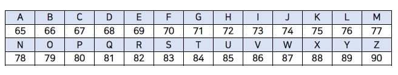

# 1. 컴퓨팅 사고

## 1) 2진법

### **컴퓨터 과학**

- 컴퓨터 과학은 문제 해결에 대한 학문 → 컴퓨터 과학이란 결국 문제를 해결한다는 것
  input → [컴퓨터 과학] → output

### 2진법

- 우리는 10진법을 쓰지만 컴퓨터는 2진법으로 말한다 → 어떻게 0과 1만으로도 그 많은 디바이스와 글자, 사진, 영상, 소리 등을 만들까?
- 10의 거듭제곱이라는 사람들간의 약속처럼 2의 거듭제곱으로 2진법을 표현
  
- 비트는 이진 숫자라는 뜻을 가진 “binary digit”의 줄임말이며, 0과 1, 두 가지 값만 가질 수 있는 측정 단위
- 이진법의 한 단위를 bit, 8개의 bit가 모여서 byte
- 컴퓨터에는 굉장히 많은 스위치(트렌지스터)가 있고 on/off 상태를 통해 0과 1을 표현
- 컴퓨터는 수백만, 수십억 개의 스위치를 갖고 있음 → 이들을 물리적으로 이용해서 정보를 표현하고 값을 저장함
- 킬로바이트는 1,000 바이트, 메가바이트는 1,000 킬로바이트(100만 바이트), 기가바이트는 1,000 메가바이트(10억 바이트) → 테라바이트는 1,000 기가바이트(1조 바이트)이며, 심지어 페타바이트와 엑사바이트와 같은 더 큰 단위도 존재
- bit의 트랜지스터
  

## 2) 정보의 표현

### 문자의 표현

- 컴퓨터는 어떻게 문자와 메일을 보내고 문서를 작성하는 일을 할까? / A와 같은 문자를 어떻게 표현할까?
- 문자를 숫자로 표현 할 수 있도록 정해진 약속(표준)이 있음 → 총 128개의 부호로 정의되어 있는데, 가령 알파벳 A는 10진수 기준으로 65, 알파벳 B는 66로 되어있음
- ASCII는 정보 교환을 위한 미국 표준 코드
  
  
- Unicode는 ASCII의 상위 집합과 같음
  - ASCII는 당시 8개의 비트만을 사용했고 이는 문자를 표현하기에 충분하지 않았음
  - Unicode는 😂(기쁨의 눈물) 이런 이모티콘 까지 표현할 수 있게 해줌 → 이 이모티콘은 10진법으로 128,514, 2진법으로는 11111011000000010
  - 만약 스마트폰으로 😂(기쁨의 눈물) 이모티콘을 친구의 스마트폰으로 보낸다면 11111011000000010 이라는 0과 1의 패턴을 보낸 것이고, 그럼 안드로이드 혹은 iOS는 0과 1의 패턴을 받아 노란색 얼굴에 눈물을 흘리고 있는 사진으로 출력함

### 그림, 영상, 음악의 표현

- 이모티콘은 각자의 정해진 이진법으로 표현하고 있고, 그 이모티콘들은 수많은 노란색 점들로 이뤄진 것처럼 RGB(Red, Green, Blue)를 통해 표현
- 이런 작은 점을 픽셀 → 각각의 픽셀은 세 가지 색을 서로 다른 비율로 조합하여 특정한 색을 갖게 됨
- 영상은 수많은 그림을 빠르게 연속적으로 이어 붙여놓은 것
- 음악은 각 음표를 숫자로 표현할 수 있음

## 3) 알고리즘

- 알고리즘 → 입력(input)에서 받은 자료를 출력(output)형태로 만드는 처리 과정 → 입력값을 출력값의 형태로 바꾸기 위해 어떤 명령들이 수행되어야 하는지에 대한 규칙들의 순서적 나열
- input → [algorithms] → output
- 불필요한 순회를 할 필요가 있는가 → 알고리즘의 평가할 때는 정확성도 중요하지만, 효율성도 중요
- 여러분의 뇌는 알고리즘을 풀 수 있습니다 - 데이비드 J. 말란 (David J. Malan)
  https://youtu.be/6hfOvs8pY1k

## 4) 스크래치: 기초

- 실습 위주 내용 / 메모 없음

# 2. C언어

## 1) C 기초

```c
#include <stdio.h>int main(void)
{
    printf("hello, world\n");
}
```

- #include <stdio.h>는 “stdio.h”라는 이름의 파일을 찾아서 “printf” 함수에 접근할 수 있도록 해줌
- 우리가 직접 작성한 코드는 “소스 코드” → 이를 2진수로 작성된 “머신 코드”로 변환해야 컴퓨터가 이해 가능함 → 이런 작업을 컴파일러라는 프로그램이 수행

## 2) 문자열

- CS50 Sandbox에서는 스크래치의 ask함수와 가장 비슷한 것은 get_string 함수 → String은 단어나 구절, 문장을 부르는 말 (숫자와는 다른 종류의 데이터)

## 3) 조건문과 루프
