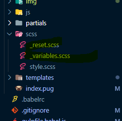
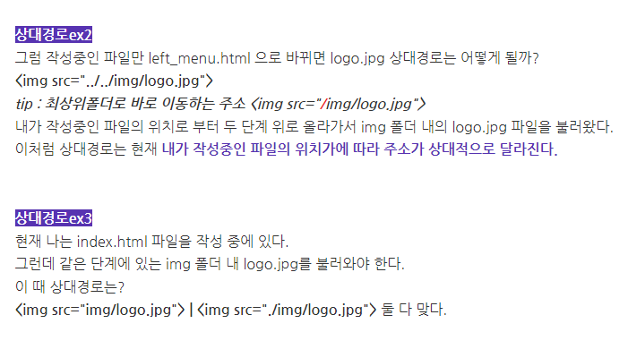

### sticky 부모에 overflow: hidden; 주면 안 먹음

### 사파리 주소창 이슈

[Designing websites keeping floating tab bar of Safari 15 (on iOS) in mind](https://www.amitmerchant.com/designing-websites-keeping-floating-address-bar-safari-15-ios/#the-problem)

### label을 absolute로 띄우고 placeholder처럼 활용하고, input:focus 됐을 때 label처럼 상단으로 올리면 접근성과 디자인을 같이 챙길 수 있음

### tailwind 설치 참고 링크

[Vue에 Tailwind CSS 적용하기](https://jinyisland.kr/post/vue-tailwind/)

### tailwind.config.js 세팅

```jsx
/** @type {import('tailwindcss').Config} */
module.exports = {
  purge: ['./index.html', './src/**/*.{vue,js,ts,jsx,tsx}'],
  darkMode: false,
  content: [],
  theme: {
    colors: {
      'primary': '#fcb92c',
      'secondary': '#d6ddea',
    },
    screens: {
      'mb': {'max': '600px'},
      'tab': {'max': '900px'},
      'web': {'max': '1200px'},
    },
    extend: {},
  },
  corePlugins: {
    aspectRatio: false,
  },
  plugins: [
    require('@tailwindcss/aspect-ratio'),
  ],
}
```

### ellipsis 해제

```jsx
.no-ellipsis {
    max-width: fit-content;
    overflow: visible;
    text-overflow: unset;
    height: auto;
    line-height: inherit;
    -webkit-line-clamp: unset;
    -webkit-box-orient: unset;
  }
```

### scss에서 _(underscore)가 붙은 파일은 css로 컴파일하지 말고 사용만 하라는 의미



### overscroll-behavior → scroll chaining을 막기 위한 속성. 적용하고자 하는 selector에 contain

```css
/* Keyword values */
overscroll-behavior: auto; /* default */
overscroll-behavior: contain;
overscroll-behavior: none;

/* Two values */
overscroll-behavior: auto contain;

/* Global values */
overscroll-behavior: inherit;
overscroll-behavior: initial;
overscroll-behavior: revert;
overscroll-behavior: unset;
```

[overscroll-behavior - CSS: Cascading Style Sheets | MDN](https://developer.mozilla.org/en-US/docs/Web/CSS/overscroll-behavior)

### animation에서 cubic-bezier 적용하려면 from에 animation-timing-function 적용하면 됨

```css
@keyframes slideup {
  from {
    transform: translateY(100%);
    opacity: 0;
    animation-timing-function: cubic-bezier(0.895, 0, 0.18, 1);
  }
  to {
    transform: translateY(0);
    opacity: 1;
  }
}
```

### 이미지 PC 1920 모바일 360의 2배

### 상대경로와 절대경로



[절대경로와 상대경로 파헤치기](https://soharu.tistory.com/11)