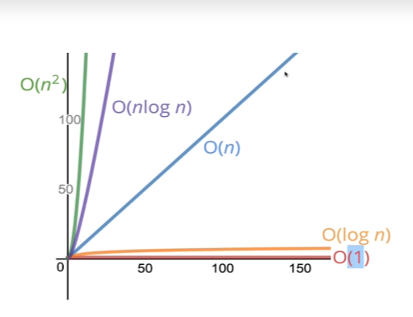
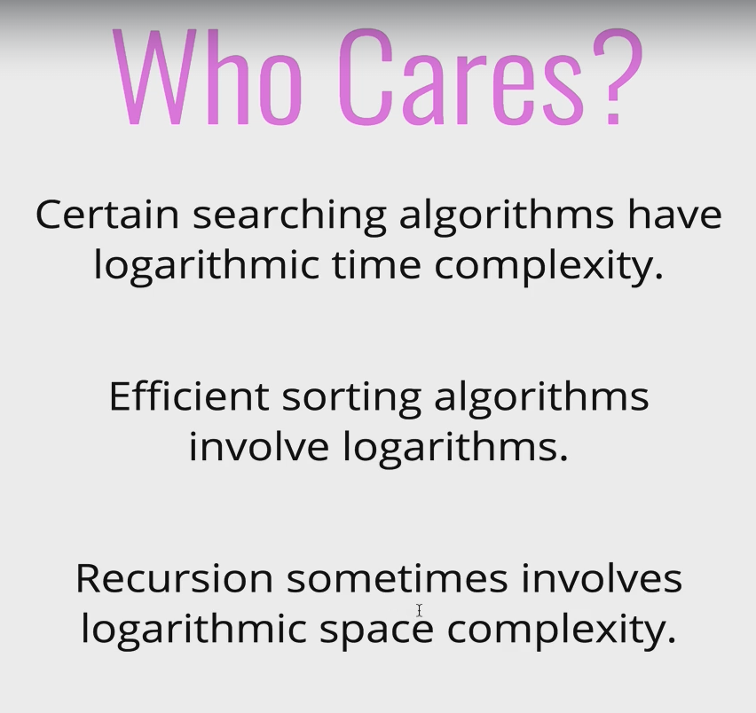

## 섹션 2: 빅오 표기법(Big O Notation)

### 4. 빅오(Big O) 소개

- What’s the idea here → 코드를 분류하거나 비교할 목적으로 만든 Big O Notation
- Who Cares → 코드가 돌기면 하면 좋은 코드인가? 하지만 그것이 수천, 수만개의 데이터라면?
- 코드의 성능을 이야기하거나 접근성을 이야기할 때 중요한 건 전문적인 방법론으로 접근하는  것이 중요 → 그래서 Big O Notation
- 면접 시 대비하는 것도 중요 ㅎ → “이 알고리즘의 빅오 표기법을 말해주세요”

### 5. 코드 시간 재기

- ex) n이라는 변수를 입력했을 때 해당 n까지의 모든 수를 더한 function을 만드세요
    
    ```jsx
    function addUpTo(n) {
      let total = 0;
      for(let i = 1; i <= n; i++) {
        total += i;
      }
      return total;
    }
    
    console.log(addUpTo(3));
    ```
    

```jsx
function addUpTo(n) {
  return n * (n + 1) / 2;
}

console.log(addUpTo(3));
```

- **What does better mean?**
    - Faster?
    - Less memory-intensive?
    - More readable?
        
        → **Let’s focus here first**
        

- **Why not use timers?**
    
    **→ 내장된 타이밍 펑션을 통해 기능을 테스트해볼 수 있음**
    
    ```jsx
    function addUpTo(n) {
      let total = 0;
      for(let i = 1; i <= n; i++) {
        total += i;
      }
      return total;
    }
    
    let t1 = performance.now();
    addUpTo(1000000000);
    let t2 = performance.now();
    console.log(`Time Elapsed: ${(t2 - t1) / 1000} seconds.`);
    ```
    
    → #`console.time`과 `console.timeEnd`를 써도 되지만 non-standard
    
    ```jsx
    var selector = "f1"
    console.time(selector);
    f1();
    console.timeEnd(selector);
    ```
    
    [http://vnthf.logdown.com/posts/2016/10/06/javascript](http://vnthf.logdown.com/posts/2016/10/06/javascript)
    
- **The Problem with Time (#시간으로만 측정하는 데에는 다소 문제가 있음)**
    - Dirfferent machines will record different times → 기기에 따라 다름
    - The same machine will record different times → 동일한 사양도 환경에 따라 다름
    - For fast algorithms, speed measurements may not be precise enough? → 정말 빠른 알고리즘들의 경우 차이를 비교하기가 어려움
        
        **→ 그래서 우리 코드를 살펴보면서 시간을 측정하지 않고 어느 코드가 더 좋은지 어떻게 평가할 수 있을까?**
        

### 6. 연산 갯수 세기

- If not time, then what?
- Let’s count the number of simple operations ths computer has to perform! → 컴퓨터가 처리해야 할 연산 갯수를 세면 됨
- Counting Operations
    
    
    


- **Counting is hard! → but, 정확한 카운팅은 중요하지 않다, 우리에게 중요한 것은 전체적인 추세를 보는 것**

### 7. 시간 복잡도(time complexity) 시각화하기

[Big O Introduction](https://rithmschool.github.io/function-timer-demo/)

### 8. 빅오에 대한 공식 소개

- Big O Notation is a way to formalize fuzzy counting → 빅오는 대략적으로 숫자를 세는 것에 붙인 공식적인 표현
- It allows us to talk formally about how the runtime of an algorithm grows as the inputs grow → 정식으로 입력된 내용이 늘어날수록 알고리즘에 실행시간이 어떻게 변하는지 설명하는 공식적인 방식
- We won’t care about the details, only the trends → 디테일보단 전반적인 추세
- 자세한 설명은 특별한 메모 없이 설명만 들음(필요시 해당 강의 참고)

### 9. 빅오 표현식의 단순화하기

- Simplifying Big O Expressions
- Constants Don’t Matter
    
    
    

- Smaller Terms Don’t Matter
    
    
    

- **Big O Shorthands**
    - Analyzing complexity with big O can get complicated
    1. Arithmetic operations are constant → 산수는 상수와 다를 바 없음
    2. Varible assignment is constant → 변수 배정도 상수와 다를 바 없음, 컴퓨터가 변수에 값을 배정하는 데 걸리는 시간은 비슷
    3. Accessing elements in an array(by index) or object (by key) is constant → 배열에서 첫번째 아이템을 찾든, 10번째 아이템을 찾든 index를 사용하면 똑같은 시간이 걸림, 객체 또한 key로 접근하면 동일함
    4. In a loop, the complexity is the length of the loop times the complexity of whatever happens inside of the loop

- graph
    
    
    

### 10. 공간 복잡도

- ‘알고리즘이 얼마나 공간을 차지하는가’ → 사용되는 메모리
- What about the inputs?
- 별도로 언급하지 않는 한, 공간 복잡도란 사실상 보조 공간 복잡도를 말하는 것
- Space Complexity is JS [Rules of Thumb]
    - Most primitives (booleans, numbers, undefined, null) are **constant space** → 불변의 공간 → 입력값과 무관하게 불변의 공간, 똑같은 공간을 차지함
    - Strings require **O(*n*)** space (where *n* is the string length)
    - Reference types are generally **O(*n*)**, where n is the length (for array) or the number of keys (for objects)

### 11. 로그와 섹션 요약(Logarithms)

- Wait, what’s a log again?
    
    
    
    
    


## 섹션 3: 배열과 오브젝트의 성능 평가

### 13. 섹션 소개

- Understand how objects and arrays work, through the lens of Big O
- Explain why adding elements to the beginning of an array is costly
- Compare and contrast the runtime for arrays and objects, as well as built-in methods

### 14. 객체의 빅오(Big O)

- **When to use objects**
    - When you don’s need order → 정렬되어 있을 필요가 없을 때
    - When you need fast access / insertion and removal → 빠른 접근, 입력과 제거를 원할 때

- **빠르다는 말은 입력, 제거, 접근하는 시간이 상수 시간이라는 것**
    
    
    
    
    

- **recap**
    - 객체는 모든 것을 빨리 처리함
    - 하지만 정렬되어 있지 않음
    - 객체는 간단하고 모두 상수 시간
    

### 15. 배열 안의 데이터에 접근이 느린 이유


- 정렬이 필요하다면 유용하지만, 연산을 하는 시간이 더 걸릴 수 있음
- **When to use arrays**
    - When you need order → 정렬되어 있는 데이터가 필요할 때 → #즉, 이 말은 정렬이 필요 없는 경우엔 object 자료형처럼 다른 선택권이 있을 수 있다는 의미
    - When you need fast access / insertion and removal (sort of…)
    


- ex) 10000개가 들어 있는 배열값이 있는데 9000번대 값에 접근하려 했을 때 8999개의 값에 모두 접근한 다음에 자료를 찾는 것이 아님
- 배열 뒤에 자료를 추가하는 건 간단하나(상수 시간), 배열 앞에 자료를 추가하는 게 간단하지 않은 건 인덱스의 값 모두 바꿔줘야 하기 때문에 n의 크기에 따라 커질 수 밖에 없음
- **즉, 배열 앞에 추가하고 제거하는 것은 최대한 피해야 함 → 물론 상황상 앞에 추가하는 게 유의미할 수 있고 데이터가 크지 않다면 문제가 없음 → 단지, 끝에서 추가하고 제거하는 것만큼 효율적이지는 않다는 점을 인지하고 있어야 함**
- push와 pop하는 작업이 shift와 unshift 작업보다 빠른 이유, 빈 배열일 때는 당연히 무관함
- 배열의 크기가 커질수록 탐색하는 시간이 그만큼 길어지게 됨 → **O(N)**

### 16. 빅오 배열 메소드


- shift와 unshift는 index를 다시 정리해줘야 하기 때문에 O(N)
- 어쨌든 배열을 정렬하는 것은 O(N)보다 더 크다는 것 → 비교를 해야 하고 엘리먼트를 이동해야 하고, 정렬하려면 엘리먼트를 한번씩 보는 것만으로 충분하지 않음
- push, pop은 빠름, 인덱스를 사용해서 접근하는 것과 똑같고 상수 시간
- **객체는 거의 모든 것을 더 빠르게 하지만 정렬되어 있지 않고, 배열은 정렬되어 있지만 끝에 추가하고 제거하는 작업이 시작에 추가하고 제거하는 작업보다는 빠르다는 점**

## 섹션 4: 문제 해결 접근법

### 18. 문제 해결법 소개

- What is an algorithm? → A process or set of steps to accomplish a certain task.
- Why do I need to know this? → Almost everything that you do in programming involves some kind of algorithm! **It’s the foundation for being a successful problem solving and developer. & INTERVIEWS**
- **How do you improve?**
    1. Devise a plan for solving problems.
    2. Master common problem solving patterns
- **PROBLEM SOLVING**
    - Understand the Problem
    - Explore Concrete Examples
    - Break It Down
    - Solve/Simplify
    - Look Back and Refactor
    

### 19. 1단계 : 문제의 이해

- **UNDERSTAND THE PROBLEM**
    - 온전히 이해하기 전에 코드 몇 줄을 먼저 빠르게 입력해서 무언가를 빨리 진행한다는 느낌은 얻을 수 있지만, 온전히 이해하는 것이 중요
    1. Can I restate the problem in my own words? → 문제를 나의 방식대로 **다시 생각**할 수 있는가?
    2. What are the inputs that go into the problem? → 문제가 어떤 **입력값**을 담고 있는가를 이해하는 건 중요한 과정
    3. What are the outputs that should come from the solution to the problem? → 문제에 대한 해결책에서 나와야 할 **출력값**은 무엇인가
    4. Can the outputs be determined from the inputs? In other words, do I have enough information to solve the problem? (You may not be able to answer this question until you set about solving the problem. That’s okay; it’s still worth considering the question at this early stage.) → **입력값이 출력값을 결정** 지을 수 있는가
    5. How should I label the important pieces of data that are a part of the problem? → 문제의 일부인 데이터의 중요한 부분에 어떻게 **라벨을 지정**할 수 있을까

- ex) Write a fuction whice takes two numbers and returns their sum.
    1. implement addition
    2. ints? floats? what about string for large numbers?
    3. int? float? string?
    4. -
    5. -
    

### 20. 2단계 구체적 예제들

- **Explore Examples**
    - Coming up with examples can help you understand the problem better
    - Examples also provide sanity checks that your eventual solution works how it should
    - User Stories!
    - Unit Tests!

- **Explore Examples**
    - Start with Simple Examples → 간단한 예시로 시작하기
    - Progress to More Complex Examples → 더 복잡한 예시들로 진행하기
    - Explore Examples with Empty Inputs → 빈 입력값이 있는 예제를 살펴보는 것은 특히 유효하지 않은 입력값이 주어진 면접 상황에서 문제를 어떻게 해결해야 할지 해결 능력을 갖출 수 있도록 해줌
    - Explore Examples with Invalid Inputs → 사용자가 유효하지 않은 값을 입력하면 어떻게 될지를 항상 생각할 수 있어야 함
    
- ex) Write a function whick takes in a string and returns counts of each character in the string.
    
    ```jsx
    charCount("aaaa"); // {a:4};
    charCount("hello"); // {h:1, e:1, l:2, o:1};
    ```
    

### 21. 3 단계 : 세부 분석

- **Break It Down**
    - Explicitly write out the steps you need to take. →  밟아야 할 단계들을 명확하게 작성해보기
        - This forces you to think about the code you’ll write before you write it, and helps you catch any lingering conceptual issues or misunderstandings before you dive in and have to worry about details (e.g. language syntax) as well.
    
- ex) Write a function which takes in a string and returns counts of each character in the string.
    
    ```jsx
    
    // 21. 3 단계 : 세부 분석
    // ex) Write a function which takes in a string and returns counts of each character in the string.\
    charCount("aaaa");
    // {a: 4}
    
    charCount("hello");
    // {
    //   h: 1,
    //   e: 1,
    //   l: 2,
    //   o: 1
    // }
    
    charCount("Your PIN number is 1234!")
    // {
    //   1: 1,
    //   2: 1,
    //   3: 1,
    //   4: 1,
    //   b: 1,
    //   e: 1,
    //   i: 2,
    //   m: 1,
    //   n: 2,
    //   o: 1,
    //   p: 1,
    //   r: 2,
    //   s: 1,
    //   u: 2,
    //   y: 1
    // }
    
    function charCount(str) {
      // do something
      // return an object with keys that are lowercase alphanumeric characters in the string: values should be the counts for those character string
    }
    
    function charCount(str) {
      // make object to return at end
      // loop over string, for each character...
        // if the char is number/letter AND is a key in object, add one to count
        // if the char is number/letter AND not in object, add it to object and set value to 1
        // if character is something else (space, period, etc.) don't do anything
      // return object at end
    }
    ```
    
    주석을 통해 명시적으로 단계를 표시한다는 건, 비록 시간이 부족하더라도 문제 해결 능력이 있다는 걸 보여줄 수 있음
    

### 22. 4단계 : 해결 또는 단순화

- **Solve/Simplify**
    
    ```jsx
    function charCount(str) {
      // make object to return at end
      var result = {};
      // loop over string, for each character...
      for(var i = 0; i < str.length; i++) {
        var char = str[i].toLowerCase();
        // if the char is number/letter AND is a key in object, add one to count
        if(result[char] > 0) {
          result[char]++;
          // if the char is number/letter AND not in object, add it to object and set value to 1
        } else {
          result[char] = 1;
        };
      }
        // if character is something else (space, period, etc.) don't do anything
      // return object at end
      return console.log(result);
    }
    ```
    

### 23. 5단계 : 되돌아 보기와 리팩터(Refactor)

- **REFACTORING QUESTIONS**
    - Can you check the result?
    - Can you derive the result differently?
    - Can you understand it at a glance?
    - Can you use the result or method for some other problem?
    - Can you improve the performance of your solution?
    - Can you think of other ways to refactor?
    - How have other people solved this problem?
    
- for of문과 정규식으로 다듬기
    
    ```jsx
    function charCount(str) {
      var obj = {};
      for(var char of str) {
        var char = char.toLowerCase();
        if(/[a-z0-9]/.test(char)) {
          obj[char] = ++obj[char] || 1;
        }
      }
      return console.log(obj);
    }
    ```
    
- 정규식 대신 charCodeAt()으로 다듬기
    
    ```jsx
    function charCount(str) {
      var obj = {};
      for(var char of str) {
        var char = char.toLowerCase();
        if(isAlphaNumeric(char)) {
          obj[char] = ++obj[char] || 1;
        }
      }
      return console.log(obj);
    }
    
    function isAlphaNumeric(char) {
      var code = char.charCodeAt(0);
      if(!(code > 47 && code < 58) && // numeric (0-9)
         !(code > 64 && code < 91) && // upper alpha (A-Z)
         !(code > 96 && code < 123)) { // lower alpha (a-z)
        return false;
      }
      return true;
    }
    ```
    
- 다듬기
    
    ```jsx
    function charCount(str) {
      var obj = {};
      for(var char of str) {
        if(isAlphaNumeric(char)) {
          char = char.toLowerCase();
          obj[char] = ++obj[char] || 1;
        }
      }
      return console.log(obj);
    }
    
    function isAlphaNumeric(char) {
      var code = char.charCodeAt(0);
      if(!(code > 47 && code < 58) && // numeric (0-9)
         !(code > 64 && code < 91) && // upper alpha (A-Z)
         !(code > 96 && code < 123)) { // lower alpha (a-z)
        return false;
      }
      return true;
    }
    ```
    

### 24. 복습과 인터뷰 전략

- RECAP!