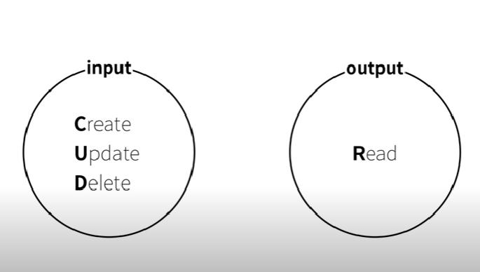
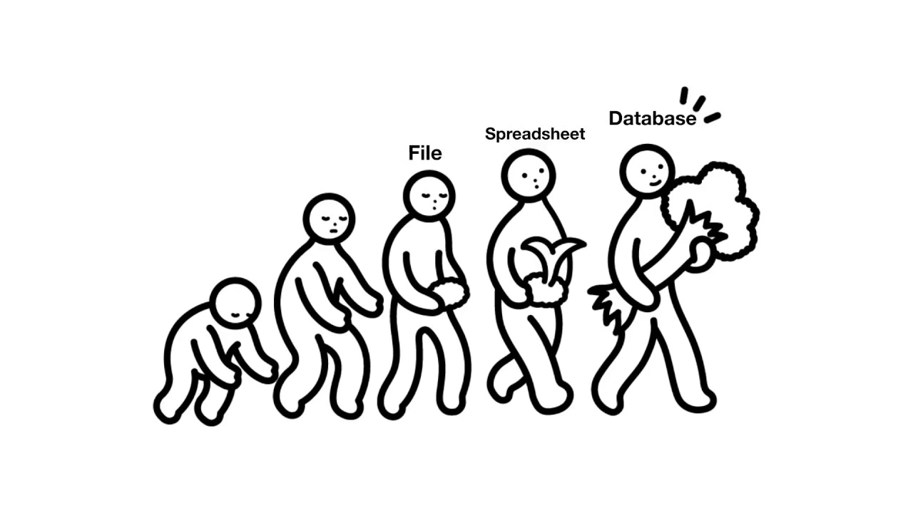

- file은 범용성이 좋지만 단점이 있기에 DB를 활용함
- CRUD

- file vs database
    - 이미지
    
    
    
    - 문서와 같은 file은 정렬 및 검색 등 필터링 같은 것이 불편함
    - Spreadsheet를 떠올리게 됨 → 구조적 데이터 저장 → Database
- 관계형 데이터베이스와 그 외의 데이터베이스
- 2010년부터 NOSQL이라는 흐름이 나오게 되었음