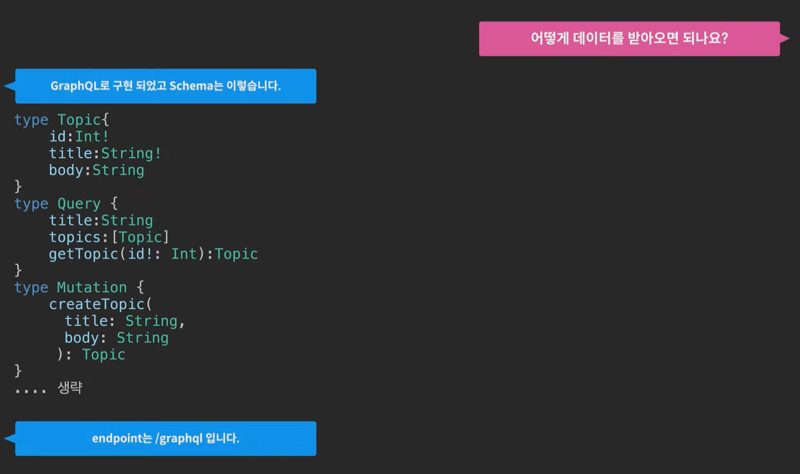

### 개요

- 페이스북에서 만든 GraphQL은 REST API의 강력한 경쟁상대로 차세대 API 포맷으로 부상하고 있음
    
    
    

### Schema

- Schema란 서버와 클라이언트가 주고 받을 데이터의 형식을 정의한 약속
- Query는 질의한다는 뜻 → 브라우저가 서버한테 질의한다

### GraphQL IDE

- 해당 주소 뒤에 /graphql을 입력하면 GraphQL IDE가 나옴
    
    ex) [https://expresssimplexkqnmg-d3fm--3010.local-credentialless.webcontainer.io/graphql](https://expresssimplexkqnmg-d3fm--3010.local-credentialless.webcontainer.io/graphql)
    

### GraphQL Language

- 데이터를 정의한 것은 Schema Language / 데이터를 요청할 때 사용하는 것은 Query Language

### 프로그래밍

- API에 접속할 수 있는 URL을 유식하게 endpoint라고 함..
    
    ```jsx
    endpoint = '/graphql';
    queryCode = `
    {
        title
    }
    `;
    options = {
        method: 'POST',
        headers: {'Content-Type':'application/json'},
        body: JSON.stringify({
            query: queryCode
        })
    }
    fetch(endpoint, options).then(type=>type.json()).then(result=>{
        console.log(result);
    });
    ```
    

### GraphQL의 유연성

- REST API의 경우 해당 API를 호출할 때 개별 endpoint를 통해서 가져와야 했지만, GraphQL의 경우 query language를 작성할 때 자기가 필요한 정보를 적기만 하면 단 하나의 endpoint로 원하는 정보를 유연하게 return 해줌
    
    ```graphql
    {
      title
      topics {
        id title body
      }
    }
    ```
    

### 함수처럼

- getTopic이라는 거는 마치 함수처럼 인자를 받아서 다른 결과를 만들 수 있음
    
    ```graphql
    {
      title
      topics {
        id title body
      }
      getTopic(id:1) {
        id title body
      }
    }
    ```
    

```jsx
endpoint = '/graphql';
queryCode = `
{
    title
    topics {
        id title body
    }
    getTopic(id:1) {id title}
}
`;
options = {
    method: 'POST',
    headers: {'Content-Type':'application/json'},
    body: JSON.stringify({
        query: queryCode
    })
}
fetch(endpoint, options).then(type=>type.json()).then(result=>{
    console.log(result);
});
```

- id값을 가변적으로 넣어주는 게 좋음, GraphQL에서 변수는 $
    
    ```graphql
    query ($topicId:Int!){
      title
      topics {
        id title body
      }
      getTopic(id:$topicId) {
        id title body
      }
    }
    ```
    
    ```graphql
    {
      "topicId": 1
    }
    ```
    
    ```jsx
    endpoint = '/graphql';
    queryCode = `
    query ($topicId:Int!){
        title
        topics {
            id title body
        }
        getTopic(id:1) {id title}
    }
    `;
    variables = {"tipicId": 1}
    options = {
        method: 'POST',
        headers: {'Content-Type':'application/json'},
        body: JSON.stringify({
            query: queryCode,
            variables: variables
        })
    }
    fetch(endpoint, options).then(type=>type.json()).then(result=>{
        console.log(result);
    });
    ```
    

### mutation

```graphql
mutation($title:String!, $body:String) {
  createTopic(title:$title, body:$body) {
    id
  }
}
```

```graphql
{
  "title":"graphQL",
  "body":"graphQL is..."
}
```

```jsx
endpoint = '/graphql';
queryCode = `
mutation($title:String!, $body:String) {
  createTopic(title:$title, body:$body) {
    id
  }
}
`;
variables = {"title": prompt('title?'), "body":prompt('body?')}
options = {
    method: 'POST',
    headers: {'Content-Type':'application/json'},
    body: JSON.stringify({
        query: queryCode,
        variables: variables
    })
}
fetch(endpoint, options).then(type=>type.json()).then(result=>{
    console.log(result);
});
```