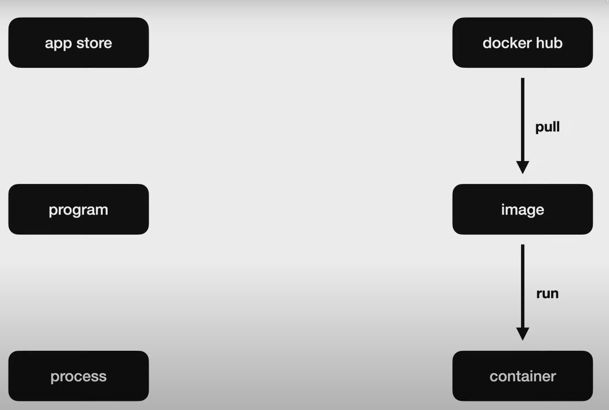
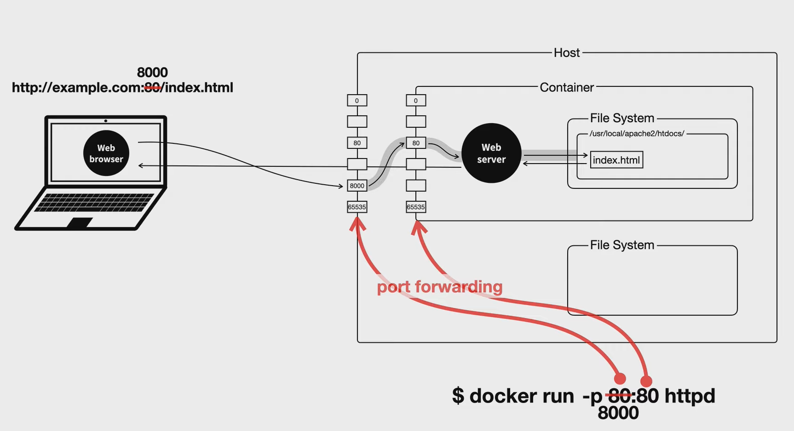
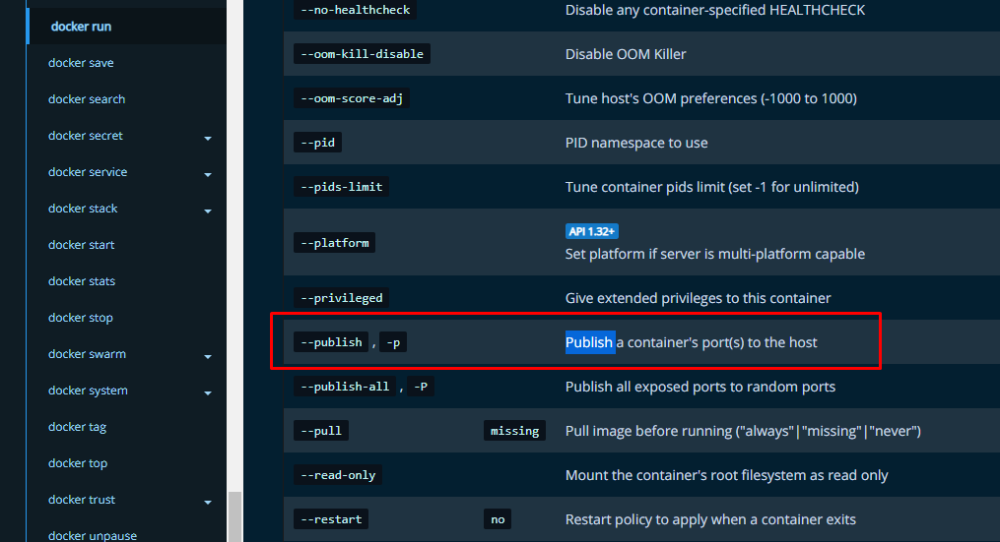

[Docker Documentation](https://docs.docker.com/)

해당 OS에 맞게 설치

윈도우의 경우 WSL 설치 필요

[QUARK : 네이버 블로그](https://blog.naver.com/brainkorea/222208329797)

GUI로 상태 확인 가능, 하지만 대체로 CLI 환경에서 실행



[Docker Hub Container Image Library | App Containerization](https://hub.docker.com/)

docker hub에서 마음에 드는 걸 찾아서 설치

### 명령어

```
docker pull httpd
```

docker 실행

```
docker run
```

docker 실행 현황(?)

```
docker ps
```

이름 지정하여 실행

```
docker run --name ws2 httpd
```

docker 중지

```
docker stop ws2
```

중지시킨 docker까지 포함해서 현황 확인

```
docker ps -a
```

해당 docker 로그 확인

```
docker logs ws2 // 한 번만 출력
docker logs -f ws2 // 실시간으로 watching 되는 명령어
```

docker 삭제 (실행중일 때는 삭제 못함 → docker stop을 통해서 중지시키고 삭제 필요)

```
docker rm ws2
```

docker image 삭제

```
docker rmi httpd // 남은 컨테이너가 없어야 삭제 가능
```

### 도커 네트워크

- 서버를 사용하기 위해선 원래 두 대의 컴퓨터가 필요
- Web browser에서 url로 요청을 하면 다른 Web Server가 있는 컴퓨터의 File System에서 해당 파일을 요청
- 기본적으로 80번 포트로 요청하게끔 되어 있음



- 도커를 사용할 때도 동일함
- 단, Host와 Container의 포트를 연결해주는 과정이 필요함
- 그 연결 명령어가 docker **run -p 8000:80** httpd

