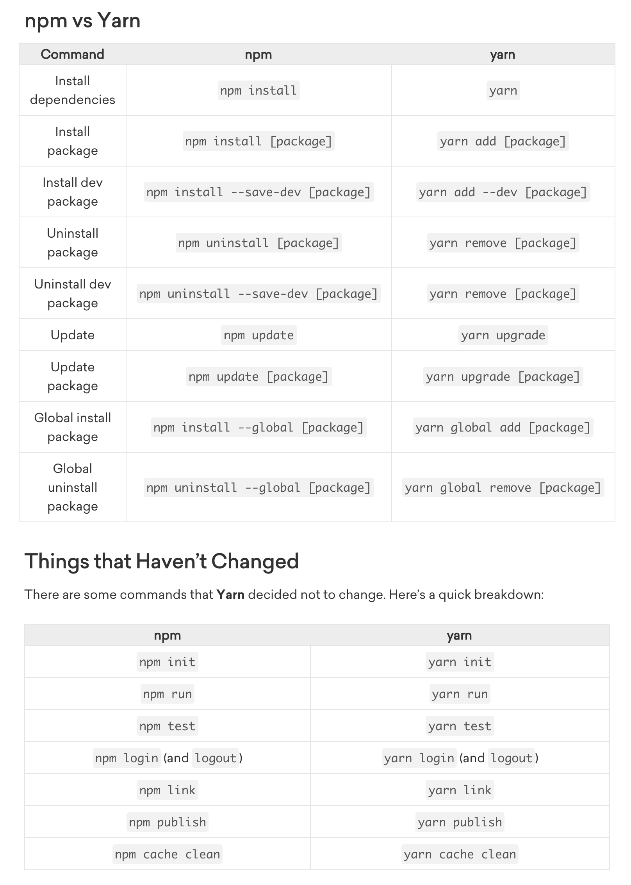
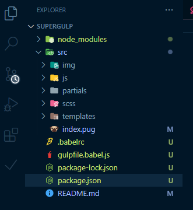

- 해당 강의는 yarn으로 진행되나 npm으로 진행하고자 하면 아래 명령어 차이점 참고



### Gulp 특징

- 복잡한 webpack을 대체 가능, 워크플로우 자동화
- 간결한 코드, 깔끔한 API

### Gulp 관련 체크

- 전역 NPM Package에 Gulp 설치 (yarn이나 npm 사용)
- src: 컴파일 되기를 원하는 파일들이 모여 있는 폴더 / dest: 컴파일 처리가 완료된 파일들이 들어갈 폴더
    
    
    

### Gulp 구동 방식

- gulp는 task와 함께 동작함 → task를 만들어줘야 함
- task → pug를 html로 만들거나 scss를 css로 변환하거나 등등, 여러 가지 task를 만들어서 하나의 명령어나 여러 개의 명령어로 묶어서 사용 (html 변환은 gulp pug라는 플러그인을 사용함)

### gulp-webserver 세팅

[gulp-webserver](https://www.npmjs.com/package/gulp-webserver)

- webserver가 필요하면 npm i gulp-webserver를 깔고 gulpfile.js에 세팅

```jsx
import gulp from "gulp";
import gpug from "gulp-pug";
import del from "del";
**import ws from "gulp-webserver";**

const routes = {
  pug: {
    src: "src/*.pug",
    dest: "build"
  }
}

const pug = () =>
  gulp
    .src(routes.pug.src)
    .pipe(gpug())
    .pipe(gulp.dest(routes.pug.dest));

const clean = () => del(["build"]);

**const webserver = () => gulp.src("build").pipe(ws({livereload: true, open: true}));**

const prepare = gulp.series([clean]);

const assets = gulp.series([pug]);

const postDev = gulp.series([webserver]);

export const dev = gulp.series([prepare, assets, postDev]);

```

- livereload를 사용하고 싶으면 watch 사용 필요

```jsx
import gulp from "gulp";
import gpug from "gulp-pug";
import del from "del";
import ws from "gulp-webserver";

const routes = {
  pug: {
    **watch: "src/**/*.pug",**
    src: "src/*.pug",
    dest: "build"
  }
}

const pug = () =>
  gulp
    .src(routes.pug.src)
    .pipe(gpug())
    .pipe(gulp.dest(routes.pug.dest));

const clean = () => del(["build"]);

const webserver = () => gulp.src("build").pipe(ws({livereload: true, open: true}));

const watch = () => {
  gulp.watch(routes.pug.watch, pug);
}

const prepare = gulp.series([clean]);

const assets = gulp.series([pug]);

**const postDev = gulp.parallel([webserver, watch]);**

export const dev = gulp.series([prepare, assets, postDev]);
```

- 컴파일이 필요한 파일과 watch를 통해 데이터의 변동이 있을 때마다 지켜봐야 할 파일의 경로를 별도로 지정해줌

```jsx
const routes = {
  pug: {
    **watch: "src/**/*.pug", // 지켜보면서 데이터 변화가 있을 때 livereload가 필요한 파일 경로
    src: "src/*.pug", // 최종적으로 컴파일하는 파일의 경로**
    dest: "build"
  }
}
```

### gulp-image 세팅

[gulp-image](https://www.npmjs.com/package/gulp-image)

build 했을 때 처리된 값을 터미널에서 확인 가능

[15:14:59] ✔ logo.svg -> before=5.42 KB after=5.33 KB reduced=90 B(1.6%)

[15:23:45] ✔ Sample-jpg-image-10mb.jpg -> before=10.02 MB after=4.14 MB reduced=5.88 MB(58.7%)

- 다양한 옵션들이 있음(npm page 참고)

```jsx
gulp.task('image', () => {
  gulp.src('./fixtures/*')
    .pipe(image({
      pngquant: true,
      optipng: false,
      zopflipng: true,
      jpegRecompress: false,
      mozjpeg: true,
      gifsicle: true,
      svgo: true,
      concurrent: 10,
      quiet: true // defaults to false
    }))
    .pipe(gulp.dest('./dest'));
});
```

### gulp-sass 컴파일 세팅

[gulp-sass](https://www.npmjs.com/package/gulp-sass)

### gulp-autoprefixer 세팅

[gulp-autoprefixer](https://www.npmjs.com/package/gulp-autoprefixer)

```jsx
const styles = () =>
  gulp
    .src(routes.scss.src)
    .pipe(sass().on('error', sass.logError))
    **.pipe(autoprefixer({browsers: ["last 2 versions"]}))**
    .pipe(gulp.dest(routes.scss.dest));
```

### gulp-csso 세팅(Minify CSS with CSSO)

[gulp-csso](https://www.npmjs.com/package/gulp-csso)

```jsx
const styles = () =>
  gulp
    .src(routes.scss.src)
    .pipe(sass().on('error', sass.logError))
    .pipe(autoprefixer({browsers: ["last 2 versions"]}))
    **.pipe(miniCSS())**
    .pipe(gulp.dest(routes.scss.dest));
```

### babelify + browserify 세팅

- js 빌드 및 minify

### 배포(deploying)