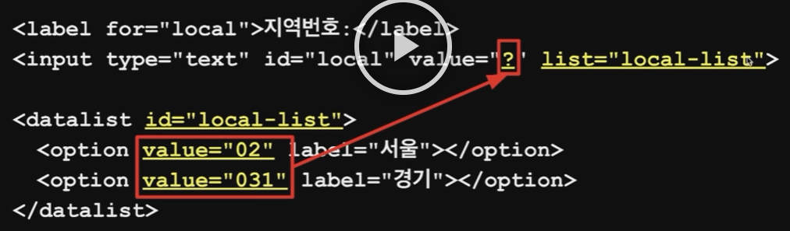
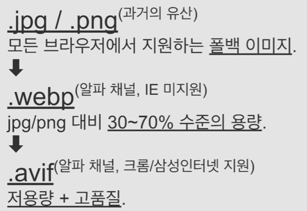
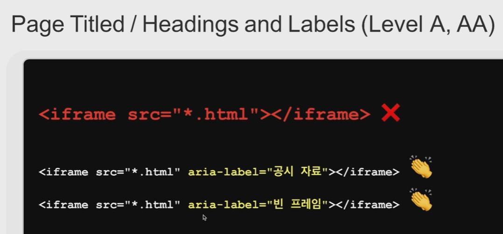
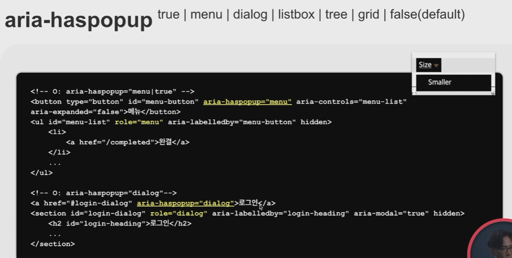
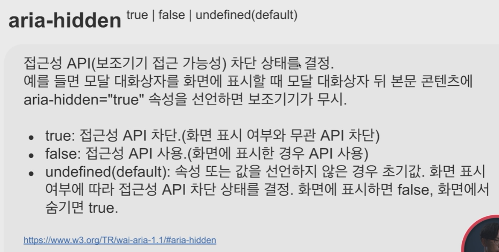
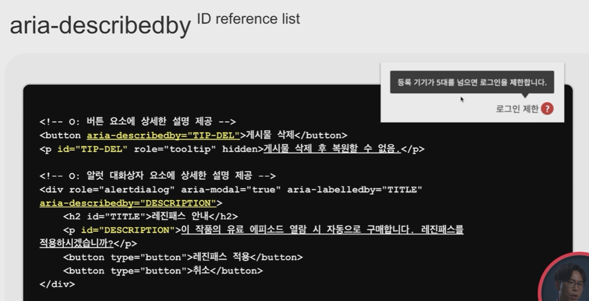
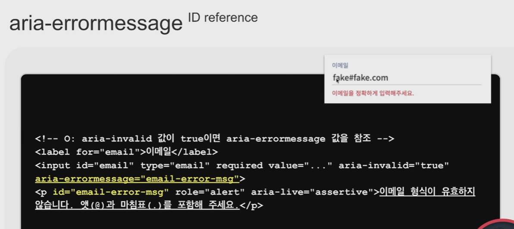

# Part 1. HTML

### 01. HTML을 어떻게 공부해야 하는가

- a 요소에는 href가 필수 요소가 아님 → <a>마크업</a>
- HTML5에서는 block이나 inline 요소 개념이 없어짐 → ex) a 안에 div가 들어가도 됨, flow content parasing content라는 개념을 사용함
- 잘 알려진 HTML 학습경로
    
    [W3Schools Free Online Web Tutorials](https://w3schools.com/)
    
    [MDN Web Docs](https://developer.mozilla.org/)
    

- HTML 명세 (Web Hypertext Application Technology Working Group 제공)
- HTML을 유지하고 발전시키는 커뮤니티 → 브라우저 제조사 연합
    
    [HTML](https://html.spec.whatwg.org/)
    
- 웹 표준 명세 공식 표준이라도 브라우저 제조사에서 구현하지 않으면 의미가 없음
    
    [Can I use... Support tables for HTML5, CSS3, etc](https://caniuse.com/)
    
- 기존에 w3c에서 제공하던 명세는 폐기됨
- block → flow content, inline → phrasing content
- 대부분의 요소는 다 flow content
- metadata content / heading content / **sectioning content → article, aside, nav, section → display: block; /** embedded content → iframe, img, video 등 / interactive content / palpable content / script-supporting element / transparent content models
- HTML5 Living Standard → HTML5 명세 확인하는 키워드
- category 어떤 카테고리인지
- contexts → 비규범적(대체로 이러하다는 뜻, 이런 맥락에서 쓰인다)
- content model → 이건 반드시 지켜야하는 규범적
- 투명한 요소(transparent content model)는 그 요소가 빠졌을 때 완전해야 함, 부모 요소를 따라가야함


### 02. 검색 엔진 밥상 차려주기

- SEO에 영향을 주는 요인들 → 페이지 타이틀과 메타 디스크립션 외 등
- 검색엔진이 가장 참고하는 게 title이기에 가장 중요한 tag
- 단순 title이 아닌 ‘실시간, 랭킹’ 이런 워딩들을 활용해서 디테일하게 → 레진코믹스(X), 실시간 - 랭킹 - 웹툰 - 레진코믹스(O)
- chrome 개발자도구의 lighthouse, chrome alexa extension 점수 등을 참고 가능
- 메뉴 depth에 따라 title을 구성하는 게 좋음 → 사용자 경혐에 영향을 끼치게 됨
- 화면 낭독기 사용자 입장에서도 타이틀을 읽기 때문에 구체적으로 적어주는 게 좋음
- 대부분 속청으로 듣기 때문에 최대한 간결한 키워드 위주로 작성하는 것이 좋음
- 구분자 -, | , : → 대쉬가 좋음
- JavaScript로 동적으로 작성된 타이틀도 검색 엔진에서 잘 크롤링됨


- Metadata - html, head
- lang 속성은 검색엔진이 언어를 분류하는 데이터이기도 하고 화면낭독기 사용자 입장에서도 언어 구분하기 좋음
- 구글은 lang 속성은 신뢰하지 않음 → 개발자들이 lang en 기본값을 수정하지 않아서 신뢰하지는 않음
- charset utf-8 → 전세계 국가의 언어를 잘 표시할 수 있음
- description → 웹사이트 설명
- keywords → 구글은 참고하지 않음 / 마케터들이 어뷰징을 하기 때문에
- viewport → 브라우저 화면을 늘였다 줄였다 했을 때 최종적으로 브라우저 안에서 보여지는 화면
- 트위터, 페이스북 등 관련 등록 방법 각 사이트에서 확인 필요
- 네이버 같은 경우 JSON-ID 형태로 관리
- 각각의 공유 디버거도 제공하고 있음
    
    [Sharing Debugger - Facebook for Developers](https://developers.facebook.com/tools/debug)
    

[JavaScript is not available.](https://cards-dev.twitter.com/validator)


### 03. HTML 개요 알고리즘 이해

- chrome의 HeadingMap이라는 extension을 활용해서 문서의 헤딩이 어떻게 정리되어 있는지 화인 가능
- title 요소는 문서의 제목, 한번만 사용
- h*은 섹션의 제목, 문서에서 여러번 사용 가능
- heading 태그는 문서의 필수 요소
- h1 h2 h3 위계관계가 낭독기에 잘 드러남 → 순차적으로 명시해주는 것이 좋음
- sectioning root → 브라우저에서는 구현되어 있지 않으나 명세에는 정리되어 있음
- sectioning content → article, aside, nav, section
    
    
    

- 암시적 섹션(h* 태그만 사용) / 명시적 섹션(article, section 등과 함께 사용)
- 어색한 section → 문서의 heading 요소가 없는 경우
- heading을 사용하고 heading과 section을 1:1로 mapping하기

### 04. HTML 의미론

- div, span는 **아무 의미가 없는 태그**이기 때문에 최종적으로 취하는 게 좋음 → html5에 새로 선언된 태그들이 많기 때문에 요소에 맞게 사용하는 걸 추천
    
    
    
- 섹셔닝 요소(SECTIONING) →  article, aside, nav, section
- <section>, <article>
    
    
    
- 중첩 가능 ex) section 안에 section, article 안에 article
- nav → **주요 탐색 섹션**
    
    
    
- aside 활용 예
    
    
    
- main
    
    
    
- dialog → modal, popup이라고 부르는 요소들에 대한 tag, tab으로 이동 시 dialog 안쪽으로만 이동되어야 함
- address
    
    
    
- ins, del ex) 쇼핑몰 같은 데서 정가 취소선 긋고 할인가 표시
    
    
    
- b, i, s, u
    
    
    

### 05. 상호작용 콘텐츠의 올바른 용법


- <a> vs <button>
    
    
    
- 현재 페이지의 특정 섹션으로 이동할 때도 <a> 사용
- button tag에서는 이용할 수 없는 기능들
    
    
    
    
    
- pointer → The cursor is a pointer that ‘indicates a link’ → CSS 명세에 따르면 cursor는 링크를 나타낸다, 의미한다 → 즉, button 같이 link가 없는 경우에는 pointer가 아니라 default를 둘 것을 권장함
- <a target>
    
    
    
    - 최신 브라우저는 target=”_blank” 링크에 rel=”noopener” 속성을 암시적으로 적용하고 있음
    - 낡은 브라우저를 위해 여전히 rel=”noopener noreferrer” 속성을 명시하는 것이 좋음
- <detail> / <summary>
    
    
    
- **placeholder를 label로 활용하지 말 것** → 사용자가 입력을 시작하면 해당 내용을 확인할 수 없기 때문에 사용자가 단기 기억에 의존하게 되어 접근성 및 사용자 경험을 떨어뜨리게 됨
- datalist ex) 사용자가 입력을 시작하면 연관 검색어나 지역번호 출력
    
    
    

### **06. 이미지 마크업 최적화 *important!**

- 이미지 포맷 비교(jpg, png / webp / avif)
    
    
    
- 이미지 용량 비교
    
    
    
- ‘더 좋은 도구를 선택한 사용자에게는 더 좋은 사용자 경험을 주어야 한다’ → IE를 챙길 필요가 없는 경우에는 **avif 포맷을 도입해보는 것도 좋음**
- <picture> → 최하단에는 fallback image가  tag로 들어가게 됨(ie나 낡은 브라우저 대응용)
    
    
    
    
    
    
    
    - 소스 뒤에 공백 한칸 띄우고 배율 작성

-  요소의 성능
    
    ```html
    
    ```
    
    - loading은 viewport 외에 이미지가 lazy 로딩하게 함
    - decoding은 이미지 로딩 전에 다른 요소가 먼저 로딩하게 함
- img source와 src를 같이 쓴다고 해도 최종적으로 사용되는 src / src 위에 커서를 올리면 현재 적용되고 있는 이미지가 출력됨
    
    
    

# Part 2. CSS

### **01. CSS가 어려운 이유**

- CSS 명세 읽는 법 설명한 챕터(추후 필요할 시 참고)

### **02. CSS의 절대 권력, 초기화**

- Eric Meyer의 reset.css나 nomalize.css 같은 reset이 현 시점에서는 overridden되거나 unused 인 경우가 많음
    
    
    
    
    
- Univeral Selector를 사용해서 styling reset하는 건 피하는 게 좋음
- 크롬 개발자 도구에서 `ctrl + shift + p`를 눌러서 coverage 활성화 →  category를 css로 선택하거나 Type에서 css인 파일들을 확인하면 unused css 확인 가능
    - font-face는 사용됨에도 unused로 표시되는 버그 있음

- css reset에 추가 고려하면 좋은 부분
    
    ```html
    /* reset body */
    body {
    	margin: 0;
    	overflow-wrap: break-word;
    }
    
    /* Do not break Korean words */
    :lang(ko) {
    	word-break: keep-all;
    }
    ```
    
    - 브라우저는 문자열에 공백이 없으면 그 문자열을 하나의 단어로 인식하기 때문에 절대 중간에 자르거나 줄바꿈을 하지 않음, 넘치는 걸 wraping 시켜주는 overflow-wrap
    - 문제는 한국어도 강제로 줄바꿈을 하는 경우가 있음 ex) 대한 (줄바꿈) 민국 → 그걸 막아주는 코드 lang 체크해서 word-break
    
    ```html
    /* Reset img */
    img {
    	max-width: 100%;
    	height: auto;
    }
    ```
    
    - 이미지가 viewport width값을 넘어가지 않게끔 잡아줌

- overridden이나 unused 고려해서 정찬명님이 짜놓은 reset customizing
    - [https://codepen.io/naradesign/pen/JjEPbER](https://codepen.io/naradesign/pen/JjEPbER)
    - [https://codepen.io/naradesign/pen/XWpvZBB](https://codepen.io/naradesign/pen/XWpvZBB) (삼성 브라우저가 지원하지 않는 :where 선택자 포함된 코드)

### 03. 웹은 덩어리 구성요소 변형의 반복으로 이루어져 있다

- CSS selector specificity(선택자 우선순위 규칙)
    
    
    

- BEM, Atomic, Tailwind 등

### 04. 레이아웃, 배치의 비밀

- Changed Display
    
    
    

- display: inline → 수직 패딩은 적용되나 다른 요소를 밀어내지 못하기 때문에 겹침
- display: block → 수직 마진이 서로 중첩이 됨
- display: none → 어떤 장치로도 접근할 수 없음
- 해당 tag의 attritube로 hidden 선언하면 감출 수 있음
- display: flow-root → block에서 수직 마진이 중첩 현상이 형제 node 뿐만 아니라 부모 자식 간의 관계에서도 발생하는데, flow-root 선언하면 수직 마진을 병합하지 않음
- display: flex
    
    
    

- display: grid
    
    
    

- position: static → left, right, top, bottom, z-index 사용 불가능
- position: relative → left, right, top, bottom, z-index, inset 사용 가능 → 박스의 현재 위치가 배치의 기준
- position: absolute → inset을 유용하게 사용할 수 있음
- position: fixed → 뷰포트가 배치 기준
- position: sticky → 스크롤포트가 배치 기준, fixed와 static의 상태를 오간다로 이해하면 편함
- inset 속성 체크(left right top bottom 한번에 선언 가능, IE 커버 불가능)
- z-index는 부모에 종속됨

### 05. 레이아웃, 여백의 비밀

- box-sizing: content-box → width/height에 padding과 border 불포함
- box-sizing: border-box → padding과 border 포함 → 그래서 주로 css reset에 border-box로 설정함
- vmax와 vmin
- padding의 % value는 padding-left든 padding-top이든 부모 컨테이너 블럭의 너비 값을 참조
- margin도 마찬가지
- 이걸 활용하면 종횡비 유지하기 설정 가능
    - 양쪽에 margin이 있는 경우 margin이 잘릴 수 있어서 margin 없이 풀로 채우는 경우에만 사용 가능
        
        
        
    - aspect-ratio라는 속성은 아직 사파리, 삼성 인터넷 미지원
        
        
        
    - 현업에서 가장 많이 사용되는 스타일
        
        
        

- 뷰포트에 맞춘다는 점 외에 스켈레톤 UI를 제공하거나 lazy를 사용할 때 전체 문서와 높이나 스크롤의 길이가 이미 계산되어 들어가서 사용자에게 혼란을 주지 않음
    
    
    

- content-visibility: auto
    
    [(번역) 랜더링 성능을 향상 시키는 새로운 CSS 속성 content-visibility | WIT블로그](https://wit.nts-corp.com/2020/09/11/6223)
    
- **수직 마진 병합 → 인접된 형제, 부모/자식 관계에서 발생**
    - block 요소 사이에서만 발생
    - 양수끼리, 음수끼리 만난 경우 절대값이 큰 값 적용
    - 양수와 음수가 만난 경우 두 값의 합
    - **display: flow-root를 적용하면 마진 병합이 발생하지 않음**


### 06. 레이아웃, 애증의 플로팅

1. 플로팅은 용도에 맞게  사용하고, 반드시 clear-fix를 통해 해제해야 함
2. 컬럼 배치는 flex와 grid를 적절히 사용(column이라는 속성도 사용 가능)
- 실무 적용이 중요하다 판단하여 이론적 내용 메모 스킵

### 07. IE를 지원하지 않아도 된다면 가장 쓸모 있는

- flex item 외의 공간을 free space라고 부름
- 텍스트 노드도 플렉스 아이템이 됨(실제로 실무 가운데 정렬할 때 사용 가능)
- flex-grow(초기값 0), flex-shrink(초기값 1), flex-basis(초기값 auto) 외 flex 요소들
    
    
    
    
    
    
    
    
    
    
    
    
    
- item에 order를 줘서 순서 변경 가능
- align-items에 stretch 때에 따라서 쓸 것
- align-self는 align-items와 적용법을 같음, 다만 여러 아이템이나 단일 아이템이냐 차이.

[이번에야말로 CSS Flex를 익혀보자](https://studiomeal.com/archives/197)

### 08. 코드는 짧고 사연은 길다

grid 추후 다시 보기

### 09. 포토샵 닫고 CSS 열기

- 삼각형 만들기
    
    ```css
    border: 40px solid transparent;
    border-left-color: red;
    ```
    

- 꺽쇠/화살표 만들기
    
    ```css
    transform: rotate(-45deg);
    transform-origin: 25% 25%;
    ```
    
- 스피너 만들기
    
    ```css
    border: 8px solid silver;
    border-top-color: transparent;
    animation: spin 1s linear infinite;
    
    @keyframe spin {
    	to { transform: rotate(360deg); }
    }
    ```
    

- 햄버거 만들기
    
    ```css
    box-shadow: 0 8px 0 black, 0 16px 0 black; // element 밑에 그림자 두 개로 햄버거
    box-shadow: 0 0 0 3px white; // 햄버거 알람 버튼의 그림자
    ```
    

# Part 3. Performance

### 01. CSS 코드 최적화

- 크롬 개발자도구 lighthouse를 통해서 퍼포먼스 체크를 할 수 있음
- 구글 lighthouse는 2kb 이상 미사용 css가 포함된 파일을 검출해서 오류로 보고하고 있음
- lighthouse tab으로 가서 Performance 체크 → mobile radio 체크 후 Generate report
- Coverage tab을 통해 미사용 css를 체크할 수도 있음
- Render blocking resources (추후 다시 보면 도움 될 듯 지금은 좀 어려움)
    
    
    
    [https://www.youtube.com/watch?v=tJieVCgGzhs](https://www.youtube.com/watch?v=tJieVCgGzhs)
    
    
    


### 02. 덩어리 콘텐츠 빨리 그리기

- LCP(Largest Contentful Paint)를 구글이 핵심 성능 지표에 포함
- Core Web Vitals
    
    
    

- LCP 성능 개선
    - 라이브러리 의존 줄이기 [https://youmightnotneed.com/](https://youmightnotneed.com/)
    - Remove unused CSS
    - Preconnect / CSS preload
        
        
        
        
        
        
        
        
        
    - picture tag를 사용해서 분기 처리하면 image 로딩 성능 개선
    - Image Loading / Decoding
        
        
        
    


### 03. 덜컥덜컥 누적 배치 변경 문제

- CLS(Cumulative Layout Shift) → 사용자 경험을 측정하는 대표적인 지표
    - ex) 뒤늦게 DOM이 추가되면서 사용자가 원치 않는 액션을 취하게 되는..
    - ex) FOIT/FOUT → 글꼴 스와핑(글꼴마다 줄간격이 다 다르기 때문)
    - 
- CLS 확인(크롬 → Performance - Experience)
- CLS 문제 해결
    
    
    


# Part 4. Accessibility

### 01. 웹 접근성 오류 유형 12개 리뷰


- **중요!**





### 02. HTML만으로 20% 부족할 때

- ARIA(Accessible Rich Internet Application): 접근 가능한 고기능 인터넷 애플리케이션
- HTML의 접근성 문제를 보완하는 W3C 명세
- HTML에 ‘역할(role), 상태(states), 속성(properties)’ 정보를 부여하여 보조기기의 웹 문서 접근을 지원
- “웹 접근성 문제의 90%는 HTML”
- “Return to HTML” → 대부분의 WAI-ARIA 명세는 HTML 요소와 속성을 흉내낸 것이기에 ARIA를 사용하기에 앞서 HTML을 의미 있게 사용했는지, 혹은 기획딴에서 누락된 것은 없는지 검토하는 것이 중요
    
    
    

- 주요 role

```html

<element role="tablist"> // 중요
<element role="tab"> // 중요
<element role="tabpanel"> // 중요
<element role="tooltip"> // 중요
<element role="status"> // 중요
<element role="alert"> // 중요
<element role="alertdialog">
<element role="dialog">
<element role="navigation">
<element role="complementary">
<element role="none">
```

- role=”tablist|tab|tabpanel”
    - 탭 스타일을 의미하진 않음
    
    
    
- role=”tooltip”
    - 초점을 받으면 설명을 표시하는 문맥 팝업
    - 툴팁은 초점을 받지 않아야 한다(ex) 키보드 등). ESC 또는 마우스를 빼면 사라져야 함
    - 참조하는 컨트롤에는 `aria-describedby=”ID reference list”` 속성으로 연결
    
    
    

- role=”status”
    - 실시간 결과 정보, role=”alert”만큼 중요하진 않음
    - 이 요소를 갱신할 때 초점을 받지 않아야 한다
    - 이 역할을 선언하면 자동으로 aria-live=”polite”, aria-atomic=”true” 속성이 할당됨
    - aria-live=”polite” → 보조기기가 현재 전달하는 음성이나 내용을 중단하지 않고 기다렸다가 그 음성 낭독이 끝나면 현재 설명하고자 하는 내용을 기기에 전달함
    - aria-atomic=”true” → 내용이 갱신되었을 때 그 문장 전체를 다시 읽어주는 특징이 있음
    
    
    

- role=”alert”
    - 시간에 민감하고 중요한(오류, 제안) 실시간 컨텐츠
    - 이 요소를 갱신할 때 초점을 받지 않아야 함
    - aria-live=”assertive”와 aria-atomic=”true” 자동 할당
    - aria-live=”assertive” → 긴급한 메세지이기 때문에 현재 진행 중인 과업을 중단하고 즉시 오류 내용을 사용자에게 전달
    - assertive이기 때문에 필히 중요한 내용에만 사용해야 함
    
    
    
- 실전 ARIA - 상태(states)
    
    
    
    
    
    
    
    
    
    
    
    
    
    
    
    
    
    
    
    
    
    
    
    
    
    
    
- 실전 ARIA - 속성(properties)
    
    
    
    
    
    
    
    
    
    
    
    
    
    
    
    
    
    
    
    
    
    
    
    
    
    
    
    
    
    
    
    