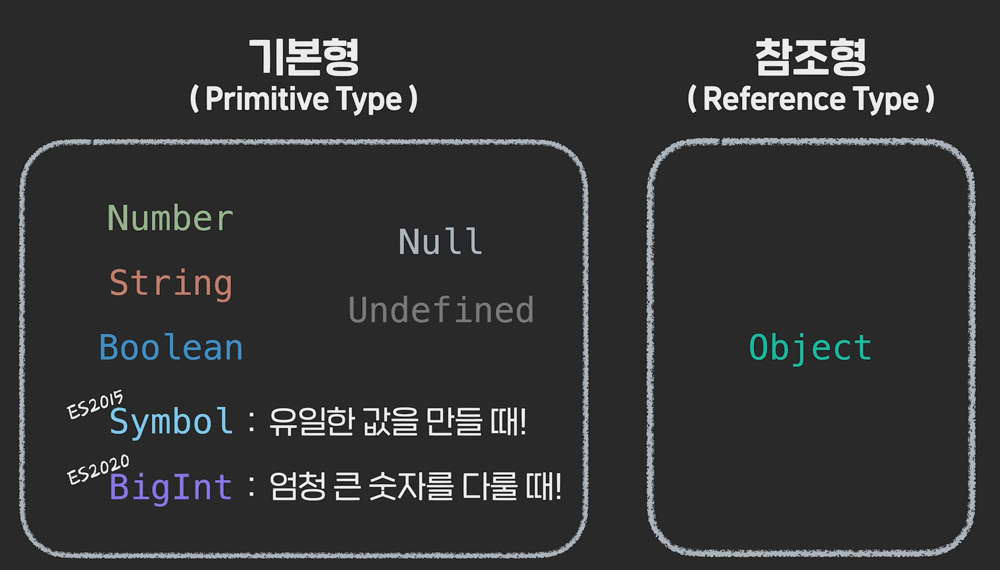
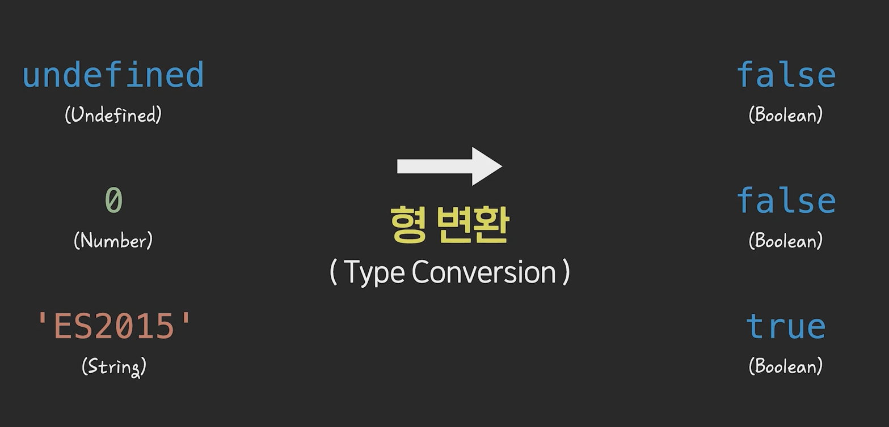
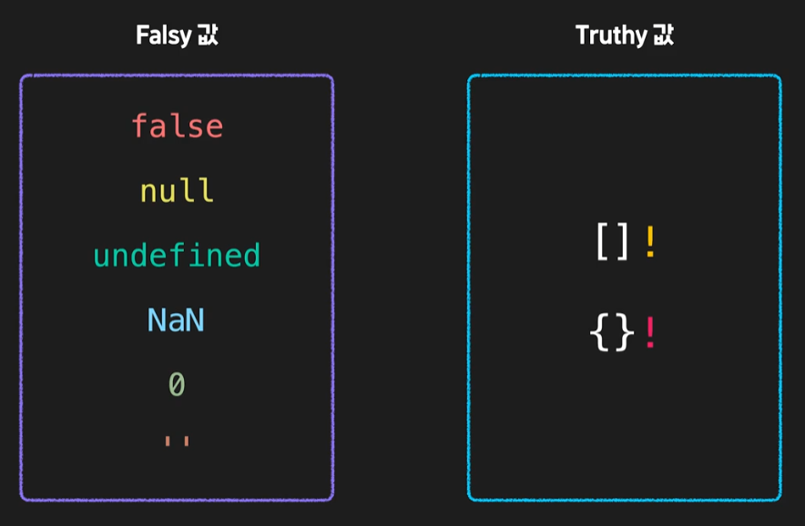
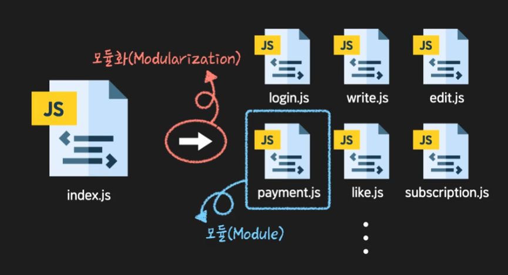

# 모던 자바스크립트 이해하기

## 모던 자바스크립트란?

- ECMA International이라는 국제 표준화 기구에서 JS 발전이나 변화 등을 관리
- 규칙이나 준수사항 등을 ECMA-262이라는 문서로 관리하게 되는데 이 문서의 내용을 ECMAScript
- **변화가 있을 때마다 ES1, ES2 형식으로 부르다가 6 버전이 등장한 2015년부터는 1년마다 출시하기로 결정하면서 편의상 ES6라고 부르지만 정식 명칭은 뒤에 연호를 달아서 ES2015, ES2016의 형식**
- ES6 버전은 JavaScript의 많은 부분을 보완한 버전 → ES5가 가지고 있던 문제점들을 보완하고(Arrow function, let, for of 등), 코드를 더 간결하게 작성할 유용한 문법들이 등장
- **현시점에 사용하기 적합한 범위 내에서 최신 버전의 표준을 준수하는 자바스크립트를 모던 자바스크립트라고 부름**

# 자바스크립트의 동작 원리

## 데이터 타입이 특정과 종류



## `Symbol`과 `BigInt`

- 심볼(symbol)은 기본형 데이터 타입(primitive data type) 중 하나입니다. 심볼은 코드 내에서 유일한 값을 가진 변수 이름을 만들 때 사용하는데요.

```jsx
const user = Symbol('this is a user');
console.log(user);

const user2 = Symbol('this is a user');
console.log(user === user2); // 유일한 값이기에 false가 반환
```

## `typeof` 연산자

- **`typeof`** 연산자는 키워드 다음에 공백(띄어쓰기)을 두고 값을 작성해도 되고, 함수를 사용하듯 괄호로 감싸서 사용 가능
- 일단, **`typeof null`**을 하면 문자열 **`null`**이 리턴되는 게 아니라 문자열 **object**가 리턴
    
    [typeof - JavaScript | MDN](https://developer.mozilla.org/ko/docs/Web/JavaScript/Reference/Operators/typeof#null)
    

## **불린인 듯 불린 아닌 불린같은 값**

- 불린이 아닌 타입도 불린 타입처럼 형 변환되는 특정이 있음
    
    
    
    
    
    - **[](빈 배열)이나 {}(빈 객체는 False가 아닌 True라는 점 혼동하지 말 것**
    

## AND와 OR의 연산 방식

- **JS에서 AND 연산자는 왼쪽 값이 truthy하면 오른쪽 값을 return하고, 왼쪽 값이 falsy하면 왼쪽 값을 return**
    
    ```jsx
    console.log(true && true); // true
    console.log(true && false); // false
    console.log(false && true); // false
    console.log(false && false); // false
    console.log('Codeit' && 'JavaScript') // JavaScript
    ```
    

- **JS에서 OR 연산자는 왼쪽 값이 truthy하면 왼쪽 값을 return하고, 왼쪽 값이 falsy하면 오른쪽 값을 return**

- 개념 이해 예시

```jsx
console.log(null && undefined); // null
console.log(0 && true); // true
console.log('0' && NaN); // NaN
console.log({} && 123); // {}
```

- 조건식처럼 활용할 수도 있음

```jsx
function print(value) {
	const message = value || 'Codeit';

	console.log(message);
}

print();
print('JavaScript');
```

## AND와 OR의 연산 우선순위

- AND 와 OR 연산자 사이에서는 AND 연산자의 우선순위가 더 높습니다.
    
    ```jsx
    console.log(true || false && false); // true
    console.log((true || false) && false); // false
    
    console.log('Codeit' || NaN && false); // Codeit
    console.log(('Codeit' || NaN) && false); // false
    ```
    
- 다양한 연산자들을 복합적으로 사용해야 한다면 소괄호를 활용해서 의도에 맞는 연산 우선순위를 명확하게 표기하는 것이 좋은 습관

[연산자 우선순위 - JavaScript | MDN](https://developer.mozilla.org/ko/docs/Web/JavaScript/Reference/Operators/Operator_Precedence)

## **null 병합 연산자 ??**

- **물음표 두 개(??)를 사용해서 null 혹은 undefined 값을 가려내는 연산자**
    
    ```jsx
    const example1 = null ?? 'I'; // I
    const example2 = undefined ?? 'love'; // love
    const example3 = 'Codeit' ?? 'JavaScript'; // Codeit
    
    console.log(example1, example2, example3); // I love Codeit
    ```
    

- OR 연산자(||)와 비교
    - OR 연산자 (||)와 동작하는 방식이 비슷
        
        ```jsx
        const title1 = null || 'codeit';
        const title2 = null ?? 'codeit';
        
        console.log(title1); // codeit
        console.log(title2); // codeit
        ```
        
    - **하지만 null 병합 연산자(??)는 왼편의 값이 null이나 undefined인지 확인**
    - OR 연산자(||)는 왼편의 값이 falsy인지를 확인
    - 아래 코드와 같이 null이나 undefined가 아닌 falsy 값을 활용할 때 결과가 서로 다름
        
        ```jsx
        const title1 = false || 'codeit';
        const title2 = false ?? 'codeit';
        
        console.log(title1); // codeit
        console.log(title2); // false
        
        const width1 = 0 || 150;
        const width2 = 0 ?? 150;
        
        console.log(width1); // 150
        console.log(width2); // 0
        ```
        
    

## **변수와 스코프**

- **변수 선언이 나중에 되었음에도 마치 선언이 위에서 된 것처럼 작동하는 것을 Hoisting이라고 함 → 단, 할당된 value 자체는 Hoisting 되지 않음 / let은 불가능**
    
    → hoist: 감아 올리기(위로 올라가는 듯한 현상이라고 해서 hoisting)
    
    ```jsx
    console.log(title); // undefined
    var title = 'codeit';
    console.log(title); // codeit
    ```
    

- **var는 변수 중복 선언 가능 / let은 불가능**
- **변수의 유효 범위(scope)의 차이가 있음**
    - **var는 함수 단위로 전역과 지역 변수로 나뉘기 때문에 if나 for에서 지역 변수를 만들 수 없는 문제가 있음**
    - **let는 명확하게 중괄호(code block)를 기준으로 지역변수 선언이 가능함**
    
    ```jsx
    var x; // function scope
    let y; // block scope
    const z; // block scope
    ```
    

# 함수 다루기

## **함수를 만드는 방법(함수 선언 & 함수 표현식)**

- **함수 표현식(Function Expression) → 함수를 값처럼 선언할 수 있음**
    
    ```jsx
    // 함수를 만드는 방법
    const printCodeit = function() {
      console.log('Codeit');
    };
    
    printCodeit();
    ```
    
- **이벤트를 만들 때 두 번째 parameter로 함수를 선언해서 전달한 이 모습도 결과적으로는 함수 선언을 값처럼 활용한다는 점에서 함수 표현식이라 말할 수 있음**
    
    ```jsx
    const myBtn = document.querySelector('#myBtn');
    
    myBtn.addEventListener('click', function() {
      console.log('button is clicked!');
    });
    ```
    

- 함수를 값처럼 선언한다는 점보다 값처럼 활용한다는 점에 중점을 둬야 함
- **함수 선언과 함수 표현식의 차이**
    - **변수 선언이나 다름 없기에 일반 함수 선언은 hoisting이 가능하지만 함수 표현식은 hoisting 불가능(변수 자체를 선언은 가능하나 value를 가져오지 못하는 변수 선언의 hoisting과 동일)**
    - **함수 안에서 추가로 선언된 함수 scope를 가지나 일반 다른 if나 for 안에서 선언된 함수는 전역적으로 사용 가능 → 함수 표현식은 선언된 변수에 한정되어 있음**
    - 각각 장단이 있고 속성이 다르기에 활용 방식 또한 달라서 코드를 작성할 때는 최대한 하나의 방식으로 통일해서 작성하는 것이 좋음

## 즉시 실행 함수 (IIFE) - Immediately Invoked Function Expression

- 일반적으로는 이렇게 함수를 먼저 선언한 다음,선언된 함수 이름 뒤에 소괄호를 붙여서 함수를 실행
    
    ```jsx
    function sayHi() {
      console.log('Hi!');
    }
      
    sayHi();
    ```
    

- 때로는 함수가 선언된 순간에 바로 실행할 수 있음 → 즉시 실행 함수(익명 함수로 선언한 케이스)
    
    ```jsx
    (function () {
      console.log('Hi!');
    })();
    ```
    
    ```jsx
    (function (x, y) {
      consoel.log(x + y);
    })(3, 5);
    ```
    

- **한 가지 주의할 점은 즉시 실행 함수는 함수에 이름을 지어주더라도 외부에서 재사용 불가 → 그래서 일반적으론 이름이 없는 익명 함수를 사용함**
    
    ```jsx
    (function sayHi() {
      console.log('Hi!');
    })();
    
    sayHi(); // ReferenceError
    ```
    

- **즉시 실행 함수의 활용**
    - 프로그램 초기화 기능에 많이 활용
        
        ```jsx
        (function init() {
          // 프로그램이 실행 될 때 기본적으로 동작할 코드들..
        })();
        ```
        
    - 재사용이 필요 없는, 일화성 동작을 구성할 때 활용
        
        ```jsx
        const firstName = Young;
        const lastName = Kang;
        
        const greetingMessage = (function () {
          const fullName = `${firstName} ${lastName} `;
        
          return `Hi! My name is ${fullName}`;
        })();
        ```
        

## 값으로서 함수

- JavaScript에서 함수는 객체 타입 → 다른 객체 안에 또 다른 객체 타입으로 넣을 수 있음
    
    ```jsx
    const myObject = {
      brand: 'Codeit',
      bornYear: 2012,
      isVeryNice: true,
      sayHi: function(name) {
        console.log(`HI! ${name}`)
      }
    };
    
    myObject.sayHi('JavaScript');
    ```
    
- 배열 안에 객체 형식으로 넣을 수도 있음
    
    ```jsx
    const myArray = [
      'codeit',
      2012,
      true,
      function(name) {
        console.log(`hi! ${name}`);
      }
    ]
    
    myArray[3]('JS');
    ```
    
- 흔히 접할 수 있듯 함수 안에 다른 함수를 `parameter` 형태로 전달할 수 있음(Callback Function)
- JavaScript에서의 함수는 변수나 다른 데이터 구조 안에 할당될 수 있고. 다른 함수의 parameter로 전달될 수도 있고, 다른 함수의 return 값으로 전달될 수도 있음 → 이런 종류의 프로그래밍 함수를 일급 함수(First Class)

## **Parameter**

- **함수 내에 선언되는 건 `parameter` - 매개변수, 호출할 때 사용되는 건 `argument` - 인자**
    
    ```jsx
    function greeting(name) { // parameter
      console.log(`Hi! My name is ${name}`);
    }
    
    greeting('JavaScript'); // Argument
    greeting('Codeit');
    greeting('World');
    ```
    

- `**parameter`가 선언된 함수를 `argument` 없이 호출되게 되면 `undifined`로 호출되지만, 해당 기본값을 선언해주면 별도의 선언없이 기본값을 가진 채 호출**
    
    ```jsx
    function greeting(name = 'Codeit') { // parameter
      console.log(`Hi! My name is ${name}`);
    }
    
    greeting(); // Hi! My name is Codeit
    ```
    
    ```jsx
    (개별메모)
    - 포켓의 경우 reset값을 상단처럼 처리해줌
    - reset값을 true의 argument로 내려주면 offset을 0으로 설정해서 새로 가져오고, 값을 안 내려줄 땐 기본값을 false로 잡고 데이터를 하단에서 concat하는 방식
    
    async loadSearchClub (reset = false) {
          if (this.search3.isLoading) return;
          if (reset) this.search3.offset = 0;
    
          try {
            this.search3.isLoading = true;
    
            const { data } = await this.$axios.get('/v1/user/meet/search', {
              params: {
                offset: this.search3.offset,
                limit: this.search3.limit,
                sort: this.search3.sort,
                meet_title: this.search3.meet_title,
              },
            });
            this.items3 = reset ? data.query : this.items.concat(data.query);
            this.search3.offset += data.query.length;
          } catch(e) {
            console.error(e);
          } finally {
            this.search3.isLoading = false;
          }
        },
    ```
    
- **여러 `parameter`가 선언된 함수를 일부 `argument` 없이 호출하면 기본값이 있고 없고와 별개로 순서대로 값을 넣어주기 때문에 기본값이 있는 `parameter`는 뒤에다가 선언하는 게 좋음**
    
    ```jsx
    // 잘못된 사례
    function greeting(name = 'Codeit', interest) { // parameter
      console.log(`Hi! My name is ${name}`);
      console.log(`I like ${interest}`);
    }
    
    greeting('JavaScript'); 
    // main.js:2 Hi! My name is JavaScript main.js:3 I like undefined
    ```
    
- **기본값이 여러 개 선언되어 있는 경우 순서에 맞게 기본값을 활용하고 싶을 때 → `argument` 값을 `undifined`로 전달하면 기본값을 사용할 수 있음**
    
    ```jsx
    function greeting(name = 'Codeit', interest = 'JavaScript') { // parameter
      console.log(`Hi! My name is ${name}`);
      console.log(`I like ${interest}`);
    }
    
    greeting(undefined, 'Python');
    // main.js:2 Hi! My name is Codeit main.js:3 I like Python
    ```
    

- 연산 형식으로도 `parameter`를 선언하고 다양한 형식으로 `argument`를 쓸 수 있음
    
    ```jsx
    function defaultTest(x, y = x + 3) {
      console.log(`x: ${x}`);
      console.log(`y: ${y}`);
    };
    
    defaultTest(2); // x: 2 y: 5
    defaultTest(2, 10); // x: 2 y: 10
    ```
    
- `parameter`에 기본값을 설정하는 문법은 ES2015에 등장한 문법 → ES2015를 지원하지 않는 환경에선 사용할 수 없음

## **Arguments**

- `parameter` 외의 `argument`를 선언했을 때 `undifined`
- **함수 내부에서 arguments 객체를 호출할 수 있고 배열과 모양새는 같지만 배열로 사용할 수 없는 유사배열(단, 반복문이나 indexing이 가능함)**
    
    ```jsx
    // arguments
    function printArguments(a, b, c) {
      console.log(a);
      console.log(b);
      console.log(c);
      console.log(arguments[1]); // 배열과 모양새는 같지만 배열로 사용할 수 없는 유사배열
      for(const arg of arguments) {
        console.log(arg);
      } // 반복문도 사용 가능
      console.log('-------------------');
    }
    
    printArguments('Young', 'Choi', 'Koby');
    printArguments('Young');
    printArguments('Young', 'Choi');
    printArguments('Young', 'Choi', 'Koby', 'Kim');
    ```
    

- **함수 내부에서 `arguments`라는 객체가 특정한 기능으로 존재하기 때문에 변수 이름이나 `parameter`의 이름을 `arguments`로 지어선 안 됨**

## 줄임말 대찬지

- **자바스크립트에서 문자열은 배열과 비슷한 특징들이 몇 가지 있는데요. 그 중 하나는 대괄호 표기법을 통해 indexing이 가능하다는 점입니다.**
    
    ```jsx
    console.log('최관수'[0]); // 최
    ```
    

## **Rest Parameter**

- `arguments`는 유사배열이기 때문에 배열함수를 사용하지 못하는 등 아쉬운 점이 존재했는데 ES6가 등장하면서 Rest Parameter라는 문법이 생김
- **일반 `parameter` 앞에 마침표 3개를 붙여주는 것을 Rest Parameter**
- **Rest Parameter는 배열이기 때문에 배열함수를 자유롭게 사용 가능**
- 배열함수 사용 예시
    
    ```jsx
    // arguments
    function printArguments(...args) {
      console.log(args.splice(0 ,2)); // ['Young', 'Choi'] - 배열함수 사용
      console.log(arguments.splice(0 ,2)); // is not a function - arguments로 접근하면 배열 함수 사용 불가
      console.log('-------------------');
    }
    
    printArguments('Young', 'Choi', 'Koby');
    printArguments('Young');
    printArguments('Young', 'Choi');
    printArguments('Young', 'Choi', 'Koby', 'Kim');
    ```
    
- ES6 이후에는 rest parameter가 활용성이 높고 더 유연하게 사용할 수 있기 때문에 스타일 가이드에서 더 권장되지만 때에 따라선 arguments를 완전히 대체할 순 없기에 온전히 구분해서 사용하는 걸 권장
    
    ```jsx
    // Rest Parameter
    // 명확하게 선언해줘야 하는 요소는 parameter로 선언하고 그 외에는 rest parameter로 선언해서 유연하게 활용
    function printRank(first, second, ...others) {
      console.log('코드잇 레이스 최종 결과');
      console.log(`'우승': ${first}`);
      console.log(`'준우승': ${second}`);
      for(const arg of others) {
        console.log(`'준우승': ${arg}`);
      }
    }
    
    printRank('Choi', 'Kim', 'Lee', 'Park', 'Yoon');
    ```
    

## **Arrow Function**

- 기존의 함수 선언 방식을 간결하게 만들어주는 문법
- **이름이 없는 익명함수이기 때문에 이름을 가진 변수에 할당하거나 다른 함수의 argument로 함수를 선언할 때 주로 사용됨**
- ‘function’이라는 키워드를 지워주고 그 대신 소괄호 오른편에서 등호와 부등호를 사용해서 화살표 기호를 표시해줌
    
    ```jsx
    // Arrow Function
    // const getTwice = function(number) {
    //   return number * 2;
    // };
    const getTwice = (number) => {
      return number * 2;
    };
    **// (number) parameter의 소괄호를 제거해도 작성할 수 있으나, parameter가 2개 이상일 경우 필수적으로 소괄호를 작성해줘야 하고, parameter를 명시적으로 표현해주기 위해 스타일가이드에서는 권장하기도 함**
    **// 내부의 동작 부분이 return문 하나로만 이루어져 있는 경우, return과 중괄호도 생략할 수 있음(단, return값이 객체인 경우 소괄호로 한번 묶어주면 가능)**
    
    console.log(getTwice(5));
    
    const myBtn = document.querySelector('#myBtn');
    
    // myBtn.addEventListener('click', function () {
    //   console.log('button is clicked!');
    // });
    myBtn.addEventListener('click', () => {
      console.log('button is clicked!');
    });
    ```
    

- **arrow function에는 arguments 객체가 없음 → arguments 객체를 사용하는 함수라면 arrow function으로 대체할 수 없음**
    
    ```jsx
    // Arrow Function
    function normalFunc() {
      console.log(arguments); // Arguments(3) [1, 2, 3]
    };
    
    const arrowFunc = () => {
      console.log(arguments); // arguments is not defined
    };
    
    normalFunc(1, 2, 3);
    arrowFunc(1, 2, 3);
    ```
    

## **What is this?**

- `**console.log(this)` 를 그냥 출력하면 전역 객체인 window가 출력됨(기본값) → 일반적으로 함수 내부에서 사용됨, 특히 객체에서 method를 만들 때 중요한 역할**
- 객체에 method를 만들 때 사용한 예시
    
    ```jsx
    // this
    const user = {
      firstName: 'Tess',
      lastName: 'Jang',
      getFullName: function() {
        return `${user.firstName} ${user.lastName}`;
      },
    };
    
    console.log(user.getFullName()); // Tess Jang
    ```
    

- **그런데, 이 method를 다른 객체에도 적용하고 싶어서 함수를 외부로 적용하면 user 객체만 바라보기 때문에 admin 객체에서 호출하더라도 user 객체의 property를 사용하게 됨 → 이런 상황에서 this라는 키워드가 유용하게 사용하게 됨**
    
    ```jsx
    function getFullName() {
      // return `${user.firstName} ${user.lastName}`; // this 적용 전
      return `${this.firstName} ${this.lastName}`; // this 적용
    }
    
    const user = {
      firstName: 'Tess',
      lastName: 'Jang',
      getFullName: getFullName,
    };
    const admin = {
      firstName: 'Alex',
      lastName: 'Kim',
      getFullName: getFullName,
    };
    
    console.log(admin.getFullName());
    console.log(user.getFullName());
    ```
    

- **JavaScript에서 `this`는 함수를 호출한 객체를 가리키는 키워드**
- **값이 미리 결정되는 게 아니라 어떤 객체가 그 함수를 호출했는지에 따라 상대적으로 그 값이 변경됨**
- **일반 함수와 arrow function은 this를 다루는 방식이 달라짐 → 따라서 객체에 method를 만들 때는 일반 함수가 권장됨**

# 자바스크립트의 문법과 표현

## 문장과 표현식

- 문장(statements)과 표현식(expressions)
- 우리가 작성하는 모든 자바스크립트 코드는 모두 문장과 표현식으로 구성
- 문장: 어떤 동작이 일어나도록 작성된 최소한의 코드 덩어리
- 표현식: 결과적으로 하나의 값이 되는 모든 코드
- `console.log` 메소드의 아규먼트로 `if`문을 전달하거나 someloop라는 변수에 `for` 반복문을 할당하게 되면, Error가 발생 → 조건문이나 반복문은 값으로 평가되지 않고 오로지 문장으로만 평가되기 때문
    
    ```jsx
    let x; 
    x = 3;
    
    console.log(if (x < 5) {
      console.log('x는 5보다 작다');
    } else {
      console.log('x는 5보다 크다');
    });
    
    const someloop = for (let i = 0; i < 5; i++) {
      console.log(i);
    };
    ```
    

## **조건을 다루는 표현식**

- ES2015 이전에는 조건을 다루는 게 `if`와 `switch` 같은 문장 형태 뿐이었음
- ES2015 이후 등장한 조건 연산자를 활용하면 문장 형태의 조건이 아니라 표현식으로 다룰 수 있음
- **조건 연산자 (Conditional operator)**
- **조건 ? truthy 할 때 표현식 : falsy 할 때 표현식**
- **삼항 연산자 (Ternary operator)**
- JavaScript에서 유일하게 항이 3개인 연산자이기 때문에 조건 연산자보다 삼항 연산자로 많이 불려짐
    
    ```jsx
    const CUT_OFF = 80;
    
    function passChecker(score) {
      return score > CUT_OFF ? '합격!' : '불합격!';
    }
    
    console.log(passChecker(75)); // 불합격!
    ```
    

## **Spread 구문**

- ES2015에서 새롭게 등장한 문법 → 배열을 다룰 때 유용하게 활용됨
- **여러 개를 묶은 배열을 각각의 개별값으로 펼치는 문법**
- **해당 배열 앞에 마침표 3개를 붙여줌**
    
    ```jsx
    const numbers = [1, 2, 3];
    
    console.log(...numbers); // 1 2 3
    ```
    

- `**spread` 구문과 `rest parameter`와 문법이 동일하지만, `rest parameter`는 여러 개의 `argument`를 하나로 묶는 방식, spread는 배열을 각각의 개별값으로 펼친다는 차이**
- **객체 타입의 값들은 변수에 직접 할당되는 게 아니라 주소값이 참조됨(깊은복사 얇은복사..?)**
    
    ```jsx
    const webPublishing = ['HTML', 'CSS'];
    const interactiveWeb = webPublishing;
    
    interactiveWeb.push('JavaScript');
    
    console.log(webPublishing); // (3) ['HTML', 'CSS', 'JavaScript']
    console.log(interactiveWeb); // (3) ['HTML', 'CSS', 'JavaScript']
    ```
    

- **따라서 `slice`를 사용해서 해당 객체를 복사해줘야 함**
    
    ```jsx
    const webPublishing = ['HTML', 'CSS'];
    // const interactiveWeb = webPublishing; //
    const interactiveWeb = webPublishing.slice();
    
    interactiveWeb.push('JavaScript');
    
    console.log(webPublishing);
    console.log(interactiveWeb);
    ```
    
    [Array.prototype.slice() - JavaScript | MDN](https://developer.mozilla.org/ko/docs/Web/JavaScript/Reference/Global_Objects/Array/slice)
    
    **‘slice() 메서드는 어떤 배열의 begin부터 end까지(end 미포함)에 대한 얕은 복사본을 새로운 배열 객체로 반환합니다. 원본 배열은 바뀌지 않습니다.’**
    

- `**slice` 대신 `spread` 구문을 사용할 수 있음**
    
    ```jsx
    const webPublishing = ['HTML', 'CSS'];
    const interactiveWeb = [...webPublishing]; // spread 사용
    
    interactiveWeb.push('JavaScript');
    
    console.log(webPublishing);
    console.log(interactiveWeb);
    ```
    
    ```jsx
    const webPublishing = ['HTML', 'CSS'];
    const interactiveWeb = [...webPublishing, 'JavaScript']; // push 없이 바로 추가 가능
    
    console.log(webPublishing);
    console.log(interactiveWeb);
    ```
    

- `concat` 메소드를 활용해서 두 배열을 합칠 수도 있지만 `spread` 구문을 사용할 수 있음
    
    ```jsx
    const arr1 = [1, 2, 3];
    const arr2 = [4, 5, 6];
    
    const arr3 = [...arr1, ...arr2]; // spread 구문 사용
    console.log(arr3);
    
    const arr4 = arr1.concat(arr2); // concat을 사용할 수도 있지만 spread를 사용했을 때 새로운 배열에 담긴 기존 배열을 좀 더 직관적으로 파악할 수 있다는 장점이 있음
    console.log(arr4);
    ```
    

- **배열을 `spread`로 풀어서 새로운 `object`로 담을 수 있음**
    
    ```jsx
    const members = ['태호', '종훈', '우재'];
    
    const newObject = {...members};
    
    console.log(newObject);
    ```
    

- **Deep Copy, Shallow Copy, spread, slice 모두 연계해서 이해하려고 해야 함**

## **객체 Spread하기**

- ES2018에서 일반 객체에도 Spread 구문을 사용할 수 있는 표준이 등장
    
    ```jsx
    const latte = {
      esspresso: '30ml',
      milk: '150ml'
    };
    
    const cafeMocha = {
      ...latte,
      chocolate: '20ml',
    }
    
    console.log(latte); // {esspresso: "30ml", milk: "150ml"}
    console.log(cafeMocha); // {esspresso: "30ml", milk: "150ml", chocolate: "20ml"}
    ```
    

## **모던한 프로퍼티 표기법**

- 객체에 프로퍼티를 좀 더 간결하게 표현하는 방식 → property name과 value로 사용할 변수나 함수의 이름이 같은 경우 하나만 작성해서 쓸 수 있음
    
    ```jsx
    const title = 'Codeit';
    const birth = 2017;
    const job = '프로그래밍 강사';
    
    const user = {
      // title: title,
      // birth: birth,
      // job: job,
      title,
      birth,
      job,
    };
    
    console.log(user);
    ```
    

- 객체 내부에 함수도 축약해서 사용할 수 있음
    
    ```jsx
    // this
    const user = {
      firstName: 'Tess',
      lastName: 'Jang',
      // getFullName: function() {
      //   return `${user.firstName} ${user.lastName}`;
      // },
      getFullName() {
        return `${user.firstName} ${user.lastName}`;
      },
    };
    
    console.log(user.getFullName()); // Tess Jang
    ```
    
- 표현식을 대괄호로 감싸면 해당 표현식을 property name으로 사용 가능
    
    ```jsx
    // 계산된 속성명(computed property name)
    const propertyName = 'birth';
    const getJob = () => 'job';
    
    const codeit = {
      ['topic' + 'Name']: 'Modern JavaScript',
      [propertyName]: 2017,
      [getJob()]: '프로그래밍 강사',
    };
    
    console.log(codeit);
    ```
    

## **옵셔널 체이닝**

- **중첩 객체를 다룰 때 주의해야 함**
    
    ```jsx
    function printCatName(user) {
      console.log(user.cat.name);
    }
    
    const user1 = {
      name: 'Captain',
      cat: {
        name: 'Crew',
        breed: 'British Shorthair',
      }
    }
    
    printCatName(user1); // Crew
    ```
    

- **cat property를 가지고 있지 않은 경우 user2의 cat property가 undefined이기 때문에 user2.cat.name에 접근하려는 순간 에러 발생** → 여러 가지 상황에 맞춰 데이터를 다루다 보면 때로는 우리가 예상한 프로퍼티를 가지고 있지 않을 수 있음
    
    ```jsx
    const user2 = {
      name: 'Young',
    }
    
    console.log(user2.cat); // undefined
    printCatName(user2); // TypeError: Cannot read property 'name' of undefined
    ```
    

- **printCatName과 같이 중첩된 객체의 프로퍼티를 다룰 때는 user.cat.name에 접근하기 전에 user.cat이 null 혹은 undefined가 아니라는 것을 검증하고 접근해야 에러를 방지할 수 있음**
- 일반적으로는 간결하게 AND 연산자를 활용해서 이 문제를 해결하곤 했었으나 객체의 이름이나 프로퍼티의 이름이 길어질수록 가독성이 나빠지는 문제가 있었음
    
    ```jsx
    function printCatName(user) {
      console.log(user.cat && user.cat.name);
    }
    ```
    

- 그래서 등장한 문법이 옵셔널 체이닝(Optional Chaining)
- **옵셔널 체이닝 연산자 왼편의 프로퍼티 값이 undefined 또는 null이 아니라면 그다음 프로퍼티 값을 리턴하고 그렇지 않은 경우에는 undefined를 반환하는 문법**
    
    ```jsx
    function printCatName(user) {
      console.log(user.cat?.name); // 옵셔널 체이닝 문법
    }
    ```
    

- **옵셔널 체이닝 연산자의 동작 원리를 삼항 연산자를 통해 구체적으로 표현하면 다음과 같이 작성**
    
    ```jsx
    function printCatName(user) {
      console.log((user.cat === null || user.cat === undefined) ? undefined : user.cat.name);
    }
    ```
    

- **null 병합 연산자와 함께 활용한 케이스**
    
    ```jsx
    function printCatName(user) {
      console.log(user.cat?.name ?? '함께 지내는 고양이가 없습니다.');
    }
    
    const user2 = {
      name: 'Young',
    }
    
    printCatName(user2); // 함께 지내는 고양이가 없습니다.
    ```
    

## Destructuring (구조 분해) - 배열의 구조 분해

```jsx
// 구조 분해(Destructuring)
const rank = ['효준', '유나', '민환', '재하'];

// const macbook = rank[0];
// const ipad = rank[1];
// const airpods = rank[2];
// const coupon = rank[3];

// destructuring 문법으로 작성
 const [macbook, ipad, airpods, coupon] = rank;
 // 배열을 분해해서 해당 배열에 값을 할당해줌
 // 할당하는 값이 배열이 아니거나 값이 없으면 오류가 발생하니 주의
****
console.log(macbook);
console.log(ipad);
console.log(airpods);
console.log(coupon);
```

- 가장 마지막 변수에 마침표 3개를 붙여주면 함수의 rest parameter처럼 나머지 요소를 배열로 할당하는 게 가능함
    
    ```jsx
    // 구조 분해(Destructuring)
    const rank = ['효준', '유나', '민환', '재하', '규식'];
    
    // const macbook = rank[0];
    // const ipad = rank[1];
    // const airpods = rank[2];
    // const coupon = rank[3];
    
    // destructuring 문법으로 작성
     const [macbook, ipad, airpods, ...coupon] = rank;
     // 배열을 분해해서 해당 배열에 값을 할당해줌
    
    console.log(macbook);
    console.log(ipad);
    console.log(airpods);
    console.log(coupon); // ["재하", "규식"]
    ```
    

- 값이 없다면 undifined가 할당되고 함수의 매개변수처럼 기본값을 할당해줄 수도 있음
    
    ```jsx
    // 구조 분해(Destructuring)
    const rank = ['효준', '유나', '민환'];
    
    // const macbook = rank[0];
    // const ipad = rank[1];
    // const airpods = rank[2];
    // const coupon = rank[3];
    
    // destructuring 문법으로 작성
     const [macbook, ipad, airpods, coupon = '없음'] = rank;
     // 배열을 분해해서 해당 배열에 값을 할당해줌
    
    console.log(macbook);
    console.log(ipad);
    console.log(airpods);
    console.log(coupon);
    ```
    

## **Destructuring (구조 분해) II - 객체의 구조 분해 - React에서 적극적으로 활용되는 문법**

```jsx
// 구조 분해 (Destructuring)
const macbook = {
  title: '맥북 프로 16형',
  price: 3690000,
  memory: '16GB',
  storage: '1TB SSD 저장 장치',
  display: '16형 Retina 디스플레이'
};

// const title = macbook.title;
// const price = macbook.price;

// destructuring 문법으로 작성
const { title, color = 'silver' } = macbook;
// 우측에 있는 객체와 좌측에 선언된 property name과 일치하는 게 있으면 값을 넣어줌

console.log(title);
console.log(color);
```

- 나머지 요소 객체로 할당하는 게 가능
    
    ```jsx
    // 구조 분해 (Destructuring)
    const macbook = {
      title: '맥북 프로 16형',
      price: 3690000,
      memory: '16GB',
      storage: '1TB SSD 저장 장치',
      display: '16형 Retina 디스플레이'
    };
    
    // const title = macbook.title;
    // const price = macbook.price;
    
    // destructuring 문법으로 작성
    const { title, ...rest } = macbook;
    // 우측에 있는 객체와 좌측에 선언된 property name과 일치하는 게 있으면 값을 넣어줌
    
    console.log(title);
    console.log(rest);
    ```
    
- 새로운 변수 이름으로 할당 가능
    
    ```jsx
    // 구조 분해 (Destructuring)
    const macbook = {
      title: '맥북 프로 16형',
      price: 3690000,
      memory: '16GB',
      storage: '1TB SSD 저장 장치',
      display: '16형 Retina 디스플레이'
    };
    
    // const title = macbook.title;
    // const price = macbook.price;
    
    // destructuring 문법으로 작성
    const { title: product, ...rest } = macbook;
    // 우측에 있는 객체와 좌측에 선언된 property name과 일치하는 게 있으면 값을 넣어줌
    
    console.log(product);
    console.log(rest);
    ```
    
- ‘serial-num’과 같이 변수로 사용할 수 없는 이름은 새로운 변수에 담아줘야 하기 때문에 상단의 문법을 주로 사용 가능
    
    ```jsx
    // 구조 분해 (Destructuring)
    const macbook = {
      title: '맥북 프로 16형',
      price: 3690000,
      memory: '16GB',
      storage: '1TB SSD 저장 장치',
      display: '16형 Retina 디스플레이',
      'serial-num': 'ABCDEFG',
    };
    
    // const title = macbook.title;
    // const price = macbook.price;
    
    // destructuring 문법으로 작성
    const { title: product, 'serial-num': serialNum } = macbook;
    // 우측에 있는 객체와 좌측에 선언된 property name과 일치하는 게 있으면 값을 넣어줌
    
    console.log(product);
    console.log(serialNum);
    ```
    

## **함수와 Destructuring**

- 배열의 경우
    
    ```jsx
    // 구조 분해(Destructuring)를 함수에 적용
    function getArray() {
      return ['컴퓨터', '냉장고', '세탁기'];
    }
    
    const [el1, el2, el3] = getArray();
    
    console.log(el1);
    console.log(el2);
    console.log(el3);
    ```
    

- 응용
    
    ```jsx
    // 구조 분해(Destructuring)
    function printWinners(...arg) {
      const [macbook, ipad, airpods, ...coupon] = arg;
    
      console.log('이벤트 결과를 알려드립니다!');
      console.log(`맥북의 주인공은 '${macbook}'님 입니다.`);
      console.log(`맥북의 주인공은 '${ipad}'님 입니다.`);
      console.log(`맥북의 주인공은 '${airpods}'님 입니다.`);
      console.log('코드잇 3개월 수강권 주인공은');
    
      for(let user of coupon) {
        console.log(`'${user}'님`);
      }
    
      console.log(`이상 총 ${coupon.length}명 입니다.`)
    }
    
    printWinners('효준', '효신', '재훈', '소원', '현승', '종훈')
    ```
    

- 응용2: 함수의 parameter 부분에서 destructuring 문법을 바로 활용할 수도 있음
    
    ```jsx
    // 구조 분해(Destructuring)
    function printWinners([macbook, ipad, airpods, ...coupon]) {
      console.log('이벤트 결과를 알려드립니다!');
      console.log(`맥북의 주인공은 '${macbook}'님 입니다.`);
      console.log(`맥북의 주인공은 '${ipad}'님 입니다.`);
      console.log(`맥북의 주인공은 '${airpods}'님 입니다.`);
      console.log('코드잇 3개월 수강권 주인공은');
    
      for(let user of coupon) {
        console.log(`'${user}'님`);
      }
    
      console.log(`이상 총 ${coupon.length}명 입니다.`)
    }
    
    const ranks = ['효준', '효신', '재훈', '소원', '현승', '종훈']
    printWinners(ranks);;
    ```
    

- 객체의 경우
    
    ```jsx
    // 구조 분해(Destructuring)를 함수에 적용
    function getObject() {
      return {
        name: '코드잇',
        birth: 2017,
        job: '프로그래밍 강사',
      }
    };
    
    const { name: brand, birth, job } = getObject();
    
    console.log(brand);
    console.log(birth);
    console.log(job);
    ```
    
- 객체의 경우에 상단처럼 객체를 return하는 함수보다는, parameter를 객체의 형식으로 작성한 상황에서 더 유용하게 활용됨
    
    ```jsx
    // 구조 분해(Destructuring)
    const macbook = {
      title: '맥북 프로 16형',
      price: 3690000,
      color: 'silver',
      memory: '16GB',
      storage: '1TB SSD 저장 장치',
      display: '16형 Retina 디스플레이',
    };
    
    function printSummary(object) {
      console.log(`선택한 상품은 '${object.title}'입니다.`);
      console.log(`색상은 '${object.color}'입니다.`);
      console.log(`가격은 '${object.price}'입니다.`);
    };
    
    printSummary(macbook);
    ```
    
- 함수 내부에서 이 property를 활용할 때 매번 이 객체에 접근하는 게 아니라 destructuring 문법을 활용하면 좀 더 간결하게 접근 가능함
    
    ```jsx
    // 구조 분해(Destructuring)
    const macbook = {
      title: '맥북 프로 16형',
      price: 3690000,
      color: 'silver',
      memory: '16GB',
      storage: '1TB SSD 저장 장치',
      display: '16형 Retina 디스플레이',
    };
    
    function printSummary(object) {
      const { title, color, price } = object;
    
      console.log(`선택한 상품은 '${title}'입니다.`);
      console.log(`색상은 '${color}'입니다.`);
      console.log(`가격은 '${price}'입니다.`);
    };
    
    printSummary(macbook);
    ```
    
- 마찬가지로, 함수의 parameter 부분에서 destructuring 문법을 바로 활용할 수도 있음
    
    ```jsx
    // 구조 분해(Destructuring)
    const macbook = {
      title: '맥북 프로 16형',
      price: 3690000,
      color: 'silver',
      memory: '16GB',
      storage: '1TB SSD 저장 장치',
      display: '16형 Retina 디스플레이',
    };
    
    function printSummary({ title, color, price }) {
      console.log(`선택한 상품은 '${title}'입니다.`);
      console.log(`색상은 '${color}'입니다.`);
      console.log(`가격은 '${price}'입니다.`);
    };
    
    printSummary(macbook);
    ```
    
- DOM 이벤트 작성 시
    
    ```jsx
    // 구조 분해(Destructuring)를 함수에 적용
    const btn = document.querySelector('#btn');
    
    btn.addEventListener('click', ({ target }) => {
      target.classList.toggle('checked');
    });
    ```
    
- Destructuring 문법과 구조가 조금 익숙해졌을 때 중첩 객체 구조 분해(Nested Object Destructuring)를 추후에 공부해보는 것도 좋음

## **에러와 에러 객체**

- **JavaScript는 코드가 실행되는 중에 에러가 발생하면 그 에러에 대한 정보가 담긴 에러 객체를 생성함**
- 에러 객체는 에러의 정보를 담고 있는 name과 message라는 property가 존재함
- **자주 보는 에러 객체**
    - **ReferenceError**: 존재하는 변수 등을 다루고자 할 때
    - **TypeError**: 잘못된 방식으로 자료형을 다루고자 할 때
    - **SyntaxError**: 문법에 맞지 않는 코드를 작성하게 되면 발생 → 코드 자체에서 발생하는 부분이 있다면 코드를 실행하기 전에 에러를 발생시킴
- 에러 객체 만드는 법
    
    ```jsx
    // 에러와 에러 객체
    const error = new TypeError('타입 에러가 발생했습니다.');
    
    console.log(error.name); // TypeError
    console.log(error.message); // 타입 에러가 발생했습니다.
    ```
    
- 에러를 발생시키는 법 - throw 키워드를 사용함
    
    ```jsx
    // 에러와 에러 객체
    const error = new TypeError('타입 에러가 발생했습니다.');
    
    throw error; // Javascript에서 error를 발생시키는 방법
    
    console.log(error.name); // TypeError
    console.log(error.message); // 타입 에러가 발생했습니다.
    ```
    

## try catch 문 - 에러를 다루는 방법 중 하나

- **try catch를 사용하지 않을 때 에러가 나면 에러 객체를 생성하고 그걸 바로 콘솔로 출력해주는데, try catch를 사용하면 에러 객체를 에러가 나는 지점에서 생성하고 그 객체를 catch의 parameter로 전달해줌**

```jsx
// try catch 문
try {
  console.log('에러 전');

  const codeit = '코드잇';
  console.log(codeit);

  codeit = 'codeit'; // 에러가 나는 지점

  const language = 'JavaScript';
  console.log(language);
} catch (e) { // error라는 parameter는 지정할 수 있음, 보통은 err 혹은 e
  console.log('에러 후');
  console.error('e', e); // console의 log 메소드보다 error 쓰면 익숙한 빨간블럭으로 출력됨
  console.log('e.name', e.name);
  console.log('e.message', e.message);
}
```

## try catch 활용하기

- try catch이 없는 경우(에러가 나면 에러 하단부를 실행되지 않음)
    
    ```jsx
    // try catch 없을 때
    function printMembers(members) {
      for (const member of members) {
        console.log(member);
      }
    }
    
    const teamA = ['상혜', '혜진', '지혜', '혜선'];
    printMembers(teamA);
    
    const codeit = { name: 'codeit' }; 
    printMembers(codeit); // 객체는 반복문을 사용할 수 없기에 에러 발생
    
    const teamB = ['영훈', '재훈', '종훈', '정훈']; // 때문에 에러 하단부는 실행되지 않음
    printMembers(teamB);
    ```
    

- try catch 활용(에러가 나도 catch문을 들어갔다가 에러 하단부까지 문제 없이 실행)
    
    ```jsx
    // try catch 활용하기
    function printMembers(members) {
      try {
        for (const member of members) {
          console.log(member);
        }
      } catch (err) {
        console.error(err);
        alert(`${err.name}가 발생했습니다. 콘솔창을 확인해주세요.`)
      }
    }
    
    const teamA = ['상혜', '혜진', '지혜', '혜선'];
    printMembers(teamA);
    
    const codeit = { name: 'codeit' }; 
    printMembers(codeit); // 객체는 반복문을 사용할 수 없기에 에러 발생
    
    const teamB = ['영훈', '재훈', '종훈', '정훈']; // 에러가 발생해도 실행 가능
    printMembers(teamB);
    ```
    
- **try catch 문도 결국은 각각의 코드 블럭으로 이뤄져 있기 때문에, let이나 const 같이 block scope를 갖는 변수를 활용할 때 각 코드 블럭 안에서의 scope를 잘 생각해야 함**
- try catch 문은 실행 불가능한 코드를 catch로 빼는 것이 아니라 실행 가능한 코드를 예외 처리(Exception Handling) 하는 방식

## finally 문

- **try문에서 어떤 코드를 실행할 때 에러 여부와 상관 없이 항상 실행할 코드를 작성하는 것**
    
    ```jsx
    try {
      // 실행할 코드
    } catch (err) {
      // 에러가 발상했을 때 실행할 코드
    } finally {
      // 항상 실행할 코드
    }
    ```
    

- **전체를 한번 더 감싸서 finally문에서의 에러 처리도 가능**
    
    ```jsx
    try {
      try {
        // 실행할 코드
      } catch (err) {
        // 에러가 발상했을 때 실행할 코드
      } finally {
        // 항상 실행할 코드
      }
    } catch (err) {
      // finall문에서 에러가 발생했을 때 실행할 코드
    }
    ```
    

# 자바스크립트의 유용한 내부 기능

## **배열 메소드 I: forEach와 map**

- `forEach`
    - `**forEach`문은 `argument`로 콜백 함수를 작성해주게 되면 콜백 함수의 첫 번째 `parameter`로 배열의 요소를 순서대로 전달하면서 매번 이 함수를 실행하는 형식**
    - **그래서 반드시 콜백 함수에는 `parameter` 하나가 작성되어야 함**
    - 콜백 함수에서 다룰 수 있는 두 가지 `parameter`가 더 있음
    - **두 번째 paramter를 작성하게 되면 요소의 index를 관리할 수 있게 됨(`for of` 문과의 확실한 차이)**
    - **세 번째 `parameter`로는 해당 `array`를 호출할 수 있음 → 앞서 배열이 담긴 변수를 그대로 쓸 수도 있기 때문에 거의 사용되지 않지만 변수에 담지 않은 그대로의 배열을 사용하는 경우에는 해당 `parameter`를 활용하는 경우도 있음**
- `map`
    - `**forEach`를 `map`로도 바꿔도 동일하게 동작하지만 callback 함수 내에서 return문을 작성해주게 되면 새로운 배열을 return**
    - **새로운 배열을 재가공해서 사용할 때 유용함**
    
- **배열의 단순 반복을 활용할 때는 `forEach` / 새로운 배열을 재가공하고자 할 때는 `map`를 활용할 수 있음**
- 두 메소드의 최대 반복 횟수는 메소드를 처음 호출할 때 그 당시 요소의 갯수라는 점 주의 → 배열의 갯수가 늘어나도 처음 호출할 때의 갯수로 반복 → **단, 반복하는 과정상에서 배열의 값이 줄면 줄어든 배열의 갯수로 반복**
    
    ```jsx
    // forEach와 map
    const firstNames = ['최', '김', '박', '이'];
    const members = ['영훈', '윤수', '동욱', '태호'];
    
    for (let member of members) {
      console.log(`${member}님이 입장하셨습니다.`);
    }
    
    members.map(function (member, i, arr) {
      console.log(`${i}. ${member}님이 입장하셨습니다.`);
      console.log(arr);
    });
    
    // fullNames라는 새로운 배열 생성
    const fullNames = members.map(function (member, i) {
      // console.log(`${i}. ${member}님이 입장하셨습니다.`);
      // console.log(arr);
      return firstNames[i] + member;
    });
    
    console.log(fullNames); // 새로운 배열 출력
    ```
    

## **배열 메소드 II: filter와 find (특정 조건 있음)**

- `**filter**`
    - **특정한 조건을 만족하는 요소만 추려낼 때 사용**
    - 항상 return 값이 배열이기 때문에 하나의 요소만 찾더라도 배열로 return → 때문에 spread 구문을 통해 배열을 벗겨내는 작업을 해줘야 함
- `**find**`
    - 하나의 값만 배열없이 return 하고자 할 땐 filter 대신 find
- `**filter`와 `find`의 차이**
    - `filter`는 배열 return, `find`는 값을 return
    - `filter`는 값을 배열 다 반복해서 돌지만, `find`는 값을 찾는 순간 반복 종료 → 물론 마지막값을 찾을 때는 반복 횟수가 동일하겠지만 성능 측면에서 적절한 상황에 잘 사용해야 할 필요성이 있음
    - 없는 값을 찾았을 때 `filter`는 빈 배열 return, `find`는 undefined
    
    ```jsx
    // filter와 find
    const devices = [
      { name: 'GalaxyNote', brand: 'Samsung' },
      { name: 'MacbookPro', brand: 'Apple' },
      { name: 'iPad', brand: 'Apple' },
      { name: 'GalaxyWatch', brand: 'Samsung' },
      { name: 'iMac', brand: 'Apple' },
      { name: 'GalaxyBuds', brand: 'Samsung' },
      { name: 'Gram', brand: 'LG' },
      { name: 'GalaxyBook', brand: 'Samsung' },
      { name: 'SurfacePro', brand: 'Microsoft' },
      { name: 'ZenBook', brand: 'Asus' },
      { name: 'MacbookAir', brand: 'Apple' },
    ]
    
    const apples = devices.filter(function(el) {
      return el.brand === 'Apple';
    })
    
    console.log(apples);
    
    // 단 하나의 값이라도 배열로 return하는 filter
    // const myLaptop = devices.filter(function(el) {
    //   return el.name === 'Gram';
    // })
    
    // 이럴 땐 find를 사용함
    const myLaptop = devices.find(function(el) {
      return el.name === 'Gram';
    })
    
    console.log(myLaptop);
    ```
    

## **배열 메소드 III: some과 every**

- **`some`과 `every`의 차이**
    - `some` 메소드는 조건을 만족하는 요소가 1개 이상, `every`는 모든 요소일 때 true
    - `some` 메소드는 1개 이상만 충족하면 되기 때문에 `find` 메소드처럼 조건이 만족되면 반복 종료, `every`는 모든 배열의 갯수만큼 반복
    - 빈 배열인 경우 callback 함수를 실행하지도 않고 `some`은 false, `every`는 true를 return
    
    ```jsx
    // some과 every
    const numbers = [1, 3, 5, 7, 9];
    
    // some: 조건을 만족하는 요소가 1개 이상 있는지
    const someReturn = numbers.some(function(el) {
      return el > 5
    });
    
    console.log(someReturn); // true
    
    // every: 모든 요소가 조건을 만족하는지
    const everyReturn = numbers.every(function(el) {
      return el > 5
    })
    
    console.log(everyReturn); // false
    ```
    

## 배열 메소드 IV: reduce

- 두번째 parameter로는 배열의 요소가 전달, 세번째는 index, 네번째는 배열
- 첫번째 parameter는 Accumulator(누산기) → callback 함수가 반복해서 동작할 때 직전에 동작한 callback 함수가 return한 값을 전달 받는 parameter
- 그런 구조이기 때문에 제일 처음 실행되는 callback 함수의 accumulator에는 전달 받을 값이 없음 → 그래서 reduce 메소드의 두번째 argument로 전달해줌 → 두번째 argument로 값을 전달해주지 않아도 배열의 첫번째 값을 초기값으로 부여하지만 명시해주는 것이 안전함
    
    ```jsx
    // reduce
    const numbers = [1, 2, 3, 4];
    
    const sumAll = numbers.reduce(function(acc, el, i) {
      console.log(`${i}번 index의 요소로 콜백함수가 동작중입니다.`);
      console.log('acc:', acc);
      console.log('el:', el);
      console.log('----------');
    
      return acc + el;
    }, 0); // 초기값이 없더라도 첫번째 값을 초기값으로 부여하지만, 명시해주는 것이 안전함
    
    console.log('sumAll:', sumAll);
    ```
    

## sort, reverse

- 배열에서 sort라는 메소드를 활용하면 배열을 정렬할 수 있습니다. sort 메소드에 아무런 아규먼트도 전달하지 않을 때는 기본적으로 유니코드에 정의된 문자열 순서에 따라 정렬됩니다.
    
    ```jsx
    const letters = ['D', 'C', 'E', 'B', 'A'];
    const numbers = [1, 10, 4, 21, 36000];
    
    letters.sort();
    numbers.sort();
    
    console.log(letters); // (5) ["A", "B", "C", "D", "E"]
    console.log(numbers); // (5) [1, 10, 21, 36000, 4]
    ```
    

- 그렇기 때문에 numbers에 sort 메소드를 사용한 것 처럼, 숫자를 정렬할 때는 우리가 상식적으로 이해하는 오름차순이나 내림차순 정렬이 되지 않습니다. 그럴 땐 sort 메소드에 다음과 같은 콜백함수를 아규먼트로 작성해주면 되는데요.
    
    ```jsx
    const numbers = [1, 10, 4, 21, 36000];
    
    // 오름차순 정렬
    numbers.sort((a, b) => a - b);
    console.log(numbers); // (5) [1, 4, 10, 21, 36000]
    
    // 내림차순 정렬
    numbers.sort((a, b) => b - a);
    console.log(numbers); // (5) [36000, 21, 10, 4, 1]
    ```
    
- sort 메소드를 사용할 때 한 가지 주의해야될 부분은 메소드를 실행하는 원본 배열의 요소들을 정렬한다는 점입니다. 그래서 한 번 정렬하고 나면 정렬하기 전의 순서로 다시 되돌릴 수 없으니, 그런 경우에는 미리 다른 변수에 복사해두는 것이 좋겠죠!?

- reverse 메소드는 말 그대로 배열의 순서를 뒤집어 주는 메소드 입니다. reverse 메소드는 별도의 파라미터가 존재하지 않기 때문에 단순이 메소드를 호출해주기만 하면 배열의 순서가 뒤집히는데요. sort 메소드와 마찬가지로 원본 배열의 요소들을 뒤집어 버린다는 점은 꼭 주의헤야 합니다.
    
    ```jsx
    const letters = ['a', 'c', 'b'];
    const numbers = [421, 721, 353];
    
    letters.reverse();
    numbers.reverse();
    
    console.log(letters); // (3) ["b", "c", "a"]
    console.log(numbers); // (3) [353, 721, 421]
    ```
    

## Map, Set

- 추후 추가 학습

# 자바스크립트 모듈

## 모듈이란?



- before 2015 에는 모듈 문법이 없었음 → 초기 JavaScript는 간단한 기능 구현을 목적으로 만들어졌기 때문에 모듈화가 필요 없었음 → ES2015에서 모듈 문법 등장
    
    ```jsx
    <script type="module" src="index.js"></script>
    ```
    

## **모듈 파일의 조건**

- 모듈이 되는 파일은 그 파일만의 독립적인 scope를 가져야 함
- **모듈 스코프(Module Scope) → 간단히 말해서 해당 파일에서 선언된 변수나 함수는 해당 파일 안에서만 사용 가능하게 구성**
    
    ```jsx
    // type을 'module'로 선언
    <script type="module" src="printer.js"></script>
    <script type="module" src="index.js"></script>
    ```
    
- **모듈 스코프가 없는 경우 예상치 못한 에러를 만날 수 있음**
    - 예컨대, 하나의 index.html에 index.js와 printer.js 파일을 각각 연결해놨는데, 동일한 변수나 메소드명이 생겨서 예상치 못한 결과가 나타나거나 SyntaxError가 나올 수 있음
- **로컬에서 html을 불러온 경우 보안 이슈로 모듈 문법을 사용할 수 없음 → 때문에 Live Server를 활용**

## Live Server 설치하기

- VSC 확장 프로그램 Live Server

## **모듈 문법**

- **export**
    
    ```jsx
    export const title = "CodeitPrinter";
    
    export function print(value) {
      console.log(value);
    }
    ```
    

- **import**
    
    ```jsx
    import { title, print } from './practice.js';
    
    print(title);
    ```
    
- 모듈 문법을 사용하는 경우 html 파일에는 진입점이 되는 main.js 하나만 연결하고 main.js 안쪽에 import 문법을 통해서 연결하는 경우가 많음

## **이름 바꾸기**

- 여러 모듈을 import 하다 보면 변수나 함수명이 겹칠 가능성이 충분히 있음
- **import하는 스크립트의 변수나 함수명이 겹쳐서 바꾸거나 좀 더 구체화해서 표현할 수 있는 문법 → 해당 변수나 함수 뒤에 as newName 형식으로 작성함**
    
    ```jsx
    import { title as printerTitle, print } from './practice.js';
    import { title as membersTitle, data as members } from './members.js';
    
    const title = 'Codeit';
    
    print(title);
    print(members);
    ```
    

## 한꺼번에 다루기

- import하면서 하나씩 불러와서 사용해도 되지만 변수나 함수가 많은 경우 코드의 가독성도 떨어지기 때문에 한꺼번에 가져올 수 있음 → `* as newName` 을 통해서 새로운 이름을 부여하고 객체 형식으로 사용함
- **하지만 사용하지 않는 것까지 모두 객체에 담기 때문에 항상 효율적이라고 볼 수는 없음 → 그렇기 때문에 무분별하게 사용하는 것보다는 필요한 상황에서만 사용하는 것이 좋음 → * 같은 걸 와일드카드 문자라고 부름**
    
    ```jsx
    import * as PrinterJS from './practice.js';
    import { title as membersTitle, data as membersData } from './members.js';
    
    console.log(PrinterJS.title);
    PrinterJS.print(membersTitle);
    PrinterJS.print(membersData);
    ```
    
- export 또한 개별 export가 아닌 한번에 묶어서 export 할 수 있음
    
    ```jsx
    import * as PrinterJS from './practice.js';
    import { printerTitle as membersTitle, data as membersData } from './members.js';
    
    console.log(PrinterJS.printertitle);
    PrinterJS.print(membersTitle);
    PrinterJS.print(membersData);
    ```
    

## default export

- default 키워드를 통해 값을 내보낼 수 있음
- 하나의 값만을 export하는 Default Export ↔ 반대로는 Named Export
- 모듈 파일 내에서 딱 한번만 사용 가능
- default export는 중괄호 생략 가능 → 때문에 named export와 구별 가능