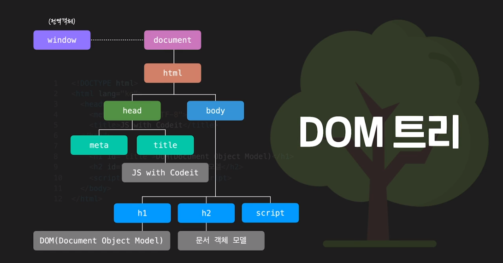
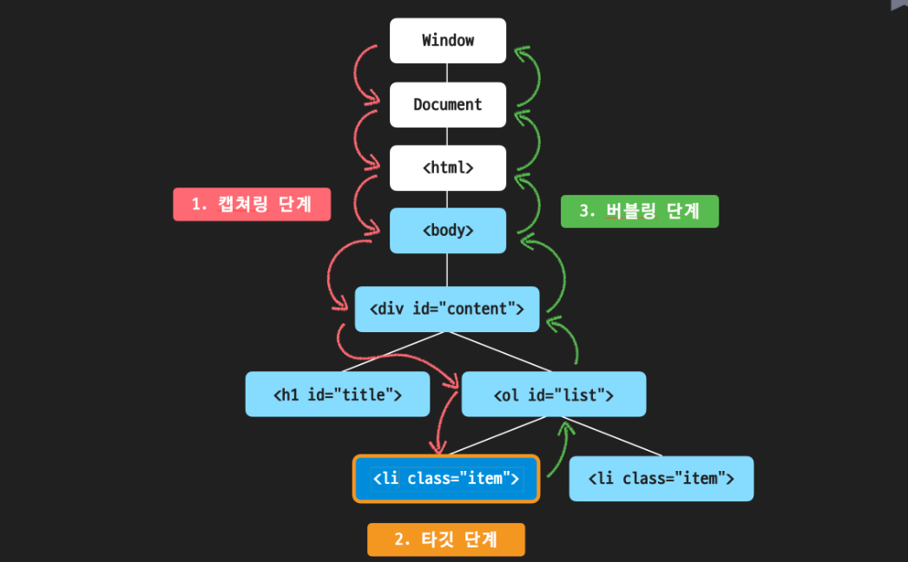
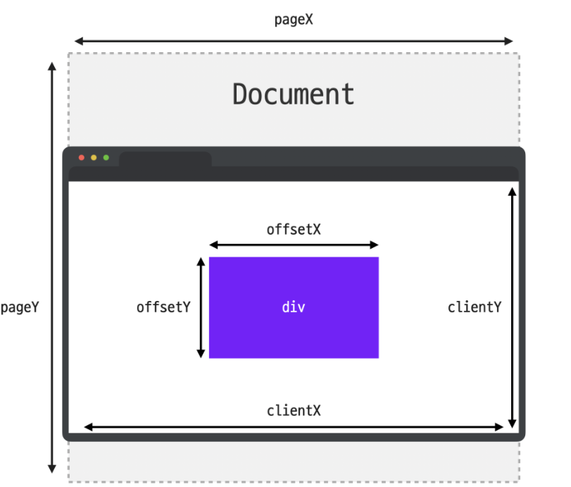

# 인터랙티브 자바스크립트 시작하기

## **getElementsByClassName**

- HTML class를 getElementsByClassName으로 담게 되면 HTMLCollection이라는 **유사배열(Array-Like Object)**의 형태로 담기게 됨 → index를 기입해 특정 배열만 출력하거나 length 같은 걸 추출해낼 순 있으나 push나 slice 같은 배열의 기능들은 사용이 불가능
    
    ```jsx
    const myTags = document.getElementsByClassName('color-btn');
    ```
    

- myTags에 담기는 class 순서는 위에서부터 아래로
- 유사배열의 형태로 담김 → 배열의 형태를 하고 있지만 배열의 메소드는 사용할 수 없음
- *유사배열 참고사항*
    
    # **유사 배열(Array-Like Object)이란?**
    
    앞에서도 설명한 것처럼 이름 그대로 **배열과 유사(類似)한 객체**를 **유사 배열**, 영어로는 **Array-Like Object**라고 부릅니다.
    하지만 마냥 모양만 비슷하다고 해서 모두 유사 배열이라고 부르진 않는데요. 유사 배열에도 최소한 갖춰야 할 조건과 특징들이 있습니다.
    
    ## **1. 숫자 형태의 indexing이 가능하다.**
    
    [https://bakey-api.codeit.kr/api/files/resource?root=static&seqId=3773&directory=%E1%84%8B%E1%85%B2%E1%84%89%E1%85%A1%E1%84%87%E1%85%A2%E1%84%8B%E1%85%A7%E1%86%AF&name=%E1%84%8B%E1%85%B2%E1%84%89%E1%85%A1%E1%84%87%E1%85%A2%E1%84%8B%E1%85%A7%E1%86%AF](https://bakey-api.codeit.kr/api/files/resource?root=static&seqId=3773&directory=%E1%84%8B%E1%85%B2%E1%84%89%E1%85%A1%E1%84%87%E1%85%A2%E1%84%8B%E1%85%A7%E1%86%AF&name=%E1%84%8B%E1%85%B2%E1%84%89%E1%85%A1%E1%84%87%E1%85%A2%E1%84%8B%E1%85%A7%E1%86%AF)
    
    배열은 각 요소에 0부터 순서대로 매겨진 index를 통해 요소끼리의 관계도 파악할 수 있고 그 index를 통해 요소에 접근할 수도 있다는 특징이 있죠?
    유사 배열도 마찬가지로 배열이라는 이름에 걸맞게 각 요소에
    
    **0부터 시작하는 숫자 형태의 index가 있어야**
    
    합니다.
    
    ## **2. length 프로퍼티가 있다.**
    
    [https://bakey-api.codeit.kr/api/files/resource?root=static&seqId=3773&directory=%E1%84%8B%E1%85%B2%E1%84%89%E1%85%A1%E1%84%87%E1%85%A2%E1%84%8B%E1%85%A7%E1%86%AF-2&name=%E1%84%8B%E1%85%B2%E1%84%89%E1%85%A1%E1%84%87%E1%85%A2%E1%84%8B%E1%85%A7%E1%86%AF-2](https://bakey-api.codeit.kr/api/files/resource?root=static&seqId=3773&directory=%E1%84%8B%E1%85%B2%E1%84%89%E1%85%A1%E1%84%87%E1%85%A2%E1%84%8B%E1%85%A7%E1%86%AF-2&name=%E1%84%8B%E1%85%B2%E1%84%89%E1%85%A1%E1%84%87%E1%85%A2%E1%84%8B%E1%85%A7%E1%86%AF-2)
    
    객체가 가지고 있는 요소의 갯수를 저장하는
    
    ```
    length
    ```
    
    프로퍼티도 역시 배열의 특징이라고 할 수 있는데요. 유사 배열 역시
    
    ```
    length
    ```
    
    프로퍼티가 있어야 비로소 유사 배열이라고 할 수 있습니다. 숫자 형태의 index가 있더라도
    
    ```
    length
    ```
    
    프로퍼티가 없다면 유사 배열이라기보단 그냥 숫자 형태의 key로 구성된 일반적인 객체라고 볼 수 있습니다.
    
    ## **3. 배열의 기본 메소드를 사용할 수 없다.**
    
    [https://bakey-api.codeit.kr/api/files/resource?root=static&seqId=3773&directory=%E1%84%8B%E1%85%B2%E1%84%89%E1%85%A1%E1%84%87%E1%85%A2%E1%84%8B%E1%85%A7%E1%86%AF-3&name=%E1%84%8B%E1%85%B2%E1%84%89%E1%85%A1%E1%84%87%E1%85%A2%E1%84%8B%E1%85%A7%E1%86%AF-3](https://bakey-api.codeit.kr/api/files/resource?root=static&seqId=3773&directory=%E1%84%8B%E1%85%B2%E1%84%89%E1%85%A1%E1%84%87%E1%85%A2%E1%84%8B%E1%85%A7%E1%86%AF-3&name=%E1%84%8B%E1%85%B2%E1%84%89%E1%85%A1%E1%84%87%E1%85%A2%E1%84%8B%E1%85%A7%E1%86%AF-3)
    
    상황에 따라서 직접 구현할 수도 있겠지만, 유사 배열이 완전한 배열이 아닌 가장 큰 이유는 바로
    
    **기본적인 배열의 메소드를 사용할 수 없다**
    
    는 점 때문입니다. 배열의 메소드를 활용할 수 없다는 특징이 유사 배열을 활용하는 목적이 되기도 하는데요. indexing을 통해 유사 배열의 요소에 접근하는 건 쉽지만 수정하거나 삭제하는 작업이 까다롭습니다.
    그래서 내부의 요소들은 배열처럼 다룰 수 있게 하면서 배열의 메소드 사용을 막고 싶거나, 혹은 일반 배열에는 없는 특별한 메소드를 제공하고 싶을 때 유사 배열을 만들어 활용하기도 합니다!
    
    ## **4. Array.isArray(유사배열)은 false다.**
    
    [https://bakey-api.codeit.kr/api/files/resource?root=static&seqId=3773&directory=%E1%84%8B%E1%85%B2%E1%84%89%E1%85%A1%E1%84%87%E1%85%A2%E1%84%8B%E1%85%A7%E1%86%AF-4&name=%E1%84%8B%E1%85%B2%E1%84%89%E1%85%A1%E1%84%87%E1%85%A2%E1%84%8B%E1%85%A7%E1%86%AF-4](https://bakey-api.codeit.kr/api/files/resource?root=static&seqId=3773&directory=%E1%84%8B%E1%85%B2%E1%84%89%E1%85%A1%E1%84%87%E1%85%A2%E1%84%8B%E1%85%A7%E1%86%AF-4&name=%E1%84%8B%E1%85%B2%E1%84%89%E1%85%A1%E1%84%87%E1%85%A2%E1%84%8B%E1%85%A7%E1%86%AF-4)
    
    ```
    Array
    ```
    
    객체의
    
    ```
    isArray
    ```
    
    메소드는 파라미터로 전달한 값이 배열인지 아닌지를 평가해서 그 결과를 불린 형태의 값으로 리턴해주는 메소드입니다.
    유사 배열은 배열과 비슷하지만 배열은 아니기 때문에 결괏값이
    
    ```
    false
    ```
    
    입니다.
    
    # **주의사항: 유사 배열은 다양하다!**
    
    유사 배열은 위의 특징들을 가진 대부분의 형태를 가리키는 포괄적인 개념이기 때문에 정말 다양한 형태로 존재할 수 있습니다.
    예를 들어 지난 시간에 봤던 HTMLCollection의 경우 for..of 문을 활용하는 데 문제는 없었지만 어떤 유사 배열의 경우에는 for..of문을 활용할 수 없는 경우도 있습니다.
    배열의 기본 메소드를 사용할 수 없다고 했지만, 직접 구현해서 마치 배열처럼 사용할 수 있도록 만들 수도 있습니다.
    하지만 직접 유사 배열을 만드는 게 아니라 이미 만들어진 유사 배열에 접근하는 경우에는 대부분 위 4가지 특징을 모두 가지고 있으니깐 잘 기억해 두시면 좋을 것 같습니다 :)
    

- document.getElementsByTagName('태그이름')로 사용할 수 있으나 거의 사용하지 않음

## **querySelector**

- css 선택자로 태그 선택하는 방식
- querySelector로 class를 담으면 가장 첫 번째 class가 담김
- querySelectorAll로 class를 담으면 HTMLCollection과 비슷하게 NodeList라는 이름으로 담김
    
    ```
    NodeList(8) [button.color-btn.red, button.color-btn.orange, button.color-btn.yellow, button.color-btn.green, button.color-btn.blue, button.color-btn.indigo, button.color-btn.purple, button.color-btn.black]
    ```
    

- ID나 class로 담는 것보다 활용도가 더 높은 편
- querySelectorAll 메소드를 활용할 경우 해당되는 요소가 하나 밖에 없더라도 요소가 하나인 NodeList를 반환하기 때문에 NodeList를 출력

## **Event**

- html 요소를 변수에 담은 다음에 그 변수의 property인 onclick에 바로 함수를 담아줄 수도 있고 해당 함수를 짜서 html에 onclick property를 선언하고 거기에 함수를 실행하게끔 작성할 수도 있음
    
    ```html
    <!DOCTYPE html>
    <html lang="ko">
    <head>
      <meta charset="UTF-8">
      <title>JS with Codeit</title>
    </head>
    <body>
      <div>
        <button id="myBtn" onclick="hello()">Click!</button>
      </div>
      <script src="index.js"></script>
    </body>
    </html>
    ```
    
    ```jsx
    const btn = document.querySelector('#myBtn');
    
    btn.onclick = function() { // 이벤트 핸들러(Event Handler)
      alert('안녕하세요');
    }
    
    function hello() {
      alert('안녕하세요')
    }
    ```
    

# 브라우저와 자바스크립트

## **window 객체**

- 브라우저 또한 객체로 담겨 있음 → window 객체
- window 객체의 해당 property를 이용하면 너비나 높이를 확인할 수 있음
    
    ```jsx
    // window: 전역객체 (Global Object)
    console.log(window);
    console.log(window.innerWidth);
    console.log(window.innerHeight);
    ```
    

- 그 외에 많은 window 객체들이 있고 콘솔에서 window.open()이나 window.close() 같은 걸로 확인 가능
- 우리가 흔히 사용하는 console.log나 alert 같은 것도 window 하위 객체들로 window는 브라우저 최상단 객체라고 볼 수 있음
    
    **DOM(Document Object Model)**
    
    ```jsx
    // document 객체를 console.log로 출력하면 html 문서 형태로 출력됨
    console.log(document)
    // document를 객체 형태로 보고 싶으면 console.dir로 출력
    console.dir(document)
    ```
    

- DOM 트리에서는 각 객체를 node라고 표현함(부모, 자식, 형제 node 등)



- tag를 표현하는 node를 element node, text를 표현하는 node를 text node → 일반적으로 text node가 element node의 자식 요소가 됨
- text node는 별도의 자식 node를 가질 수 없기에 leaf node라고 부름
- **텍스트 노드: 요소 노드의 자식 노드 / 자식 노드를 가질 수 없다.**

## **05. DOM 트리 여행하기**

```html
<!DOCTYPE html>
<html lang="en">
<head>
  <meta charset="UTF-8">
  <meta http-equiv="X-UA-Compatible" content="IE=edge">
  <meta name="viewport" content="width=device-width, initial-scale=1.0">
  <title>Document</title>
</head>
<body>
  <div id="content">
    <h2 id="title-1">Cat-1</h2>
    <ul id="list-1">
      <li>AAAA</li>
      <li>BBBB</li>
      <li>CCCC</li>
      <li>DDDD</li>
    </ul>
    <h2 id="title-2">Cat-2</h2>
    <ul id="list-2">
      <li>EEE</li>
      <li>FFF</li>
      <li>GGG</li>
    </ul>
  </div> 
  <script src="./main.js"></script> 
</body>
</html>
```

```jsx
const myTag = document.querySelector('#content');

// 형제 요소 노드
console.log(myTag.previousElementSibling); // null
console.log(myTag.nextElementSibling); // <script..

// 부모 요소 노드
console.log(myTag.parentElement); // <body..

// 자식 요소 노드
console.log(myTag.children[1]) // <ul id="list-1"..
console.log(myTag.firstElementChild); // <h2 id="title-1"..
console.log(myTag.lastElementChild); // ul id="list-2"..
```

[요소 노드에 대한 이동 프로퍼티](https://www.notion.so/020a4fd06eed4223a93bef692f72cd02)

## **08. 요소 노드 프로퍼티**

- textContent, outerHTML, innerHTML
    
    ```jsx
    const myTag = document.querySelector('#list-1');
    
    // textContent
    console.log(myTag.textContent); // tag까지도 텍스트 요소로 넣기 때문에 사용자 입력값을 넣을 때 원하지 않는 html 코드가 들어가지 않기 때문에 유용
    
    // outerHTML
    console.log(myTag.outerHTML);
    
    // innerHTML
    console.log(myTag.innerHTML); // 태그와 태그 사이의 줄바꿈이나 들여쓰기도 포함됨
    myTag.innerHTML += '<li>Test</li>'; // 기존의 것을 대체할 수도, += 를 사용해서 마지막에 추가할 수도 있음
    ```
    

## **11. 요소 노드 추가하기 (**prepend, append, before, after 등등)

```html
<body>
  <div id="content">
    <h2 id="today-ttl">오늘 할 일</h2>
    <ol id="today">
      <li>자바스크립트 공부</li>
      <li>고양이 샤워</li>
      <li>고양이집 청소</li>
    </ol>
    <h2 id="tmr-ttl">내일 할 일</h2>
    <ol id="tmr">
      <li>자바 공부</li>
      <li>뮤지컬</li>
      <li>영화</li>
    </ol>
  </div> 
  <script src="./main.js"></script> 
</body>
```

```jsx
const today = document.querySelector('#today');
const tmr = document.querySelector('#tmr');

// 1. 요소 노드 만들기
const first = document.createElement('li');

// 2. 요소 노드 꾸미기
first.textContent = '처음';

// 3. 요소 노드 추가하기
tmr.prepend(first);
```

## **12. 노드 삭제와 이동하기**

```jsx
// 노드 삭제하기 Node.remove()
// tmr.remove();
tmr.lastElementChild.remove();
today.children[2].remove();

// 노드 이동하기 prepend, append, before, after
today.append(tmr.children[1]);
```

ToDoList 더하기

```jsx
const toDoList = document.querySelector('#to-do-list');

function addNewTodo(text) {
  const newList = document.createElement('li');
  newList.textContent = text;
	toDoList.append(newList);
}

// 테스트 코드
addNewTodo('자바스크립트 공부하기');
addNewTodo('고양이 화장실 청소하기');
addNewTodo('고양이 장난감 쇼핑하기');
```

## **14. HTML 속성 다루기**

- HTML 모든 요소에 property가 생성되는 건 아님 → **예컨대, ol 태그에 href 속성을 넣어놓고 script에서 element.href로 불러와도 undefined 출력(html 표준이 아닌 요소)**
- 단, element.getAttribute를 사용하면 **표준, 비표준 상관없이 property에 접근할 수 있음**
    
    ```html
    <body>
      <div id="content">
        <h2 id="today-ttl">오늘 할 일</h2>
        <ol id="today" href="https://www.naver.com">
          <li class="item">자바스크립트 공부</li>
          <li class="item">고양이 샤워</li>
          <li class="item">고양이집 청소</li>
        </ol>
        <h2 id="tmr-ttl">내일 할 일</h2>
        <ol id="tmr">
          <li class="item">자바 공부</li>
          <li class="item">뮤지컬</li>
          <li class="item">영화</li>
        </ol>
      </div> 
      <script src="./main.js"></script> 
    </body>
    ```
    
    ```jsx
    const today = document.querySelector('#today')
    const item = today.firstElementChild;
    
    // element.getAttribute('속성'): 속성에 접근하기
    console.log(today.getAttribute('href')) // https://www.naver.com
    console.log(item.getAttribute('class')) // item
    
    // element.setAttribute('속성', '값'): 속성 변경하기
    today.setAttribute('href', 'https://www.google.com');
    item.setAttribute('class', 'list')
    
    console.log(today.getAttribute('href')) // https://www.google.com
    console.log(item.getAttribute('class')) // list
    
    // element.removeAttribute('속성'): 속성 제거하기
    today.removeAttribute('href');
    item.removeAttribute('class');
    
    console.log(today.getAttribute('href')) // null
    console.log(item.getAttribute('class')) // null
    ```
    

## **16. HTML 스타일 다루기**

- style property를 사용하면 해당 html에 inline 형식으로 들어가기 때문에 스타일 우선 순위가 높아지게 되는 문제점이 있음 // **때문에 js를 스타일을 변경하는 것보다 해당 클래스에 css로 스타일을 주고 해당 클래스를 변경하는 것이 권장되는 방식**
    
    ```jsx
    // 스타일 다루기
    const today = document.querySelector('#today');
    const tmr = document.querySelector('#tmr');
    
    // style property
    // 하이픈이 들어가는 property는 카멜케이스로 변경해서 사용
    today.children[0].style.textDecoration = 'line-through';
    today.children[0].style.backgroundColor = '#DDD';
    // style property를 사용하면 해당 html에 inline 형식으로 들어가기 때문에 스타일 우선 순위가 높아지게 되는 문제점이 있음
    // 때문에 js를 스타일을 변경하는 것보다 해당 클래스에 css로 스타일을 주고 해당 클래스를 변경하는 것이 권장되는 방식
    
    // class를 추가하는 방법
    today.children[2].className = 'done';
    // className을 사용하게 되면 기존에 있는 'item' class가 삭제되고 'done'으로 대체됨
    
    today.children[1].classList.add('done');
    // 기존 class는 그대로 두고 class 추가
    
    tmr.children[0].classList.add('done', 'done-border');
    // 여러 개의 class를 넣고 싶을 때는 쉼표로 parameter 연달아 작성
    
    tmr.children[0].classList.remove('done-border', 'done');
    // class 삭제
    
    tmr.children[1].classList.toggle('done');
    // toggle은 클래스 하나만을 다룸
    **// ..toggle('done', true) 이런 식으로 특정할 수 있음**
    ```
    

# 이벤트 살펴보기

## **이벤트 핸들러 등록하기**

- onclick property를 활용해서 이벤트를 생성할 수 있으나, 추가적인 이벤트를 주고자 새롭게 이벤트를 넣으면 그 전에 이벤트는 사라지는 문제가 있음 → 고로 element.addEventListener(event, handler)가 권장됨
- onclick property에 값을 연달아 넣어도 두 개가 담기지 않게 새로운 값이 담기게 되어 있음
    
    ```jsx
    let btn = document.querySelector('#myBtn');
    
    function event1() {
      console.log('Hi Codeit!')
    }
    
    function event2() {
      console.log('Hi again!')
    }
    
    // element.addEventListner(event, handler)
    btn.addEventListener('click', event1);
    btn.addEventListener('click', event2);
    
    btn.addEventListener('click', event1());
    // 이런 식으로 작성하면 function를 바로 호출해서 parameter로 인식하지 못함
    
    **// element.removeEventListner(event, handler)
    btn.removeEventListener('click', event2);**
    ```
    
    ```jsx
    btn.addEventListener('click', function() {
      console.log('click!');
    });
    btn.removeEventListener('click', function() {
      console.log('click!');
    });
    // 이런 형식으로는 추가는 가능하나 삭제 불가능,
    // 모양은 같지만 서로 다른 함수로 인지하기 때문에 삭제할 수 없음
    ```
    

## **다양한 이벤트**

### **마우스 이벤트**

| 이벤트 타입 | 설명 |
| --- | --- |
| mousedown | 마우스 버튼을 누르는 순간 |
| mouseup | 마우스 버튼을 눌렀다 떼는 순간 |
| click | 왼쪽 버튼을 클릭한 순간 |
| dblclick | 왼쪽 버튼을 빠르게 두 번 클릭한 순간 |
| contextmenu | 오른쪽 버튼을 클릭한 순간 |
| mousemove | 마우스를 움직이는 순간 |
| mouseover | 마우스 포인터가 요소 위로 올라온 순간 |
| mouseout | 마우스 포인터가 요소에서 벗어나는 순간 |
| mouseenter | 마우스 포인터가 요소 위로 올라온 순간 (버블링이 일어나지 않음) |
| mouseleave | 마우스 포인터가 요소에서 벗어나는 순간 (버블링이 일어나지 않음) |

### **키보드 이벤트**

| 이벤트 타입 | 설명 |
| --- | --- |
| keydown | 키보드의 버튼을 누르는 순간 |
| keypress | 키보드의 버튼을 누르는 순간 ('a', '5' 등 출력이 가능한 키에서만 동작하며, Shift, Esc 등의 키에는 반응하지 않음) |
| keyup | 키보드의 버튼을 눌렀다 떼는 순간 |

### **포커스 이벤트**

| 이벤트 타입 | 설명 |
| --- | --- |
| focusin | 요소에 포커스가 되는 순간 |
| focusout | 요소로부터 포커스가 빠져나가는 순간 |
| focus | 요소에 포커스가 되는 순간 (버블링이 일어나지 않음) |
| blur | 요소로부터 포커스가 빠져나가는 순간 (버블링이 일어나지 않음) |

### **입력 이벤트**

| 이벤트 타입 | 설명 |
| --- | --- |
| change | 입력된 값이 바뀌는 순간 |
| input | 값이 입력되는 순간 |
| select | 입력 양식의 하나가 선택되는 순간 |
| submit | 폼을 전송하는 순간 |

### **스크롤 이벤트**

| 이벤트 타입 | 설명 |
| --- | --- |
| scroll | 스크롤 바가 움직일 때 |

### **윈도우 창 이벤트**

| 이벤트 타입 | 설명 |
| --- | --- |
| resize | 윈도우 사이즈를 움직일 때 발생 |

## **이벤트 객체**

- element.addEventListner(event, handler) → **handler에 해당되는 function의 첫 번째 parameter는 이벤트 객체(Event Object)가 됨**
- **공통적으로 자주 사용되는 property는 type과 target**
- type은 발생한 이벤트의 type을 담고 있고 target은 이벤트가 발생한 해당 요소를 담고 있음
- DOM 요소가 담겨 있기 때문에 이벤트 발생한 시점의 특정하게 작동하게 할 수 있음
    
    ```jsx
    // 이벤트 객체 (Event Object)
    const myInput = document.querySelector('#myInput');
    const myBtn = document.querySelector('#myBtn');
    
    function printEvent(event) {
      console.log(event)
      event.target.style.color = 'red';
    }
    
    myInput.addEventListener('keydown', printEvent);
    
    myBtn.addEventListener('click', printEvent);
    ```
    

## **완료한 일 체크하기! → 이벤트 객체를 활용한 예시 코드**

```jsx
const toDoList = document.querySelector('#to-do-list');
const items = toDoList.children;

// 1. updateToDo 함수를 완성해 주세요.
function updateToDo(event) {
  event.target.classList.toggle('done');
}

// 2. 반복문을 활용해서 각 li태그에 이벤트 핸들러를 등록해 주세요.
for(let item of items) {
  item.addEventListener('click', updateToDo);
}

// 테스트 코드
items[2].removeEventListener('click', updateToDo);
```

## **이벤트 버블링 (참고만) - window 객체에 도달할 때까지 부모 요소까지 이벤트가 발생**

- **이벤트는 전파가 됩니다.** 어떤 요소에서 이벤트가 발생하면 해당 요소에 등록된 이벤트 핸들러가 동작하는 것뿐만 아니라 부모 요소로 이벤트가 계속해서 전파되면서 각 요소에도 등록된 이벤트 핸들러가 있다면 차례로 이벤트 핸들러가 동작하는데요.
- 자식 요소에서 부모 요소로 이벤트가 전파되는 것을 **이벤트 버블링(Event Bubbling)**이라고 부릅니다.
- 참고로 이벤트 버블링은 이벤트 객체의 **stopPropagation** 메소드로 전파를 막을 수 있습니다.
    
    ```jsx
    // 이벤트 버블링 (Event Bubbling)
    const content = document.querySelector('#content');
    const title = document.querySelector('#title');
    const list = document.querySelector('#list');
    const items = document.querySelectorAll('.item');
    
    content.addEventListener('click', function(e) {
      console.log('content Event');
      console.log(e.currentTarget);
    });
    
    title.addEventListener('click', function(e) {
      console.log('title Event');
      console.log(e.currentTarget);
    });
    
    list.addEventListener('click', function(e) {
      console.log('list Event');
      console.log(e.currentTarget);
    });
    
    for (let item of items) {
      item.addEventListener('click', function(e) {
        console.log('item Event');
        console.log(e.currentTarget);
    		**e.stopPropagation();**
      });
    }
    ```
    



```
캡쳐링은 이벤트가 발생하면 가장 먼저, 그리고 버블링의 반대 방향으로 진행되는 이벤트 전파 방식입니다.
```

## **이벤트 위임 (참고만)**

- 버블링 개념을 활용하면 훨씬 효과적인 이벤트 관리를 할 수 있습니다. 예를 들어 자식 요소 각각에 이벤트 핸들러를 하나씩 등록할 필요 없이 부모 요소에서 한 번에 자식 요소들에 발생한 이벤트를 관리할 수도 있는데요.
- 이렇게 이벤트를 다루는 방식을 자식 요소의 이벤트를 부모 요소에 위임한다고 해서 이벤트 위임(Event Delegation)이라고 부릅니다.
- 이벤트 위임을 잘 활용하면 훨씬 더 효율적으로 이벤트를 다룰 수 있습니다.
    
    ```jsx
    // 이벤트 위임 (Event Delegation)
    const list = document.querySelector('#list');
    
    // for(let item of list.children) {
    //   item.addEventListener('click', function(event){
    //     event.target.classList.toggle('done');
    //   })
    // }
    
    list.addEventListener('click', function(event) {
      event.target.classList.toggle('done')
    })
    
    const li = document.createElement('li');
    li.classList.add('item');
    li.textContent = '일기 쓰기';
    list.append(li);
    ```
    

## **브라우저의 기본 동작**

- 우리가 브라우저에서 흔히 사용되는 기본 동작들(입력, 마우스 우클릭 메뉴 등)을 막을 수 있다
- **단, 해당 html tag의 고유한 속성을 해치는 것이기 때문에 꼭 필요한 기능인지 신중하게 판단해야 함**
    
    ```jsx
    // 브라우저의 기본 동작
    const link = document.querySelector('#link');
    const checkbox = document.querySelector('#checkbox');
    const input = document.querySelector('#input');
    const text = document.querySelector('#text');
    
    // event.preventDefault
    
    // href 막기
    link.addEventListener('click', function(event){
      event.preventDefault();
      alert('지금은 이동할 수 없습니다.');
    })
    
    // 입력 막기
    input.addEventListener('keydown', function(event){
      if(!checkbox.checked) {
        event.preventDefault();
        alert('체크박스를 먼저 클릭해 주세요.')
      }
    })
    
    // 우클릭 막기
    document.addEventListener('contextmenu', function(event){
      event.preventDefault();
      alert('마우스 우클릭은 사용할 수 없습니다.')
    })
    ```
    

# 다양한 이벤트 알아보기

## **마우스 버튼 이벤트**

- **하나의 이벤트에도 여러 가지 이벤트가 동시에 실행될 수 있음(click, mouseup, mousedown)**
- **dbclick event 실행 시 이벤트 실행 순서**

```
mousedown 이벤트가 발생했습니다.
mouseup 이벤트가 발생했습니다.
click 이벤트가 발생했습니다.
mousedown 이벤트가 발생했습니다.
mouseup 이벤트가 발생했습니다.
click 이벤트가 발생했습니다.
dblclick 이벤트가 발생했습니다.
```

- contextmenu의 경우 실행 순서 운영체제 별로 다를 수 있음

```
--------------------------
mousedown 이벤트가 발생했습니다.
mouseup 이벤트가 발생했습니다.
contextmenu 이벤트가 발생했습니다.
```

## **마우스 이동 이벤트 I**

- mousemove
    - **client는 현재 창을 기준으로, page는 문서 전체를 기준으로 마우스의 위치를 담고 있음**
    
    ```jsx
    /** 
     * [마우스 이동 이벤트]
     * 
     * > MouseEvent.type
     * mousemove: 마우스 포인터가 이동할 때
     * mouseover: 마우스 포인터가 요소 밖에서 안으로 이동할 때
     * mouseout: 마우스 포인터가 요소 안에서 밖으로 이동할 때 
     *
     * > MouseEvent.clientX, clientY
     * : 화면에 표시되는 창 기준 마우스 포인터 위치   
     * 
     * > MouseEvent.pageX, pageY
     * : 웹 문서 전체 기준 마우스 포인터 위치
     * 
     * > MouseEvent.offsetX, offsetY
     * : 이벤트가 발생한 요소 기준 마우스 포인터 위치
     */
     
     const box1 = document.querySelector('#box1');
    
     function onMouseMove(e) {
      //  console.log('mouse is moving!');
      console.log(`client: (${e.clientX}, ${e.clientY})`)
      console.log(`page: (${e.pageX}, ${e.pageY})`)
      console.log(`offset: (${e.offsetX}, ${e.offsetY})`)
     }
    
     box1.addEventListener('mousemove', onMouseMove);
    ```
    

## **client, page, offset 차이**

- clientX, clientY
    - client 프로퍼티는 말 그대로 **클라이언트 영역 내에서 마우스의 좌표 정보**를 담고있는데요. 클라이언트 영역이란 이벤트가 발생한 순간에 브라우저가 콘텐츠를 표시할 수 있는 영역을 뜻합니다. client 값은 그 순간 보여지는 화면을 기준으로 계산하기 때문에 **스크롤 위치와는 무관하게 항상 보여지는 화면의 좌측 상단의 모서리 위치를 (0, 0)으로 계산**합니다.
- offsetX, offsetY
    - offset 프로퍼티는 **이벤트가 발생한 target이 기준**이 됩니다. offset 값도 이벤트가 발생한 대상을 기준으로 계산하기 때문에 **스크롤 위치와는 무관하게 항상 대상의 좌측 상단의 모서리 위치를 (0, 0)으로 계산**합니다.
- pageX, pageY
    - page 프로퍼티는 **전체 문서를 기준으로 마우스 좌표 정보를 담고 있습니다**. 그렇기 때문에 **스크롤로 인해서 보이지 않게된 화면의 영역까지 포함해서 측정한다는 점**이 앞의 두 프로퍼티와의 차이점 입니다. 자칫 client 값과 혼동하기 쉬우니 잘 구분해 두시는 것이 좋습니다.



## **마우스 이동 이벤트 II**

- mouseover, mouseout
    - 참고: 버블링을 통해서 자식 요소까지 이벤트 핸들러가 발생할 수 있음
    
    ```jsx
    /** 
     * [마우스 이동 이벤트]
     * 
     * > MouseEvent.type
     * mousemove: 마우스 포인터가 움직일 때
     * mouseover: 마우스 포인터가 요소 밖에서 안으로 움직일 때
     * mouseout: 마우스 포인터가 요소 안에서 밖으로 움직일 때 
     * 
     * > MouseEvent.target
     * : 이벤트가 발생한 요소
     * 
     * > MouseEvent.relatedTarget
     * : 이벤트가 발생하기 직전(또는 직후)에 마우스가 위치해 있던 요소
     */
    
     const box2 = document.querySelector('#box2');
    
    // 이벤트 위임 활용
    //  function printEventData(e) {
    //    if(e.target.classList.contains('cell')) {
    //      e.target.classList.toggle('on');
    //    }
    //  }
    
    function printEventData(e) {
      console.log('event:', e.type);
      console.log('target:', e.target);
      console.log('relatedTarget:', e.relatedTarget);
      console.log('-------------------');
    } 
    
     
     box2.addEventListener('mouseover', printEventData);
     box2.addEventListener('mouseout', printEventData);
    ```
    

## **mouseenter / mouseleave**

**❗mouseover, mouseout과 비교하는 것이 중요**

1. 버블링 발생 유무 차이
    - mouseenter와 mouseleave는 버블링이 일어나지 않음
2. 자식 요소에 영역 계산의 차이
    - 즉, 자식 요소에 영향을 끼치고자 하면 mouseover/mouseout, 자식 요소에는 영향을 끼치지 않고 **해당 요소에만 이벤트 핸들러를 다루고자 한다면 mouseenter/mouseleave를 활용(버블링이 발생하지 않기 때문에 당연하게도)**

## **키보드 이벤트**

```
/** 
 * [키보드 이벤트]
 * 
 * > KeyboardEvent.type
 * keydown: 키보드 버튼을 누른 순간
 * keypress: 키보드 버튼을 누른 순간
 * keyup: 키보드 버튼을 눌렀다 뗀 순간
 * 
 * > KeyboardEvent.key
 * : 이벤트가 발생한 버튼의 값
 * 
 * > KeyboardEvent.code
 * : 이벤트가 발생한 버튼의 키보드에서 물리적인 위치
 */
```

- keypress는 알파벳이나 숫자, 스페이스로 띄어쓰는 것과 같이 출력값이 변하는 것에만 반응하고, esc나 shift처럼 기능키에는 반응하지 않음 + 하나의 키를 계속 누르는 상황에서 keypress는 한번만 발생함 + 출력이 가능한 키더라도 영어가 아닌 키에는 반응하지 않는 경우도 있음
- **keypress는 웹표준에서 권장되지 않기 때문에 keydown을 사용**

## **input 태그 다루기**

```
**> 포커스 이벤트**
focusin: 요소에 포커스가 되었을 때
focusout: 요소에 포커스가 빠져나갈 때
focusin: 요소에 포커스가 되었을 때 (버블링 X)
focusout: 요소에 포커스가 빠져나갈 때 (버블링 X)

**> 입력 이벤트**
input: 사용자가 입력을 할 때
change: 요소의 값이 변했을 때
```

- **keydown과의 차이점**: 말 그대로 input은 값을 입력 받을 때의 이벤트이기 때문에 esc, shift처럼 입력과 관련 없는 기능 관련 키에는 반응을 하지 않음
- **change와 다른 이벤트와 차이점**: 말 그대로 값이 변했을 때 발생하는 이벤트이지만 input이 입력되는 시점에서는 발생을 하지 않고 입력이 완료되었다는 어떤 암시를 줘야함(tab을 통해서 해당 커서를 이동한다거나 enter를 입력한다거나)

## **스크롤 이벤트**

```jsx
// Scroll 이벤트
let lastScrollY = 0;

function onSroll() {
  const nav = document.querySelector('#nav');
  const toTop = document.querySelector('#to-top');
  const STANDARD = 30;
  
  if (window.scrollY > STANDARD) { // 스크롤이 30px을 넘었을 때
    nav.classList.add('shadow');
    toTop.classList.add('show');
  } else { // 스크롤이 30px을 넘지 않을 때
    nav.classList.remove('shadow');
    toTop.classList.remove('show');
  } 

	if (window.scrollY > lastScrollY) { // 스크롤 방향이 아랫쪽 일 때
    nav.classList.add('lift-up');
  } else { // 스크롤 방향이 윗쪽 일 때
    nav.classList.remove('lift-up');
  }

  lastScrollY = window.scrollY;
}

window.addEventListener('scroll', onSroll);
```

- 웹문서와 크기가 브라우저의 창 크기보다 클 때 자연스럽게 스크롤이 생김
- 때문에 일반적으로 브라우저를 대변하는 window 객체에 이벤트핸들러를 등록하는 경우가 많음
- 그리고 window 객체의 property가 많이 활용됨(ex) window.scrollY)