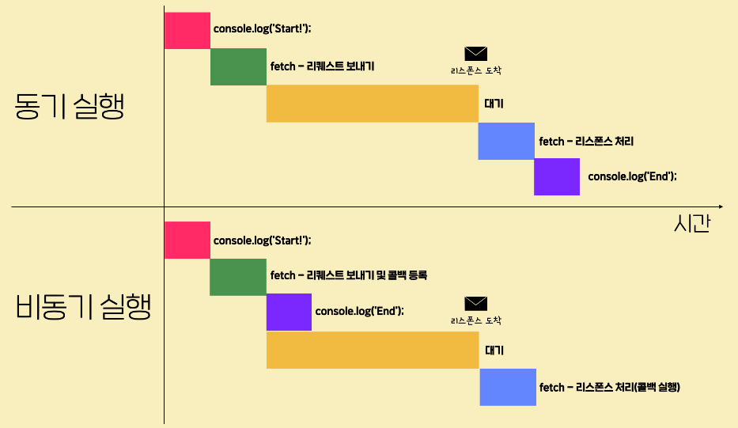

# 웹 기초 다지기

## 이번 토픽에서 배울 내용

- 웹브라우저와 서버와의 통신(JSON, Ajax, promise, fetch, async/await …)

## fetch 함수 사용해보기

```jsx
fetch('https://www.google.com')
	.then((response) => response.text())
	.then((result) => { console.log(result); });
```

## **fetch 함수 살펴보기**

- **클라이언트의 요청은 request, 서버가 보내주는 응답은 response**
- **fetch는 서버에 request를 보내고 reponse를 받는 함수**
- fetch 외에도 서버와 통신할 수 있는 방법은 많으나 최근에 가장 보편적인 방법
- **fetch는 parameter로 넘어온 url로 request를 보냄** → 서버로부터 response가 오면 처리해줄 방법이 필요함 → 화면에 뿌리거나 값을 재가공하거나 등등
- **fetch에서 값을 받았을 때 response 관련 내용이 실행됨 → 콜백 함수**
- then 메소드는 콜백을 등록해주는 메소드 → fetch 함수가 리턴하는 어떤 객체(Promise 객체)의 메소드
- then 메소드는 이전 then의 값을 전달 받을 수 있음

## response 객체


## 웹이란?

- HyperText, HyperText Markup Language

## URL이란?

- Uniform Resource Locator → 규격화된 리소스 검색자 → 웹에 존재하는 특정 데이터를 나타내는 문자열
- 호스트(host)를 통해서 전 세계의 수많은 서버 중 하나의 서버를 특정할 수 있음
    
    
    
- path를 통해 별도의 데이터를 특정할 수 있음
- path는 전적으로 개발자들이 설계하기 나름
    
    
    
- url 끝에 query를 붙여서 데이터를 세분화함
- query는 하나의 속성 이름에 등호와 값이 써있고 각각의 속성은 &로 이어서 쓰여짐
    
    
    

## HTTP란?


- **프로토콜을 https로 보내면 reponse 또한 https 프로토콜에 맞게 보내줘야 함**
- http: HyperText Transfer Protocol → 초기에는 HyperText만 주고 받았기 때문에 이런 이름이 붙여졌지만 물론 현재에는 이미지, 사운드, 영상 등 많은 요소들을 주고 받고 있음
- https: + Secure

## 한 번의 접속, 여러 번의 Request

- 우리가 웹 브라우저로 특정 페이지에 접속할 때, 보통 한 번 이상의 리퀘스트-리스폰스가 오고 감 → ex) html을 불러왔더라도 imc tag의 href attribute의 이미지를 받아와야 하고, 연결된 main.js를 불러와야 하기 때문에 여러 번의 request와 reponse가 발생

# Web API 배우기

## **JSON이란?**

- **JSON: JavaScript Object Notation → JavaScript의 언어를 빌려서 만들어진 데이터 포맷**
- [https://jsonplaceholder.typicode.com/users](https://jsonplaceholder.typicode.com/users)
- 하지만 JSON과 JavaScript의 문법이 100% 같은 것은 아님
    
    ```
    fetch('https://jsonplaceholder.typicode.com/users')
    	.then((response) => response.text())
    	.then((result) => { console.log(result); });
    ```
    

## 자바스크립트 객체 표기법과 JSON 문법의 차이

- JSON에서는 각 프로퍼티의 이름을 반드시 큰따옴표(")로 감싸줘야 합니다. → Javascript에서는 property에 따옴표를 붙여도, 안 붙여도 되지만, JSON에서는 반드시 큰따옴표를 붙여줘야 함
- JSON에서는 값이 문자열인 경우 큰따옴표(")를 사용해야 합니다. → JavaScript에서는 작은따옴표(’)나 큰따옴표(”) 둘 다 사용해도 되지만, JSON에서는 반드시 큰 따옴표를 사용해야 함
- JSON에서는 표현할 수 없는 값들이 있습니다. → JavaScript에서는 property의 값으로 사용할 수 있는 undefined, NaN, Infinity 등을 JSON에서는 사용할 수 없음
- JSON에는 주석을 추가할 수 없습니다. → JSON은 코드가 아니라 데이터 포맷이기 때문에 그 안에 주석을 포함시킬 수 없음

## **JSON 데이터를 객체로 변환하기**

- typeof로 JSON 데이터를 확인해보면 string 타입임을 확인할 수 있음
    
    ```jsx
    fetch('https://jsonplaceholder.typicode.com/users')
    .then((response) => response.text())
    .then((result) => { console.log(typeof result); });
    Promise {<pending>}
    VM1495:3 string
    ```
    
- string 타입의 JSON 객체는 그대로 JavaScript 객체로 변환할 수 있음
- **JSON이라는 JavaScript 객체의 parse 메소드를 사용하면 string 타입의 JSON 객체를 JavaScript 객체로 변환**
    
    ```jsx
    fetch('https://jsonplaceholder.typicode.com/users')
    .then((response) => response.text())
    .then((result) => {
        **const users = JSON.parse(result)**
        console.log(users.length);
        users.forEach((user) => {
            console.log(user.name);
        })
    })
    ```
    

## 메소드의 의미

- Request → 데이터 조회, 데이터 추가, 데이터 수정, 데이터 삭제 → CRUD
- GET, POST, PUT, DELETE

1. **Request의 Head와 Body**
- **POST, PUT은 body가 필요하지만 GET, DELETE는 보통 body가 필요 없음**
    
    
    

- **header는 head 안에 존재하는 key, value 한쌍을 의미함 → 그것들이 모여서 headers라고 지칭**
    
    
    

- **:method: GET → request를 보낸 method의 종류**
- **:path:** /users → path 정보가 request header로 있기 때문에 request를 받은 서버가 웹브라우저가 무슨 정보를 원하는지 알 수 있게 됨
- **user-agent:** Mozilla/5.0 (Windows NT 10.0; Win64; x64) AppleWebKit/537.36 (KHTML, like Gecko) Chrome/105.0.0.0 Safari/537.36 → 이 header에는 request를 보낸 브라우저와 그것이 설치된 운영체제의 정보가 적혀 있음 → 만약 서버에서 사용자의 웹브라우저 정보를 수집한다면 이 정보를 수집하게 됨
- **GET, DELETE의 경우 별도의 body를 담아서 보낼 필요가 없기 때문에 head만 존재함**

## 앞으로 사용할 URL 미리보기

- [https://learn.codeit.kr/api/members](https://learn.codeit.kr/api/members)
- GET(특정직원조회), PUT, DELETE는 URL 끝에 고유값 필요 / GET(전체직원조회), POST 별도의 고유값 필요 없음

## POST request 보내기

- 브라우저 창에 해당 url를 입력해서 불러오는 건 해당 url로 get request를 하는 것과 동일함
- GET request
    
    ```jsx
    fetch('https://learn.codeit.kr/api/members')
    .then((response) => response.text())
    .then((result) => { console.log(result); });
    ```
    
- GET request (특정직원 조회)
    
    ```jsx
    fetch('https://learn.codeit.kr/api/members/3')
    .then((response) => response.text())
    .then((result) => { console.log(result); });
    ```
    
- POST request
- **fetch 함수는 아무 것도 설정해주지 않으면 GET request가 기본 → 그래서 POST request는 argument로 옵션 객체가 들어감**
- **JSON.stringify는 JavaSript 객체를 string 타입의 JSON 객체로 변환**
- **JavaScript 객체 그 자체는 외부에 바로 전송할 수 없기 때문**
    
    ```jsx
    const newMember = {
      name: 'Joel',
      email: 'joel@gmail.com',
      department: 'engineering',
    };
    
    // fetch 함수는 아무 것도 설정해주지 않으면 GET request가 기본
    fetch('https://learn.codeit.kr/api/members', {
      method: 'POST', // argument로 옵션 객체가 들어감
      body: JSON.stringify(newMember), // string 타입의 JSON 데이터로 변경
    }) // JavaScript 객체 그 자체는 외부에 바로 전송할 수 없기 때문
      .then((response) => response.text())
      .then((result) => { console.log(result); });
    ```
    

## POST request 살펴보기

- payload가 request의 body(POST에서 발생)
    
    
    

## PUT request, DELETE request 보내기

- PUT request
    
    ```jsx
    const member = {
      name: 'Alice',
      email: 'alice@codeitmail.kr',
      department: 'marketing',
    };
    
    fetch('https://learn.codeit.kr/api/members/2', {
      method: 'PUT',
      body: JSON.stringify(member),
    })
      .then((response) => response.text())
      .then((result) => { console.log(result); });
    ```
    
- DELETE request (body property 필요 없음, GET request도 마찬가지)
    
    ```jsx
    fetch('https://learn.codeit.kr/api/members/9', {
      method: 'DELETE', // 옵션 객체에 method를 DELETE로 설정
    })
      .then((response) => response.text())
      .then((result) => { console.log(result); });
    ```
    

## 모범적인 Web API, REST API

- '프론트엔드에서 이 URL로 이렇게 생긴 리퀘스트를 보내면, 백엔드에서 이런 처리를 하고 이런 리스폰스를 보내주는 것으로 정합시다'와 같은 논의 → 프론트엔드, 백엔드 고려해서 Web API 설계
- 사실 POST 메소드를 설정하고 직원을 추가하는 api를 설계할 수는 있음 → 하지만 REST API를 준수해서 설계하는 것이 중요
- REST API 이야기는 추후 참고

## JSON 데이터 다루기 종합

- **자바스크립트 객체를 string 타입의 JSON 데이터로 변환하는 것은 영어로 Serialization, 우리말로는 직렬화**
- **이와 반대로 string 타입의 JSON 데이터를 자바스크립트 객체로 변환하는 것을 영어로 Deserialization, 우리말로는 역직렬화**
- 이 Serialization과 Deserialization은 자바스크립트뿐만 아니라 모든 프로그래밍 언어에서 중요하게 다뤄지는 개념
- **간단하게 얘기해서 Serialization가 필요한 이유는 자바스크립트 객체가 갖고 있는 기본 내장 프로퍼티들을 서버로 보낼 필요가 없고, 특히 객체의 메소드 같은 경우 서버에서 이를 인식 가능하도록 보낼 수 있는 방법도 없음**
    
    
    

- 반대로 Deserialization가 필요한 이유는 역직렬화를 하지 않고는 y값을 가져올 수가 없음
    
    
    

## Status Code

- 우리가 주로 받아서 가공하는 데이터는 Body, 404 같은 상태 코드가 들어 있는 곳은 Head
    
    
    

## Status Code 더 자세히

```
(1) 100번대
서버가 클라이언트에게 정보성 응답(Informational response)을 줄 때 사용되는 상태 코드들입니다.

100 Continue : 클라이언트가 서버에게 계속 리퀘스트를 보내도 괜찮은지 물어봤을 때, 계속 리퀘스트를 보내도 괜찮다고 알려주는 상태 코드입니다. 예를 들어, 클라이언트가 용량이 좀 큰 파일을 리퀘스트의 바디에 담아 업로드하려고 할 때 서버에게 미리 괜찮은지를 물어보는 경우가 있다고 할 때, 서버가 이 100번 상태 코드의 리스폰스를 주면 그제서야 본격적인 파일 업로드를 시작합니다.
101 Switching Protocols : 클라이언트가 프로토콜을 바꾸자는 리퀘스트를 보냈을 때, 서버가 '그래요, 그 프로토콜로 전환하겠습니다'라는 뜻을 나타낼 때 쓰이는 상태 코드입니다.
(2) 200번대
클라이언트의 리퀘스트가 성공 처리되었음을 의미하는 상태 코드들입니다.

200 OK : 리퀘스트가 성공적으로 처리되었음을 포괄적으로 의미하는 상태 코드입니다. 이때 성공의 의미는 리퀘스트에 있던 메소드의 종류에 따라 다르겠죠? GET 리퀘스트의 경우 리소스가 잘 조회되었다는 뜻이고, POST 리퀘스트의 경우 새 리소스가 잘 생성되었다, PUT 리퀘스트의 경우 기존 리소스가 잘 수정되었다, DELETE 리퀘스트의 경우 기존 리소스가 잘 삭제되었다는 뜻입니다.
201 Created : 리퀘스트의 내용대로 리소스가 잘 생성되었다는 뜻입니다. POST 리퀘스트가 성공한 경우에 200번 대신 201번이 올 수도 있습니다.
202 Accepted : 리퀘스트의 내용이 일단은 잘 접수되었다는 뜻입니다. 즉, 당장 리퀘스트의 내용이 처리된 것은 아니지만 언젠가 처리할 것이라는 뜻인데요. 리퀘스트를 어느 정도 모아서 한번에 실행하는 서버인 경우 등에 이런 응답을 줄 수도 있습니다.
(3) 300번대
클라이언트의 리퀘스트가 아직 처리되지 않았고, 리퀘스트 처리를 원하면 클라이언트 측의 추가적인 작업이 필요함을 의미하는 상태 코드들입니다.

301 Moved Permanently : 리소스의 위치가 바뀌었음을 나타냅니다. 보통 이런 상태 코드가 있는 리스폰스의 헤드에는 Location이라는 헤더도 일반적으로 함께 포함되어 있습니다. 그리고 그 헤더의 값으로 리소스에 접근할 수 있는 새 URL이 담겨있는데요. 대부분의 브라우저는 만약 GET 리퀘스트를 보냈는데 이런 상태 코드가 담긴 리스폰스를 받게 되면, 헤드에 포함된 Location 헤더의 값을 읽고, 자동으로 그 새 URL에 다시 리퀘스트를 보내는 동작(리다이렉션, redirection)을 수행합니다.
302 Found : 리소스의 위치가 일시적으로 바뀌었음을 나타냅니다. 이 말은 지금 당장은 아니지만 나중에는 현재 요청한 URL이 정상적으로 인식될 것이라는 뜻입니다. 이 상태 코드의 경우에도 보통 그 리스폰스의 헤드에 Location 헤더가 있고, 여기에 해당 리소스의 임시 URL 값이 있습니다. 이 경우에도 대부분의 브라우저들은 임시 URL로 리다이렉션합니다.
304 Not Modified : 브라우저들은 보통 한번 리스폰스로 받았던 이미지 같은 리소스들을 그대로 내부에 저장하고 있습니다. 그리고 서버는 해당 리소스가 바뀌지 않았다면, 리스폰스에 그 리소스를 보내지 않고 304번 상태 코드만 헤드에 담아서 보냄으로써 '네트워크 비용'을 절약하고 브라우저가 저장된 리소스를 재활용하도록 하는데요. 사실 이 상태 코드는 웹에서 '캐시(cache)'라는 주제에 대해서 공부해야 정확하게 이해할 수 있습니다. 당장 배울 내용은 아니니까 넘어갈게요. 혹시 관심이 있는 분들은 이 링크를 참조하세요.
(4) 400번대
리퀘스트를 보내는 클라이언트 쪽에 문제가 있음을 의미하는 상태 코드들입니다.

400 Bad Request : 말그대로 리퀘스트에 문제가 있음을 나타냅니다. 리퀘스트 내부 내용의 문법에 오류가 존재하는 등의 이유로 인해 발생합니다.
401 Unauthorized : 아직 신원이 확인되지 않은(unauthenticated) 사용자로부터 온 리퀘스트를 처리할 수 없다는 뜻입니다.
403 Forbidden : 사용자의 신원은 확인되었지만 해당 리소스에 대한 접근 권한이 없는 사용자라서 리퀘스트를 처리할 수 없다는 뜻입니다.
404 Not Found : 해당 URL이 나타내는 리소스를 찾을 수 없다는 뜻입니다. 보통 이런 상태 코드가 담긴 리스폰스는 그 바디에 관련 웹 페이지를 이루는 코드를 포함하고 있는 경우가 많습니다. 예를 들어, 다음과 같이

https://www.google.com/abc와 같이 존재하지 않는 URL에 접속하려고 하면 이런 페이지가 보이는 것을 알 수 있습니다.

405 Method Not Allowed : 해당 리소스에 대해서 요구한 처리는 허용되지 않는다는 뜻입니다. 만약 어떤 서버의 이미지 파일을 누구나 조회할 수는 있지만 아무나 삭제할 수는 없다고 해봅시다. GET 리퀘스트는 허용되지만, DELETE 메소드는 허용되지 않는 상황인 건데요. 그런데 만약 그 이미지에 대한 DELETE 리퀘스트를 보낸다면 이런 상태 코드를 보게될 수도 있습니다.
413 Payload Too Large : 현재 리퀘스트의 바디에 들어있는 데이터의 용량이 지나치게 커서 서버가 거부한다는 뜻입니다.
429 Too Many Requests : 일정 시간 동안 클라이언트가 지나치게 많은 리퀘스트를 보냈다는 뜻입니다. 서버는 수많은 클라이언트들의 리퀘스트를 정상적으로 처리해야 하기 때문에 특정 클라이언트에게만 특혜를 줄 수는 없습니다. 따라서 지나치게 리퀘스트를 많이 보내는 클라이언트에게는 이런 상태 코드를 담은 리스폰스를 보낼 수도 있습니다.
(5) 500번대
서버 쪽의 문제로 인해 리퀘스트를 정상적으로 처리할 수 없음을 의미하는 상태 코드들입니다.

500 Internal Server Error : 현재 알 수 없는 서버 내의 에러로 인해 리퀘스트를 처리할 수 없다는 뜻입니다.
503 Service Unavailable : 현재 서버 점검 중이거나, 트래픽 폭주 등으로 인해 서비스를 제공할 수 없다는 뜻입니다.
```

- [ ]  18~20 추후 한번 읽어볼 것

## 그 밖에 알아야 할 내용들

- **Ajax**
    - Ajax는 웹 브라우저가 현재 페이지를 그대로 유지한 채로 서버에 리퀘스트를 보내고 리스폰스를 받아서, 새로운 페이지를 로드하지 않고도 변화를 줄 수 있게 해주는 기술입니다.
    - 자바스크립트에서는 XMLHttpRequest 라고 하는 객체를 통해 Ajax 통신을 할 수 있습니다.
        
        ```jsx
        const xhr = new XMLHttpRequest();
        xhr.open('GET', 'https://learn.codeit.kr/api/members');
        xhr.onload = function () {
          console.log(xhr.response);
        };
        xhr.onerror = function () {
          alert('Error!');
        };
        xhr.send();
        ```
        
    - 예전엔 XMLHttpRequest를 이렇게 직접 사용할 일이 많았지만 요즘에는 굳이 그렇게 하지 않아도 됩니다.(2020년 1월 기준)
        - **첫 번째 이유는 XMLHttpRequest 객체 이후에 등장한 함수, 바로 이때까지 우리가 배운 fetch 함수를 사용해서 Ajax 통신을 할 수 있기 때문입니다.**
        - **두 번째 이유는 XMLHttpRequest을 기반으로 더 쓰기 편하게 만들어진 axios라는 패키지가 존재하기 때문입니다.**
    - Ajax 통신인 것과 Ajax 통신이 아닌 것을 구분할 수 있어야 합니다.
        - 웹에서의 전통적인 방식처럼 새 페이지를 로드하게 하는 방식
            
            ```jsx
            <a href="https://learn.codeit.kr/api/main">메인 화면으로 가기</a>
            ```
            
        - Ajax 통신
            
            ```jsx
            // (위 예시를 단순화한 코드입니다)
            function getLocationInfo(latitude, longitude) {
              fetch('https://map.google.com/location/info?lat=latitude&lng=longitude')
                .then((response) => response.text())
                .then((result) => { /* 사용자 화면에 해당 위치 관련 정보 띄워주기 */ });
            }
            ```
            

- PATCH
    - PUT은 기존 데이터를 아예 새로운 데이터로 덮어씀으로써 수정하려고 할 때 쓰는 메소드이고, PATCH는 새 데이터로 기존 데이터의 일부를 수정하려고 할 때 쓰는 메소드입니다.
    - PUT 메소드는 서버에 존재하는 기존 데이터를 새로운 데이터로 아예 덮어쓰기하는 방식으로 수정합니다. 따라서 PUT 메소드의 경우에는 원하는 새 데이터의 온전한 모습 전체를 바디에 담아서 보내줘야 합니다.

# 비동기 실행과 Promise 객체

## **fetch 함수와 비동기 실행**

- **fetch 함수에 ‘비동기 실행이 되는 부분’이 있음**
    1. fetch 함수는 request를 보내고 **어떤 객체(Promise)**를 return
    2. 그리고 그 객체에 then 메소드로 callback을 등록함
    3. 이 callback(첫번째 callback)은 서버로부터 response를 받았을 때 실행됨
    4. **then 메소드로 callback을 등록한 후 console.log('End')가 실행됨(callback은 등록만 함)**
    5. 그리고 response를 받았을 때 callback(두번째 callback)들이 실행됨
- **이런 일련의 과정을 비동기 실행이라고 함**

```jsx
console.log('Start!');

// - fetch 함수가 비동기 실행이 되는 부분이 있음
// 1. fetch 함수는 request를 보내고 어떤 객체(Promise)를 return
// 2. 그리고 그 객체에 then 메소드로 callback을 등록함
// 3. 이 callback은 서버로부터 response를 받았을 때 실행됨
// 4. then 메소드로 callback을 등록한 후 console.log('End')가 실행됨
// 5. 그리고 response를 받았을 때 callback들이 실행됨
// - 이런 일련의 과정을 비동기 실행이라고 함
fetch('https://jsonplaceholder.typicode.com/users')
  .then((response) => response.text())
  .then((result) => { console.log(result); });

console.log('End');
```

## **동기 실행과 비동기 실행**

- 상단 코드 실행 순서
    1. console.log('Start');
    2. fetch 함수(리퀘스트 보내기 및 콜백 등록)
    3. console.log('End');
    4. 리스폰스가 오면 2. 에서 then 메소드로 등록해뒀던 콜백 실행
- **이렇게 특정 작업을 시작(리퀘스트 보내기)하고 완벽하게 다 처리(리스폰스를 받아서 처리)하기 전에, 실행 흐름이 바로 다음 코드로 넘어가고, 나중에 콜백이 실행되는 것을 '비동기 실행’**
- **한번 시작한 작업은 다 처리하고 나서야, 다음 코드로 넘어가는, 우리에게 익숙한 방식의 실행은 '동기 실행'**

```
'비동기 실행'이라는 건 왜 존재하는 걸까요? 그건 바로 보통 '비동기 실행'이 '동기 실행'에 비해, 동일한 작업을 더 빠른 시간 내에 처리할 수 있기 때문입니다. 방금 전 fetch 함수가 '동기 실행'된다고 가정했을 때를 생각해봅시다. fetch 함수가 실행되고 리스폰스가 올 때까지 기다린다는 것은 무슨 의미일까요? 바로 리스폰스가 올 때까지는 아무런 작업도 할 수 없다는 뜻입니다. 그만큼 시간을 낭비하게 되는 셈이죠.
```



## **알아야하는 비동기 실행 함수들**

- **fetch 함수 외에 비동기 실행되는 함수들**
    1. **setTimeout 함수: 특정 함수의 실행을 원하는 시간만큼 뒤로 미루기 위해 사용하는 함수**
    
    ```jsx
    console.log('a');
    setTimeout(() => { console.log('b'); }, 2000);
    console.log('c');
    ```
    
    - fetch 함수에서는 콜백이 실행되는 조건이, '리스폰스가 도착했을 때'였다면, setTimeout에서 콜백이 실행되는 조건은, **'설정한 밀리세컨즈만큼의 시간이 경과했을 때'**입니다.

1. **setInterval 함수: setInterval 함수는 특정 콜백을 일정한 시간 간격으로 실행하도록 등록하는 함수**

```jsx
console.log('a');
setInterval(() => { console.log('b'); }, 2000);
console.log('c');
```

1. addEventListener 메소드

## **fetch 함수는 Promise 객체를 리턴합니다 (Promise 객체의 기본 정보)**

- **promise 객체: 어떤 작업에 관한 ‘상태 정보’를 갖고 있는 객체**
- fetch 함수를 실행했을 때 response를 받을 수도, 인터넷 상태에 따라 실패할 수도 있는데, promise 객체에 저장됨
- 그래서 fetch 함수가 return하는 promise 객체를 보면 그 작업이 성공했는지, 실패했는지 알 수 있음
- **promise 객체는 크게 3가지 중 하나의 상태를 가짐**
    - **pending(진행중) / fulfilled(성공) / rejected(실패)**
- 작업 성공/실패 여부에 따라 promise 객체가 fulfilled나 rejected 각각의 정보를 갖게 됨
- **성공하면 response 같은 ‘작업 성공 결과’ / 실패하면 실패 관련 정보와 같은 ‘작업 실패 정보’**

## fetch 함수를 사용한 코드, 다시 해석하기

- **callback을 등록하기 위해서 사용한다고 했던 then 메소드는 사실 promise 객체의 메소드 → promise 객체가 pending 상태에서 fulfilled 상태가 될 때 실행할 callback을 등록하는 메소드**
- fetch 함수가 request를 보내고 response를 정상적으로 받았을 때 fulfilled 상태가 됨
    1. fetch 함수는 promise 객체를 return
    2. 그리고 이때 promise 객체의 then 메소드를 사용하면 나중에 해당 promise 객체가 pending 상태에서 fulfilled 상태가 됐을 때 실행할 callback을 등록할 수 있음
    3. 작업 성공 결과를 then 메소드의 response로 담아서 재가공할 수 있음
- Promise 객체는 오늘날 자바스크립트의 비동기 실행의 핵심 문법
    
    

## **Promise Chaining이란?**

- then 메소드가 promise 객체의 메소드라는 점을 알게 되었음
- **promise 객체의 then 메소드는 then 메소드 뒤에 계속해서 then 메소드를 붙일 수 있음**
- **promise 객체에 then 메소드를 여러 개 붙이는 것을 promise chaining 이라고 함**
- **then 메소드는 새로운 promise 객체를 return**
- 아래 보이는 then 메소드는 각각의 promise 객체를 return
    
    ```jsx
    console.log('Start!');
    
    fetch('https://jsonplaceholder.typicode.com/users')
      .then((response) => response.text())
      .then((result) => {
        const users = JSON.parse(result);
        return users[0];
      })
      .then((user) => {
        console.log(user);
        const { address } = user;
        return address;
      })
      .then((address) => {
        console.log(address);
        const { geo } = address;
        return geo; 
      })
      .then((geo) => {
        console.log(geo);
        const { lat } = geo;
        return lat;
      })
    
      .then((lat) => {
        console.log(lat);
      })
    
    console.log('End');
    ```
    

## Promise Chaining이 필요한 경우

- 굳이 then 메소드로 chaining을 하지 않고 하나의 then 메소드 안에서 값을 받아도 동일한 결과값을 얻을 수 있음
- Promise Chaining은 비동기 작업을 순차적으로 수행해야 할 때 전체 코드를 좀 더 깔끔하게 나타내기 위해서 사용
    
    ```jsx
    console.log('Start!');
    
    fetch('https://jsonplaceholder.typicode.com/users')
      .then((response) => response.text())
      .then((result) => {
        const users = JSON.parse(result);
        const { id } = users[0];
        fetch(`https://jsonplaceholder.typicode.com/posts?userId=${id}`)
          .then((response) => response.text())
          .then((posts) => {
            console.log(posts);
          });
      });
    
    console.log('End');
    ```
    

## rejected 상태가 되면 실행할 콜백

- **두번째 콜백은 rejected 상태가 되면 실행**
- 첫번째 콜백은 그 parameter로 작업 성공 결과가 날아오지만, 두번째 콜백은 parameter로 작업 실패 결과가 옴
    
    ```jsx
    fetch('https://jsonplaceholder.typicode.com/users')
      .then((response) => response.text(), (error) => { console.log(error); })
      .then((result) => { console.log(result); });
    ```
    

## catch 메소드

- **then 메소드에 두번째 callback으로 rejected 상태가 됐을 때 실행할 것을 넣는 방법 외에 catch로 처리할 수 있음**
- **catch: promise 상태가 rejected 됐을 때 실행할 callback을 등록하는 메소드**
- catch 메소드는 then 메소드를 약간 변형시킨 것에 불과하기 때문에, .then(undefined, (error) => { console.log(error); }) 이것과 동일함

```jsx
fetch('https://jsonplaceholder.typicode.com/users')
  .then((response) => response.text())
  .catch((error) => { console.log(error); })
  .then((result) => { console.log(result); })
```

## catch 메소드 이해하기

- promise 제대로 이해하고 와서 다시 읽어볼 내용

## catch 메소드는 마지막에 씁니다

- 마지막 then 때문에 error을 잡지 못한 것이 되어 버림
    
    ```jsx
    fetch('https://jsonplaceholder.typicode.com/users')
      .then((response) => response.text())
      **.catch((error) => { console.log(error); })**
      .then((result) => {
        console.log(result);
        throw new Error('test');
      })
    ```
    
- **promise의 어떤 rejected 상태에서도 잘 대응하기 위해서는 catch를 가장 하단에 써줘야 함**
    
    ```jsx
    fetch('https://jsonplaceholder.typicode.com/users')
      .then((response) => response.text())
      .then((result) => {
        console.log(result);
        throw new Error('test');
      })
      .catch((error) => { console.log(error); })
    ```
    

## 18. catch 메소드를 여러 개 쓰는 경우

- [ ]  실무에서 catch 메소드 두 개 이상 사용한 케이스 찿아보기

## finally 메소드

- **promise 객체가 fulfilled가 되든 rejected가 되든 상관없이 항상 실행하고자 하는 callback이 있을 때 사용**
- catch 메소드보다도 뒤에 작성함
- **작업결과와 상관없기 때문에 별도의 parameter가 존재하지 않음**
- 예컨대 promise chaining에서 사용한 어떤 값을 지워줘야 한다거나, 최종적으로 별도의 log를 남겨야 한다거나 할 때 사용
    
    ```jsx
    fetch('https://jsonplaceholder.typicode.com/users')
      .then((response) => response.text())
      .then((result) => { console.log(result); })
      .catch((error) => { console.log(error); })
      .finally(() => { console.log('exit'); })
    ```
    

## Promise 객체는 왜 등장했을까?

- callback 지옥을 해결하러 오셨다,,,

## 직접 만들어보는 Promise 객체

- resolve, reject: Promise 객체가 실행될 때 자동으로 실행되는 함수 → ‘executor’ 함수
    
    ```jsx
    const p = new Promise((resolve, reject) => {
      // setTimeout(() => { resolve('success'); }, 2000);
      setTimeout(() => { reject(new Error('fail')); }, 2000);
    });
    
    p.catch((error) => { console.log(error); });
    ```
    

# async/await을 활용한 세련된 비동기 코드

## **async/await이란?**

- promise 객체가 등장함으로서 callback hell의 문제를 해결하고, 비동기 실행 코드를 좀 더 보기 좋게 작성하는 것이 가능해짐
- **async/await → Promise 객체를 동기 실행으로 활용하기 위한 문법**
- `**async`: asynchronous의 줄임말, 비동기**
- `**await`: ‘기다리다’ → `await`은 그 뒤에 코드를 실행하고 Promise 객체를 기다려줌**
- **해당 Promise 객체가 fulfilled나 rejected 상태가 될 때까지 기다림**

```jsx
// fetch('https://jsonplaceholder.typicode.com/users')
//   .then((response) => response.text())
//   .then((result) => { console.log(result); })

async function fetchAndPrint() {
  const response = await fetch('https://jsonplaceholder.typicode.com/users'); // promise 객체를 return하는 코드 앞에 await
  const result = await response.text(); // promise 객체를 return하는 코드 앞에 await
  console.log(result);
}

fetchAndPrint();
```

## **async/await 구문의 실행 원리**

- `**await`라는 키워드는 `async` 가 붙어 있는 함수 안에서만 사용이 가능함**
- `**await`이 보이는 순간 코드가 선언된 순서대로 실행되는 것이 아니라는 걸 아는 것이 중요**
- **await 뒤에 promise를 실행하고, 해당하는 결과값을 받기 전에 async가 붙은 함수를 호출한 지점으로 다시 가게 됨 → 실행 흐름이 바뀐다는 점에서 중요!**
    
    ```jsx
    // fetch('https://jsonplaceholder.typicode.com/users')
    //   .then((response) => response.text())
    //   .then((result) => { console.log(result); })
    
    async function fetchAndPrint() {
      console.log(2);
      // await을 만나면 일단 그 뒤에 코드를 실행하고,
      // fetchAndPrint 함수를 호출한 곳으로 다시 가게 됨(fetchAndPrint 바깥으로 실행 흐름이 바뀜) *
      // 3~6을 다 찍은 후 다시 Promise 객체가 fulfilled가 될 때까지 기다림
      const response = await fetch('https://jsonplaceholder.typicode.com/users');
      console.log(7);
      // await을 만나면 다시 바깥으로 실행 흐름이 바뀌지만 더 이상 실행할 것이 없는 상황
      const result = await response.text();
      console.log(result);
    }
    console.log(1);
    fetchAndPrint();
    console.log(3);
    console.log(4);
    console.log(5);
    console.log(6);
    ```
    

- **async/await과 기존 promise와 비교**
    
    
    

## 동기 실행 코드처럼 생긴 비동기 실행 코드

- note
    - 이전 영상에서는 async 함수 안의 코드들이 어떤 식으로 실행되는지 배웠습니다. 이때 함수 안에 존재하는 await이 코드 실행 흐름에 변화를 주는 중요한 역할을 했는데요. 코드를 다시 살펴봅시다.
        
        ```jsx
        async function fetchAndPrint() {
          console.log(2);
          const response = await fetch('https://jsonplaceholder.typicode.com/users');
          console.log(7);
          const result = await response.text();
          console.log(result);
        }
        
        console.log(1);
        fetchAndPrint();
        console.log(3);
        console.log(4);
        console.log(5);
        console.log(6);
        ```
        

- 사실 fetchAndPrint 함수를 언뜻 보면, 비동기 실행 함수처럼 생기지 않았습니다. 오히려 코드가 등장하는 순서대로 실행될 것처럼 생겼죠. 즉, 동기 실행되는 코드처럼 생겼는데요. 그런데 이건 의도된 것입니다. 왜냐하면 async/await 구문 자체가 기존의 Promise 객체를 사용하는 코드(Promise Chaining)를 (1) 개발자가 더 편하게 작성할 수 있도록 하고 (2) 코드의 가독성을 높이기 위해서 도입된 일종의 Syntactic sugar(기존 문법을 더 편하게 사용할 수 있도록 하는 문법적 장치)에 해당하기 때문입니다. 사실 우리에게는 이때까지 배웠던 것처럼 전통적인 형식의 비동기 실행 함수에 콜백을 바로 전달하거나, Promise 객체 뒤에 .then 메소드를 붙이는 것보다는 그냥 코드를 차례대로 써나가는 것이 더 익숙한 방식입니다. 그리고 바로 async/await 구문이 Promise 객체를 우리에게 이미 익숙한 동기 실행 코드 방식으로 다룰 수 있게 해주는 문법인 겁니다. 하지만 동기 실행 코드처럼 보인다고 해서 정말로 동기 실행되는 것은 아닙니다. 만약 위의 코드를 그냥 보이는 대로만 해석한다면, 그 결과가 아래처럼 출력될 것으로 생각하기 쉽습니다.
    
    ```jsx
    1
    2
    7
    [리스폰스의 내용]
    3
    4
    5
    6
    ```
    

- 하지만 코드에서 async/await이 보인다면 사실 비동기 실행되는 코드가 있다는 걸 반드시 기억해야 하는데요. 사실 위 코드의 실제 출력 결과는
    
    ```jsx
    1
    2
    3
    4
    5
    6
    7
    [리스폰스의 내용]
    ```
    

- 이것이었죠? 만약 async/await 구문의 실행 원리가 아직도 이해되지 않는 분은 이 코드의 원래 모습을 떠올려보세요. 사실 위 코드의 원래 모습은 아래와 같다고 할 수 있습니다.
    
    ```jsx
    /* fetch('https://www.google.com')
        .then((response) => response.text())
        .then((result) => { console.log(result); }); */
    
    function fetchAndPrint() {
      console.log(2);
      fetch('https://jsonplaceholder.typicode.com/users')
        .then((response) => {
          console.log(7);
          return response.text();
        })
        .then((result) => { console.log(result); });
    }
    
    console.log(1);
    fetchAndPrint();
    console.log(3);
    console.log(4);
    console.log(5);
    console.log(6);
    ```
    

- 지금 함수 이름 앞에 있던 async 키워드를 삭제했고, await이 있던 코드들은 Promise Chaining을 하는 코드로 바꿨습니다. 이 코드를 실행해보면 역시 이전 영상과 같은 결과가 출력되는데요.
    
    
    

- 원래 모습이었을 코드를 보니까, 이제 왜 async/await가 있는 코드가 제가 말한 것처럼 실행되는지 이해되시죠? 이번 노트에서 배운 것처럼 async/await 구문을 사용하면, (1) Promise 객체를 사용할 때, then 메소드 등을 사용하지 않고도 (2) 마치 동기 실행 코드처럼 코드를 훨씬 더 간단하고 편하게 작성할 수 있습니다. 코드를 읽기에도 훨씬 편하구요. 하지만 이런 편안함을 얻은 대신 한 가지 주의해야 할 점이 있습니다. 바로 이 async/await 구문 중에 비동기 실행되는 부분이 있다는 사실에 유의하며 코드를 작성 및 해석해야한다는 것입니다. 아무리 async/await 구문이 동기 실행 코드처럼 생겼다고 해도 그 속에는 Promise 객체가 존재함을 절대 잊지 마세요. 자, async/await 구문의 실행 원리를 다시 한번 정리할게요. async 함수 안의 코드가 실행되다가 await을 만나면, 일단 await 뒤의 코드가 실행되고, 코드의 실행 흐름이 async 함수 바깥으로 나가서 나머지 코드를 다 실행합니다. 물론 함수 바깥에 더 이상 실행할 코드가 없을 수도 있습니다. 어느 경우든 그 이후로는, await 뒤에 있던 Promise 객체가 fulfilled 상태가 되기를 기다립니다. 그리고 기다리던 Promise 객체가 fulfilled 상태가 되면 await이 Promise 객체의 작업 성공 결과를 리턴하는 겁니다. 그런데 이때까지 Promise 객체가 fulfilled 상태가 되기만을 기다렸는데, await 뒤의 Promise 객체가 rejected 상태가 될 수도 있겠죠? 이런 경우는 어떻게 대비해야 하는지 다음 영상에서 배워봅시다.

## catch문과 finally문

```jsx
async function fetchAndPrint() {
  try {
    const response = await fetch('https://jsonplaceholder.typicode.com/users');
    const result = await response.text();
    console.log(result);
  } catch (error) {
    console.log(error);
  } finally {
    console.log('exit')
  }
}

fetchAndPrint();
```

## async 함수는 Promise 객체를 리턴합니다

- Promise 객체 return 예시
    
    
    
    
    

## async 함수 안의 async 함수

- async를 활용해서 하나의 api에서 별도의 정보(개인정보나 민감정보)를 소거하는 예시
    
    ```jsx
    const applyPrivacyRule = async function (users) {
      const resultWithRuleApplied = users.map((user) => {
        const keys = Object.keys(user);
        const userWithoutPrivateInfo = {};
        keys.forEach((key) => {
          if (key !== 'address' && key !== 'phone') {
            userWithoutPrivateInfo[key] = user[key];
          }
        });
        return userWithoutPrivateInfo;
      });
    
      const p = new Promise((resolve, reject) => {
        setTimeout(() => { resolve(resultWithRuleApplied); }, 2000);
      });
      return p;
    };
    
    async function getUsers() {
      try {
        const response = await fetch('https://jsonplaceholder.typicode.com/users');
        const result = await response.text();
        const users = JSON.parse(result);
        const resultWithRuleApplied = await applyPrivacyRule(users);
        return resultWithRuleApplied;
      } catch (error) {
        console.log(error);
      } finally {
        console.log('exit');
      }
    }
    
    getUsers().then((result) => { console.log(result); });
    ```