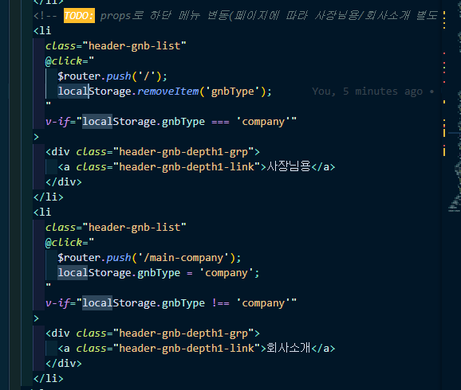
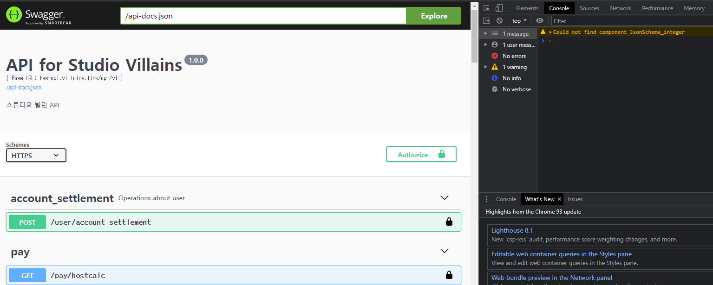
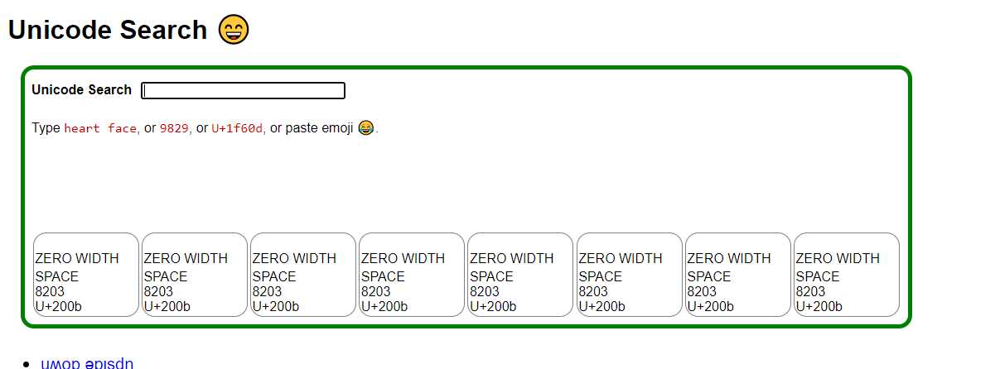

### **localStorage**

브라우저에서 값을 계속 들고 그 값을 활용해야 하는 경우 localStorage를 활용하면 좋음



### **숫자 세 자리마다 comma 추가하는 방법 → toLocaleString**

- 대상 변수의 자료형이 숫자일 경우 → 변수.toLocaleString()
- 대상 변수의 자료형이 문자일 경우(숫자로 바꾼다음 함수호출) → parseInt(변수).toLocaleString()
- 해당 변수의 자료형 검사하는 법 → typeof(변수)
- 이런 것도 있음 참고만

```jsx
filters: {
  // filter를 활용한 원화 숫자 콤마 넣기
  comma(val) {
    return String(val).replace(/\B(?=(\d{3})+(?!\d))/g, ',')
  }
},
```

### **문자열 뒤에서 자르기**

[[Javascript] 문자열 뒤에서 자르기](https://hianna.tistory.com/383)

### **forEach, map**

- forEach는 argument로 callback 함수를 작성해주게 되면 callback 함수의 첫 번째 parameter로 배열의 요소를 순서대로 하나씩 전달하면서 매번 이 함수를 실행하는 원리로 등장
- 첫 번째 parameter는 배열의 요소기 때문에 반드시 있어야 하고, 두 번째 parameter는 요소의 인덱스를 관리할 수 있음
    
    ```jsx
    const members = ['영훈', '석민', '유자', '사과']
    
    for(let member of members) {
      console.log(`${member}님이 입장하셨습니다.`);
    }
    
    members.forEach(function(member) {
      console.log(`${member}님이 입장하셨습니다.`);
    })
    
    // arrow function으로 작성
    members.forEach(member => {
      console.log(`${member}님이 입장하셨습니다.`);
    })
    
    // 두 번째 parameter로 index 관리
    members.forEach((member, i) => {
      console.log(`${i} ${member}님이 입장하셨습니다.`);
    })
    
    // forEach와 map
    // forEach와 문법적으로 비슷하나 forEach는 return값이 없음
    const firstNames = ['소리', '영수', '철수', '지민'];
    const lastNames = ['이', '박', '김', '최'];
    
    const fullNames = firstNames.map((firstName, i) => {
      return lastNames[i] + firstName
    })
    
    console.log(fullNames);
    ```
    

### **주소나 data에 알 수 없는 한글 혹은 특수문자 들어간 것처럼 잘못 나올 때  확인 사항(유니코드)**





### **try catch 문**

- try 안에서의 error는 바로 console에 출력되는 게 아니라 catch의 parameter로 전달됨
    
    ```jsx
    // try catch 문
    try {
      console.log('에러 전');
    
      const codeit = '코드잇';
      console.log(codeit)
    
      codeit = 'codeit';
    
      const language = 'JavaScript';
      console.log(language);
    } catch (e) {
      console.log('에러 후');
      console.log(e.name);
      console.log(e.message);
      console.error(e); // log가 아니라 error를 사용하면 실제 console error처럼 출력
    }
    ```
    

### map 함수

- 배열에서 사용 가능
    
    ```jsx
    const arr = [1, 2, 3];
    console.log(arr);
    
    const res = [];
    
    // 일반적인 for문을 돌렸을 때
    for(let i = 0; i < arr.length; i++) {
      res.push(arr[i] * 2);
    }
    
    console.log(res);
    
    // map함수를 사용할 때
    const res1 = arr.map((value) => {
      return value * 2;
    });
    
    console.log(res1);
    
    // 축약
    const res2 = arr.map((value) => value * 2);
    
    console.log(res2);
    
    // 배열의 index에 접근하고 싶을 때
    const res3 = arr.map((value, index) => index);
    
    console.log(res3);
    
    // 배열 안이 객체여도 가능 -> 배열 안의 일부 객체를 삭제할 때
    const items = [{id: 1, name: 'Kossie'}, {id: 2, name: 'Coder'}];
    const result  = items.map((item) => {
      return {id: item.id}
    });
    console.log(result);
    
    // 배열 안이 객체여도 가능 -> 배열 안의 일부 객체를 추가할 때
    const result2  = items.map((item) => ({
      ...item,
      isOpen: false
    }));
    console.log(result2);
    ```
    
    [자바스크립트 map 함수](https://www.youtube.com/watch?v=Q8g0tULRWn0)
    

### swiper element가 새로 생성될 때 width 이슈

탭 형식으로 swiper 슬라이드 구성할 때 width를 제대로 인식 못하는 문제가 생길 수 있음 -> 그럴 때 js에 observer: true, observeParents: true, -> 해당 옵션들이 reload 역할을 해줌 → script를 전부 불러오고 난 다음에 생성되는 html 요소는 script 적용 받지 않는 부분으로 이해함 → 고로 modal 같이 display: none; 으로 적용되었다가 새로 불러오는 modal 안에 script 요소가 들어가는 경우(ex) swiper) observer와 observeParents 옵션을 줘야 함

### url split

```jsx
'https://facebook.com/프로필주소'.split('/')
(4) ['https:', '', 'facebook.com', '프로필주소']
'https://facebook.com/프로필주소'.split('/').length
4
'https://facebook.com/프로필주소'.split('/')['https://facebook.com/프로필주소'.split('/').length - 1]
'프로필주소'
'프로필주소'.split('/')['프로필주소'.split('/').length - 1]
'프로필주소'
```

### window.scrollY offsetTop innerWidth 체크

```jsx
if (window.innerWidth < 1024) {
    // 220121 CGS: 스크롤값 체크해서 sticky 요소 조정
    window.addEventListener("scroll", function() {
      let scrollY = window.scrollY; // 스크롤값
      let mainPpSectionOffset = this.document.querySelector(
        "#main_pp_section"
      ).offsetTop; // 분기처리할 element offsetTop
      const mainSection = document.querySelector("#main_section");
      if (scrollY > mainPpSectionOffset) {
        mainSection.classList.add("type-relative");
      } else {
        mainSection.classList.remove("type-relative");
      }
    });
  }
```

### 일수 추가/제거 계산하기

```jsx
var ms = new Date().getTime() + 86400000;
var tomorrow = new Date(ms);

// 86400000 -> 하루의 ms
```

### moment 요일 뽑아내기

해당 날짜 데이터를 `$moment(item.on_work_dt).day()` 로 처리하면 일요일부터 0~6로 데이터 뱉음

그 데이터 기반으로 재가공

ex)

```jsx
setTimeToText(time) {
  const ampm = this.$moment(time).format('A') === 'AM' ? '오전' : '오후'
  return `${ampm} ${this.$moment(time).format('hh:mm')}`
}
```

### 브라우저 체크 스크립트

```jsx
CheckBrower() {
  if (
    (navigator.appName == "Netscape" &&
      this.agent.search("Trident") != -1) ||
    this.agent.toLowerCase().indexOf("msie") != -1
  ) {
    this.html.classList.add("ie");
  } else {
    this.html.classList.add("not-ie");

    if (this.agent.toLowerCase().indexOf("safari") != -1) {
      document.querySelector("html").classList.add("safari");
    }

    if (this.agent.toLowerCase().indexOf("chrome") != -1) {
      document.querySelector("html").classList.add("chrome");
    }
  }
},
```