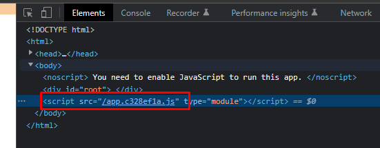

# 01. 시작하며

### CH01_01. (웹앱)프로그래밍 어떻게 배울것인가

- NOT EASY~

### CH01_02. 빠르게 배워야할 것, 나중에 배워야할 것, 반복해 배워야 하는 것

- 기술의 세가지 유형 → 변하지 않는 기술 / 느리게 변하는 기술 / 빠르게 변하는 기술
    - 변하지 않는 기술: 네트워크, 운영체제, 컴퓨터 시스템, 논리학, 대수학
    - 느리게 변하는 기술: 프로그래밍 언어, 프로그래밍 패러다임, 자료구조, 보안, 알고리즘
    - 빠르게 변하는 기술: 프레임워크, 라이브러리, UI, UX, 디자인 패턴

### CH01_03. 강의의 구조와 학습 환경

- Node.js, TypeScript, Parcel.js(번들러) 설치

# 02. JavaScript 그리고 TypeScript

### CH02_01. JavaScript 변천사

- 1995년에 JavaScript 등장(Netscape에 탑재, 당시 이름은 LiveScript)
- IE에 JScript라는 이름으로 탑재
- EcmaScript, Javascript 1997년
- 2009년에 ECMAScript 5.0
- 그 사이에 JS는 큰 발전을 이루지 못했음 → 당시 Adobe Flash가 인기를 끌던 시절이었기에 JS로 만든 웹사이트보다 flash로 만들어진 사이트가 더 인기를 끌었기 때문(Adobe는 flash 안에 있던 ActionScript를 JavaScript의 표준으로 만들고자 노력했었음)
- 2009년 ECMAScript 5.0이 나오고 2015년 ES2015라고 불려지는 그 사이에 특별히 버전이 나오지 않고 많은 논의가 있던 시기 → 2015년에 새로운 JavaScript 버전이 나오게 되고 이 버전부터 보통 모던 JavaScript라고 불리게 됨

### CH02_02. 웹앱의 구성요소

- 브라우저: 런타임 환경을 제공함
- 브라우저만이 JavaScript를 실행하는 것이 아니라 Node.js 외 다양한 환경이 존재함
- 웹서버에 있는 html 파일이 브라우저로 전송된 후에 문서를 그리고, 그 후에 JavaScript가 실행
- HTML를 언제 만드느냐에 따라서 CSR과 SSR이 나눠짐
- **CSR: 실제 최초 전송된 HTML에는 내용이 거의 없고 JavaScript가 실행되면서 필요한 UI를 그때그때 생성해내는 방식**
- **SSR: 웹서버에서 html이 만들어져서 브라우저로 전송되는 방법**

### CH02_03. 모던 JavaScript와 개발 환경

- 모던 JavaScript: ES2015
- 프론트엔드 개발 환경이 다소 복잡함 → 웹앱의 규모가 굉장히 커지고 복잡해짐
- **모듈 스펙이 과거에는 없었음 → ES2015부터 지원을 하기 시작함 → 모듈 스펙이라고 하면 파일과 파일간의 기능 연결 → `import`와 `export`**
- **Script tag로 script를 불러 들이는 것과 JavaScript 코드 내에서 script를 불러 들이는 건 엄연히 다름 → HTML 내에서 script tag로 script를 불러 들이는 건 모듈 스펙이라고 부르기 어려움**
- 모듈 스펙을 포함해서 새로운 문법들이 구 버전의 브라우저에서 지원하지 않음 → 때문에 번들러라고 하는 소프트웨어과 세상에 나옴 → 번들러가 번들링을 통해 하나의 파일로 만들어줌 ex) Webpack
- **최초에는 번들링이라는 게 간단한 작업이었지만 이미지 파일을 압축하기도 하고, JavaScript 파일을 일반 사용자가 알아보기 힘들게 어글리파이하기도 하고, 주석을 삭제해주는 일을 하기도 하게 됨**
- 트랜스 파일러 → 기계어로 변환하는 과정 ex) Babel - 최신 버전의 문법을 하위 버전으로 변환, TypeScript - 원하는 문법으로 작성한 후 JavaScript로 변환

### CH02_04. TypeScript vs. JavaScript

- TypeScript는 왜 필요한가 → TS는 JS의 슈퍼셋이다
- TS의 예시

```jsx
type Centimeter = Number;
type RainbowColor = 'red' | 'orange' | 'yellow';

let weight:number = 80; // 타입을 지정하는 방식
let height: Centimeter = 176; // 단위를 표현하는 방식
let color: RainbowColor = 'orange';

color = 'block'; // JS에선 해당 변수를 넣을 수 있지만 TS에서는 상단에 타입을 규정지어 놨기 때문에 black을 넣을 수 없음
```

- 프로젝트의 규모가 커지면 커질수록 데이터의 규모도 커지기 때문에 데이터 타입이나 데이터를 명확히 인지하는 것이 중요해짐 → 그런 면에서 TS로 좀 더 명확하게 파악할 수 있음

### CH02_05. nodejs & npm

- Nodejs → 라이언 달이라는 해커가 크롬 V8 엔진을 활용해서 JS가 꼭 브라우저에서 실행될 필요 없이 일반 데스크톱 환경에서도 실행될 수 있게끔 런타임 환경을 만듬
- node index.js
- npm i colors → 해당 프로그램을 npm으로 설치하고 브라우저 없이 별도의 기능을 사용할 수 있음
    
    ```jsx
    var colors = require('colors'); // 기본 세팅
    
    console.log('Hellow World'.yellow); // 콘솔 메세지를 컬러풀하게 출력해줌
    ```
    

# 03. JavaScript Starter Kit_Hacker News Client

### CH03_01. Hacker News 클라이언트 앱

- 어플리케이션이란 무엇인가 → 인풋 데이터를 가지고 출력 데이터로 변환시키는 것 → 입력, 처리, 출력 3가지 요소가 충족되어야 함
- 막히는 부분은 6장 참조 세션에서 공부하고 다시 복귀

### CH03_02. 12줄의 코드로 시작하기

- parcel.js가 app.js로 다른 파일을 만들고, 그 파일로 하여금 브라우저에서 실행되게끔 해줌(실행할 때마다 파일명이 바뀜)



- 개발자 도구 Elements 탭에서 esc key를 누르면 console 탭을 사용할 수 있음
- DOM API를 통해 element에 접근할 수 있음(물론 element 뿐만 아니라 그 외 다양하게)
- ajax(아작스)를 통해 api를 호출
    
    [XMLHttpRequest - Web API | MDN](https://developer.mozilla.org/ko/docs/Web/API/XMLHttpRequest)
    
- 개발자도구 Network 탭 XHR(XHLHttpRequest)를 통해 해당 fetch 파일을 확인할 수 있음
- Response 탭에서 확인하는 데이터는 문자열 데이터 → 문자열 데이터는 JS에서 다루기가 까다로움 → 바뀐 형식으로 보여주는 게 Preview 탭
- Response 탭의 데이터(문자열 데이터)를 Preview 탭 형식(객체)으로 바꾸는 방식(JSON이기 때문에 가능함, 모든 값을 객체로 바꿀 순 없음)
    
    ```jsx
    const ajax = new XMLHttpRequest();
    const NEWS_URl = 'https://api.hnpwa.com/v0/news/1.json'; 
    ajax.open('GET', NEWS_URL, false); // 비동기가 아니라 동기적으로 처리하겠다는 옵션
    ajax.send();
    
    const newsFeed = JSON.parse(ajax.response); // 문자열을 객체로 변환
    const ul = document.createElement('ul');
    
    // overwrite 되는 이슈
    for (let i = 0; i < 10; i++) {
      const li = document.createElement('li');
      li.innerHTML = newsFeed[i].title;
      ul.appendChild(li);
    };
    
    // 하드코딩
    // document.getElementById('root').innerHTML = `<ul>
    // <li>${newsFeed[0].title}</li>
    // <li>${newsFeed[1].title}</li>
    // <li>${newsFeed[2].title}</li>
    // </ul>`;
    
    document.getElementById('root').appendChild(ul);
    ```