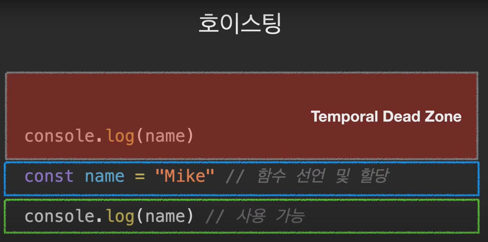
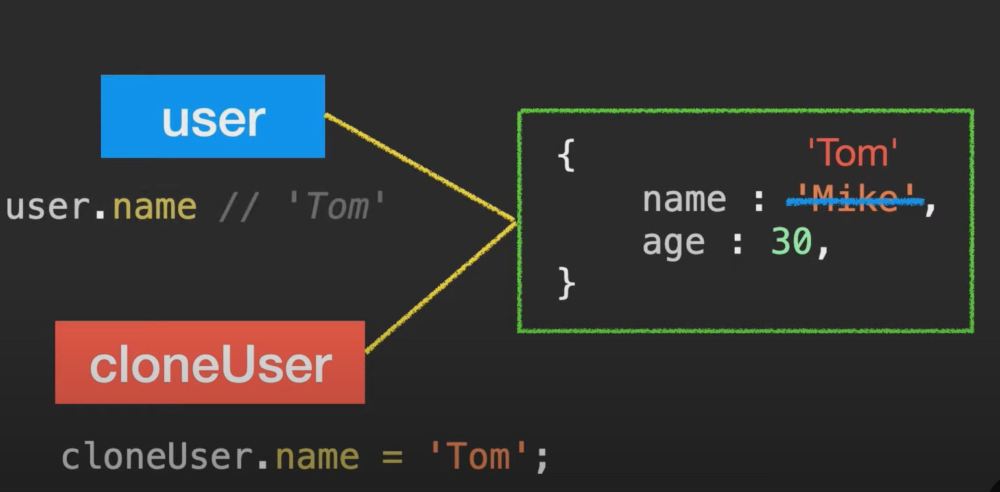
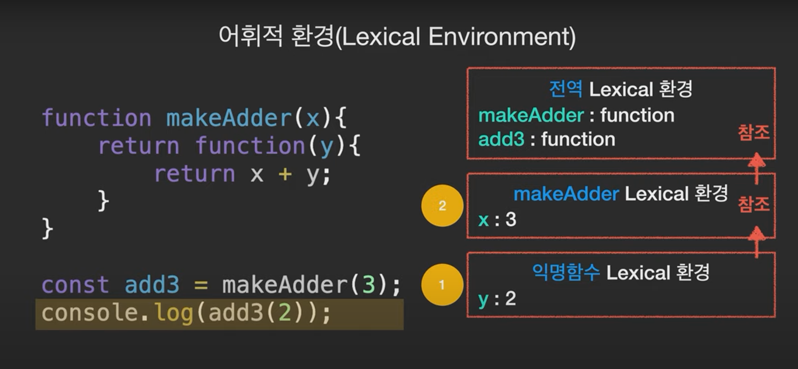
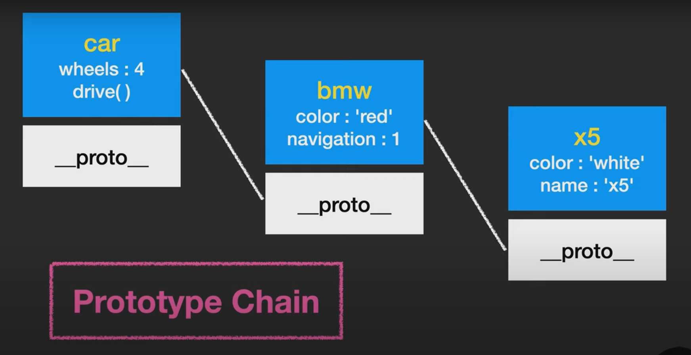

[자바스크립트 중급 강좌 : 140분 완성](https://www.youtube.com/watch?v=4_WLS9Lj6n4)


# **변수**

- let, const → ES6부터 사용
- var는 한번 선언된 변수를 다시 선언할 수 있다. → 반면 let은 불가능
    
    ```jsx
    let name = 'Mike';
    console.log(name); // Mike
    
    let name = 'Jane'; // error!
    console.log(name);
    ```
    

- var는 선언하기 전에 사용할 수 있다. → **// 선언은 hoisting되지만 할당은 hoisting 되지 않음, 그래서 undefined 출력**
    
    ```jsx
    var name;
    **// 선언은 hoisting되지만 할당은 hoisting 되지 않음, 그래서 undefined 출력**
    console.log(name); // undefined
    name = 'Mike';
    ```
    
- **hoisting → scope 내부 어디서든 변수 선언은 최상위에 선언된 것처럼 행동**
- let 또한 hoisting이 되지만 let과 const는 TDZ(Temporal Dead Zone)의 영향을 받기 때문에 때문에 ReferencError
    
    ```
    console.log(이름); // RefernceError
    let 이름 = 'Mike';
    ```
    
    
    
    - 이는 코드를 예측 가능하게 하고 잠재적인 버그를 줄일 수 있음
    
- hoisting은 scope 단위로 일어남
    
    ```jsx
    let age = 30;
    
    function showAge() {
      console.log(age);
      let age = 20;
    }
    
    showAge();
    ```
    

## **변수의 생성과정**

1. 선언 단계
2. 초기화 단계
3. 할당 단계
- **vat, let, const 변수 생성과정**
    - `var`는 선언 및 초기화 단계가 동시에
    - `let`은 선언과 초기화 단계를 나눠서 진행
    - `const` 선언 + 초기화 + 할당
        
        ```jsx
        let 이름;
        이름 = 'Mike';
        
        var age;
        age = 30;
        
        const gender; // 선언, 초기화, 할당 동시에 이뤄져야 함
        gerder = 'male';
        ```
        
- `var`: 함수 스코프(function-scoped) / `let`, `const`: **블록 스코프(block-scoped)**
- **블록 스코프: 모든 코드 블록 내에서 선언된 변수는 코드 블록 내에서만 유효하며 외부에서는 접근할 수 없음**
    
    → 함수, if문, for문, while문, try/catch문 등
    
- **var가 유일하게 벗어날 수 없는 스코프가 함수라고 생각하면 됨**
    
    ```jsx
    function add(num1, num2) {
      var result = num1 + num2;
    }
    
    add(2, 3);
    
    console.log(result); // ReferenceError: 함수 스코프를 벗어나면 사용할 수 없음
    ```
    
- var 대신 let, const를 권장함 → 예측 가능한 결과를 내고 버그를 줄일 수 있음

# **생성자 함수**

## **객체 리터럴**

```jsx
let user = {
  name: 'Mike',
  age: 30,
}
```

## **생성자 함수**

```jsx
function User(name, age) {
  this.name = name;
  this.age = age;
}

let user1 = new User('Mike', 30);
let user2 = new User('Jane', 22);
let user3 = new User('Tom', 17);
```

- 생성자 함수 첫 글자는 대문자로
- new 연산자를 사용해서 호출
- 생성자 함수는 붕어빵틀이나 와플팬이라고 생각하면 됨

## **생성자 함수 작동 방식**

- 일단 빈 객체를 만들고 this에 할당
- 본문을 실행하면서 this에 property들을 추가
- 마지막으로 this를 반환
- 실제로 앞뒤 두줄은 코드에 작성하지 않아도 이미 할당된 알고리즘이 실행
- **어떤 함수라도 new를 붙여서 실행하면 이 알고리즘과 동일하게 작동함 → 그래서 관례적으로 생성자 함수는 첫 글자를 대문자로 작성**

```jsx
function User(name, age) {
  // this = {}

  this.name = name;
  this.age = age;

  // return this;
}

new 함수명();
```

```jsx
function User(name, age) {
  // this = {}

  this.name = name;
  this.age = age;
  this.sayName = function() {
    console.log(this.name);
  }
}

let user5 = new User('Han', 40);
user5.sayName(); // 'Han'
```

- 생성자 함수는 new를 붙이지 않으면 그냥 함수를 실행해주는 것이기 때문에 return값이 없는 undefined 출력되는 케이스
    
    ```jsx
    function Item(title, price) {
      // this = {};
      this.title = title;
      this.price = price;
      this.showPrice = function() {
        console.log(`가격은 ${price}원 입니다.`)
      }
    
      // return this;
    }
    
    const item1 = new Item('인형', 3000);
    **const item2 = Item('가방', 4000); // undefined**
    const item3 = new Item('지갑', 9000);
    
    console.log(item1, item2, item3);
    
    item3.showPrice();
    ```
    

# **객체 메소드(Object methods), 계산된 프로퍼티(Computed property)**

- **대괄호로 묶어서 선언하면 a라는 문자열이 아니라 변수 a에 할당된 값이 들어감 → 이를 computed property라고 부름**
    
    ```jsx
    let a = 'age';
    
    const user = {
      name: 'Mike',
      [a]: 30, // age: 30
    }
    ```
    
- 식 자체를 넣는 것도 가능함
    
    ```jsx
    const user  = {
      [1 + 4]: 5,
      ['안녕' + '하세요']: 'Hello'
    }
    
    console.log(user); // {5: 5, 안녕하세요: 'Hello'}
    ```
    

## **객체 메소드(Object methods) 종류**

### **Object.assign() : 객체 복제**

- **user 변수에는 객체가 들어가 있는 게 아니라 객체가 저장되어 있는 메모리 주소인 객체에 대한 참조값이 저장됨 → 그래서 cloneUser에는 객체가 복사되는 게 아니라 그 참조값만 복사됨**
    
    ```jsx
    const user = {
      name: 'Mike',
      age: 30
    }
    
    const cloneUser = user; // 복제가 아님
    // user 변수에는 객체가 들어가 있는 게 아니라 객체가 저장되어 있는 메모리 주소인 객체에 대한 참조값이 저장됨
    // 그래서 cloneUser에는 객체가 복사되는 게 아니라 그 참조값만 복사됨
    ```
    
    
    

- 동일하게 복제하고자 한다면 Object.assign() 메소드를 사용해야 함
    
    ```jsx
    const user = {
      name: 'Mike',
      age: 30
    }
    
    // 빈 객체는 초기값
    // 두 번째 매개변수에 들어온 값이 초기값에 병합됨
    const newUser = Object.assign({}, user);
    console.log(newUser);
    newUser.name = 'Tom';
    console.log(user);
    ```
    

- 성별값이 있는 객체 초기값에 user가 병합되므로 property가 하나 늘어남
    
    ```jsx
    const user = {
      name: 'Mike',
      age: 30
    }
    
    // 성별값이 있는 객체 초기값에 user가 병합되므로 property가 하나 늘어남
    const newUser = Object.assign({ gender: 'male' }, user);
    console.log(newUser);
    newUser.name = 'Tom';
    console.log(user);
    ```
    
- 병합을 하는데 초기값과 key가 같은 것이 있다면 덮어씌우는 형태로 병합
    
    ```jsx
    const user = {
      name: 'Mike',
      age: 30
    }
    
    // 병합을 하는데 초기값과 key가 같은 것이 있다면 덮어씌우는 형태로 병합
    const newUser = Object.assign({ name: 'Tom' }, user);
    console.log(newUser);
    newUser.name = 'Tom';
    console.log(user);
    ```
    

- 두 개 이상의 객체도 합칠 수 있음
    
    ```jsx
    const user = {
      name: 'Mike'
    }
    
    const info1 = {
      age: 30,
    }
    
    const info2 = {
      gender: 'male',
    }
    
    const newUser = Object.assign(user, info1, info2);
    console.log(newUser); // {name: 'Mike', age: 30, gender: 'male'}
    ```
    

### **Object.keys() : 키 배열 반환**

- 해당 메소드에 인수로 객체를 내려주면 key를 배열로 담아줌
    
    ```jsx
    const user = {
      name: 'Mike',
      age: 30,
      gender: 'Male'
    }
    
    const keyArr = Object.keys(user);
    console.log(keyArr); // ['name', 'age', 'gender']
    ```
    

### **Object.values() : 값 배열 반환**

- 반대로 value만 얻고 싶다면 이 메소드 활용
    
    ```jsx
    const user = {
      name: 'Mike',
      age: 30,
      gender: 'Male'
    }
    
    const valueArr = Object.values(user);
    console.log(valueArr); // ['Mike', 30, 'Male']
    ```
    

### **Object.entries() : 키/값 배열 반환**

- 해당 메소드에 객체를 전달하면 키와 값을 각각 쌍으로 묶어 배열로 반환
    
    ```jsx
    const user = {
      name: 'Mike',
      age: 30,
      gender: 'Male'
    }
    
    const newUser = Object.entries(user);
    console.log(newUser);
    // [
    //   ['name', 'Mike'],
    //   ['age', 30],
    //   ['gender', 'Male']
    // ]
    ```
    

### **Object.fromEntries() : 키/값 배열을 객체로 반환**

- 반대로 키/갓 배열을 객체로 반환해줌
    
    ```jsx
    const user = {
      name: 'Mike',
      age: 30,
      gender: 'Male'
    }
    
    const newUser = Object.entries(user);
    console.log(newUser);
    // [
    //   ['name', 'Mike'],
    //   ['age', 30],
    //   ['gender', 'Male']
    // ]
    
    const renewUser = Object.fromEntries(newUser);
    console.log(renewUser); // {name: 'Mike', age: 30, gender: 'Male'}
    ```
    

- **실용 예제**
    - 어떤 게 key가 될지 모르는 객체를 생성할 때 유용함
        
        ```jsx
        function makeObj(key, val) {
          return {
            [key]: val
          }
        }
        
        const obj = makeObj('성별', 'male');
        
        console.log(obj);
        ```
        

# **심볼(Symbol)**

## property key : 문자형

```jsx
// property key : 문자형
const obj = {
  1: '1입니다',
  false: '거짓'
}

console.log(Object.keys(obj)); // ['1', 'false']

console.log(obj['1']); // '1입니다'
console.log(obj['false']); // '거짓'
```

## property key : Symbol (심볼형)

```jsx
// 유일한 식별자 Symbol
const a = Symbol(); // new를 붙이지 않습니다!
const b = Symbol();

console.log(a == b); // false
```

**Symbol: 유일성 보장**

- 심볼형의 자료형은 재가공하거나 탐색할 때 건너뜀
    
    ```jsx
    const id = Symbol('id');
    const user = {
      name: 'Mike',
      age: 30,
      [id]: 'myid'
    }
    
    console.log(Object.keys(user)); // ['name', 'age']
    console.log(Object.values(user)); // ['Mike', 30]
    console.log(Object.entries(user)); // [Array(2), Array(2)]
    for(let a in user) {} // for in을 써도 건너뜀
    ```
    

## Symbol.for() : 전역 심볼

- 하나의 심볼만 보장받을 수 있음
- 없으면 만들고, 있으면 가져오기 때문
- Symbol 함수는 매번 다른 Symbol 값을 생성하지만,
- Symbol.for 메소드는 하나를 생성한 뒤 키를 통해 같은 Symbol을 공유
    
    ```jsx
    const id1 = Symbol.for('id');
    const id2 = Symbol.for('id');
    
    console.log(id1 == id2); // true
    console.log(Symbol.keyFor(id1)); // 생성할 때 적어뒀던 이름을 알려줌
    ```
    

- 전역 심볼이 아닌 경우 keyFor를 사용할 수 없음 → 대신 description으로 이름을 알 수 있음
    
    ```jsx
    const id1 = Symbol('id');
    console.log(id1.description); // 'id'
    ```
    
- 숨겨진 Symbol key 보는 법
    
    ```jsx
    const id = Symbol('id');
    
    const user = {
      name: 'Mike',
      age: 30,
      [id]: 'myid'
    }
    
    console.log(Object.getOwnPropertySymbols(user));
    console.log(Reflect.ownKeys(user)); // ['name', 'age', Symbol(id)]
    ```
    
- 내가 추가한 메소드도 잘 동작하고, 다른 개발자가 만들어놓은 코드에도 영향을 주지 않는 선에서 추가할 수 있음
    
    ```jsx
    // 다른 개발자가 만들어 놓은 객체
    const user = {
      name: 'Mike',
      age: 30,
    }
    
    // 내가 작업
    // user.showName = function() {}; // 이런 식으로 작업하면 사용자가 메세지를 보게 됨
    const showName = Symbol('show name');
    user[showName] = function() {
      console.log(this.name);
    }
    
    // 사용자가 접속하면 보는 메세지
    for(let key in user) {
      console.log(`His ${key} is ${user[key]}.`);
    }
    ```
    

# 숫자, 수학 method (Number, Math)

## toString() - 10진수 → 2진수/16진수

```jsx
let num = 10;

console.log(num.toString()); // '10'
console.log(num.toString(2)); // '1010'

let num2 = 255;
console.log(num2.toString(16)); // 'ff'
```

## Math

- Math.ceil() : 올림
    
    ```jsx
    let num1 = 5.1;
    let num2 = 5.7;
    
    console.log(Math.ceil(num1)); // 6
    console.log(Math.ceil(num2)); // 6
    ```
    

- Math.floor() : 내림
- Math.round() : 반올림
- 소수점 자릿수 : ToFixed() → ToFixed는 문자열을 반환하기 때문에 Number를 활용해서 숫자로 변환 후 작업하는 경우 많음

## isNaN

- isNaN만이 isNaN인지 판단할 수 있음
    
    ```jsx
    let x = Number('x'); // NaN
    
    console.log(x == NaN); // false
    console.log(x == NaN); // false
    console.log(NaN == NaN); // false
    
    console.log(isNaN(x)) // true
    console.log(isNaN(3)) // false
    ```
    

## parseInt()

- 문자를 숫자로 바꿔줌 → Number()와 다른 점은 문자와 숫자가 혼용되어 있어도 작동을 함
    
    ```jsx
    let margin = '10px';
    
    console.log(parseInt(margin)); // 10
    console.log(Number(margin)); // NaN
    ```
    

 

- 읽을 수 있는 부분까지 읽고 문자를 만나면 읽은 부분까지의 숫자를 반환함
    
    ```jsx
    let redColor = 'f3';
    console.log(parseInt(redColor)); // NaN
    ```
    

## parseFloat()

- 부동소숫점까지 반환함
    
    ```jsx
    let padding = '18.5%';
    console.log(parseInt(padding)); // 18
    console.log(parseFloat(padding)); // 18.5
    ```
    

## Math.random();

- 0~1 사이에 무작위 숫자

## Math.max()

- 최대값

## Math.min()

- 최소값

## Math.abs()

- 절대값

## Math.pow(n, m)

- 제곱값

## Math.sqrt()

- 제곱근

# 문자열 메소드(String methods)

## 여러줄

- 백틱은 여러줄 가능, 일반 따옴표는 \n 등을 활용
    
    ```jsx
    // 여러줄
    let desc = `오늘은 맑고 화창한
    날씨가 계속 되겠습니다.
    내일은 비소식이 있습니다.`;
    
    let desc2 = '오늘은 맑고 화창한\n날씨가 계속 되겠습니다.';
    
    console.log(desc);
    console.log(desc2);
    ```
    

## length : 문자열 길이

- 보통 가입할 때 아이디나 비밀번호 체크할 때 length 체크
    
    ```jsx
    let desc = '안녕하세요.';
    console.log(desc.length);
    ```
    

- 배열과 동일하게 특정위치로 접근 가능
    
    ```jsx
    let desc = '안녕하세요.';
    console.log(desc[2]);
    ```
    

- 특정 위치에 접근 - 하지만 배열과 다르게 한 글자만 바꾸는 건 허용되지 않음
    
    ```jsx
    let desc = '안녕하세요.';
    console.log(desc[2]);
    
    desc[4] = '용';
    console.log(desc);
    ```
    

## toUpperCase() / toLowerCase()

- 대문자, 소문자 변경
    
    ```jsx
    let desc = "Hi guys. Nice to meet you.";
    
    desc = desc.toUpperCase();
    console.log(desc);
    
    desc = desc.toLowerCase();
    console.log(desc);
    ```
    

## str.indexOf(text)

- 문자를 인수로 받아 몇 번째 오는지 알려줌
- 포함된 문자가 여러 개라도 첫 번째 문자만 반환
- **주의: 조건문 걸 때 첫번째 문자열은 0을 반환하기 때문에 0은 false이므로 -1을 조건으로 잡아야 함(-1(찾는 문자열이 없음)과 일치하더라도 true가 되기 때문에 조건을 -1 이상으로)**
    
    ```jsx
    let desc = "Hi guys. Nice to meet you.";
    
    console.log(desc.indexOf('to')); // 14
    console.log(desc.indexOf('man')); // 찾는 문자열이 없으면 -1 반환
    
    if(desc.indexOf('Hi') > -1) {
      console.log('Hi가 포함된 문장입니다.')
    }
    ```
    

## str.slice(n, m)

- slice는 조건부 반환
- n은 시작점
- m은 없으면 문자열 끝까지 / 양수면 그 숫자까지(포함하지는 않음) / 음수면 끝에서부터 셈
    
    ```jsx
    let desc = 'abcdefg';
    
    console.log(desc.slice(2)); // 'cdefg'
    console.log(desc.slice(0, 5)); // 'abcde'
    console.log(desc.slice(2, -2)); // 'cde'
    ```
    

## str.substring(n, m)

- 마찬가지로 n, m 사이의 문자열을 반환
- slice와 비슷하지만 n과 m을 바꿔도 동작함
- 음수를 허용하지 않음. 음수는 0으로 인식
    
    ```jsx
    let desc = 'abcdefg';
    
    console.log(desc.substring(2, 5)); // 'cde'
    console.log(desc.substring(5, 2)); // 'cde'
    ```
    

## str.substr(n, m)

- n부터 시작 / m개를 가져옴
    
    ```jsx
    let desc = 'abcdefg';
    
    console.log(desc.substr(2, 4)); // 'cdef'
    console.log(desc.substr(-4, 2)); // 'de'
    ```
    

## str.trim()

- 앞 뒤 공백 제거

## str.repeat(n)

- 문자열을 n번 반복

## 문자열 비교

```jsx
console.log(1 < 3); // true
console.log('a' < 'c'); // true
```

## 실용 예제

- 문자열만 반환
    
    ```jsx
    let list = [
      "01. 들어가며",
      "02. JS의 역사",
      "03. 자료형",
      "04. 함수",
      "05. 배열",
    ]
    
    let newList = [];
    
    for(let i = 0; i < list.length; i++) {
      newList.push(
        list[i].slice(4)
      )
    }
    
    console.log(newList);
    ```
    
- 금칙어
    
    ```jsx
    // 금칙어: 콜라
    
    function hasCola(str) {
      if(str.indexOf('콜라') > -1) {
        console.log('금칙어가 있습니다.');
      } else {
        console.log('통과.');
      }
    }
    
    hasCola('와 사이다가 짱이야!');
    hasCola('무슨 소리, 콜라가 최고!');
    hasCola('콜라');
    ```
    
    ```jsx
    // 금칙어: 콜라
    
    // function hasCola(str) {
    //   if(str.indexOf('콜라') > -1) {
    //     console.log('금칙어가 있습니다.');
    //   } else {
    //     console.log('통과.');
    //   }
    // }
    
    // includes 통해서도 확인 가능
    function hasCola(str) {
      if(str.includes('콜라')) {
        console.log('금칙어가 있습니다.');
      } else {
        console.log('통과.');
      }
    }
    
    hasCola('와 사이다가 짱이야!');
    hasCola('무슨 소리, 콜라가 최고!');
    hasCola('콜라');
    ```
    

# 배열 메소드(Array methods)

**#splice, slice는 반환값의 차이가 있음**

[JavaScript slice(), splice(), split() 차이](https://velog.io/@gagaeun/JavaScript-slice-splice-split-차이)

## arr.splice(n, m) - 특정 요소 지움

- n은 시작, m은 갯수
    
    ```jsx
    let arr = [1, 2, 3, 4, 5];
    arr.splice(1, 2);
    
    console.log(arr); // [1, 4, 5]
    ```
    

## arr.splice(n, m, x) - 특정 요소 지우고 추가

- x를 추가하는 것까지
    
    ```jsx
    let arr = [1, 2, 3, 4, 5];
    arr.splice(1, 3, 100, 200);
    
    console.log(arr); // [1, 100, 200, 5]
    ```
    
- m의 값을 0으로 설정하면 아무 것도 지우지 않고 값만 추가하는 것도 가능
    
    ```jsx
    let arr = ["나는", "철수", "입니다"];
    arr.splice(1, 0, "대한민국", "소방관");
    
    console.log(arr);
    ```
    

## arr.splice() - 삭제된 요소 반환

- 처리한 값을 변수에 담으면 삭제된 요소가 반환
    
    ```jsx
    let arr = [1, 2, 3, 4, 5];
    let result = arr.splice(1, 2);
    
    console.log(arr); // [1, 4, 5]
    console.log(result); // [2, 3]
    ```
    

## arr.slice(n, m) - n부터 m까지 반환

- 기존의 배열값 수정 없이 새로운 배열을 반환
    
    ```jsx
    let arr = [1, 2, 3, 4, 5];
    let newArr = arr.slice(1, 4);
    
    console.log(arr); // [1, 2, 3, 4, 5]
    console.log(newArr); // [2, 3, 4]
    ```
    

## arr.concat(arr2, arr3) : 합쳐서 새배열 반환

- 기존의 배열값 수정 없이 새로운 배열을 반환
    
    ```jsx
    let arr = [1, 2];
    let newArr = arr.concat([3, 4]);
    let newArr2 = arr.concat([3, 4], [5, 6]);
    
    console.log(arr); // [1, 2]
    console.log(newArr); // [1, 2, 3, 4]
    console.log(newArr2); // [1, 2, 3, 4, 5, 6]
    ```
    

## arr.forEach(fn) : 배열 반복

- 배열의 반복
    
    ```jsx
    let users = ['Mike', 'Tom', 'Jane'];
    
    users.forEach((name, index, arr) => {
      console.log(`${index + 1}, ${name}`);
    })
    ```
    

## arr.indexOf / arr.lastIndexOf

- 해당값의 index 위치를 숫자로 반환해줌 / 뒤에서부터 찾고 싶으면 lastIndexOf
    
    ```jsx
    let arr = [1, 2, 3, 4, 5, 1, 2, 3];
    let idx = arr.indexOf(3);
    console.log(idx); // 2
    idx = arr.indexOf(3, 3);
    console.log(idx); // 7
    idx = arr.lastIndexOf(2);
    console.log(idx); // 6
    ```
    

## arr.includes() : 포함하는지 확인

- index의 값은 필요 없고 그냥 포함하는지만 확인할 땐 includes가 더 나음
    
    ```jsx
    let arr = [1, 2, 3];
    
    let check = arr.includes(2);
    console.log(check); // true
    
    let check2 = arr.includes(4);
    console.log(check2); // false
    ```
    

## arr.find(fn) / arr.findIndex(fn)

- 찾는다는 의미는 비슷하지만 보다 복잡한 연산이 가능하도록 함수를 전달할 수 있음 ex) 짝수를 찾아낸다던지, 성인을 찾아낸다던지 등
- 주의: 첫 번째 true값만 반환하고 종료
    
    ```jsx
    let arr = [1, 2, 3, 4, 5];
    const result = arr.find((item) => {
      return item % 2 === 0;
    })
    
    console.log(result);
    ```
    

```jsx
let userList = [
  { name: 'Mike', age: 30 },
  { name: 'Jane', age: 27 },
  { name: 'Tom', age: 10 },
];

const result = userList.find((user) => {
  if(user.age < 19) {
    return true;
  }
  
  return false;
});

console.log(result);
```

## arr.filter(fn)

- find는 첫 번째 값만 반환하는데 만약 모든 값을 알고 싶다면? → 만족하는 모든 요소를 배열로 반환
    
    ```jsx
    let userList = [
      { name: 'Mike', age: 30 },
      { name: 'Jane', age: 27 },
      { name: 'Tom', age: 10 },
    ];
    
    const result = userList.filter((user) => {
      if(user.age < 30) {
        return true;
      }
      
      return false;
    });
    
    console.log(result);
    ```
    

## arr.reverse()

- 역순으로 재정렬
    
    ```jsx
    let arr = [1, 2, 3, 4, 5];
    arr.reverse();
    
    console.log(arr);
    ```
    

## arr.map(fn)

- 함수를 받아 특정 기능을 시행하고 새로운 배열을 반환
- **실무에서 정말 많이 사용되기에 틈틈히 연습 필요**
    
    ```jsx
    let userList = [
      { name: 'Mike', age: 30 },
      { name: 'Jane', age: 27 },
      { name: 'Tom', age: 10 },
    ];
    
    let newUserList = userList.map((user, index) => {
      return Object.assign({}, user, {
        id: index + 1,
        isAdult: user.age > 19,
      })
    });
    
    console.log(newUserList);
    ```
    

## arr.join() / arr.split(”,”)

- 배열을 합쳐서 문자열로 만들거나 문자열을 쪼개서 배열로 만들 거나
    
    ```jsx
    let arr = ["안녕", "나는", "철수야"];
    let result = arr.join('   ');
    
    console.log(result);
    ```
    
    ```jsx
    const users = "Mike,Jane,Tom,Tony";
    let str = 'Hello, My name is Mike.';
    const result = users.split(",");
    const result2 = str.split("");
    
    console.log(result); // ['Mike','Jane', 'Tom', 'Tony']
    console.log(result2);
    ```
    

## Array.isArray()

- 배열 여부 판별
- js에서 배열은 객체형에 속하기 때문에 typeof로는 객체인지 배열인지 판별할 수 없음
    
    ```jsx
    let user = {
      name: "Mike",
      age: 30,
    }
    
    let userList = ["Mike", "Tom", "Jane"];
    
    console.log(typeof userList); // object
    console.log(Array.isArray(userList)); // true
    ```
    

# 배열 메소드2(sort, reduce)

## Array.sort()

- 배열 재정렬
- 배열 자체가 변경되니 주의
- 인수로 정렬 로직을 담은 **함수를 받음**
    
    ```jsx
    let arr = [1, 5, 4, 2, 3];
    arr.sort();
    
    console.log(arr); // [1, 2, 3, 4, 5]
    ```
    
- 정렬할 때 요소를 문자열로 취급하기 때문에 13의 1, 27의 2를 먼저 체크해서 정렬하게 됨
    
    ```jsx
    let arr = [27, 8, 5, 13];
    arr.sort();
    
    console.log(arr); // [13, 27, 5, 8]
    ```
    
- 실질적으로 정렬하기 위해서는 정렬 로직을 담은 함수를 넣어줘야 함
    
    ```jsx
    let arr = [27, 8, 5, 13];
    arr.sort((a, b) => {
      console.log(a, b);
      return a - b;
    });
    
    console.log(arr); // [13, 27, 5, 8]
    ```
    
- 로직이 까다롭기 때문에 보통은 Lodash 같은 라이브러리를 사용함
    - `_.sortBy(arr);` 로 처리 가능
    

## Array.reduce()

- 인수로 함수를 받음
- (누적 계산값, 현재값) ⇒ { return 계산값 };
    
    ```jsx
    let arr = [1, 2, 3, 4, 5];
    
    // 배열의 모든 수 합치기
    // let result = 0;
    // arr.forEach(num => {
    //   result += num;
    // })
    
    const result = arr.reduce((prev, cur) => {
      return prev + cur;
    }, 100)
    
    console.log(result);
    ```
    
    ```jsx
    let userList = [
      { name: "Mike", age: 30 },
      { name: "Tom", age: 10 },
      { name: "Jane", age: 27 },
      { name: "Sue", age: 26 },
      { name: "Harry", age: 42 },
      { name: "Steve", age: 60 },
    ]
    
    let result = userList.reduce((prev, cur) => {
      if(cur.age > 19) {
        prev.push(cur.name);
      }
    
      return prev;
    }, [])
    
    console.log(result);
    ```
    

# 구조 분해 할당(Destructuring assignment)

## 배열 구조 분해

- 구조 분해 할당 구문은 배열이나 객체의 속성을 분해해서 그 값을 변수로 담을 수 있게 하는 표현식
    
    ```jsx
    let [x, y] = [1, 2];
    
    console.log(x); // 1
    console.log(y); // 2
    ```
    
    ```jsx
    let users = ['Mike', 'Tom', 'Jane'];
    
    let [user1, user2, user3] = users;
    
    console.log(user1); // 'Mike'
    console.log(user2); // 'Tom'
    console.log(user3); // 'Jane'
    ```
    
- 앞서 확인한 split을 사용해서 바로 구조 분해 할당할 수 있음
    
    ```jsx
    let str = "Mike-Tom-Jane";
    
    let [user1, user2, user3] = str.split('-');
    
    console.log(user1); // 'Mike'
    console.log(user2); // 'Tom'
    console.log(user3); // 'Jane'
    ```
    
- 값이 없으면 undefined가 들어가기 때문에 기본값을 미리 할당해주면 에러를 방지할 수 있음
    
    ```jsx
    let [a, b, c] = [1, 2];
    
    console.log(a); // 1
    console.log(b); // 2
    console.log(c); // undefined
    ```
    
    ```jsx
    // let [a, b, c] = [1, 2];
    let [a = 3, b = 4, c = 5] = [1, 2];
    
    console.log(a); // 1
    console.log(b); // 2
    console.log(c); // 5
    ```
    
- 배열 구조 분해 : 일부 반환값 무시
    
    ```jsx
    let [user1, , user2] = ['Mike', 'Tom', 'Jane', 'Tony'];
    
    console.log(user1); // 'Mike'
    console.log(user2); // 'Jane'
    ```
    
- 배열 구조 분해: 바꿔치기 → 무의미한 임시 변수 없이도 간단하게 가능
    
    ```jsx
    let a = 1;
    let b = 2;
    
    [a, b] = [b, a];
    
    console.log(a); // 2
    console.log(b); // 1
    ```
    

## 객체 구조 분해

- 순서와 무관하게 객체도 구조 분해 할당 가능
    
    ```jsx
    let user = {name: 'Mike', age: 30};
    
    // let {name, age} = user;
    let {age, name} = user; // 순서와 무관함
    
    console.log(name); // 'Mike'
    console.log(age); // 30
    ```
    
- 새로운 변수 이름으로도 할당 가능
    
    ```jsx
    let user = {name: 'Mike', age: 30};
    // let {name, age} = user;
    let {name: userName, age: userAge} = user;
    
    console.log(userName); // 'Mike'
    console.log(userAge); // 30
    ```
    
- 객체 구조 분해: 기본값
    
    ```jsx
    let user = {
      name: 'Jane',
      age: 18,
      gender: 'female'
    };
    
    let {name, age, gender = 'male'} = user;
    
    console.log(gender); // female
    ```
    

# 나머지 매개변수, 전개 구문(Rest parameters, Spread syntax)

## 인수전달

- JavaScript에서 함수에 넘겨주는 인수의 갯수는 제한이 없음, 인수의 갯수를 정하고 함수를 만들어도 실제 호출할 때 그 갯수를 맞출 필요는 없음
    
    ```jsx
    function showName(name) {
      console.log(name);
    }
    
    showName('Mike'); // 'Mike'
    showName('Mike', 'Tom'); // ?
    
    showName(); // undefined
    ```
    

## arguments

- 함수로 넘어 온 모든 인수에 접근
- 함수 내에서 이용 가능한 지역 변수
- length / index
- Array 형태의 객체
- 배열의 내장 메소드 없음(forEach, map)
    
    ```jsx
    function showName(name) {
      console.log(arguments.length);
      console.log(arguments[0]);
      console.log(arguments[1]);
    }
    
    showName('Mike', 'Tom');
    ```
    

## 나머지 매개변수(Rest parameters)

- ES6를 사용할 수 있는 환경이면 나머지 매개변수를 권장하고 있음
- 배열의 내장 메소드를 사용할 수 있다는 장점이 있음
    
    ```jsx
    function add(...numbers) {
      let result = 0;
      numbers.forEach(num => (result += num));
      console.log(result);
    }
    
    add(1, 2, 3); // 6
    add(1, 2, 3, 4, 5, 6, 7, 8, 9, 10); // 55
    ```
    
- 나머지 매개변수는 항상 마지막에 있어야 함
    
    ```jsx
    function User(name, age, ...skills) {
      this.name = name;
      this.age = age;
      this.skills = skills;
    }
    
    const user1 = new User('Mike', 30, 'html', 'css');
    const user2 = new User('Tom', 20, 'JS', 'React');
    const user3 = new User('Jane', 10, 'English');
    
    console.log(user1);
    console.log(user2);
    console.log(user3);
    ```
    

## 전개 구문(Spread syntax): 배열

- 전개 구문 배열 예제
    
    ```jsx
    let arr1 = [1, 2, 3];
    let arr2 = [4, 5, 6];
    
    let result = [...arr1, ...arr2];
    
    console.log(result); // [1, 2, 3, 4, 5, 6]
    ```
    
- arr.push() / arr.splice() / arr.concat() 등과 같은 내장함수를 써서 배열을 조작하는 건 다소 번거로움, 전개구문을 사용하면 쉽게 가능
    
    ```jsx
    let arr1 = [1, 2, 3];
    let arr2 = [4, 5, 6];
    
    let result = [0, ...arr1, ...arr2, 7, 8, 9];
    console.log(result); // [0, 1, 2, 3, 4, 5, 6, 7, 8, 9]
    ```
    

## 전개 구문(Spread syntax): 객체

- 전개 구문 객체 예제
    
    ```jsx
    let user = {name: 'Mike'}
    let mike = {...user, age: 30}
    
    console.log(mike); // {name: 'Mike', age: 30}
    ```
    

## 전개 구문(Spread syntax): 복제

- Object.assign()의 사용 없이도 간단하게 복제 가능
    
    ```jsx
    let arr = [1, 2, 3];
    let arr2 = [...arr];
    
    let user = {name: 'Mike', age: 30};
    let user2 = {...user};
    
    user2.name = 'Tom';
    
    console.log(user.name); // 'Mike'
    console.log(user2.name); // 'Tom'
    ```
    
    ```jsx
    let arr1 = [1, 2, 3];
    let arr2 = [4, 5, 6];
    
    // arr2.reverse().forEach((num) => {
    //   arr1.unshift(num);
    // });
    
    arr1 = [...arr2, ...arr1];
    console.log(arr1);
    ```
    
    ```jsx
    let user = { name: 'Mike' };
    let info = { age: 30 };
    let fe = ['JS', 'React'];
    let lang = ['Korean', 'English'];
    
    user = Object.assign({}, user, info, {
        skills: [],
      });
    
      // fe.forEach(item => {
      //   user.skills.push(item);
      // })
    
      // lang.forEach(item => {
      //   user.skills.push(item);
      // })
    
      user = {
        ...user,
        ...info,
        skills: [...fe, ...lang],
      }
    
      console.log(user);
    ```
    

# 클로저(Closure)
## 어휘적 환경(Lexical Environment)

- 자바스크립트는 어휘적 환경을 갖습니다.
- 코드가 실행되면 스크립트 내에서 선언한 변수들이 Lexical 환경에 올라갑니다.
- 전역 Lexical 환경 / 내부 Lexical 환경
- 코드에서 변수를 찾을 때 내부에서 찾고, 없으면 외부, 거기에도 없으면 전역 Lexical까지 범위를 넓혀서 찾습니다.
    
    
    
- 클로저는 함수와 렉시컬 환경의 조합
- 함수가 생성될 당시의 외부 변수를 기억
- 생성 이후에도 계속 접근 가능

# setTimeout / setInterval

## setTimeout

- 두 개의 매개변수를 받음 - 첫 번째는 실행될 함수, 두 번째는 시간
- 별도의 인수가 필요하면 시간 뒤에 적어줌
    
    ```
    function showName(name) {
      console.log(name);
    }
    
    // clearTimeout(tId);
    setTimeout(showName, 3000, 'Mike');
    ```
    

## clearTimeout(tId)

- setTimeout은 TimeId를 반환하는데 이걸 이용하면 스케쥴링을 취소할 수 있음

## setInterval

- 시간마다 반복 실행, setTimeout과 사용법이 동일함
    
    ```jsx
    function showName(name) {
      console.log(name);
    }
    
    const tId = setInterval(showName, 3000, 'Mike');
    // clearInterval(tId);
    ```
    
    ```jsx
    // setInterval, clearInterval
    
    let num = 0;
    
    function showTime() {
      console.log(`안녕하세요. 접속하신지 ${num++}초가 지났습니다.`);
      if(num > 5) {
        clearInterval(tId);
      }
    }
    
    const tId = setInterval(showTime, 1000);
    ```
    

## delay = 0 ?

- delay를 0으로 설정했다해도 실제 바로 실행되지는 않음
- 일반 함수가 실행된 후에야 스케쥴링 함수가 실행됨
- 브라우저는 기본적으로 4ms의 대기 시간이 있음
    
    ```jsx
    setTimeout(function() {
      console.log(2);
    }, 0);
    
    console.log(1);
    ```
    

# call, apply, bind
- 함수 호출 방식과 관계없이 this를 지정할 수 있음

## call

- call 메서드는 모든 함수에서 사용할 수 있으며, this를 특정값으로 지정할 수 있습니다.
    
    ```jsx
    const mike = {
      name: "Mike",
    };
    
    const tom = {
      name: "Tom",
    };
    
    function showTimeName() {
      console.log(this.name);
    }
    
    // showTimeName();
    // showTimeName.call(mike);
    // showTimeName.call(tom);
    
    function update(birthYear, occupation) {
      this.birthYear = birthYear;
      this.occupation = occupation;
    }
    
    update.call(mike, 1999, 'singer');
    console.log(mike);
    
    update.call(tom, 2002, 'teacher');
    console.log(tom);
    ```
    

## apply

- apply는 함수 매개변수를 처리하는 방법을 제외하면 call과 완전히 같습니다. call은 일반적인 함수와 마찬가지로 매개변수를 직접 받지만, apply는 매개변수를 배열로 받습니다.
    
    ```jsx
    const mike = {
      name: "Mike",
    };
    
    const tom = {
      name: "Tom",
    };
    
    function showTimeName() {
      console.log(this.name);
    }
    
    // showTimeName();
    // showTimeName.call(mike);
    // showTimeName.call(tom);
    
    function update(birthYear, occupation) {
      this.birthYear = birthYear;
      this.occupation = occupation;
    }
    
    update.apply(mike, [1999, 'singer']);
    console.log(mike);
    
    update.apply(tom, [2002, 'teacher']);
    console.log(tom);
    ```
    
- apply는 배열 요소를 함수 매개변수로 사용할 때 유용합니다.

## bind

- bind를 사용하면 함수의 this값을 영구히 바꿀 수 있습니다.
    
    ```jsx
    const mike = {
      name: 'Mike',
    };
    
    function update(birthYear, occupation) {
      this.birthYear = birthYear;
      this.occupation = occupation;
    }
    
    const updateMike = update.bind(mike);
    
    updateMike(1980, 'police');
    console.log(mike);
    ```
    
    ```jsx
    const user = {
      name: "Mike",
      showName: function() {
        console.log(`hello, ${this.name}`);
      },
    };
    
    user.showName();
    
    let fn = user.showName;
    
    fn.call(user);
    fn.apply(user);
    
    let boundFn = fn.bind(user);
    
    boundFn();
    ```
    

# 상속, prototype

- `__proto__` 라는 객체가 있는데, 이걸 prototype이라고 함
- 객체에서 property를 읽으려고 하는데 없으면 여기서 찾게 됨 → 반대로 prototype과 동일한 이름이 객체 내에 선언되어 있으면 찾는 순간 탐색을 멈춤(prototype에서 탐색하지 않음)
    
    ```jsx
    const user = {
      name: 'Mike',
      hasOwnProperty: function() {
        console.log('haha');
      }
    }
    
    console.log(user.hasOwnProperty('name')); // true
    console.log(user);
    ```
    
    ```jsx
    const car = {
      wheels: 4,
      drive() {
        console.log("drive..");
      },
    };
    
    const bmw = {
      color: "red",
      navigation: 1,
    };
    
    const benz = {
      color: "black",
    };
    
    const audi = {
      color: "blue",
    };
    
    const x5 = {
      color: 'white',
      name: 'x5',
    }
    
    bmw.__proto__ = car;
    benz.__proto__ = car;
    audi.__proto__ = car;
    
    console.log(bmw.wheels); // 4
    
    x5.__proto__ = bmw;
    
    console.log(x5.drive);
    ```
    
    
    
    ```jsx
    // 상속된 property까지 모두 나옴
    for(p in x5) {
      console.log(p); // color name navigation wheels drive
    }
    
    // 키, 값과 관련된 내장메소드는 상속된 property는 나오지 않음
    console.log(Object.keys(x5)); // ['color', 'name']
    console.log(Object.values(x5)); // ['white', 'x5']
    
    // 만약 for문에서도 구분하고 싶다면 hasOwnProperty로 구분 가능
    for(p in x5) {
      if(x5.hasOwnProperty(p)) {
        console.log(p); // color name
      }
    }
    ```
    
    ```jsx
    // const car = {
    //   wheel: 4,
    //   drive() {
    //     console.log("drive..");
    //   }
    // }
    
    const Bmw = function(color) {
      this.color = color;
    }
    
    // 생성자함수가 생성하는 객체에 __proto__를 이렇게 설정한다는 의미
    Bmw.prototype.wheels = 4;
    Bmw.prototype.drive = function () {
      console.log("drive..");
    };
    Bmw.prototype.navigation = 1;
    Bmw.prototype.stop = function() {
      console.log("STOP!");
    };
    
    const x5 = new Bmw("red");
    const z4 = new Bmw("blue");
    
    // x5.__proto__ = car;
    // z4.__proto__ = car;
    
    console.log(z4 instanceof Bmw); // true
    ```
    

# Class