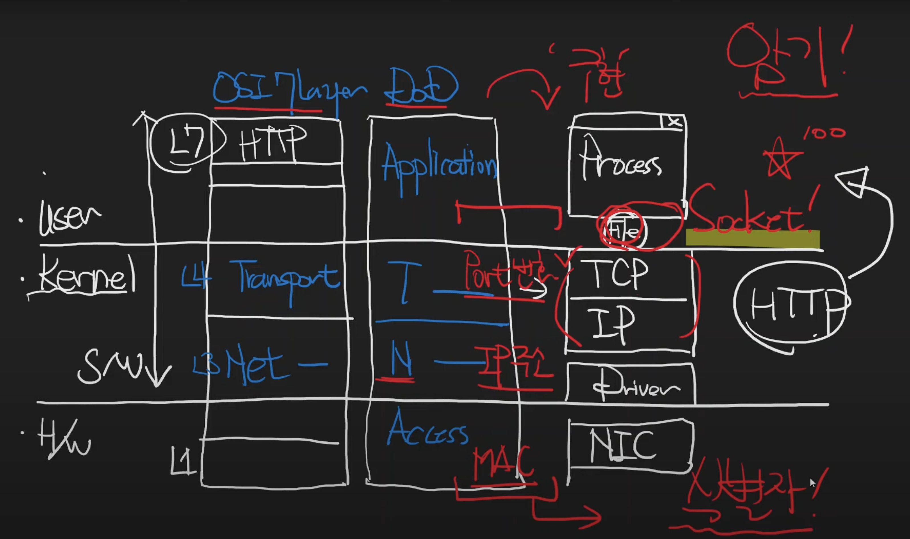
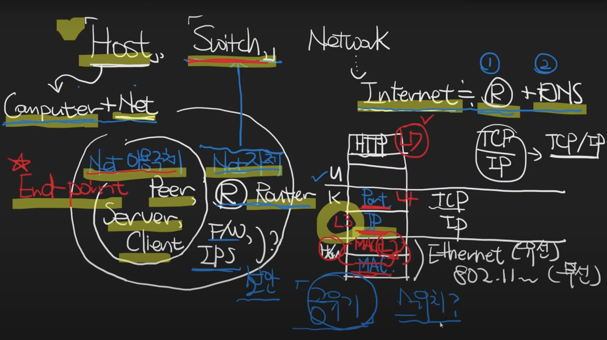

[네트워크를 배우려는 사람들을 위해](https://www.youtube.com/watch?v=k1gyh9BlOT8&list=PLXvgR_grOs1BFH-TuqFsfHqbh-gpMbFoy&index=2)

# \***\*네트워크를 배우려는 사람들을 위해\*\***

- 크게 보자면 User mode(S/W) / Kernel mode(S/W) / H/W
- 분류 방식, 주체에 따라 OSI 7 layer, DoD 4 layer(TCP/IP 4 layer)
- **Kernel의 구성요소를 유저모드 어플리케이션으로 추상화할 때는 File의 형태로 추상화하는데, 이때 이 File은 File이라고 부르지 않고 Socket이라고 부름**
- **각 계층의 식별자가 있음(Access → MAC, Network → IP 주소, Transport → Port 번호)**

# MAC주소, IP주소, Port번호가 식별하는 것

- MAC 주소는 NIC(LAN 카드)에 대한 식별자, IP 주소는 Host에 대한 식별자
- Host란 인터넷에 연결된 컴퓨터
- 랜카드는 유선, 무선이 있을 텐데 각각의 NIC은 MAC 주소가 부여되므로 노트북에 두 개의 랜카드가 있다면 두 개의 MAC 주소를 보유함
- 하나의 컴퓨터가 있다면 IP 주소가 몇 개나 있을까 → n개 → NIC 하나에 여러 개의 IP 주소를 바인딩할 수 있음
- MAC 주소는 하드웨어 주소인데, MAC 주소는 변경 가능한가 → 변경 가능
- Port 번호는 상황이나 처한 업무에 따라서(계층에 따라서) Process, Service, Interface 등 식별에 대한 대상이 달라짐

# Host, Switch, Network 이들의 관계에 대해…

- **Host → 컴퓨터인데 네트워크에 연결이 되어 있으면 Host, 네트워크에 연결된 컴퓨터**
- **Host가 Network 자체를 이루는 컴퓨터라면 Switch**
  - Router (경로 선정)
  - 방화벽, IPS (보안을 위한 스위치)
- **Host가 Network 이용 주체일 때는 End point (Peer, Server, Client)**
- Network → Internet는 Router와 DNS의 집합체
- 스위치는 레이어가 높을 수록 연산이 복잡해지고 당연하게도 고가
  - ex) L3 스위치 중 가장 대표적인 것이 Router
- 인터넷 공유기란 무엇인가 → 개념적 의미로 스위치라고 볼 수 있고 분류하자면 L3 스위치 정도

# IPv4주소 체계에 대한 암기사항

- IP(Internet Protocol) 주소 → Host에 대한 식별자
- IP 주소의 버전 → IPv4, IPv6
  - IPv4: 주소 길이 32bit → 가능한 주소가 대략 43억 개
  - IPv6: 주소 길이 128bit
- IP 주소는 8bit씩 끊어서 표시!
- IP 주소는 Network ID와 Host ID로 나뉨
- 이 Network ID를 나타내는 게 서브넷마스크
