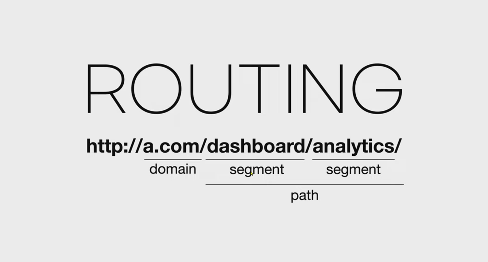
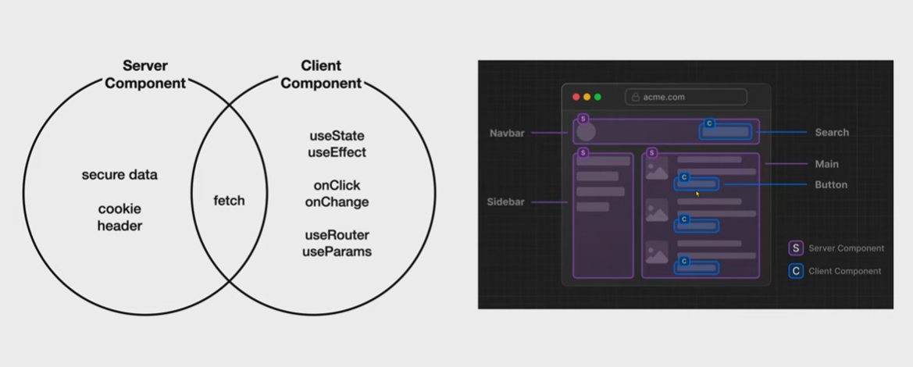

## \***\*설치와 실행\*\***

- `npx create-next-app@lastest .`

## 샘플앱 세탁

- `layout.js`에 `children`에는 `page.js`에서 return 값을 뿌려주는 구조

## 빌드와 배포

- 크롬 개발자도구의 Network 탭을 보면 해당 페이지를 로드할 때 가져오는 resources가 확인 가능함 (ex) 7.0 MB resources)
- 실서버에 사용할 코드는 좀 더 용량을 줄이고 최적화된 코드가 필요함 → 배포 버전
- `npm run build`를 통해 build하고 `npm run start`를 통해서 build된 결과물을 실행해보면 용량이 줄어들고 최적화됐다는 걸 확인 가능함(7.0 MB resources → 906 KB resources)

## 뼈대 만들기



- Next.js 13의 App router 구조에서는 라우팅 path에 따라서 해당 페이지를 찾는 구조로 되어 있음
  - 예컨대 ‘create’라는 segment가 있다면 app 폴더 밑에 ‘create’ 폴더가 있는지 찾음
  - ‘create’ 폴더 안에 약속된 page.js 파일을 찾음
  - 같은 경로에 약속된 layout.js 파일을 찾아서 children으로 랜더링
  - 같은 경로에 약속된 layout.js가 없다면 그 부모 요소에 layout.js를 찾아서 children으로 랜더링

## Single Page Application

- SSR의 단점이라고 할 수 있는데, 페이지의 일부 영역만 바뀌거나 이미 방문한 페이지를 다시 방문하더라도 전체 페이지를 다시 ssr을 통해 클라이언트로 가져옴 → 사용자 입장에선 느리다고 느낄 것이고 서비스를 제공하는 입장에선 돈이 많이 듬
- a tag 대신 <Link />를 사용함으로 SPA처럼 구성할 수 있음 → <Link />를 사용하면 사용자가 클릭하기도 전에 fetch를 하고, 이미 방문했던 페이지를 다시 방문하려고 하면 서버와 통신하지 않음
- 아래 3가지를 충족시켜줌
  - 링크를 클릭하면 페이지 전체 리로딩이 일어나지 않고 필요한 콘텐츠만 로딩하고 싶다.
  - 이미 방문한 페이지는 캐슁을 해서 다시 다운로드 하지 않도록 하고 싶다.
  - 미리 페이지를 로드했다가 실제 요청이 있을 때 클라이언트 측에서 즉시 응답한다.
- Link는 Next.js에서 SPA를 매우 쉽게 구현하도록 도와주는 도구

## **backend**

- json-server를 활용한 실습

  - `npx json-server --port 9999 --watch db.json`
  - db.json에 활용하고 싶으면 json data를 작성하고 저장하면 watch 때문에 재시작함

    ```json
    {
      "topics": [
        {
          "id": 1,
          "title": "html",
          "body": "html is ..."
        },
        {
          "id": 2,
          "title": "css",
          "body": "css is ..."
        }
      ],

      "posts": [
        {
          "id": 1,
          "title": "json-server",
          "author": "typicode"
        }
      ],
      "comments": [
        {
          "id": 1,
          "body": "some comment",
          "postId": 1
        }
      ],
      "profile": {
        "name": "typicode"
      }
    }
    ```

  - `fetch('http://localhost:9999/topics').then((response) => {return response.json()}).then(result => {console.log(result)});`

## **글 목록 가져오기**

- 사용자와 상호작용하는 영역은 클라이언트 컴포넌트, 단순히 보여주는 역할을 하는 영역은 서버 컴포넌트 구현이 유리함

  

- 서버 컴포넌트는 아래와 같은 경우에 사용합니다.
  - 사용자와 상호작용하지 않는 경우
  - 백엔드에 엑세스하면서 보안적으로 위험한 정보를 주고 받는 경우
- 클라이언트 컴포넌트는 아래와 같은 경우 사용합니다.

  - 서버 컴포넌트로 해결되지 않는 경우
  - 사용자와 상호작용하는 경우
  - useEffect, useState, onClick, onChange와 같은 API를 사용해야 하는 경우
  - useRouter, useParams와 같은 nextjs의 client component API를 사용하는 경우

- 클라이언트 컴포넌트 사용 사례

  - 최상단 `"use client";` 를 통한 클라이언트 컴포넌트 사용 선언
  - `metadata`는 서버 컴포넌트에서 사용하기에 주석 처리

    ```jsx
    "use client";

    import Link from "next/link";
    import "./globals.css";
    import { useEffect, useState } from "react";

    // export const metadata = {
    //   title: "Web tutorials",
    //   description: "Generated by gonasooc",
    // };

    export default function RootLayout({ children }) {
      const [topics, setTopics] = useState([]);

      useEffect(() => {
        fetch("http://localhost:9999/topics")
          .then((resp) => {
            return resp.json();
          })
          .then((result) => {
            setTopics(result);
          });
      }, []);
      return (
        <html>
          <body>
            <h1>
              <a href="/">WEB</a>
            </h1>
            <ol>
              {topics.map((topic) => {
                return (
                  <li key={topic.id}>
                    <Link href={`/read/${topic.id}`}>{topic.title}</Link>
                  </li>
                );
              })}

              {/* <li>
                <Link href="/read/2">css</Link>
              </li> */}
            </ol>
            {children}
            <ul>
              <li>
                <Link href="/create">Create</Link>
              </li>
              <li>
                <Link href="/update/1">Update</Link>
              </li>
              <li>
                <input type="button" value="delete" />
              </li>
            </ul>
          </body>
        </html>
      );
    }
    ```

- 서버 컴포넌트 전환

  - 함수 자체를 비동기로 처리하기 위해 `async` 선언

    ```jsx
    import Link from "next/link";
    import "./globals.css";

    export const metadata = {
      title: "Web tutorials",
      description: "Generated by gonasooc",
    };

    export default async function RootLayout({ children }) {
      const resp = await fetch("http://localhost:9999/topics");
      const topics = await resp.json();
      return (
        <html>
          <body>
            <h1>
              <a href="/">WEB</a>
            </h1>
            <ol>
              {topics.map((topic) => {
                return (
                  <li key={topic.id}>
                    <Link href={`/read/${topic.id}`}>{topic.title}</Link>
                  </li>
                );
              })}

              {/* <li>
                <Link href="/read/2">css</Link>
              </li> */}
            </ol>
            {children}
            <ul>
              <li>
                <Link href="/create">Create</Link>
              </li>
              <li>
                <Link href="/update/1">Update</Link>
              </li>
              <li>
                <input type="button" value="delete" />
              </li>
            </ul>
          </body>
        </html>
      );
    }
    ```

- 서버 컴포넌트 사용의 장점
  - 간결한 코드: useEffect와 useState와 같은 훅을 사용하지 않아도 되므로, 코드가 더 간결하고 이해하기 쉬워집니다. 이로 인해 코드 유지 관리가 쉬워지고, 버그 발생 확률이 줄어들 수 있습니다.
  - 빠른 데이터 엑세스: 데이터베이스와 같은 자원에 접근해야 하는 경우, 서버 컴포넌트는 서버와 데이터베이스가 가까운 위치에서 작동하므로, 더 빠른 속도로 필요한 데이터에 접근할 수 있습니다.
  - 보안: 서버 컴포넌트는 클라이언트에 민감한 정보(예: 데이터베이스 비밀번호)를 전송하지 않습니다. 이로 인해, 필요한 작업을 안전하게 처리하면서 동시에 클라이언트의 보안을 유지할 수 있습니다.
  - 향상된 성능: 서버 컴포넌트는 클라이언트로 JavaScript 코드를 전송하지 않습니다. 이는 전송되는 데이터의 양을 줄이고, 클라이언트의 부하를 줄임으로써 웹사이트의 전반적인 성능을 향상시키는데 도움이 됩니다.

## 읽기 기능 구현

```jsx
import React from "react";

const Read = async (props) => {
  const resp = await fetch(`http://localhost:9999/topics/${props.params.id}`);
  const topic = await resp.json();

  return (
    <>
      <div>{topic.title}</div>
      {topic.body}
    </>
  );
};

export default Read;
```

## 생성 기능 구현

```jsx
"use client";

import { useRouter } from "next/navigation";
import React from "react";

const Create = () => {
  const router = useRouter();

  return (
    <form
      onSubmit={(event) => {
        event.preventDefault();
        const title = event.target.title.value;
        const body = event.target.body.value;
        const options = {
          method: "POST",
          headers: {
            "Content-Type": "application/json",
          },
          body: JSON.stringify({ title, body }),
        };
        fetch(`http://localhost:9999/topics`, options)
          .then((res) => res.json())
          .then((result) => {
            console.log(result);
            const lastId = result.id;
            router.push(`/read/${lastId}`);
          });
      }}
    >
      <p>
        <input type="text" name="title" placeholder="title" />
      </p>
      <p>
        <textarea
          name="body"
          placeholder="body"
          id=""
          cols="30"
          rows="10"
        ></textarea>
      </p>
      <p>
        <input type="submit" value="create" />
      </p>
    </form>
  );
};

export default Create;
```

## cache

- `fetch` 명령을 사용하게 되면 Next.js는 기본적으로 우리가 한번 가져온 정보를 `.next` 안에 저장해둠
- `cache: MISS` → 캐시 미사용, 캐시 재생성 / `cache: HIT` → 캐시 사용
- Next.js의 revalidating을 통해 캐시를 재성성할 수 있지만,
  - https://nextjs.org/docs/app/building-your-application/data-fetching/fetching-caching-and-revalidating
- 성능을 조금 희생하겠지만 단순하고 간단하게 글 생성 시 캐시를 생성하지 않을 수도 있음
  ```jsx
  import Link from "next/link";
  import "./globals.css";
  import { Control } from "./Control";

  export const metadata = {
    title: "Web tutorials",
    description: "Generated by gonasooc",
  };

  export default async function RootLayout({ children }) {
    const resp = await fetch("http://localhost:9999/topics", {
      cache: "no-store",
    });
    const topics = await resp.json();
    return (
      <html>
        <body>
          <h1>
            <a href="/">WEB</a>
          </h1>
          <ol>
            {topics.map((topic) => {
              return (
                <li key={topic.id}>
                  <Link href={`/read/${topic.id}`}>{topic.title}</Link>
                </li>
              );
            })}
          </ol>
          {children}
          <Control />
        </body>
      </html>
    );
  }
  ```

## 필요할 때 update, delete 기능 보이기

- 전체 영역에서 클라이언트 컴포넌트에서 사용 가능한 훅을 사용하고 싶을 때는 그 영역만 컴포넌트화해서 ‘use client’ 로 사용하는 것이 좋다 → 전체 영역을 클라이언트 컴포넌트로 전환해버리면 서버 컴포넌트가 주는 장점을 활용할 기회가 사라지기 때문
- VSCode에서 블록 영역으로 잡고 `Move to a new file`을 누르면 해당 파일이 새로운 파일로 만들어지고 자동으로 `import` 처리해줌
  ```jsx
  "use client";

  import Link from "next/link";
  import { useParams } from "next/navigation";

  export function Control() {
    const params = useParams();
    const id = params.id;
    return (
      <ul>
        <li>
          <Link href="/create">Create</Link>
        </li>
        {id ? (
          <>
            <li>
              <Link href={`/update/${id}`}>Update</Link>
            </li>
            <li>
              <input type="button" value="delete" />
            </li>
          </>
        ) : null}
      </ul>
    );
  }
  ```

## **수정 기능 구현**

- 수정이 완료되었는데도 변경이 되지 않는다면 `cache` 기능을 살펴봐야 함 → 리스트나 상세 정보 `fetch`할 때 `cache`를 끄거나 아니면 별도의 `revalidating` 처리
  ```jsx
  "use client";

  import { useParams, useRouter } from "next/navigation";
  import React, { useEffect, useState } from "react";

  const Update = () => {
    const [title, setTitle] = useState("");
    const [body, setBody] = useState("");

    const router = useRouter();
    const params = useParams();
    const id = params.id;
    useEffect(() => {
      fetch(`http://localhost:9999/topics/${id}`)
        .then((resp) => resp.json())
        .then((result) => {
          setTitle(result.title);
          setBody(result.body);
          // console.log(result);
        });
    }, []);

    return (
      <form
        onSubmit={(event) => {
          event.preventDefault();
          const title = event.target.title.value;
          const body = event.target.body.value;
          const options = {
            method: "PATCH",
            headers: {
              "Content-Type": "application/json",
            },
            body: JSON.stringify({ title, body }),
          };
          fetch(`http://localhost:9999/topics/${id}`, options)
            .then((res) => res.json())
            .then((result) => {
              console.log(result);
              const lastId = result.id;
              router.refresh();
              router.push(`/read/${lastId}`);
            });
        }}
      >
        <p>
          <input
            type="text"
            name="title"
            placeholder="title"
            value={title}
            onChange={(event) => {
              setTitle(event.target.value);
            }}
          />
        </p>
        <p>
          <textarea
            name="body"
            placeholder="body"
            id=""
            cols="30"
            rows="10"
            value={body}
            onChange={(event) => {
              setBody(event.target.value);
            }}
          ></textarea>
        </p>
        <p>
          <input type="submit" value="update" />
        </p>
      </form>
    );
  };

  export default Update;
  ```

## 삭제 **기능 구현**

```jsx
"use client";

import Link from "next/link";
import { useParams } from "next/navigation";
import { useRouter } from "next/navigation";

export function Control() {
  const params = useParams();
  const router = useRouter();
  const id = params.id;
  return (
    <ul>
      <li>
        <Link href="/create">Create</Link>
      </li>
      {id ? (
        <>
          <li>
            <Link href={`/update/${id}`}>Update</Link>
          </li>
          <li>
            <input
              type="button"
              value="delete"
              onClick={() => {
                const options = { method: "DELETE" };
                fetch(`http://localhost:9999/topics/${id}`, options)
                  .then((resp) => resp.json())
                  .then((result) => {
                    router.push("/");
                    router.refresh();
                  });
              }}
            />
          </li>
        </>
      ) : null}
    </ul>
  );
}
```

## 환경변수 & 졸업

- 개발 환경과 실 서버에서 사용하는 API 주소가 다를 수 있음 → 그래서 소스 코드에서 분리 후 별도로 관리할 필요성이 생김 → ‘환경 변수’
  https://nextjs.org/docs/pages/building-your-application/configuring/environment-variables
- 루트에 `.env.local` 파일 생성
  ```
  API_URL=http://localhost:9999/
  ```
- 서버 컴포넌트에서 호출
  ```jsx
  const resp = await fetch(`${process.env.API_URL}topics`, {
    cache: "no-store",
  });
  const topics = await resp.json();
  ```
- 클라이언트 컴포넌트에서 동일하게 호출하면 `undefined` → 기본적으로 환경 변수는 `DB_PASS` 와 같은 보안이 필요한 정보가 들어 있을 가능성이 높음 → 그래서 클라이언트 컴포넌트에서 호출되면 바로 브라우저에 노출되기 때문에 환경 변수는 서버 컴포넌트에서만 접속이 가능함
- 만약 브라우저를 위한 환경 변수를 선언하고자 하면 `NEXT_PUBLIC`을 접두어로 붙이면 됨
  ```
  NEXT_PUBLIC_API_URL=http://localhost:9999/
  ```
