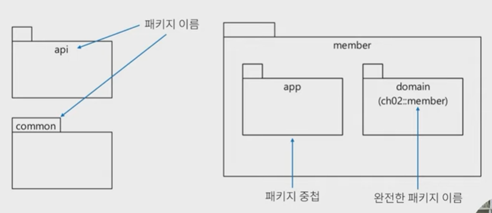
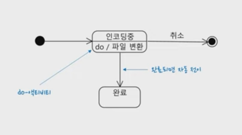

[UML 기초 01 - 클래스 다이어그램](https://www.youtube.com/watch?v=HG0dwNnTsII&list=PLwouWTPuIjUgd-1167R5_6gTBsp_9cfu3)

# UML 기초 01 - 클래스 다이어그램

## UML

- Unified Modeling Language
- 그래픽 표기법
- 여러 다이어그램 정의
    - 클래스D, 패키지D, 객체D, 시퀸스D, 액티비티D, 컴포넌트D, 배치D, …
- 소프트웨어 시스템 표현, 설계에 사용
- 의사소통 도구로 활용하기 좋음

## 클래스 다이어그램

- 객체의 타입을 표현
- 타입 간의 정적 관계 기술
- 설계할 때 자주 사용하는 다이어그램 중 하나

## 클래스, 속성(attribute), 오퍼레이션(operation)

- 표시방법
    
    
    
    - 속성은 클래스의 필드처럼 생각, 오퍼레이션은 메소드에 대응한다고 보면 조금 쉽게 이해
    

## 속성 표기법

- 가시성 이름 : 타입 = 기본값
- 가시성: +(public), -(private), #(protected), ~(package)
- 언어마다 다르기 때문에 언어에 맞게 잘 표기하면 됨
    
    
    

## 오퍼레이션 표기법

- 가시성 이름(매개변수 목록): 리턴타입
    
    
    

## 연관(association)

- 객체 간의 구조적 관계를 표현함
    
    
    

## 연관 탐색(navigation)

- 실선에 화살표를 이용해서 탐색 가능 방향 지정
    - 양쪽에 모두 지정하지 않으면 양방향 탐색 의미
        
        
        

## 의존(dependency)

- 사용 관계를 표현
    - A가 변할 때 A를 사용하는 B도 변할 때 B가 A에 의존
    - 점선으로 표시
        
        
        

## 인터페이스, 추상 클래스

## aggregation, composition

## 정리

- 클래스 다이어그램은 정적인 구조를 표현
- 전달하고자 하는 내용 위주로 표시
    - 반드시 모든 것을 다 표시해야 하는 것은 아님
        - UML로 완벽하게 표현할 수도 없음

# UML 기초 02 - 패키지 다이어그램

## 패키지 다이어그램

- 패키지: UML의 구성 요소를 더 높은 수준에서 묶을 수 있는 단위
    - 다양한 다이어그램에서 활용 가능
    - 상위 수준 구조 분석에 용이
- 예시
    
    
    

## 구성 요소 함께 표현

## 패키지 간 관계

## 정리

- 패키지 다이어그램은 정적인 구조를 표현
- 전체 모듈의 구조적 관계 파악에 용이
- 관련된 것들을 묶어서 표현하기에 용이

# UML 기초 03 - 시퀸스 다이어그램

## 시퀸스 다이어그램

- 동적 측면을 모델링
- 시간 순서에 따른 상호 작용을 표현
    - 커뮤니케이션 다이어그램은 구조적 관점에서 상호 작용
- 예시
    
    
    
    
    
    
    

## 정리

- 시퀸스 다이어그램은 동적 측면을 표현
- 시간 순서에 따라 구성 요소 간 상호 작용을 표현하기에 적합
- 코드 수준에서 모든 상세함을 표시하려고 하면 안 됨

# UML 기초 04 - 상태 다이어그램

## 상태 다이어그램

- 동적 측면을 시각화
- 상태 종류와 상태 변화를 표현
    - 예: 주문 - 결제대기, 결제완료, 취소, 배소중, 배송완료
- 예시
    
    
    
    
    
    
    

## 정리

- 상태 다이어그램은 조건/기능에 따른 상태 변화를 이해할 때 유용
    - 코드로만 보면 일부 전이만 이해할 수 있기 때문에 상태 다이어그램을 통해 전체 변화 이해

# UML 기초 05 - 액티비티 다이어그램

## 액티비티 다이어그램

- 로직, 절차, 흐름을 기술(플로우 차트와 유사) / 업무 프로세스, 코드 실행 로직을 표현할 때 주로 사용
- 초기 노드(initial node), 액션(action - 뭘 하는 것), 제어 흐름(control flow), 끝 노드(final node)
    
    
    
- 결정 노드(decision node), 조건(guard condition), 병합 노드(merge node) - 병합 노드는 생략할 때도 있음
    
    
    
- 포크 노드(fork node - 동시에 처리되는 것, 병렬로 실행됐다가 다시 그것들이 모여서 다 끝날 때까지 기다렸다가 이어서 나갈 때), 조인 노드(join node)
    
    
    
- 확장 영역(expansion region - 뭔가 목록을 조회하고 각 목록에 담겨 있는 어떤 항목을 loop를 돌면서 처리하는 걸 표현하고자 할 때 사용), 확장 노드(expansion node)
    
    
    
- 파티션(partition - 각각의 액션이나 이런 것들이 어느 영역을 통해서 실행이 되는지 구분하고자 할 때, 조금 더 표현력이 올라감)
    
    
    
- 액티비티 다이어그램은 흐름, 병렬 실행을 표현할 때 유용 → 업무 흐름 분석 및 실행 흐름을 파악할 때 사용

# UML 기초 06 - 컴포넌트 다이어그램

## 컴포넌트 다이어그램

- Component Diagram
- 구성 요소의 관계를 컴포넌트 단위로 표현할 때 사용
- 컴포넌트란, 시스템의 한 부분, 교체 가능한 부분, 인터페이스 구현
- 예시
    
    
    
    
    
    
    
    
    

## 정리

- 상위 수준에서 구성 요소를 표현할 때 유용
    - 개인적으론 AS-IS를 프로세스 수준에서 정리할 때 사용
        - C4 모델의 컨테이너와 컴포넌트에 대응하는 요소를 표현하기에 적합