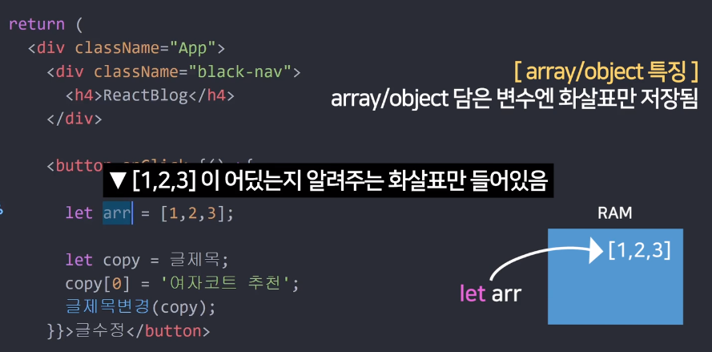
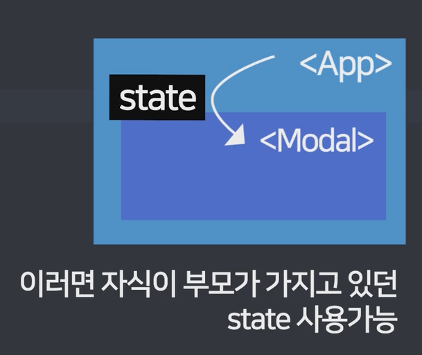
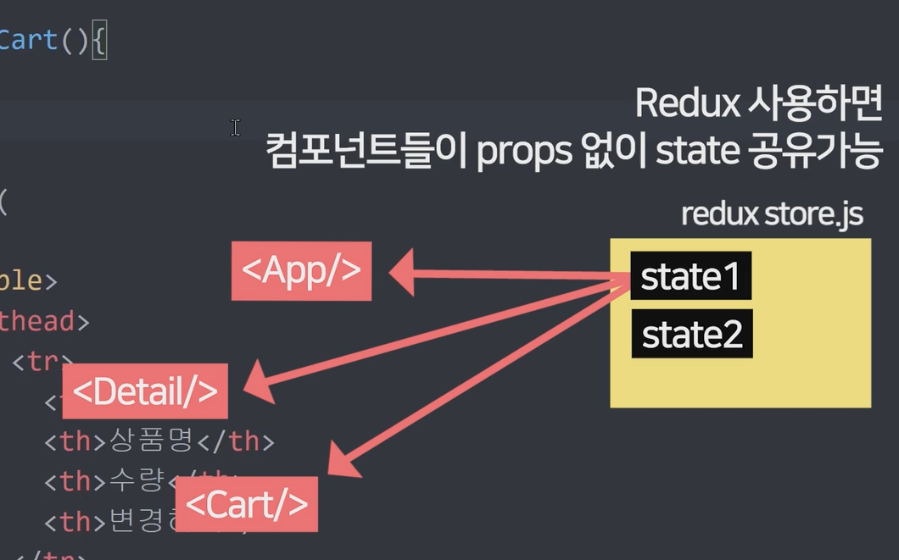
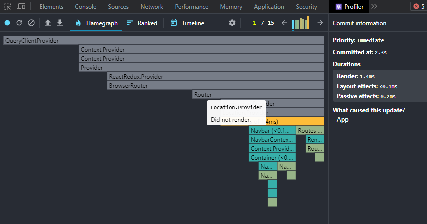
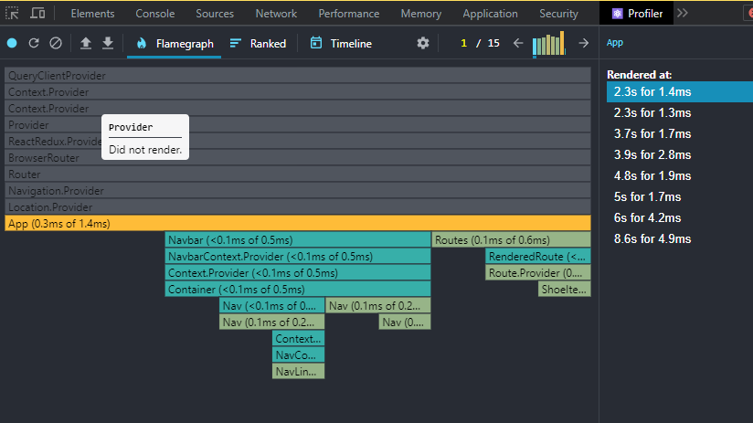
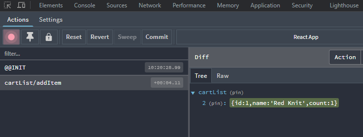

# Part 1 : 블로그 제작 & 기초 문법

## **React 배우기 전에 쓰는 이유부터 알아야**

- Single Page Application
- html 재사용성 좋음
- 동일한 문법으로 앱개발 가능(React Native)

## **리액트 React 설치와 개발환경 셋팅**

- public 폴더: static 파일 모아놓는 곳
- src 폴더: 코드 짜는 곳

## **리액트에서 레이아웃 만들 때 쓰는 JSX 문법 3개**

- react는 jsx 사용 → .js파일에서 쓰는 html 대용품
- 리액트에서 <div>를 만들기 위해선 React.createElement(’div’, null, ‘Hello World) 같은 걸로 작성 → 그걸 편리하게 작성하기 위해서 나온 게 JSX
- **JSX 문법**
    - html에 class 넣을 땐 className → JSX도 일종의 자바스크립트라서 자바스크립트에서 사용하는 예약어인 class라는 키워드를 막 사용하면 안됨
    - 데이터바인딩은 {중괄호}
    - style은 object 형태로 중괄호 안에 작성 ex) style={{스타일명: ‘값’}}, 하이픈(-)은 js에서 뺄셈으로 인식되기 때문에 camelCase로 작성 ex) font-size(X), fontSize(O)
    

## ****중요한 데이터는 변수말고 state에 담습니다****

- return () 안에는 병렬로 태그 2개 이상 기입금지 ex) 하나의 div 안에 모든 태그 요소들이 들어가 있어야 함, #.vue 파일 안에서 html 선언하는 것과 동일
- state 생성법
    1. *`import* { useState } *from* 'react';`
    2. `useState(보관할자료)`
    3. `let [작명, 작명] = useState('남자 코트 추천');` → Destructuring 문법
- Destructuring 문법
    - 배열 안에 각각의 요소를 별도의 변수 안에 담음
        
        ```jsx
        let num = [1, 2];
        
        let [a, c] = [1, 2];
        // let a = num[0];
        // let c = num[1];
        ```
        
- Q. 왜 state 써야함? → state를 쓰는 이유는 해당 데이터가 변동됐을 때 html 자동 재랜더링하기 위함 → state 쓰던 html은 자동 재랜더링됨
- Q. state 언제 써야함? → 변동시 자동으로 html에 반영되게 만들고 싶으면 state 사용 → 가급적 변동될 일이 없는 거의 정적인 데이터는 굳이 state 사용하지 않아도 됨

## ****버튼에 기능개발을 해보자 & 리액트 state변경하는 법****

- 터미널에 warning 메세지를 신경 쓰이면 최상단에 `/* *eslint-disable* */` 추가해주면 경고 메세지 미출력
- JSX에서 event handler 처리할 때는 역시 하이픈(-) 없이 camelCase로 작성
- **onClick={} 안엔 함수 이름을 넣어야 함**
- **state는 등호로 변경할 수 없음 → state변경함수(새로운state) 형식으로 변경**

## **array, object state 변경하는 법**

- 확장성이 없는 방법
    
    ```jsx
    <span onClick={function() {
      글제목변경(['여자 코트 추천', '강남 우동맛집', '파이썬독학'])
    }}>👩</span>
    ```
    
- 확장성은 있으나 관습이 없는 방법
    - **array/object 다룰 때는 원본을 보존하는 게 좋음(관습적)**
        
        ```jsx
        <span onClick={function() {
            글제목[0] = '여자 코트 추천';
            글제목변경(글제목);
          }}>👩</span>
        ```
        
- 관습적으로 원본을 보존하는 방법
    
    ```jsx
    <span onClick={function() {
      let copy = [...글제목];
      copy[0] = '여자 코트 추천';
      글제목변경(copy);
    }}>👩</span>
    ```
    
- state변경함수 특징
    - 기존state == 신규state 의 경우 변경안해줌 → 일종의 리소스 절약
    - array/object 특징
        
        
        
    
    - 변수1 & 변수2(copy) 화살표가 같으면 변수1 == 변수2 비교해도 true 나옴
    - array, object는 reference data type이라서 그럼
    - `let **copy **= **[...글제목];` 이런 형식으로 적었을 때 되는 이유는 ‘화살표를 바꿔주세요’ 라는 뜻이기 때문 → 괄호를 벗겨주세요 + 괄호를 다시 씌워주세요 → 완전히 독립적인 array 사본이 생성됨 → 화살표도 변경
    - **빡대가리식 정리: state가 array/object면 독립적 카피본(shallow copy)을 만들어서 수정해야 함**
    - 글제목을 가나다식으로 정렬
        
        ```jsx
        // import logo from './logo.svg';
        import './App.css';
        import { useState } from 'react';
        
        function App() {
          
          let [글제목, 글제목변경] = useState(['남자 코트 추천', '강남 우동맛집', '파이썬독학']);
          let [따봉, 따봉변경] = useState(0)
          // let [작성일, set작성일] = useState(['2월 17일 발행', '3월 17일 발행', '4월 17일 발행']);
        
          // const list = [];
          // for(let i = 0; i < 글제목.length; i++) {
          //   list.push(<div key={i} className="list">
          //   <h4>{ 글제목[i] }</h4>
          //   <p>{ 작성일[i] }</p>
          // </div>)
          // }
        
          return (
            <div className="App">
              <div className="black-nav">
                <h4 style={{color: 'red', fontSize: '20px'}}>ReactBlog</h4>
              </div>
                <span onClick={function() {
                  let copy = [...글제목];
                  copy[0] = '여자 코트 추천';
                  글제목변경(copy);
                }}>👩</span>
                <button type="button" onClick={function() {
                  let copy = [...글제목];
                  copy.sort();
                  글제목변경(copy);
                }}>가나다순정렬</button>
                <div className="list">
                  <h4>{ 글제목[0] } <span onClick={ () => {
                    따봉변경(따봉+1)
                  } }>👍</span>{따봉}</h4>
                  <p>2월 17일 발행</p>
                  
                </div>
                <div className="list">
                  <h4>{ 글제목[1] }</h4>
                  <p>2월 17일 발행</p>
                </div>
                <div className="list">
                  <h4>{ 글제목[2] }</h4>
                  <p>2월 17일 발행</p>
                </div>
            </div>
          );
        }
        
        export default App;
        ```
        

## **Component : 많은 div들을 한 단어로 줄이고 싶으면**

- html 길어지면 가독성이 떨어지기 때문에 component를 통해서 좀 더 가독성 있게 표현할 수 있음
- **컴포넌트 만드는 법**
    1. function 만들고
    2. return () 안에 html 담기(단, 하나의 tag로 시작해서 하나의 tag로 끝나야 한다)
    3. <함수명></함수명> 쓰기
    - 안쪽에 element를 병렬로 구성하고 싶다면 또 하나의 div로 묶어서 그룹화하고 병렬 구성을 할 수도 있지만 react에서는 fragment 문법을 통해 <></> 빈 태그로 묶어서 구현할 수도 있음
        
        [https://ko.reactjs.org/docs/fragments.html](https://ko.reactjs.org/docs/fragments.html)
        
    
- **어떤 걸 컴포넌트로 만들면 좋은가**
    - 반복적인 html 축약할 때
    - 큰 페이지들
    - 자주 변경되는 것들
    - ***컴포넌트를 사용하는 데에는 책임이 따름**

- **컴포넌트의 단점**
    - state 가져다 쓸 때 문제가 생김(불편함이 생김)
        - JavaScript에서는 다른 함수에 있는 변수를 맘대로 가져다 쓸 수가 없음, 변수의 범위가 함수이기 때문

- **컴포넌트 만드는 법 2**
    - `const Modal = () ⇒ { return ()}` 처럼 변수를 먼저 선언하고 함수를 넣어도 됨
    - 장점이라면, const로 만들어놓으면 실수로 수정했을 때 바로 확인 가능
    

## **리액트 환경에서 동적인 UI 만드는 법 (모달창만들기)**

- 동적인 UI 만드는 step
    1. html, css를 통해 미리 디자인된 요소 완성
    2. UI의 현재 상태를 state로 저장
    3. 해당 state에 따라 UI가 어떻게 보일지 작성
        - 중괄호 안쪽에서는 if문을 사용할 수 없기 때문에 삼항연산자로 조건 선언
            
            ```jsx
            { modal ? <Modal /> : null }
            ```
            
    
    - 토글을 넣고자 할 때
        
        ```jsx
        <h4 onClick={function() {
          if(modal) {
            setModal(false);
          } else {
            setModal(true);
          }
        }}>{ 글제목[2] }</h4>
        ```
        
    

## **map : 많은 div들을 반복문으로 줄이고 싶은 충동이 들 때**

- 모든 array 자료형 뒤에는 map()을 붙일 수 있음
- map 함수 안에서 callback 함수를 받음
    
    ```jsx
    [1, 2, 3].map
    ```
    

- **주요 3가지 기능**
    - array 자료 갯수만큼 함수 안의 코드를 실행해줌
    - 함수의 parameter는 array 안에 있던 자료임
    - callback 함수 안쪽에 return에 값을 선언해주면 array로 담아줌
    - (+) 두번째 parameter 해당 자료들의 index값으로 활용 가능
    
- 중괄호 안에서는 for문을 쓸 수 없지만 map함수는 사용 가능
    - react 상에서 주로 선언하는 방식(vue에서 v-for와 비슷)
        
        ```jsx
        { [1,2,3].map(function() {
            return (
              <div className="list">
                <h4>{ 글제목[1] }</h4>
                <p>2월 17일 발행</p>
              </div>
            )
          })
        }
        ```
        

- 일반적인 for문으로 담고 싶다면,
    
    ```jsx
    function App (){
      
      var 어레이 = [];
      for (var i = 0; i < 3; i++) {
        어레이.push(<div>안녕</div>)
      }
      return (
        <div>
          { 어레이 }
        </div>
      )
    }
    ```
    

## **자식이 부모의 state 가져다쓰고 싶을 때는 props**

- JavaScript에서는 다른 함수에 있는 변수를 맘대로 가져다 쓸 수가 없음, 변수의 범위가 함수이기 때문
- #항상 props를 선언할 때는 부모와 자식 구조를 먼저 떠올려보고 접근하면 좋음
- 자식 컴포넌트는 부모의 state를 활용할 수 있음 → 전송할 땐 props라는 문법을 사용함
    
    
    
- 자식에서 부모로, 혹은 형제 요소끼리는 props를 사용할 수 없음
- **props 사용하는 법**
    1. 자식 컴포넌트로 가서 <자식컴포넌트 **작명**={state이름}> 형식으로 자식컴포넌트에 작명하기
        
        ```jsx
        { modal ? <Modal 작명={글제목} /> : null }
        ```
        
    2. 자식 컴포넌트 선언부로 가서 props라는 parameter 등록 후 props.작명 사용

- 컴포넌트가 많아지면 props를 별도로 선언해줘야 해당 state를 활용할 수 있기 때문에 귀찮아짐

## **props를 응용한 상세페이지 만들기**

- *state 만드는 곳은 state 사용하는 컴포넌트들 최상위 컴포넌트에 선언하는 것이 좋음 → 자식 요소에서 부모 요소로 props를 사용할 수 없기 때문 → 생각 귀찮으면 App에 만드는 것이 좋음

```jsx
let [title, setTitle] = useState(null);

...

<h4 onClick={ function() {
  setTitle(i);
  setModal(!modal);
}}>{ 글제목[i] }
  <span onClick={ () => {
    let copy = [...따봉];
    copy[i] = copy[i] + 1;
    따봉변경(copy);
  } }>👍</span>{따봉[i]}
</h4>

...

{ modal ? <Modal 글제목={글제목} title={title} /> : null }

...

function Modal(props) {
  return (
    <div className="modal">
      <h4>{props.글제목[props.title]}</h4>
      <p>날짜</p>
      <p>상세내용</p>
      <button type="button">글수정</button>
    </div>
  )
}
```

## **input 1 : 사용자가 입력한 글 다루기**

- 클릭이벤트는 상위html로 퍼짐(이벤트 버블링) #Vue는 `click.stop`으로 해당 버블링을 막음 → React나 순수 js에서는 `event.stopPropagation()` 을 통해서 버블링 막을 수 있음
- 사용자가 입력한 글을 변수에 저장하기 위해선 역시 비슷하게 state로 다루면 됨 -> `let [입력값, 입력값변경] = useState('');` 선언하고 event.target.value를 해당 변수에 state변경함수를 통해서 담아줌
- 하기 코드에서 `console.log`가 먼저 실행되고 state 변경함수가 더 늦게 처리됨 → 비동기처리 되게끔 짜여져 있는데 React가 그렇게 짜여져 있음
    
    ```jsx
    <input onChange={(e) => {
      입력값변경(e.target.value);
    	console.log(입력값);
    }} type="text"></input>
    ```
    

## **input 다루기 2 : 블로그 글발행 기능 만들기**

- #값을 뒤에 담고 싶으면 `array.push()` / 앞에 담고 싶으면 `array.unshift()`

## **class를 이용한 옛날 React 문법**

- class 문법으로도 컴포넌트 생성 가능(단, 최근에는 function으로 거의 생성)
- class 문법은 변수와 함수를 많이 보관 가능한 일종의 보관함 개념으로 이해하면 편함
- class 문법에서는 state를 갈아 치우는 게 아니라 변경된 것만 반영해주는 형식
    
    ```jsx
    class Modal2 extends React.Component {
      constructor() {
        super();
        this.state = { // state 선언
          name: 'Kim',
          age: 20
        }
      }
      render() {
        return (
          <div>안녕 {this.state.name}
            <button type="button" onClick={() => {
              this.setState({name: 'Choi'}); // state 변경
            }}>버튼</button>
          </div>
        )
      }
    }
    ```
    

## **만든 리액트 사이트 build & Github Pages로 배포해보기**

- #기본적으로 react는 build할 때 파일의 경로가 절대경로로 잡혀 있음
- #static 파일들을 상대 경로롤 인지할 수 있게 빌드를 해줘야 함
- #package.json에 homepage key를 추가
    
    ```jsx
    {
      // ...
      "homepage": ".",
      // ...
    }
    ```
    
    [https://velog.io/@aejin24/React-상대경로-build](https://velog.io/@aejin24/React-%EC%83%81%EB%8C%80%EA%B2%BD%EB%A1%9C-build)
    

# Part 2 : 쇼핑몰 프로젝트

## **새로운 프로젝트 생성 & Bootstrap 사용하기**

- bootstrap 사용, 해당 컴포넌트 사용하기 위해선 import 해줘야 함

## **이미지 넣는 법 & public 폴더 이용하기**

- css파일에서 src폴더의 이미지 넣을 땐 ./이미지경로
- html에서 src폴더의 이미지 넣을 땐 `import 작명 from ‘이미지경로’` ex) `import bg from './img/bg.png';`
- import 후에 inline-style로 작성 가능
    
    ```jsx
    import bg from './img/bg.png';
    
    <div className="main-bg" style={{backgroundImage: `url(${bg})`}}></div>
    ```
    
- src폴더에 있는 이미지는 별도로 import를 각각 해줘야 하기 때문에 public 폴더에도 이미지 보관 가능함
- 리액트는 사이트 발행 전에 html js css 파일을 압축함 (bundling) → 하지만 public 폴더 안에 있던 건 압축되지 않음, 고로 그대로 쓸 수 있음
- 서브 경로를 통해서 발행하고자 할 땐 src 경로를 다시 잡아줘야 하는 문제가 있음 → 때문에 env를 사용해서 경로를 잡아주는 것을 권장함
    
    ```jsx
    render() {
      // Note: this is an escape hatch and should be used sparingly!
      // Normally we recommend using `import` for getting asset URLs
      // as described in “Adding Images and Fonts” above this section.
      return ;
    }
    ```
    
    [Using the Public Folder | Create React App](https://create-react-app.dev/docs/using-the-public-folder/)
    

## **코드 길어지면 import export 하면 됩니다**

- 선언된 정적인 자료는 긴 경우에 변수로 바로 선언하면 코드가 너무 길어지기 때문에, 해당 자료는 별도의 js 파일에 저장하고 `import/export` 문법으로 가져올 수 있음
- 해당 별도의 js 파일에서 `export` 먼저 하고, 그 다음에 가져다 쓸 곳에서 `import`
    
    ```jsx
    // data.js
    let a = 10;
    
    export default a;
    
    // App.js
    import 작명 from './data.js';
    ```
    
- 두 개 이상의 데이터 export → import 하는 데에서 따로 작명할 수 없음, 변수명 그대로 가져옴
    
    ```jsx
    // data.js
    let a = 10;
    let b = 100;
    
    export {a, b};
    
    // App.js
    import {a, b} from './data.js';
    ```
    

## **리액트 라우터 1 : 셋팅이랑 기본 라우팅**

- 기존 html 환경에서 페이지 나누는 법(프레임워크 없이)
    1. html 파일 만들어서 상세페이지 내용 채움
    2. 누가 /detail로 접속하면 html 파일 보내줌

- React 환경에서 페이지 나누는 법
    - SPA(Single Page Application) 환경으로 index.html만 사용함
    1. 컴포넌트 만들어서 상세페이지 내용 채움
    2. 누가 /detail로 접속하면 html은 그대로고 그 컴포넌트 보여줌 
    - 별도로 짤 수도 있지만 코드가 길어지기 때문에 react-router-dom라는 라이브러리 사용
    
- react-router-dom 설치법
    - npm install react-router-dom@6
    - index.js에 새로 import하고 `<App />` 컴포넌트를 감싸면 됨
        
        ```jsx
        import React from 'react';
        import ReactDOM from 'react-dom/client';
        import './index.css';
        import App from './App';
        import reportWebVitals from './reportWebVitals';
        **import { BrowserRouter } from 'react-router-dom';**
        
        const root = ReactDOM.createRoot(document.getElementById('root'));
        root.render(
          <React.StrictMode>
            **<BrowserRouter>
              <App />
            </BrowserRouter>**
          </React.StrictMode>
        );
        
        // If you want to start measuring performance in your app, pass a function
        // to log results (for example: reportWebVitals(console.log))
        // or send to an analytics endpoint. Learn more: https://bit.ly/CRA-vitals
        reportWebVitals();
        ```
        
    - App.js에 별도의 import하고 <Routes>와 <Route> 컴포넌트를 통해서 사용
        
        ```jsx
        import { Routes, Route, Link } from 'react-router-dom';
        
        ...
        
        <Routes>
          <Route path="/" element={
            <div>
              <div className="main-bg"></div>
        
              <div className="container">
                <div className="row">
                  {shoes.map(function (item) {
                    return (
                      <div className="col-md-4" key={item.id}>
                        <ShoeItem item={item} />
                      </div>
                    )
                  })}
                </div>
              </div>
            </div>} />
          <Route path="/detail" element={
            <ItemDetail />
          } />
        </Routes>
        ```
        
    
    ## **리액트 라우터 2 : navigate, nested routes, outlet**
    
    - React의 폴더 구조 → 비슷한 파일끼리 폴더로 잘 묶는 게 끝..
    1. 페이지 이동 도와주는 `useNavigate()` → 페이지 이동기능을 만들고 싶으면 사용
        
        ```jsx
        // 상단에 useNavigate 사용 import 후에,
        import { Routes, Route, Link, useNavigate, Outlet } from 'react-router-dom';
        
        // onClick 이벤트 통해서 해당 path 선언
        <Nav.Link onClick={() => {navigate('/')}}>홈</Nav.Link>
        <Nav.Link onClick={() => {navigate('/detail')}}>상세페이지</Nav.Link>
        ```
        
    2. 404페이지 만들기
    - route path에 와일드카드(선언한 값 외 모든 것) 선언하고 404 페이지 엘레멘트 넣어주기
    
    ```jsx
    <Route path="*" element={<div>없는페이지입니다</div>} />
    ```
    
    1. Nested Routes
        
        ```jsx
        // 이런 식으로 관련 path를 다 잡는 것이 아니라,
        <Route path="/about" element={<About />} />
        <Route path="/about/member" element={<About />} />
        <Route path="/about/location" element={<About />} />
        
        // 이런 식으로 Nested 되게끔 처리
        <Route path="/about" element={<About />}> 
          <Route path="member" element={<About />} />
          <Route path="location" element={<About />} />
        </Route>
        ```
        
        - 단 부모 컴포넌트에 Outlet 설정을 해줘야 함
            
            ```jsx
            function About() {
              return (
                <div>
                  <h4>회사정보임</h4>
                  <Outlet></Outlet>
                </div>
              )
            }
            ```
            
    
- nested routes 언제 씀?
    - 여러 페이지를 쓰고 싶을 때
    - 단, 페이지간의 차이가 별로 없고 유사한 페이지가 필요할 때
    

## **리액트 라우터 3 : URL 파라미터로 상세페이지 100개 만들기**

- 상세 페이지 같이 별도의 값으로 각각 페이지를 그려주는 곳에는 :url parameter를 사용할 수 있음
    
    ```jsx
    <Route path="/detail/:id" element={<Detail shoes={shoes} />} />
    ```
    
- parameter는 여러 개 선언 가능

## **styled-components 쓰면 CSS 파일 없어도 되는데**

- `npm install styled-components`
- 기본 React 환경에서는 JSX 내에서 엘레먼트를 선언하고 css 파일로 가서 스타일을 입혀야 함 → styled-components 사용하면 JSX 내에서 전부 선언 가능
    
    ```jsx
    import styled from 'styled-components';
    
    // 컴포넌트 생성 및 css 선언, 하나의 변수에 담아줌
    let YellowBtn = styled.button`
      background: yellow;
      color: black;
      padding: 10px;
    `
    
    // 컴포넌트 호출
    <YellowBtn></YellowBtn>
    ```
    
- **styled-components의 장점 및 기능**
    - 해당 js 파일에 적힌 style은 다른 파일에 영향을 주지 않음(일종의 scope) → 스타일이 다른 js파일로 오염되지 않음
    - 오염방지하는 기능으로는 React에 module.css를 활용할 수 있음 → 컴포넌트.module.css
    - styled-components의 장점 → 페이지 로딩시간 단축
    - props를 통해서 별도의 값을 주고 동일한 컴포넌트 사용 가능
        
        ```jsx
        import { useParams } from "react-router-dom";
        import styled from 'styled-components';
        
        // props를 통해 사용 가능한 styled-components
        // props안쪽에서 프로그래밍 처리 가능(ex) 삼항연산자)
        let YellowBtn = styled.button`
          background: ${props => props.bgColor};
          color: ${props => props.bgColor === 'blue' ? 'white' : 'black'};
          padding: 10px;
        `
        
        // 기존 스타일 복사해서 새로운 엘레먼트 생성
        let NewBtn = styled(YellowBtn)`
          padding: 20px;
        `
        
        <YellowBtn bgColor='blue'>버튼</YellowBtn>
        <YellowBtn bgColor='orange'>버튼</YellowBtn>
        <NewBtn bgColor='black'>뉴버튼</NewBtn>
        ```
        
    
- **styled-components의 단점**
    - JS파일이 복잡해짐
    - 중복스타일은 컴포넌트간 import할 텐데 css와 다른 점이 없음
    - 협업시 css 담당의 숙련도 이슈, 협업 까다로움
    

**#관련해서 참고할 만한 포스팅**

[카카오웹툰은 CSS를 어떻게 작성하고 있을까? | 카카오엔터테인먼트 FE 기술블로그](https://fe-developers.kakaoent.com/2022/220210-css-in-kakaowebtoon/)

## **Lifecycle과 useEffect 1**

- **컴포넌트의 Lifecycle**
    - 페이지에 장착되기도 하고 (mount)
    - 가끔 업데이트도 되고 (update)
    - 필요없으면 제거되고 (unmount)
- **이게 왜 필요해서 배우느냐 → 중간중간 간섭 가능(중간중간 코드 실행)**
- **예전 컴포넌트에 갈고리 다는 법**
    
    ```jsx
    class Detail2 extends React.Component {
      componentDidMount() {
        // 컴포넌트 mount시 여기 코드 실행됨
    
      }
    
      componentDidUpdate() {
      // 컴포넌트 update시 여기 코드 실행됨
    
      }
    
      componentWillUnmount() {
      // 컴포넌트 unmount시 여기 코드 실행됨
    
      }
    }
    ```
    
- **지금 컴포넌트에 갈고리 다는 법**
    
    ```jsx
    useEffect(() => {
      // 여기 적은 코드는 mount, update시 실행해줌
      console.log('안녕');
    })
    ```
    
- **useEffect 쓰는 이유**
    - 컴포넌트 안쪽에 별도의 코드를 넣어도 동일하게 실행이 되지만 useEffect 안에 있는 코드는 html 랜더링이 다 끝난 후에 동작함
    - useEffect 안에 적는 코드들은 어려운 연산
    - 혹은 서버에서 데이터 가져오는 작업
    - 타이머 장착하는 거
    - #그 외 html 랜더링 후에 실행되어야 할 것들

- **왜 이름이 Effect임?**
    - 프로그래밍 언어 중에 Side Effect → 함수의 핵심 기능과 상관없는 부가기능

## **Lifecycle과 useEffect 2**

- **useEffect와 dependency array**
- **useEffect 끝에 dependency array를 설정해주게 되면 해당 변수가 변경될 때마다 다시 랜더링이 된다는 점을 조금 더 명시적으로 사용 가능함**
    
    ```jsx
    useEffect(() => {
      setTimeout(() => {
        setPromo(false);
      }, 2000);
      console.log(1);
    }, [count]);
    ```
    
    #Vue로 치면 computed나 watch와 비슷하게 사용 가능한 게 아닐지..?
    
- **빈 배열을 넣으면 mount 될 때만 실행되고 update가 되어도 추가 랜더링이 되지 않음 → 컴포넌트 mount시 1회만 실행하고 싶으면 이렇게 작성**
    
    ```jsx
    useEffect(() => {
      setTimeout(() => {
        setPromo(false);
      }, 2000);
      console.log(1);
    }, []);
    ```
    
- #예컨대 프로모션 배너처럼 mount 될 때만 실행되면 되는 함수가 update 될 때마다 실행이 되면 비효율적임 → 때문에 빈 배열로 처리해서 mount에만 실행되는 것이 좋음

- **return 사용 가능함 → React 특성상 재랜더링이 잦기 때문에 기존코드를 치우는 clean up function 같은 걸 사용 →** Vue로 치면 unMounted 될 때 clean up 하는 것과 비슷함
    - setTimeout 사용 시 안전하게 clearTimeout
        
        ```jsx
        useEffect(() => {
          let timeoutID = setTimeout(() => {
            setPromo(false);
          }, 2000);
        
          return () => {
            // useEffect 동작 전에 실행되는 return () => {}
            // ex) clean up function
            clearTimeout(timeoutID);
          }
        }, []);
        ```
        
    
    - 서버에서 데이터 요청할 때(예컨대 3초), 기존 데이터 요청은 제거하고 다시 요청하고자 할 때
        
        ```jsx
        useEffect(() => {
          let timeoutID = setTimeout(() => {
            setPromo(false);
          }, 2000);
        
          return () => {
            // useEffect 동작 전에 실행되는 return () => {}
            // ex) clean up function
            // 기존 데이터 요청은 제거해주세요~ 라는 코드
          }
        }, []);
        ```
        

- **return 안쪽의 코드는 mount 될 때는 실행 없이 unmount 될 때만 실행 → #**Vue로 치면 unMounted 안쪽에 코드 선언하는 것과 비슷

- **빡통식 정리시간**
    - 재랜더링할 때마다 코드를 실행하고 싶으면,
        
        ```jsx
        useEffect(() => { 여기 코드 작성 });
        ```
        
    - mount시 1회만 코드 실행하고 싶으면,
        
        ```jsx
        useEffect(() => { 여기 코드 작성 }, []);
        ```
        
    - unmount시 1회 코드 실행하고 싶으면,
        
        ```jsx
        useEffect(() => {
        	return () => {
        		여기에 unmount시 할 코드 작성
        	}
        });
        ```
        
    

## **리액트에서 서버와 통신하려면 ajax 1**

- 브라우저 내에서 GET/POST 요청을 하게 되면 새로고침이 필연적인데, 새로고침 없이 데이터를 호출하고 싶다면 ajax를 사용 → 새로고침 없이도 요청 가능
- ajax 쓰려면 옵션 3개 중 택1
    1. XMLHttpRequest → 옛날 자바스크립트 문법
    2. fetch() → 요즘 자바스크립트 문법
    3. axios → 외부 라이브러리
- `npm install axios`한 후에 원하는 곳에 *`import* axios *from* 'axios'`

```jsx
<button type="button" onClick={() => {
  axios.get('https://codingapple1.github.io/shop/data2.json')
  .then((result) => {
    let copy = shoes;
    copy = copy.concat(result.data);
    setShoes(copy);
    console.log(shoes);
  }).catch(() => {
    console.log('error');
  })
}}>더보기</button>
```

## **리액트에서 서버와 통신하려면 ajax 2 : post, fetch**

- **동시에 ajax 요청 여러 개 하려면,**
    
    ```jsx
    Promise.all([ axios.get('/url1'), axios.get('/url2') ])
    .then(() => {
    	
    })
    ```
    
- **본질적으로는 서버와 문자만 주고 받을 수 있습니다**
    - 원래는 array나 object 자료 주고 받을 수 없음
    - JSON 데이터는 문자 취급을 받을 수 있기 때문에 array나 object 형식으로 통신 가능함
    - **실질적으로 api 호출해서 값을 받아올 때 JSON 데이터로 받아오지만 외부 라이브러리(ex) axios)의 경우 array로 자동으로 변환해줌**
    - **fetch 같은 기존 js 문법으로 호출하는 경우 별도의 변환 과정 필요**
        
        ```jsx
        const fetchItem = () => {
          fetch('https://codingapple1.github.io/shop/data2.json')
          .then((res) => {
            console.log(res);
            return res.json();
          })
          .then((json) => {
            console.log(json);
          })
        }
        ```
        

## **리액트에서 탭 UI 만들기**

- JSX 안에선 if문을 쓸 수 없기 때문에 컴포넌트로 빼고 바깥에서 if문 적용
    
    ```jsx
    function TabContent(props) {
      if(props.탭 === 0) {
        return <div>내용0</div>
      }
      else if(props.탭 === 1) {
        return <div>내용1</div>
      }
      else if(props.탭 === 2) {
        return <div>내용2</div>
      }
    }
    ```
    
- `props.` 으로 접근하기 번거로우면 parameter에 props 대신 {}로 감싸고 그 안에 해당 props 데이터를 적어줘도 무방함
    
    ```jsx
    function TabContent({탭}) {
      if(탭 === 0) {
        return <div>내용0</div>
      }
      else if(탭 === 1) {
        return <div>내용1</div>
      }
      else if(탭 === 2) {
        return <div>내용2</div>
      }
    }
    ```
    

- 꼭 if문이 아니더라도 배열로 처리할 수도 있음
    
    ```jsx
    function TabContent({탭}) {
      return [<div>내용0</div>, <div>내용1</div>, <div>내용2</div>][탭];
    }
    ```
    

## **멋있게 컴포넌트 전환 애니메이션 주는 법 (transition)**

1. 애니메이션 동작 전 className 만들기
2. 애니메이션 동작 후 className 만들기
3. className에 transition 속성 추가
4. 원할 때 2번 className 부착

- **React의 automatic batching 기능**
    - (쉽게 말하면) 여러 state변경함수가 근처에 있으면 state 변경할 때마다 재랜더링을 하는 게 아니라 모든 걸 다 변경한 다음에 재랜더링을 함
    - 그래서 state변경함수가 붙어 있을 때 setTimeout 같은 걸 사용해서 시간차를 주면 제대로 동작함, 물론 setTimeout은 clean up function에서 clear를 해줘야 함
    

```jsx
function TabContent({탭}) {

    let [fade, setFade] = useState('');

    useEffect(() => {
      setFade('end');
      return () => {
        setFade('');
      }
    }, [탭])
    return (<div className={`start ${fade}`}>
      { [<div>내용0</div>, <div>내용1</div>, <div>내용2</div>][탭] }
      </div>)
  }
```

## **props 싫으면 Context API 써도 됩니다**

- props 전송은 부모 → 자식만 가능, 고로 조부모에서 자식으로 내리려면 부모를 거쳐야 함 → 컴포넌트가 중첩될 수록 props 내리는 일이 쉽지 않음
- **props 싫으면,**
    1. Context API (리액트 기본문법) → 실무에선 잘 쓰이진 않음
        - 성능 이슈
        - 컴포넌트 재활용이 좀 어려움
    2. Redux 등 외부 라이브러리
- **Context는 일종의 보관함**
- 적용한 컴포넌트의 자식 컴포넌트까지도 해당 Context 사용 가능
- **Context API 특징**
    1. state 변경 시 쓸데없는 것까지 비효율적인 것까지 재랜더링
    2. 해당 컴포넌트를 다른 페이지에서 재사용한다고 했을 때 혼란함이 있을 수 있음
    

## **장바구니 페이지 만들기 & Redux 1 : Redux Toolkit 설치**

- Q. 장바구니 state가 App, Detail, Cart에 필요하면 어디 만들어야 함? → 물론 Cart.js에 만들어도 되지만 전체 서비스 곳곳에서 필요하다면 최상위 컴포넌트에서 만들어야 함
- Redux 사용하면 컴포넌트들이 props 없이 state 공유 가능
    
    
    
    (리액트 구인 시 대부분 Redux 요구)
    
- `npm install @reduxjs/toolkit react-redux`
- **Redux 세팅**
    1. store.js 파일 생성
    2. index.js 가서 <Provider store={store}> 쓰기
    

## **Redux 2 : store에 state 보관하고 쓰는 법**

- Redux 쓰는 이유 → 컴포넌트간 state 공유 편해짐(props 전송 필요 없음)
- redux에서 생성되는 state 하나를 slice라고 부름
    
    ```jsx
    import { configureStore, createSlice } from '@reduxjs/toolkit'
    
    let user = createSlice({ // createSlice를 통해 slice 하나 생성 후,
      name: 'user',
      initialState: 'kim'
    })
    
    export default configureStore({
      reducer: {
        user: user.reducer // reducer를 통해서 등록까지 해줘야 함
      }
    })
    ```
    

- userSelector를 import하고 문법대로 적어주면 Redux store에 있던 state가 그대로 남음
    
    `let **state **= *useSelector*((*state*) **=> **{ *return* state **})`
    

## **Redux 3 : store의 state 변경하는 법**

- state 수정해주는 함수 만들고 →  원할 때 그 함수 실행해달라고 store.js에 요청
- Redux의 state 변경 방법
    1. state 수정해주는 함수 만들기
    2. 만든 함수 export 해야 
    3. 만든 함수 import 해서 쓰기 전에 useDispatch 사용해야 함
        - store.js로 요청 보내주는 함수
        

```jsx
let user = createSlice({ // createSlice를 통해 slice 하나 생성 후,
  name: 'user',
  initialState: 'kim',
  reducers: {
    changeName(state) { // state는 기존 state를 뜻함
      return 'john ' + state
    }
  }
})

export let { changeName } = user.actions
```

```jsx
import { changeName } from "./../store.js"
```

## **Redux 4 : state가 object/array일 경우 변경하는 법**

```jsx
let user = createSlice({ // createSlice를 통해 slice 하나 생성 후,
  name: 'user',
  initialState: { name: 'kim', age: 20 },
  reducers: {
    changeName(state) { // state는 기존 state를 뜻함
      state.name = 'park';
    }
  }
})
```

- state가 object/array면 return 없이 직접 수정 가능함
- 그래서 문자 하나만 필요해도 일부러 객체 안에 담기도 함
- 첫 번째 parameter는 state, 두 번째부터는 활용 필요한 parameter 선언해서 사용 가능함
    
    ```jsx
    let user = createSlice({ // createSlice를 통해 slice 하나 생성 후,
      name: 'user',
      initialState: { name: 'kim', age: 20 },
      reducers: {
        changeName(state) { // state는 기존 state를 뜻함
          state.name = 'park';
        },
        IncreaseAge(state, action) { // state는 기존 state를 뜻함
          state.age += action.payload;
        }
      }
    })
    ```
    

## **Redux 5 : 장바구니 기능 만들기 숙제 & 응용문제**

```jsx
let cartList = createSlice({ // createSlice를 통해 slice 하나 생성 후,
  name: 'cartList',
  initialState: [
    {
      id: 0,
      name: 'White and Black',
      count: 2
    },
    {
      id: 2,
      name: 'Grey Yordan',
      count: 1
    },
  ],
  reducers: {
    addCount(state, action) {
      let num = state.findIndex((a) => {
        return a.id === action.payload 
      })
      state[num].count++
    },
    addItem(state, action) {
      state.push(action.payload);
    }
  }
})
```

- [x]  장바구니 삭제 기능
- [ ]  장바구니에 해당 아이템 있을 시 추가하는 게 아니라 수량만 추가되는 기능


## **리액트에서 자주쓰는 if문 작성패턴 5개**

### 컴포넌트 안에서 쓰는 if/else

- 우리가 자주 쓰던 자바스크립트 if문은 return () 안의 JSX 내에서는 사용 불가능
- 그래서 return + html에 포함된 JSX 전체를 뱉어주는 형식으로 IF문을 작성해서 사용함
    
    ```jsx
    function Component() {
      if ( true ) {
        return <p>참이면 보여줄 HTML</p>;
      } else {
        return null;
      }
    }
    ```
    
- (참고) else 생략 가능 → 어차피 function 안에서는 return을 만나면 return 밑에 있는 코드는 실행되지 않기 때문에 가능
    
    ```jsx
    function Component() {
      if ( true ) {
        return <p>참이면 보여줄 HTML</p>;
      }
      return null;
    }
    ```
    
- else가 필요 없는 경우도 많으니 깔끔한 코드를 위해 생략해보는 것이 필요
- if -> else if -> else 이렇게 구성된 조건문도 if 두개로 축약가능

### JSX안에서 쓰는 삼항연산자

- ternary operator
- 조건문 ? 조건문 참일때 실행할 코드 : 거짓일 때 실행할 코드
    
    ```jsx
    function Component() {
      return (
        <div>
          {
            1 === 1
            ? <p>참이면 보여줄 HTML</p>
            : null
          }
        </div>
      )
    }
    ```
    
- 삼항연산자는 if와는 다르게 JSX 안에서도 실행가능하며 조건을 간단히 주고 싶을 때 사용
- 중첩 사용 가능(가독성이 떨어지는 경우엔 안 쓰는 게 좋음)
    
    ```jsx
    function Component() {
      return (
        <div>
          {
            1 === 1
            ? <p>참이면 보여줄 HTML</p>
            : ( 2 === 2
                ? <p>안녕</p>
                : <p>반갑</p>
              )
          }
        </div>
      )
    }
    ```
    

### && 연산자로 if 역할 대신하기

- "그냥 왼쪽 오른쪽 둘다 true면 전체를 true로 바꿔주세요~" 라고 쓰고싶을 때 사용
    
    ```jsx
    true && false; // false
    true && true; // true
    ```
    
- 자바스크립트는 && 기호로 비교할 때 true와 false를 넣는게 아니라 자료형을 넣으면,
    
    ```jsx
    // 이해가 잘 안 가면 "자바스크립트는 그냥 &&로 연결된 값들 중에 처음 등장하는 falsy 값을 찾아주고 그게 아니면 마지막값을 남겨준다"라고 외우고 차후에 이해
    true && '안녕'; // '안녕'
    false && '안녕'; // false
    true && false && '안녕'; // false
    ```
    
- 이걸 리액트에서 약간 exploit 하면 if문을 조금 더 간략하게 쓸 수 있음
- "만약에 이 변수가 참이면 <p></p>를 이 자리에 뱉고 참이 아니면 null 뱉고" 이런 상황에서 자주 쓸 수 있는 간단한 조건문
    
    ```jsx
    function Component() {
      return (
        <div>
          {
            1 === 1
            ? <p>참이면 보여줄 HTML</p>
            : null
          }
        </div>
      )
    }
    
    function Component() {
      return (
        <div>
          { 1 === 1 && <p>참이면 보여줄 HTML</p> }
        </div>
      )
    }
    ```
    

### switch / case 조건문

- if문이 중첩해서 여러개 달려있는 경우에 가끔 사용
- 장점은 if문 연달아쓸 때 코드가 약간 줄어들 수 있는데 조건식란에서 변수하나만 검사할 수 있다는게 단점
    
    ```jsx
    function Component2(){
      var user = 'seller';
      if (user === 'seller'){
        return <h4>판매자 로그인</h4>
      } else if (user === 'customer'){
        return <h4>구매자 로그인</h4>
      } else {
        return <h4>그냥 로그인</h4>
      }
    }
    ```
    
    ```jsx
    function Component2(){
      var user = 'seller';
      switch (user){
        case 'seller' :
          return <h4>판매자 로그인</h4>
        case 'customer' :
          return <h4>구매자 로그인</h4>
        default :
          return <h4>그냥 로그인</h4>
      }
    }
    ```
    

### object/array 자료형 응용

```jsx
function Component() {
  var 현재상태 = 'info';
  return (
    <div>
      {
        {
           info : <p>상품정보</p>,
           shipping : <p>배송관련</p>,
           refund : <p>환불약관</p>
        }[현재상태]
      }

    </div>
  )
}
```

```jsx
var 탭UI = {
  info : <p>상품정보</p>,
  shipping : <p>배송관련</p>,
  refund : <p>환불약관</p>
}

function Component() {
  var 현재상태 = 'info';
  return (
    <div>
      {
        탭UI[현재상태]
      }
    </div>
  )
}
```

## localStorage로 만드는 최근 본 상품 기능 1
1. `key`, `value` 형태로 저장 가능
2. 문자 데이터만 저장 가능(최대 5MB까지 저장 가능)
3. 사이트 재접속해도 남아 있음(브라우저 청소하면 삭제됨)
- Local Storage는 재접속해도 남아있음 / Session Storage는 브라우저 끄면 삭제(휘발성 데이터에 적합)
- 데이터 저장은 `localStorage.setItem('key', 'value')`
- 데이터 출력은 `localStorage.getItem('key')`
- 데이터 삭제는 `localStorage.removeItem('key')`
- 데이터 수정 문법은 없음 → 꺼내서 수정하고 집어넣으면 됨
- `sessionStorage` 문법도 동일함
- array/object → JSON 변환은 `JSON.stringify()` → **array나 object를 Local Storage에 담고자 할 때**
- JSON → array/object 변환은 `JSON.parse()` → **JSON 형태를 다시 array/object 형태로 바꾸고자 할 때**

## localStorage로 만드는 최근 본 상품 기능 2

- local strorage에 담겨 있는 걸 가져오고 다시 넣거나 할 땐 항상 `stringify`나 `parse` 사용
    
    ```jsx
    useEffect(() => {
        let 꺼낸거 = localStorage.getItem('watched');
        꺼낸거 = JSON.parse(꺼낸거);
        꺼낸거.push(info.id);
        꺼낸거 = new Set(꺼낸거);
        꺼낸거 = Array.from(꺼낸거);
        localStorage.setItem('watched', JSON.stringify(꺼낸거));
      // eslint-disable-next-line react-hooks/exhaustive-deps
      }, [])
    ```
    
- 모든 state를 localStorage에 자동저장? → redux-persist라는 라이브러리를 쓰기도 함, 그 외 Jotai, Zustand

## 실시간 데이터가 중요하면 react-query

- 코인거래소나 SNS 서비스처럼 실시간 데이터가 중요한 경우에 react-query, 실시간 데이터가 굳이 필요하지 않은 대부분의 사이트에서는 거의 사용하지 않음
- `axios` 요청을 `useQuery`로 감싸서 적용 가능
    
    ```jsx
    let result = useQuery('작명', () => {
      return axios.get('http://codingapple1.github.io/userdata.json').then((a) => {
        return a.data
      })
    })
    ```
    
    1. 성공/실패/로딩중 쉽게 파악 가능(해당 `result` 객체가 `status`, `isLoading` 등의 상태값을 들고 있어서 별도의 state 만들 필요가 없음)
    2. 틈만 나면 자동으로 재요청(refetch) 해줌
    3. 실패시 자동으로 retry 해줌
    4. state 공유 안해도 됩니다
    5. ajax 결과 캐싱 가능
- redux-toolkit 설치하면 RTK Query도 자동 설치됨
## 성능개선 1 : 개발자도구 & lazy import

- 크롬 확장 프로그램에서 React Developer Tools 설치 후 해당 도구를 통해 components 구조나 해당 component의 props나 state 확인하면서 디버깅 가능
- 해당 컴포넌트에서 View source for this element 버튼을 통해 해당 컴포넌트가 어느 위치에 있는지 확인 가능
- Profiler 기능을 통해 어떤 컴포넌트나 어떤 페이지가 성능 저하를 일으키고 있는지 체크하기 수월함
    
    
    
    
    
- 대부분의 지연시간은 서버에서 데이터가 늦게 와서 그럼
- 크롬 확장 프로그램 Redux를 통해서 store를 한 눈에 보여주거나 state 변경 내역을 알려줌
    
    
    
- React로 개발한 페이지는 기본적으로 Single Page Application → SPA는 발행하면 js 파일 하나에 모든 코드를 다 쑤셔넣음 → 그러다 보니 사이즈가 매우 큼 → 최초에 유저가 메인에 접근했을 때 로딩 속도가 느릴 수밖에 없음
- 그래서 바로 필요하지 않은 파일은 lazy import 할 수 있음 → 사이트를 발행할 때도 별도의 js 파일로 분리됨
    
    ```jsx
    import { lazy, useEffect, useState } from 'react'; // lazy 호출 필요
    
    // import Detail from './routes/Detail.js';
    // import Cart from './routes/Cart.js';
    
    const Detail = lazy(() => import('./routes/Detail.js'));
    const Cart = lazy(() => import('./routes/Cart.js'));
    ```
    
- 단, 해당 lazy 컴포넌트로 접근할 때 해당 컴포넌트 지연시간 발생 → Suspense 호출 후 해당 컴포넌트를 감싸서 fallback에 지연시간 동안 보여줄 html 입력

## 성능개선 2 : 재렌더링 막는 memo, useMemo

- 부모 컴포넌트에서 state가 변경되면 자식 컴포넌트까지도 재랜더링이 되는 구조
- 자식 컴포넌트에 지연 요소가 있다면 불필요한 재랜더링을 하는 꼴
- 꼭 필요할 때만 재랜더링해라 → 상단에 memo import한 후 함수선언식을 함수 표현식으로 변경한 후에 memo()로 감쌈
    
    ```jsx
    import { memo, useState } from 'react';
    
    let Child = memo (function() {
      console.log('재랜더링됨')
      return <div>자식임</div>
    })
    ```
    
- memo로 재랜더링 오래 걸리는 컴포넌트 감싸놓으면 좋음
- memo의 원리 → 해당 컴포넌트로 전송되는 props가 변할 때만 재랜더링
- 해당 컴포넌트로 전송되는 props가 좀 길고 복잡하다면 memo를 쓰는 게 안 좋을 수 있음 → 때문에 큰 컴포넌트에만 적용할 것
- useMemo → 컴포넌트 렌더링 시 1회만 실행해줌
- dependency 세팅 가능
- useEffect와 비슷함
- useEffect → html 파싱 같은 게 끝나면 그때서야 useEffect가 생각이 남 / useMomo는 랜더링 될 때 같이 실행 → 실행 시점의 차익

## 성능개선 3 : useTransition, useDeferredValue


