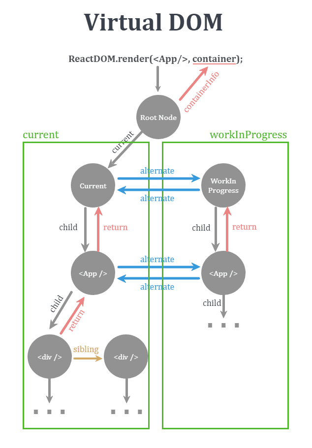

[React 까보기 시리즈 개요(feat. Fiber vs Stack)](https://www.youtube.com/watch?v=JadWu4Ygnyc&list=PLpq56DBY9U2B6gAZIbiIami_cLBhpHYCA)

## React 까보기 시리즈 개요(feat. Fiber vs Stack)

### fiber vs stack

- fiber는 stack과 비슷하게 생겼지만 stack과는 다르게 가장 나중에 들어간 fiber() 노드를 가장 먼저 꺼낼 필요가 없음 → 들어간 순서와 무관하게 꺼낼 수 있는 것이 fiber 아키텍처와 stack과의 가장 큰 차이점
- 16v부터는 stack이 아닌 fiber 아키텍처를 가지고 있음 → 본격적으로 사용된 건 v18

[[가장쉬운 리액트] Elements](https://www.youtube.com/watch?v=MTzS8XnD6-Q)

**#추가자료**

## Element[React Tutorial]

- React elements는 몇 가지 특징을 가진다
  - React앱의 가장 작은 구성 요소
  - Plain object(브라우저 DOM element과 다르게)
  - 상대적으로 생성하는 데 비용이 적게 듬
- React DOM은 React element와 DOM element가 일치하도록 DOM을 업데이트하는데, 이 입데이트는 React element를 다시 **랜더링**하는 것

### React element를 DOM에 랜더링하기

- React element를 DOM에 처음 랜더링하기 위해서는 아래 과정을 거친다.
  - React element들이 DOM element에 소속된다.
  - 브라우저가 소속된 React element들을 DOM element로 인식한다.
  - DOM element로 인식된 React element들을 랜더링한다.
- 그럼 React element들은 어떻게 DOM element에 소속될까?
  ```jsx
  <div id="root"></div>
  ```
  - 일반적으로 React element가 소속되는 DOM element를 id값이 root인 ‘root’ DOM node, 즉 모든 React element의 뿌리이다.
  ```jsx
  const element = <h1>Hello, React</h1>;
  ReactDOM.render(element, document.getElementById("root"));
  ```
  - ReactDOM은 render라는 method를 실행
  - 이때 arguments는 두 가지
    - React element
    - 브라우저 DOM element
  - 실행 결과 React element가 DOM element에 소속된다.
    - React element가 html DOM element로 인식됨
  - 이제 DOM element로 인식된 React element가 랜더링된다

### 랜더링 된 React element 업데이트하기

- React element는 **immutable**하다. 그러므로 아래 두 가지 특징을 가진다.
  - element가 생성된 후에는 children과 props를 변경할 수 없다
  - 특정 시점의 UI를 나타낸다
- 그러므로 React element를 업데이트하다 방법은 딱 **한가지**다. **새로운 React element를 만들고, ReactDOM.render()에 넣어 실행시킨다.**

```jsx
function tick() {
  const element = (
    <div>
            <h1>Hello, world!</h1>
            **<h2>It is {new Date().toLocaleTimeString()}.</h2>**     
    </div>
  );
  ReactDOM.render(element, document.getElementById("root"));
}

setInterval(tick, 1000);
```

### React element의 달라진 부분만 업데이트

- 만약 ReactDOM.render()이 실행될 때마다 root DOM node에 소속된 모든 React element들이 다시 랜더링 된다면 너무 비효율적이다.
- ReactDOM은 React element의 달라진 부분만 업데이트한다.
- 상단 코드의 하이라이팅된 h2 tag의 text node(달라진 부분)만 업데이트 된다.

## React 구성요소인 reconciler, renderer 등의 내부 패키지 & fiver, rendering 등의 용어 정의

### 구성요소

- react 코어
  - 다른 패키지에 의존성이 없으므로 다양한 플랫폼(브라우저, 모바일)에 올려서 사용 가능
- renderer
  - react-dom, react-native-renderer 등 호스트 랜더링 환경에 의존
  - 호스트와 react를 연결 즉, 웹에서 DOM 조작
  - reconciler와 legacy-events 패키지 의존성
- event(legacy-events)
  - https://legacy.reactjs.org/docs/events.html
  - SyntheticEvent 라는 이름으로 내부적으로 개발된 이벤트 시스템
  - 기존에 event가 있는데 왜 별도의 SyntheticEvent이 필요하나 → React에서 추가적인 기능이 덧붙여져야 했음 → 기존 웹 event를 wrapping해서 추가적인 기능 수행 가능하게 함
- scheduler
  - 스케줄링을 담당함 → React는 task 단위로 작업을 실행하는데 이 task는 비동기로 실행됨
- reconciler
  - VDOM을 재조정하는 역할 → fiber architecture에서 VDOM 재조정
  - 컴포넌트를 호출하는 곳

### 용어

- 랜더링
  - 컴포넌트 호출하여 return react element → VDOM에 적용(재조정)하는 과정
  - 전체 과정
    - 컴포넌트 호출 return react element
    - VDOM 재조정 작업(**여기까지가 랜더링**)
    - renderer가 컴포넌트 정보를 DOM에 삽입(mount)
    - 브라우저가 DOM을 paint
- react element
  - 컴포넌트 호출 시 return 하는 것(함수형 컴포넌트 작성 시 JSX 사용 → babel을 통해 react.createElement() 호출하는 것과 동일, 그를 통해 return 받는 것이 react element)
  - 컴포넌트의 정보(결국 DOM에 삽입될 내용)를 담은 객체
    - type, key, props, ref 등의 정보
- fiber
  - VDOM의 노드 객체(architecture로서의 fiber와 이름이 동일)
  - react element의 내용이 DOM에 반영되기 위해서는 먼저 VDOM에 추가되어야 하는데, 이를 위해 확장한 객체 → 컴포넌트의 상태, life cycle, hook이 관리됨

## Virtual DOM 이 자바스크립트 객체라고? render phase 와 commit phase 로 나누어서 동작 원리 살펴보기

### VDOM

- https://legacy.reactjs.org/docs/faq-internals.html
- 프로그래밍 컨셉 - 메모리 상에 UI 관련된 정보를 띄우고, react-dom과 같은 라이브러리에 의해 실제 DOM과 sync를 맞춘다. (renderer 관여)
- 이 과정이 재조정(reconciliation)이라고 부름(reconciler 관여)
- 왜 가상 DOM을 사용하느냐 → 실제로 하면(mount → paint) 가상보다 비용이 더 큼
  
- https://goidle.github.io/react/in-depth-react-intro/
- VDOM은 fiber node로 구성된 tree 형태(더블 버퍼링 구조)
  - current
    - DOM에 mount된 fiber
  - workInProgress
    - render phase에서 작업 중인 fiber
    - commit phase를 지나면서 current tree가 됨
- 구현 상세
  - workInProgress tree는 current tree에서 자기 복제하여 만들어짐(서로 alternate로 참조)
  - fiber는 첫 번째 자식만을 child로 참조, 나머지 자식들은 서로 sibling으로 참조, 모든 자식은 부모를 return으로 참조
- 컴포넌트 리렌더링이라는 정의: 컴포넌트 호출 후 그 결과가 VDOM에 반영까지, DOM에 mount되어 paint 되는 과정은 정의에서 제외

### React lifecycle

- render phase
  - VDOM 재조정(reconciliation)하는 단계
    - react element, 즉 fiber node로 확장된 그 자바스크립트 객체가 추가, 수정, 삭제 → WORK를 scheduler(패키지)에 등록
      - WORK: reconciler가 컴포넌트의 변경을 DOM에 적용하기 위해 수행하는 일
    - reconciler가 담당(reconciler 설계가 stack → fiber로 바뀌면서 abort, stop, restart 즉 랜더링 우선순위 변경이 가능해짐 useTransation 등)
- commit phase
  - 재조정한 VDOM을 DOM에 적용하고 라이프사이클을 실행하는 단계
    - 일관성을 위해 sync 실행 → 즉, DOM 조작 일괄 처리 후, 리액트가 콜스택을 비워준 다음 브라우저가 paint 시작

## useState 가 코드로 정의된 곳은 어디일까? reconciler 까지 찾아가기!

### Hook은 어디서 오는 걸까?

- react 코어
  - React.js ← ReactHooks.js ← ReactCurrentDispatcher.js → 해당 코드를 까봐도 hook에 대한 구체적인 코드 구현이 없음
- react 코어는 react element에 대한 정보만 알고 있고 hook에 대한 코드 구현이 없음
- react element는 fiber로 확장해야 hook을 포함하게 됨
- reconciler가 fiber로 확장하고 즉, reconciler가 hook을 알고 있음? → reconciler → react 코어로 어떻게 전달?
- react 코어는 hook을 사용하기 위해 외부에서 **주입** 받음(의존성 끊기 위해서 → 이곳 저곳에서 사용 가능하도록)
  - react
    - React.js ← ReactHooks.js ← ReactCurrentDispatcher.js ← ReactSharedInternals.js
- react/ReactSharedInternals.js는 객체에 property로 외부 모듈을 할당 받음
- **shared 는 모든 패키지가 공유하는 공통 패키지**
  - **shared/ReactShareInternals.js는 react 코어 패키지에 연결된 출입구**

## renderWithHooks 함수? useState 를 할당하는 과정 코드 까보기?!

### 어떻게 useState export 하지?
