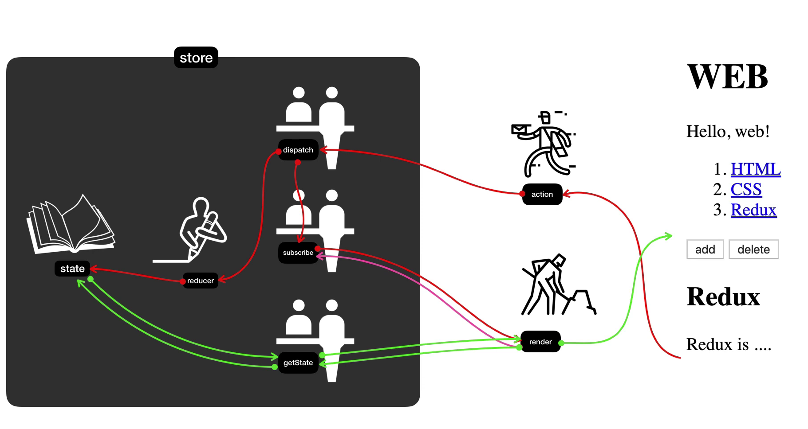
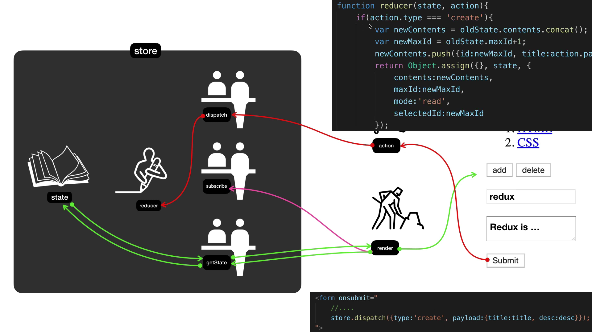

### Redux - 1. 수업소개

- Redux - A predictable state container for JavaScript apps. - 예측 가능한 상태의 저장소
- Single Source of Truth - 하나의 상태를 갖는다
- 데이터를 하나의 state, 즉 하나의 객체를 통해 관리한다, 일원화한다 + 데이터를 한곳에서 통제한다, 데이터를 통제를 위해선 dispatcher나 reducer라는 걸 통해서 데이터 수정을 가할 수 있음
- 데이터를 가져올 때도 별도의 함수를 통해 가져옴
- 그것을 통해 의도하지 않게, 예기치 않게 state의 값이 변하는 걸 차단하는 걸 통해서 예측 가능하게 만듬

### Redux - 2.1. 리덕스 여행의 지도 : 소개



### Redux - 2.2. state와 render의 관계

- state에 직접 접근하는 건 불가능, 누군가를 통해서 해야 함
- store를 만들면서 reducer라는 함수를 만들어서 공급해야 함
- render 함수는 해당 state의 값을 받아와서 html을 그려주는 역할(innerHTML을 통해 #app 엘리멘탈 안에 html 삽입)
- **subscribe에 render 함수를 등록해놓으면 값이 바뀔 때마다 다시 랜더링**

### Redux - 2.3. action과 reducer

- dispatch
  - reducer를 호출해서 state 값을 바꿈
  - 그 작업이 끝나면 subscribe를 이용해서 render 함수를 호출해줌, 화면 갱신
  - dispatch가 reducer를 호출할 때 두 개의 값을 호출함 → 첫 번째는 현재의 state 값, 또 하나는 action 데이터
  - reducer는 state를 입력값으로 받고 action을 참조해서 새로운 state값을 만들어내서 return 해주는, state를 가공하는 가공자
  - 새로운 state값이 return 되면 dispatch가 subscribe에 등록되어 있는 구독자들(render 포함)을 다 호출해줌 → render를 통해 화면을 갱신함
    

### Redux - 3. Redux가 좋은 가장 중요한 이유

- Redux DevTools를 이용하면 time travel이 가능함
- 중앙 집중적인 데이터스토어(전역 상태관리)를 통해서 쉽게 개발할 수 있음
- 만약 중앙 집중적인 기능 없이 각각의 컴포넌트가 데이터로 연결되어 있는 상태로 별개의 로직이 있어야 하고 컴포넌트가 늘어날 수록 기하급수적으로 로직을 늘어날 수밖에 없음
- Redux를 통한다면 개별 컴포넌트가 값이 변했다는 걸 알리는 로직, 그리고 그 값을 반영해서 새롭게 랜더링할 로직 이 두 개의 로직만 각각 들고 있으면 됨, 로직 간소화

### Redux - 4. Redux가 없다면

- terrible..

  ```html
  <html>
    <body>
      <style>
        .container {
          border: 5px solid black;
          padding: 10px;
        }
      </style>
      <div id="red"></div>
      <div id="green"></div>
      <div id="blue"></div>

      <script>
        function red() {
          document.querySelector("#red").innerHTML = `
          <div class="container" id="component_red">
              <h1>red</h1>
              <input type="button" value="fire" onclick="
              document.querySelector('#component_red').style.backgroundColor = 'red';
              document.querySelector('#component_green').style.backgroundColor = 'red';
              document.querySelector('#component_blue').style.backgroundColor = 'green';
              ">
          </div>
      `;
        }
        red();
        function green() {
          document.querySelector("#green").innerHTML = `
          <div class="container" id="component_green">
              <h1>green</h1>
              <input type="button" value="fire" onclick="
              document.querySelector('#component_red').style.backgroundColor = 'green';
              document.querySelector('#component_green').style.backgroundColor = 'green';
              document.querySelector('#component_blue').style.backgroundColor = 'green';
              ">
          </div>
      `;
        }
        green();
        function blue() {
          document.querySelector("#blue").innerHTML = `
          <div class="container" id="component_blue">
              <h1>blue</h1>
              <input type="button" value="fire" onclick="
              document.querySelector('#component_red').style.backgroundColor = 'blue';
              document.querySelector('#component_green').style.backgroundColor = 'blue';
              document.querySelector('#component_blue').style.backgroundColor = 'blue';
              ">
          </div>
      `;
        }
        blue();
      </script>
    </body>
  </html>
  ```

### Redux - 5.1. Redux의 적용 : store 생성

```html
<!DOCTYPE html>
<html>
  <head>
    <script src="https://cdnjs.cloudflare.com/ajax/libs/redux/4.2.1/redux.js"></script>
  </head>

  <body>
    <style>
      .container {
        border: 5px solid black;
        padding: 10px;
      }
    </style>
    <div id="red"></div>

    <script>
      function reducer(state, action) {
        if (state === undefined) {
          return { color: "yellow" };
        }
      }

      var store = Redux.createStore(reducer);

      function red() {
        var state = store.getState();
        document.querySelector("#red").innerHTML = `
        <div class="container" id="component_red" style="background-color:${state.color}">
            <h1>red</h1>
            <input type="button" value="fire" onclick="
            document.querySelector('#component_red').style.backgroundColor = 'red';
            document.querySelector('#component_green').style.backgroundColor = 'red';
            document.querySelector('#component_blue').style.backgroundColor = 'green';
            ">
        </div>
    `;
      }
      red();
    </script>
  </body>
</html>
```

### Redux - 5.2. Redux의 적용 : reducer와 action을 이용해서 새로운 state 값 만들기

- store에 dispatch를 호출하게 되면 dispatch는 store를 생성할 때 만든 reducer를 호출하도록 약속되어 있음 → 이전의 state값과 action의 값을 인자로 줌
- 이런 형식으로 action의 type을 받아서 state값을 바꿀 수 있지만, 이렇게 되면 undo, redo와 같은 시간 여행을 할 수가 없게 됨(기존 state값을 바꿨기 때문에) → 기존의 state값의 사본을 만들고 그 사본을 return 해줌으로서 과거의 state 이력을 확인할 수 있음

  ```html
  <!DOCTYPE html>
  <html>
    <head>
      <script src="https://cdnjs.cloudflare.com/ajax/libs/redux/4.2.1/redux.js"></script>
    </head>

    <body>
      <style>
        .container {
          border: 5px solid black;
          padding: 10px;
        }
      </style>
      <div id="red"></div>

      <script>
        function reducer(state, action) {
          console.log(state, action);
          if (state === undefined) {
            return { color: "yellow" };
          }

          if (action.type === "CHANGE_COLOR") {
            return { color: "red" };
          }

          return state;
        }

        var store = Redux.createStore(reducer);

        function red() {
          var state = store.getState();
          document.querySelector("#red").innerHTML = `
          <div class="container" id="component_red" style="background-color:${state.color}">
              <h1>red</h1>
              <input type="button" value="fire" onclick="
                store.dispatch({type: 'CHANGE_COLOR', color: 'red'})
              ">
          </div>
      `;
        }
        red();
      </script>
    </body>
  </html>
  ```

- `Object.assign({}, {name: 'egoing'}, {city: 'Seoul'});` → 반드시 첫 번째 인자는 빈 객체 → `Object.assign` 의 return값은 첫 번째 인자인 객체이기 때문

### Redux - 5.3. Redux의 적용 : state의 변화에 따라서 UI 반영하기

- state값이 바뀔 때마다 화면을 새로 그려줘야 함 → render를 호출해주면 됨
- 중앙집중적으로 관리하게 되면, 상태가 바꼈을 때 상태가 바꼈음을(action) store에 dispatch 해주면 됨 → 그리고 그걸 subscribe에 등록해놓으면 바뀔 때마다 render 호출
- redux를 통해 서로간의 의존성을 낮추고(디커플링) 각자의 부품을 stand-alone으로 사용할 수 있음

### Redux - 6. Redux 선물 : 시간여행과 로깅

- time travel이라는 이 기능은 redux의 주요 기능
- 크롬 개발자도구 Redux DevTools

### Redux - 7.1. 실전 Redux : 정적인 웹페이지 만들기

- CRUD 설계

### Redux - 7.2. 실전 Redux : 부품화

- 부품화 설계

### Redux - 7.3. 실전 Redux : store 생성과 state 사용하기

- (recap) store를 처음 생성하는 최초 1회, action과는 상관없이 reducer가 생성되는데 그때 state의 값은 undefined니까 그걸 조건식 `if === undefined`으로 초기값을 세팅
  ```jsx
  function reducer(state, action) {
    if (state === undefined) {
      return {
        contents: [
          { id: 1, title: "HTML", desc: "HTML is .." },
          { id: 2, title: "CSS", desc: "CSS is .." },
        ],
      };
    }
  }

  var store = Redux.createStore(reducer);
  ```

### Redux - 8. 수업을 마치며

- redux toolkit과 JavaScript 불변성(Immutability) 공부
