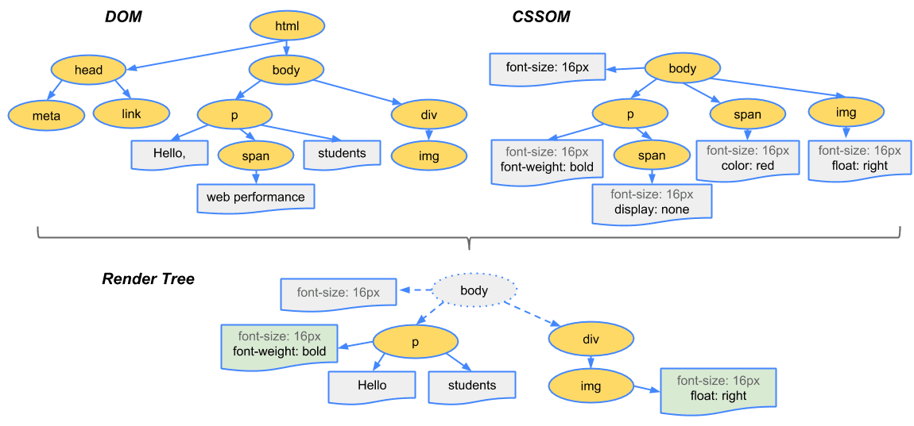

# 2.1 JSX란?

- JSX를 리액트의 전유물로 생각하기 쉬운데, JSX는 리액트가 등장하면서 메타에서 소개한 새로운 구문으로 XML과 유사한 내장형 구문이고, 리액트에 종속되지 않은 독자적인 문법으로 보는 것이 옳습니다. 물론 ECMAScript라고 불리는 자바스크립트 표준의 일부는 아니기 때문에 V8 같은 자바스크립트 엔진이나 브라우저에 의해서 실행되거나 표현되도록 만들어진 구문은 아닙니다. 트랜스파일러를 거쳐서 자바스크립트 런타임이 이해할 수 있는 자바스크립트 코드로 변환됩니다.

## 2.1.1 JSX의 정의

- JSX는 기본적으로 `JSXElement`, `JSXAttributes`, `JSXChildren`, `JSXstrings`라는 4가지 컴포넌트를 기반으로 구성되어 있습니다.

### JSXElement

- JSX를 구성하는 가장 기본 요소, HTML의 요소(element)와 비슷한 역할을 합니다. `JSXElement`가 되기 위해서는 다음과 같은 형태 중 하나여야 합니다.
  - `JSXOpeningElement` - 일반적으로 볼 수 있는 요소, `JSXOpeningElement`로 시작했다면 `JSXClosingElement`가 같은 단계에서 선언되어 있어야 올바른 JSX 문법으로 간주합니다.
  - `JSXClosingElement` - `JSXOpeningElement`가 종료됐음을 알리는 요소
  - `JSXSelfClosingElement` - 요소가 시작되고 스스로 종료되는 형태, 내부적으로 자식을 포함할 수 없음
  - `JSXFragment` - 아무런 요소가 없는 형태로 `JSXSelfClosingElement` 형태는 띨 수 없음
- 리액트에서 사용자 컴포넌트는 반드시 대문자로 시작해야 하는데, HTML 태그명과 구분 짓기 위해서 입니다. 굳이 현존하는 HTML 태그만 필터링하지 않고 이런 규칙을 둔 이유는 미래에 추가된 HTML 태그에 대한 가능성을 열어둔 것으로 보입니다.
- `JSXElementName`
  - `JSXElement`의 요소 이름으로 쓸 수 있는 것을 의미하는데, 이름으로 가능한 것은 다음과 같습니다.
    - `JSXIdentifier` - JSX 내부에서 사용하는 식별자, 자바스크립트와 마찬가지로 숫자로 시작하거나 `$`와 `_` 외의 다른 특수문자로 시작할 수 없습니다.
    - `JSXNamespacedName` - `JSXIdentifier:JSXIdentifier`의 조합, 즉 `:` 을 통해 서로 다른 식별자를 이어주는데, 두 개 이상은 불가능합니다.
    - `JSXMemberExpression` - `JSXIdentifier.JSXIdentifier`의 조합, 즉 `.` 을 통해 서로 다른 식별자를 이어주는 것도 하나의 식별자로 취급합니다. 두 개 이상도 가능합니다.

### JSXAttiributes

- `JSXElement`에 부여할 수 있는 속성을 의미하는데, 단순히 속성을 의미하고 필수값은 아니어서 없어도 에러가 나지 않습니다.
  - `JSXSpreadAttributes` - 자바스크립트의 전개 연산자와 동일한 역할을 한다고 볼 수 있습니다.
    - `{…AssignmentExpression}` - 이 `AssignmentExpression`에는 객체뿐만 아니라 조건문 표현식, 화살표 함수, 할당식 등 `AssignmentExpression`로 취급되는 모든 표현식이 존재할 수 있습니다.
  - `JSXAttribute` - 속성을 나타내는 키와 값으로 짝을 이뤄서 표현합니다.
    - `JSXAttributeName` - 속성의 키 값, `JSXIdentifier`와 `JSXNamespacedName`이 가능하고, `:` 또한 가능합니다.
    - `JSXAttributeValue` - 속성의 키에 할당할 수 있는 값, 자바스크립트 문자열과 동일하게 `‘’`, `“”` 으로 구성되어야 합니다.
      - `{ AssignmentExpression }` - 자바스크립트의 `AssignmentExpression`를 의미합니다. `AssignmentExpression`는 자바스크립트에서 값을 할당할 때 쓰는 표현식을 말하는데, 자바스크립트에서 변수에 값을 넣을 수 있는 표현식은 JSX 속성의 값으로도 가능합니다.
      - `JSXElement` - 값으로 다른 JSX 요소가 들어갈 수 있습니다.
      - `JSXFragment` - 별도 속성을 갖지 않는 형태 즉, 비어 있는 형태의 fragment 도 허용됩니다.

### JSXChildren

- `JSXElement`의 자식 값을 나타냅니다. JSX는 속성을 가진 트리 구조를 나타내기 위해 만들어졌기 때문에 JSX로 부모와 자식 관계를 나타낼 수 있으며, 그 자식을 `JSXChildren`라고 합니다.

  - `JSXChild` - `JSXChildren`을 이루는 기본 단위, `JSXChildren`은 `JSXChild`를 0개 이상 가질 수 있고, 0개 이상이라는 말처럼 `JSXChildren`은 `JSXChild`이 없어도 상관 없습니다.

    - `JSXText` - 다른 JSX 문법과 혼동할 수 있는 `{`, `<`, `>`, `}`을 제외한 문자열입니다.
    - `JSXElement` - 값으로 다른 JSX 요소가 들어갈 수 있습니다.
    - `JSXFragment` - 값으로 fragment가 들어갈 수 있습니다.
    - `{ JSXChildExpression (optional) }` - 이 `JSXChildExpression`은 자바스크립트의 `AssignmentExpression`을 의미하기에 다음과 같은 코드도 올바른 JSX 표현식으로 볼 수 있습니다.

      ```jsx
      // 'foo'라는 문자열 출력

      import React from "react";
      import "./style.css";

      export default function App() {
        return <>{(() => "foo")()}</>;
      }
      ```

### JSXStrings

- HTML에서 사용 가능한 문자열은 모두 `JSXStrings`에서도 가능합니다. 현재의 JSX는 HTML처럼 `\`를 이스케이프 문자열로 처리하고 있지 않는다는 게 자바스크립트와의 차이점이라고 볼 수 있는 부분입니다.

## 2.1.3 JSX는 어떻게 자바스크립트로 변환될까?

- JSX가 변환되는 방식을 알려면 리액트에서 JSX를 변환하는 `@babel/plugin-transform-react-jsx` 플러그인을 알아야 하는데, 이 플러그인은 JSX 구문을 자바스크립트 이해할 수 있는 형태로 변환합니다.
- JSX

  ```jsx
  const ComponentA = <A required={true}>Hello World</A>;

  const ComponentB = <>Hello World</>;

  const ComponentC = (
    <div>
      <span>hello world</span>
    </div>
  );
  ```

- 변환 결과

  ```jsx
  "use strict";

  var ComponentA = React.createElement(
    A,
    {
      required: true,
    },
    "Hello World"
  );

  var ComponentB = React.createElement(React.Fragment, null, "Hello World");
  var ComponentC = React.createElement(
    "div",
    null,
    React.createElement("span", null, "hello world")
  );
  ```

## 2.1.4 정리

- 리액트에서 JSX의 모든 구문을 다 활용할 필요가 없다고 판단했기 때문에 낯선 문법이 있을 수도 있습니다. JSX 문법에는 있지만 실제로 리액트에서 사용하지 않는 것은 다음과 같습니다.
  - `JSXNamespacedName`
  - `JSXMemberExpression`

# 2.2 가상 DOM과 리액트 파이버

## 2.2.1 DOM과 브라우저 렌더링 과정

1. 브라우저가 사용자가 요청한 주소에서 HTML 파일을 다운로드 합니다.
2. 브라우저의 렌더링 엔진은 HTML을 파싱해 DOM 노드로 구성된 트리(DOM)를 만듭니다.
3. 2번 과정에서 CSS 파일을 만나면 해당 CSS 파일도 다운로드 합니다.
4. 브라우저의 렌더링 엔진은 이 CSS도 별도로 파싱해서 CSS 노드로 구성된 트리(CSSOM)을 만듭니다.
5. 브라우저는 2번에서 만든 DOM 노드를 순회하는데, 모든 노드를 방문하는 것은 아니고 사용자 눈에 보이는 노드만 방문합니다. 즉 display: none과 같이 사용자 화면에 보이지 않는 요소는 방문해 작업하지 않는데, 이는 트리를 분석하는 과정을 조금이라도 빠르게 하기 위해서입니다.
6. 5번에서 제외된, 눈에 보이는 노드를 대상으로 해당 노드에 대한 CSSOM 정보를 찾고 여기서 발견한 CSS 스타일 정보를 이 노드에 적용합니다. 이 DOM 노드에 CSS를 적용하는 과정은 크게 두 가지로 나눌 수 있습니다.
   1. 레이아웃(layout, reflow) - 각 노드가 브라우저 화면의 어느 좌표에 정확히 나타나야 하는지 계산하는 과정인데, 이 레이아웃 과정을 거치면 반드시 페인팅 과정도 거치게 됩니다.
   2. 페인팅(painting) - 레이아웃 단계를 거친 노드에 색과 같은 실제 유효한 모습을 그리는 과정입니다.



## 2.2.2 가상 DOM의 탄생 배경

- 레이아웃은 필연적으로 리페인팅이 발생하기 때문에 더 많은 비용이 드는데, 또한 부모의 변경은 자식 요소까지도 변경되어야 하기에 더 많은 비용을 브라우저와 사용자가 지불하게 됩니다. 또한 사용자의 인터렉션에 따라 DOM의 모든 변경 사항을 추적하는 것은 개발자 입장에선 수고스러운 일이고, 인터렉션에 따른 DOM의 최종 결과물을 간편하게 제공하는 것은 브라우저 뿐만 아니라 개발자에게도 매우 유용합니다.
- 가상 DOM은 리액트가 관리하는 가상의 DOM으로, 웹페이지가 표시해야 할 DOM을 일단 메모리에 저장하고 리액트가 실제 변경에 대한 준비가 완료됐을 때 실제 브라우저의 DOM에 반영합니다. 이를 통해 DOM 계산을 브라우저가 아닌 메모리에서 계산하는 과정을 한번 거치게 된다면 실제로는 여러 번 발생했을 렌더링 과정을 최소화할 수 있고 브라우저와 개발자의 부담을 덜 수 있습니다.
- 일반적인 DOM 관리 방식보다 속도적으로 우월한 것이 아니라 브라우저와 개발자에게 도움을 줄 수 있기에 가성 DOM 개념을 만들었고, 일반적인 애플리케이션을 개발할 수 있을 만큼 합리적으로 빠르게 때문에 채택했다고 볼 수 있습니다.

## 2.2.3 가상 DOM을 위한 아키텍처, 리액트 파이버

### 리액트 파이버란?

- 가상 DOM과 렌더링 과정 최적화를 가능하게 해주는 것이 바로 리액트 파이버(React Fiber)인데, 리액트에서 관리하는 평범한 자바스크립트 객체입니다. 파이버는 파이버 재조정자(fiber reconciler)가 관리하는데, 가상 DOM과 실제 DOM을 비교해 변경 사항을 수집하며 둘 사이의 차이가 있으면 변경에 관련된 정보를 가지고 있는 파이버를 기준으로 렌더링을 요청하는 역할을 합니다. 재조정(reconciliation)은 리액트에서 어떤 부분을 새롭게 렌더링해야 하는지 가상 DOM과 실제 DOM을 비교하는 작업(알고리즘)이라고 이해하면 됩니다.
- 과거 리액트의 조정 알고리즘은 스택 알고리즘으로 이뤄져 동기적으로 작업이 진행됐지만, 파이버 아키텍쳐로 넘어오면서 비동기로 이뤄집니다. 기존 렌더링 스택의 비효율성을 타파하기 위해 스택 조정자 대신 파이버라는 개념을 만들게 됩니다.
- 파이버는 하나의 작업 단위로 구성되어 있고, 이러한 작업 단위를 하나씩 처리하고 `finishedWork()`라는 작업으로 마무리합니다. 그리고 이 작업을 commit phase에서 가시적인 변경사항을 만들어 냅니다.
  - render phase에서 사용자에게 노출되지 않는 모든 비동기 작업을 수행합니다. 파이버의 작업 외 우선순위를 지정하거나 중지하는 등의 작업이 일어납니다.
  - commit phase에서는 DOM에 실제 반영을 위해서 `commitWork()`가 실행되는데 render phase와 다르게 동기적으로 일어나고 중단할 수 없습니다. commit phase 중간에 페인트 되지 않고, 이 단계가 끝나고 리액트에서 콜 스택을 비워줘야지만 브라우저에서 화면을 페인트 할 수 있게 됩니다.
- 파이버는 단순한 자바스크립트 객체로 구성되어 있고, 렌더링이 발생할 때마다 새롭게 생성되지만 가급적 재사용됩니다.

### 리액트 파이버 트리

- 파이버 트리는 리액트 내부에 두 개가 존재하는데, 하나는 현재 모습을 담은 `current` 트리와 작업 중인 상태를 나타내는 `workInProgress` 트리입니다. 리액트 파이버의 작업이 끝나면 리액트는 단순히 포인터만 변경해 `workInProgress` 트리를 현재 트리로 바꿔버리는데, 이런 기술을 더블 버퍼링이라고 합니다.
- 미처 다 그리지 못한 모습(불완전한 트리)을 노출하지 않기 위해 더블 버퍼링을 사용하는데, 먼저 `current` 트리 기준으로 작업을 시작하고, 업데이트가 발생하면 `workInProgress` 트리를 빌드하기 시작합니다. `workInProgress` 트리가 UI에 최종적으로 렌더링되어 반영 완료되면 `current`가 이 `workInProgress`로 변경됩니다.

### 파이버의 작업 순서

- 파이버 노드의 생성 흐름
  - 리액트는 `beginWork()` 함수를 실행해 파이버 작업을 수행하는데, 더 이상 자식이 없는 파이버를 만날 때까지 트리 형식으로 시작합니다.
  - 앞서 작업이 끝나면 `completeWork()`로 파이버 작업을 완료합니다.
  - 형제가 있다면 형제로 넘어가고, 모든 작업이 끝나면 `return`으로 돌아가 자신의 작업이 완료됐음을 알립니다.
- 트리가 형성된 후 `setState` 등으로 업데이트가 발생하면, 이미 리액트는 앞서 만든 `current` 트리가 존재하고 업데이트 요청에 따라 `workInProgress` 트리를 다시 빌드하기 시작합니다. 최초 렌더링 시에는 파이버를 새롭게 만들어야 하지만 이미 파이버가 존재하는 상황에서는 새로 생성하지 않고 기존 파이버에서 업데이트된 `props`를 받아 파이버 내부에서 처리합니다.
- 앞서 파이버를 재사용한다는 의미는 이런 부분입니다. 업데이트는 수시로 일어나고 그때마다 파이버를 재생성하는 것은 리소스 낭비라고 볼 수 있기 때문에 기존 파이버 객체를 재활용해서 초기화하고 바꾸는 형태로 트리를 업데이트합니다.
- 그리고 과거에는 이 트리 업데이트 과정, 재귀적으로 하나의 트리를 순회해 새로운 트리를 만드는 작업은 동기식이고 중단될 수 없었습니다. 파이버 아키텍쳐로 넘어오면서 이러한 작업을 파이버 단위로 나눠서 수행하게 되었고, 우선순위가 높은 작업의 분리 등 최적의 순위로 작업을 완료할 수 있게끔 만듭니다.

## 2.2.4 파이버와 가상 DOM

- 가상 DOM은 웹 애플리케이션에서만 통용되는 개념이고 리액트 파이버는 리액트 네이티브와 같은 환경에서도 사용할 수 있기 때문에 파이버와 가상 DOM은 동일한 개념은 아닙니다. 리액트와 리액트 네이티브의 렌더러가 서로 다르다 하더라도 내부적으로 파이버를 통해서 조정되는 과정은 동일하기 때문에 동일한 재조정자를 사용할 수 있게 됩니다.

# 2.4 렌더링은 어떻게 일어나는가?

## 2.4.1 리액트의 렌더링이란?

- 브라우저의 렌더링과 구분할 필요가 있는데, 리액트 애플리케이션 트리 안에 있는 모든 컴포넌트들이 현재 자신들이 가지고 있는 `props` 와 `state` 의 값을 기반으로 어떻게 UI를 구성하고 이를 바탕으로 어떤 DOM 결과를 브라우저에 제공할 것인지 계산하는 일련의 과정을 의미합니다.

## 2.4.2 리액트의 렌더링이 일어나는 이유

- 렌더링이 발생하는 시나리오
  1. 최초 렌더링 - 사용자가 처음 애플리케이션에 진입했을 때 브라우저에 정보를 제공하기 위해 최초 렌더링을 수행합니다.
  2. 리렌더링 - 최초 렌더링 이후 발생하는 모든 렌더링을 의미합니다.
     - 클래스형 컴포넌트의 `setState` 가 실행되는 경우
     - 클래스형 컴포넌트의 `forceUpdate` 가 실행되는 경우 - 클래스형 컴포넌트에서 렌더링을 수행하는 것은 인스턴스 메서드인 `render` 로, `render` 는 `state` 나 `props` 가 아닌 다른 값에 의존하고 있어 리렌더링을 자동으로 실행할 수 없는 경우 `forceUpdate` 를 실행해 리렌더링을 일으킬 수 있습니다. `forceUpdate` 를 실행하면 `shouldComponentUpdate` 는 무시하고 건너뛰게 되고, `render` 내에 `forceUpdate()` 가 사용되면 무한 루프에 빠질 수 있으니 주의해야 합니다.
     - 함수형 컴포넌트의 `useState()` 의 두 번째 배열 요소인 `setter` 가 실행되는 경우
     - 함수의 컴포넌트의 `useReducer()` 의 두 번째 배열 요소인 `dispatch` 가 실행되는 경우
     - 컴포넌트의 `key props` 가 변경되는 경우
       - 리액트에서 `key` 가 필요한 이유는 리액트 파이버 트리 구조에서 `sibling` 이라는 속성값을 사용해서 형제 컴포넌트 참조 과정에서 구별을 하기 되는데, 리렌더링이 발생하면 `current` 트리와 `workInProgress` 트리 사이에서 어떠한 컴포넌트가 변경이 있었는지 구별해야 합니다. 이 두 트리 사이에서 같은 컴포넌트인지를 구별하는 값이 바로 `key` 입니다.

## 2.4.3 리액트의 렌더링 프로세스

- 루트에서부터 아래로 내려가면서 업데이트가 필요하다고 지정되어 있는 모든 컴포넌트를 찾고, 발견됐을 때 클래스형 컴포넌트는 `render()` 함수를 실행하고 함수형 컴포넌트는 `FunctionComponent()` 그 자체를 호출한 뒤에 그 결과물을 저장합니다.
- 변환되는 과정
  ```jsx
  function Hello() {
    return (
      <TestComponent a={35} b={"yceffort"}>
        안녕하세요
      </TestComponent>
    );
  }
  ```
  ```jsx
  function Hello() {
    return React.createElement(
      TestComponent,
      { a: 35, b: "yceffort" },
      "안녕하세요"
    );
  }
  ```
  ```
  // 결과물
  {type: TestComponent, props: {a: 35, b: 'yceffort', children: '안녕하세요'}}
  ```
- 이런 과정을 거쳐 렌더링 결과물을 수집하고, 가상 DOM과 비교해 실제 DOM에 반영하기 위한 모든 변경사항을 차례차례 수집합니다. 이런 계산 과정이 재조정(Reconciliation)이라고 하는데, 주목해야 할 것은 리액트의 렌더링은 render 단계와 commit 단계 이렇게 두 단계로 분리되어 실행된다는 점입니다.

## 2.4.4 렌더와 커밋

- render 단계는 컴포넌트를 렌더링하고 변경 사항을 계산하는 모든 작업을 말하는데, 렌더링 프로세스에서 컴포넌트를 실행해(`render()` 또는 `return` ) 이 결과와 이전 가상 DOM을 비교하는 과정을 거쳐 변경이 필요한 컴포넌트를 체크하는 단계입니다. 여기서 비교하는 것은 크게 `type` , `props` , `key` 인데, 이 중 하나라도 변경되는 것이 있으면 변경이 필요한 컴포넌트로 체크합니다.
- commit 단계는 render 단계의 변경 사항을 실제 DOM에 적용해 사용자에게 보여주는 과정을 말하는데, 이 단계가 끝나야 브라우저의 렌더링이 발생합니다.
- 리액트의 렌더링이 일어난다고 해서 무조건 DOM 업데이트가 일어나진 않는데, 렌더링을 수행했으나 commit 단계까지 갈 필요가 없다면, 즉 변경이 감지되지 않는다면 commit 단계가 생략될 수 있습니다.
- 18 버전 이전에는 이 두 가지 과정에서의 렌더링은 동기식으로 작동했기에 렌더링 과정이 길어지면 성능 저하 등의 이슈가 있을 수 있었습니다. 다만 이 부분은 비동기식으로 변경했을 때 일부만 변경되어서 사용자에서 혼란을 줄 수 있는 이유 등을 생각해보면 당연한 것이었습니다. 그럼에도 B 컴포넌트의 렌더링이 무거워서 상대적으로 빠른 C 컴포넌트라도 변경하면 좋을 케이스가 있는데, 이런 의도된 우선순위로 컴포넌트를 렌더링해 최적화할 수 있는 비동기 렌더링, 이른바 동시성 렌더링이 리액트 18에서 도입됐습니다.
- 이 동시성 렌더링은 render 단계가 비동기로 작동해 특정 렌더링의 우선순위를 낮추거나, 필요하다면 중단 혹은 재시작하거나, 경우에 따라서는 포기할 수도 있습니다.

## 2.4.5 일반적인 렌더링 시나리오 살펴보기

- 컴포넌트 렌더링 작업은 하위 컴포넌트에 영향을 미치기 때문에, 부모가 변경됐다면 `props` 변경 여부와 무관하게 리렌더링됩니다. 다만 `memo` 로 래핑한다면 render 단계에서 컴포넌트 비교를 거쳤지만 `memo` 로 선언한 덕분에 `props` 가 변경되지 않으면 렌더링이 생략되므로 commit 단계 또한 생략이 됩니다.

# 2.5 컴포넌트와 함수의 무거운 연산을 기억해 두는 메모이제이션

- 리액트에서 제공하는 `useMemo` , `useCallback` 훅과 고차 컴포넌트인 `memo` 는 리액트에서 발생하는 렌더링을 최소한으로 줄이기 위해서 제공됩니다.

## 2.5.1 주장 1: 섣부른 최적화는 독이다, 꼭 필요한 곳에만 메모이제이션을 추가하자

```jsx
function sum(a, b) {
  return a + b;
}
```

- `sum(1, 1)` 의 결과를 저장해 두고 `sum(1, 1)` 이 다시 실행될 때 메모리에서 그 값을 꺼내오는 게 나을지, 아니면 단순히 자바스크립트에 `1+1` 을 실행하는 게 나을지 판단해야 할 필요가 있습니다. 예시는 극단적으로 간단하긴 하지만 대부분의 가벼운 작업 자체는 메모이제이션보다 매번 그 작업을 수행해 결과를 반환하는 게 빠를 수도 있습니다.
- 메모이제이션에도 비용이 들기 때문에 섣부른 최적화(premature optimization or premature memoization)는 경계해야 하고, 모든 문제를 해결하는 은탄환(silver bullet)이 아니라는 사실을 염두해야 합니다.

## 2.5.2 주장 2: 렌더링 과정의 비용은 비싸다, 모조리 메모이제이션해 버리자

- 잘못된 `memo` 를 통해 지불해야 하는 비용은 `props` 에 대한 얕은 비교가 발생하면서 지불해야 하는 비용인데, 리렌더링을 통해 발생하는 문제에 비해 비용에 작다는 입장에서는 전부 메모이제이션 하자는 생각이 있을 수 있습니다.

## 참고자료

- 모던 리액트 Deep Dive(김용찬, 2023)
- https://web.dev/articles/critical-rendering-path/render-tree-construction?hl=ko
- [https://velog.io/@gonasooc/Virtual-DOM에-대해-설명해주세요](https://velog.io/@gonasooc/Virtual-DOM%EC%97%90-%EB%8C%80%ED%95%B4-%EC%84%A4%EB%AA%85%ED%95%B4%EC%A3%BC%EC%84%B8%EC%9A%94)
- https://goidle.github.io/react/in-depth-react-intro/
