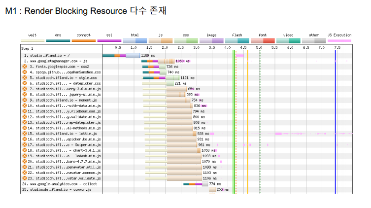
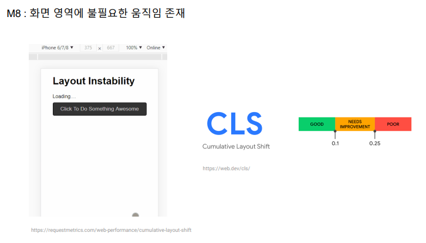

https://devocean.sk.com/vlog/view.do?id=423&vcode=A03

[20230622_frontend.pdf](../../assets/20230622_frontend.pdf)

# 세션1: 웹 프론트엔드 성능 최적화를 해야 하는 당위성

## Introduction

### 이번 세미나에서 알아 가셨으면 하는 것

- 웹 프론트엔드 성능 최적화하는 이유
- 웹 프론트엔드 성능 최적화 방법

### 서비스 관점에서도 웹 성능 최적화는 중요합니다

- 사용자 이탈율과 직접적인 연관이 되어 있는 최적화

## Why should Web Performance be optimized?

### How long can you wait?

- 이탈율은 비즈니스 퍼포먼스와 연관이 강하다

### How Google measure web performance?

- **Core Web Vitals(CWV)** - 사용자 관점에서 정의되었기에 각광을 받음
    - **Largest Contentful Paint(LCP)** for measuring the loading speed
        - 웹사이트의 7할 이상은 LCP에 해당되는 건 이미지
    - **First Input Delay(FID)** for scoring interactivity
        - 첫 번째 사용자 인풋에 얼마나 빨리 반응하느냐
    - **Cumulative Layout Shift(CLS)** for calculating the visual stability
        - 비주얼이 얼마나 안정적이냐, 소위 말하는 덜컹거림
    - LCP와 FID가 너무 첫 화면에만 집중된 평가 영역이 아니냐는 피드백이 있었고 그걸 반영한 구글이 2023년 5월 구글 I/O에서 INP 발표, FID → INP로 대체될 예정(2024년 초) → INP는 첫 인풋뿐만 아니라 사이트 내 모든 인풋이 평가 기준이 됨

### Mobile website experience affects All marketing channels

- SEO와 함께 CWV도 랭크에 반영됨

## How to measure Web Performance?

### Tools that measure Core Web Vitals

### Measuring Real User Monitoring (RUM) tools - 리얼 유저 모니터링 데이터 → 캐시 혜택을 받는 실제 유저를 대상으로 하는 RUM 데이터

### Page speed audit reports

- Lighthouse → Lighthouse is a lab tool that provides specific opportunities for improving page performance, 측정할 때마다 수치를 변할 수 있음, 하드웨어 상태에 따라

**#발표자님이 주로 사용하는 웹페이지테스트 by 캐치포인트, 페이지스피드인사이트 / web-vitals JS**

### LCP optimization

### CLS optimization

### FID optimization

# 세션2: ifland 웹 프론트엔드 성능 최적화 적용 사례

## How to optimize web performance at ifland studio

### Case: How to optimize web performance of ifland studio

- **Measure: 현재 상황을 측정, 인지**
- **Analyze: 현상 분석 및 개선점 도출**
- **Optimize: 최적화 (개선) 적용**

### Case별 Measure → Analyze → Optimize

- M1: Render Blocking Resource 다수 존재 → 스크립트 로딩 옵션 변경: defer, async 옵션
    
    
    
    
    

- M2: 이미지 용량 문제 → webp 이미지로 전환
    
    
    
    
    
    
    

- M3: 해상도에 맞지 않는 이미지 사용 → img 태그를 picture 방식으로 변경
    
    
    
    
    
    
    

- M4: 네트워크 요청 낭비 → 이미지 lazy load
    
    
    
    
    

- M5: 메인 이미지가 늦게 로드 → 메인 이미지 preload 적용
    
    
    

- M6: 모바일 해상도에서 Header 아이콘 및 로고 이미지 늦게 로드 → Header 이미지: png에서 html inline svg로 변경
    
    
    
    
    

- M7: CSS, JS 용량 감소 여지 존재 → 사용하는 css, js 최적화(minify, gzip)
    
    
    

- M8: 화면 영역에 불필요한 움직임 존재 → HTML, JS 효율화(Desktop, Mobile 중복코드 제거)
    
    
    
    
    
- M9: html, JS 중복 코드 발견 → CLS 개선(UX, DOM 영역 늘어지는 부분 확인)
    
    
    
- M10: 재방문자 페이지 접속시간 단축 개선점 발견 → 리소스 브라우저 캐싱
    
    
    

## Lessons learned & tips

- Script에 옵션 추가(defer, async)
- WebP, AVIF 이미지 포맷 적용
- 이미지 lazy loading 적용
- 리소스 Preload 옵션 적용
- 개발코드는 작품을 만들 수 있지만 부채가 될 수도 있음(항상 경량화를 염두)
- CWV 개선은 지속적인 노력이 요구되는 작업
- 웹과 그를 위한 기술은 지속적으로 변화하고 발전함

## Conclusion

1. 웹 프론트엔드 개발자는 웹 성능 개선을 통해 서비스 향상에 크게 기여할 수 있다.
2. 웹 프론트엔드 성능 개선은 비즈니스 관점에서 상당히 중요하다. (로딩 시간이 길면 사용자는 이탈한다)
3. 사용자 중심으로 사이트를 지속적으로 개선하는 문화를 만들 필요가 있다
4. 측정 가능한 지표를 정의하고 목표를 설정하고 달성하는 일은 재미있다. (인정 받기까지 한다면 더욱 좋다)

# 기타 메모

- 웹사이트의 성향과 사용자 목적에 따라 최적화의 방향성을 설정할 수 있음
- 아마존 같은 경우 저해상도 이미지로 랜더링하고 완료되면 고해상도 이미지로 교체하는 방식으로 최적화함 → 구글 성능 지표 체크할 때 저해상도 이미지가 일단 뜨면 로드된 걸로 체크함 → 이미지가 많은 웹사이트에서 많이 채택하는 방식

# 후기

- 일전에 정찬명님 강의를 듣고 접했던 개념들인데 이렇게 더 세부적으로 다뤄본 적은 처음인 거 같다.
- 최근에 접했던 세션 중에 가장 인상적으로 와닿았던 세션이었다. 사실 아무리 좋은 세션이어도 내가 해당 세션을 이해할 만한 수준이 되지 못하면 와닿을 수 없는데, 최적화 부분은 퍼블리싱을 하면서도 접근해 보려 했던 주제면서 동시에 심화적으로 해보고 싶었던 분야라 더더욱 집중해서 들을 수 있었다.
- 세션의 흐름도 좋았다. 첫 번째 세션에서 왜 해야 하는가, 어떻게 해야 하는가를 연이어 설명하고, 두 번째 세션에는 실질적으로 현업에서 어떻게 적용했는가를 접하면서 이해하는 데에 수월했다. 물론 내가 아직은 이해할 수 없는 영역도 있었지만 내 수준에서 흡수할 수 있을 만한 것들을 온전히 이해하는 데에 집중했고 그 점에서 만족스러웠다.
- 해당 세션은 영상과 발표 자료가 제공된다고 하니 자료가 올라오면 다시 정리해 둘 셈이다. → 정리 완료!