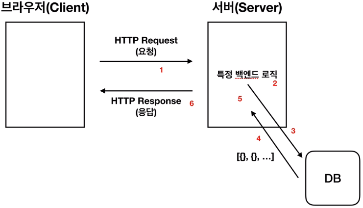
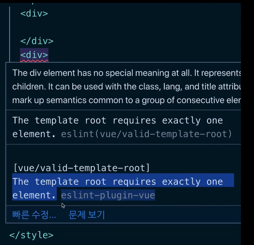

### Vue.js 소개

- 기존의 웹개발 방식은 데이터가 변경되면 그 데이터를 DOM을 통해 다시 넣어줘야 반영할 수 있었음 → 하지만 Vue는 Reactivity 방식

```jsx
<script>
    var div = document.querySelector('#app');
    var str = 'hello world';
    console.log(div);
    div.innerHTML = str;

    str = 'hello world!!!';
    div.innerHTML = str;
  </script>
```

- Object.defineProperty() → 동작을 재정의 → Vue의 핵심인 Reactivity, 데이터의 변화를 라이브러리에서 감지해서 화면에 자동으로 그려주는 것
- data binding의 구조

```jsx
<script>
    var div = document.querySelector('#app');
    var viewModel = {};

    // Object.defineProperty(대생 객체, 객체의 속성, {
    //   정의할 내용
    // }}

    Object.defineProperty(viewModel, 'str', {
      // 속성에 접근했을 때의 동작을 정의
      get: function() {
        console.log('접근');
      },
      // 속성에 값을 할당했을 때의 동작을 정의
      set: function(newValue) {
        console.log('할당', newValue);
        div.innerHTML = newValue;
      }
    })
  </script>
```

- 상단 구조를 기반으로 한 reactivity의 라이브러리화

```jsx
<script>
    var div = document.querySelector('#app');
    var viewModel = {};

    // Object.defineProperty(대생 객체, 객체의 속성, {
    //   정의할 내용
    // }}

      (function(){
        function init() {
          Object.defineProperty(viewModel, 'str', {
            // 속성에 접근했을 때의 동작을 정의
            get: function () {
              console.log('접근');
            },
            // 속성에 값을 할당했을 때의 동작을 정의
            set: function (newValue) {
              console.log('할당', newValue);
              render(newValue);
            }
          });
        }

        function render(value) {
          div.innerHTML = value;
        }

        init();
      })();
  </script>
```

각각의 함수로 담아주고 최종적으로는 즉시실행함수를 통해 감싸줌

[IIFE - 용어 사전 | MDN](https://developer.mozilla.org/ko/docs/Glossary/IIFE)

### 인스턴스

- Vue는 기본적으로 생성자 함수에 많은 기능들을 객체 형태로 저장하고 불러오는 것으로 구성되어 있음
- 기본적으로 생성자 함수는 앞에 대문자로 적고 객체 형태로 매개변수를 객체 형태로 저장

[Using a Constructor Function | MDN](https://developer.mozilla.org/ko/docs/orphaned/Web/JavaScript/Guide/Obsolete_Pages/Core_JavaScript_1.5_Guide/Creating_New_Objects/Using_a_Constructor_Function)

```jsx
function Person(name, job) {
    this.name = name;
    this.job = job;
}

var p = new Person('josh', 'developer');
```

- 인스턴스 옵션들

### 컴포넌트

지역 컴포넌트와 전역 컴포넌트(실제로 서비스를 구현할 때 전역 컴포넌트는 사용할 일이 적음)

```jsx
<div id="app">
    <app-header></app-header>
    <app-content></app-content>
    <app-footer></app-footer>
  </div>

  <script src="https://cdn.jsdelivr.net/npm/vue/dist/vue.js"></script>
  
  <script>
    // 전역 컴포넌트 등록 방식
    // Vue.component('컴포넌트 이름', '컴포넌트 내용');
    template: '<h1>header</h1>'
    Vue.component('app-header', {
    });

    Vue.component('app-content', {
      template: '<div>content</div>'
    });

    new Vue({
      el: '#app',
      // 지역 컴포넌트 등록 방식
      components: {
        // 'key': 'value'
        // 컴포넌트 이름: 컴포넌트 내용
        'app-footer': {
          template: '<footer>footer</footer>'
        }
      }
    });
    
  </script>
```

### 컴포넌트 통신 방식 - 기본

- 상위에서 하위로는 데이터를 내려줌, 프롭스 속성
- 하위에서 상위로는 이벤트를 올려줌, 이벤트 발생

N방향 통신의 문제점 - 데이터가 바꼈을 때 그로 인한 버그를 추적하기가 어려움(MVC 패턴에서 많이 발견됐던 문제점)

### 라우터

- 라우터는 Vue에서 공식적으로 관리하는 라이브러리

### Axios

- 웹 서비스에서의 클라이언트와 서버와의 HTTP 통신 구조



- axios에서 호출 전 후의 this를 이해하기 위한 추천 아티클

[자바스크립트의 동작원리: 엔진, 런타임, 호출 스택](https://joshua1988.github.io/web-development/translation/javascript/how-js-works-inside-engine/)

[프런트엔드 개발자가 알아야하는 HTTP 프로토콜 Part 1](https://joshua1988.github.io/web-development/http-part1/)

### 템플릿 문법 - 기본

템플릿 문법은 크게 데이터 바인딩과 디렉티브로 나눔

데이터 바인딩: 콧수염 괄호(Mustache Tag)를 이용해서 정의한 속성들을 화면에 표시하는 방법

```html
<div>{{ message }}</div>
```

```jsx
new Vue({
	data: {
		message: 'Hello Vue.js'
	}
})
```

디렉티브: v-라고 붙는 속성들을 전부 디렉티브라고 칭함, 뷰로 화면의 요소를 더 쉽게 조작하게 위한 문법

```html
<div>
	Hello <span v-if="show">Vue.js</span>
</div>
```

```jsx
new Vue({
	data: {
		show: false
	}
})
```

- show라는 속성 값에 따라 텍스트가 출력되거나 되지 않는 코드

- computed(계산된 속성) → 데이터의 값에 따라서 바뀌는 값을 정의할 때 활용할 수 있음, 유용한 속성이고 computed를 활용해서 표현식을 더 깔끔하게 정의할 수도 있음

- html 속성에 v-bind하고자 할 때

```html
<div id="app">
  <p v-bind:id="uuid" v-bind:class="name">{{ num }}</p>
  <p>{{ doubleNum }}</p>
</div>
```

- 데이터를 활용한 v-if

```html
<div v-if="loading">
  Loading...
</div>
<div v-else>
  test user has been logged in
</div>
```

- v-if와 v-show의 차이: 보이는 것에는 큰 차이가 없을 수 있으나 v-if를 사용했을 땐 DOM에서 아예 제거를 하는 것이고 v-show를 사용했을 땐 css의 display: none; 속성을 이용해서 DOM에는 존재하나 보이지 않게 처리
- :class, :id 같은 건 v-bind:class의 축약
- :click 은 v-on:click의 축약

- v-on:keyup.enter="logText" 이런 식으로 해당 이벤트 뒤에 특정한 키를 넣듯이 설정하는 걸 이벤트 모디파이어라고 함

### 템플릿 문법 - 실전

watch → 데이터의 변화에 따라서 특정 로직을 실행할 수 있는 vue의 속성

- watch와 computed의 차이?

- computed 속성을 이용한 클래스 코드 작성 방법

```html
<!DOCTYPE html>
<html lang="en">
<head>
  <meta charset="UTF-8">
  <meta name="viewport" content="width=device-width, initial-scale=1.0">
  <meta http-equiv="X-UA-Compatible" content="ie=edge">
  <title>Document</title>
  <style>
  .warning {
    color: red;
  }
  </style>
</head>
<body>
  <div id="app">
    <p v-bind:class="errorTextColor">Hello</p>
    <!-- <p v-bind:class="{ warning: isError }">Hello</p> -->
  </div>
  
  <script src="https://cdn.jsdelivr.net/npm/vue/dist/vue.js"></script>
  <script>
    new Vue({
      el: '#app',
      data: {
        isError: false,
        // cname: 'blue-text',
      },
      computed: {
        errorTextColor: function(){
          // if(isError){
          //   return 'warning'
          // } else {
          //   return null;
          // }

          return this.isError ? 'warning' : null;
        }
      }
    });
  </script>
</body>
</html>
```

→ 직접 클래스 바인딩해서 true, false에 따라서 하는 것도 괜찮으나, 직접 computed에 함수를 선언해서 좀 더 가독성 좋게 코딩할 수도 있음

### 프로젝트 생성 도구 - Vue CLI

[Overview | Vue CLI](https://cli.vuejs.org/guide/)

- node -v로 node 버전을 먼저 확인(10버전 이상 필수)
- npm -v (6버전 이상 필수)
- 버전 확인이 끝났으면 npm install -g @vue/cli 를 통해서 설치 진행

permission error → 쓰기 권한이 없어서 생기는 에러로 앞에 sudo를 붙여서 진행 → sudo npm install -g @vue/cli

---

**Vue CLI 2.x과 3.x의 차이점**

[Vue CLI 2.x]

vue init '프로젝트 템플릿 유형' '프로젝트 폴더 위치'

vue init webpack-simple '프로젝트 폴더 위치'

[Vue CLI 3.x]

vue create '프로젝트 폴더 위치'

---

- vue create vue-cli 를 통해 프로젝트 생성 → 설치 완료 후 두 가지 명령어 안내

$ cd vue-cli → 해당 폴더로 이동해서
$ npm run serve → cli 실행

포트 번호 8080이 점유되고 있으면 뒤에 끝자리가 하나씩 올라가면서 접근할 수 있게 됨

**Vue CLI 프로젝트 폴더 구조 확인 및 설명**

npn run serve에서 serve는 json에서 scripts로 이미 정의된 명령어

```html
"scripts": {
    "serve": "vue-cli-service serve",
    "build": "vue-cli-service build",
    "lint": "vue-cli-service lint"
  },
```

public 안에 index.html 가장 먼저 실행

→ src 폴더 밑에 App.vue나 main.js처럼 미리 세팅된 웹팩이 index.html 안에 주입되는 구조 

**싱글 파일 컴포넌트 소개**

- 새로운 파일을 만들었을 때 scf나 vue를 입력하고 tab을 치면 기본 vue cli 구조를 잡아줌

```html
<template>
// HTML
</template>

<script>
export default {
// JAVASCRIPT
}
</script>

<style>
// CSS
</style>
```

→ 해당 구조처럼 html, JavaScript, css를 한 파일에서 관리하겠다는 게 싱글 파일 컴포넌트라고 지칭함

- 컴포넌트 네이밍 컨벤션 → 케밥, 카멜, 파스칼 다 사용함 → 조금 더 진보된 방식으로 닫힘 태그 하나로 쓸 수도 있음 ex) <HelloWorld/>

### 싱글 파일 컴포넌트

- <template>안에는 하나의 root div만 존재할 수 있음
- eslint message
    
    
    
    - vue-cli 싱글 파일 컴포넌트 형식에서는 아래처럼 data를 선언할 수 없음
    
    ```jsx
    <script>
    export default {
      data: {
        
      }
    }
    </script>
    ```
    
    → cli를 통해서 컴포넌트 형식으로 오게 되면 그 컴포넌트를 재사용하겠다는 의지, 그리고 컴포넌트를 재사용하게 될 확률이 높기 때문에 여러 개의 컴포넌트에서 동일한 값을 참조하면 안 됨 → 때문에 function이라고 함수를 연결해준 다음에 return으로 새 객체를 반환해주는 형식으로 선언해줘야 함 → vue 최신 버전으로 올 수록 이런 부분에 대한 logging이 엄격해지고 있음
    
    ```jsx
    <script>
    export default {
      data: function() {
        return {
    
        }
      }
    }
    </script>
    ```
    
    컴포넌트 정의 및 사용
    
    1. components 폴더 밑에 새로운 컴포넌트 정의 
    - 컴포넌트의 파일명은 파스칼 케이스로 최소한 두 단어 이상의 이름으로 작성 → 예컨대 main.vue라는 이름의 컴포넌트를 싱글 파일 컴포넌트에서 사용했을 때 브라우저는 <main>이 컴포넌트인지, html 표준 태그인지 알 길이 없음
    
    2. 사용하고자 하는 페이지.vue에서 그 정의한 내용을 받아서 변수로 넣음
    
    ```jsx
    <script>
    import AppHeader from './components/AppHeader.vue';
    
    export default {
      data: function() {
        return {
          str: 'hi'
        }
      },
      components: {
        'app-header': AppHeader
      }
    }
    </script>
    ```
    
    - 변수로 선언했을 때와 다르진 않음, 다만 파일을 가져왔을 뿐
    
    ```jsx
    var AppHeader = {
    	template: '<header><h1>Header</h1></header>
    }
    ```
    
    - 컴포넌트와 싱글 파일 컴포넌트가 데이터를 주고 받기 위해선 props 사용
    
    ```jsx
    <template>
      <header>
        <h1>{{ **propsdata** }}</h1>
      </header>
    </template>
    
    <script>
    export default {
      **props: ['propsdata']**
    }
    </script>
    ```
    
    ```jsx
    <template>
      <div>
        <app-header **v-bind:propsdata="str"**></app-header>
      </div>
    </template>
    
    <script>
    **import AppHeader from './components/AppHeader.vue';**
    
    export default {
      data: function() {
        return {
          **str: 'Header'**
        **}
      },
      components: {
        **'app-header': AppHeader**
      }
    }
    </script>
    ```
    
    - event emit 구현하기
    
    ```jsx
    <template>
      <header>
        <h1>{{ propsdata }}</h1>
        <button **@click="sendEvent"**>send</button>
      </header>
    </template>
    
    <script>
    export default {
      props: ['propsdata'],
      **methods: {
        sendEvent: function() {
          this.$emit('renew');
        }
      }**
    }
    </script>
    
    <style>
    
    </style>
    ```
    
    ```jsx
    <template>
      <div>
        <app-header v-bind:propsdata="str" **v-on:renew="renewStr"**></app-header>
      </div>
    </template>
    
    <script>
    import AppHeader from './components/AppHeader.vue';
    
    export default {
      data: function() {
        return {
          str: 'Header'
        }
      },
      components: {
        'app-header': AppHeader
      },
      **methods: {
        renewStr: function() {
          this.str = 'hi';
        }
      }**
    }
    </script>
    
    <style>
    
    </style>
    ```
    
    ### 최종 프로젝트 - 사용자 입력 폼 만들기
    
    ```jsx
    <template>
      <form action="" v-on:submit="submitForm">
        <!-- button보다는 form 자체에다가 methods를 걸어줌 -->
        <div>
          <label for="username">id: </label>
          <input v-model="username" id="username" type="text">
          <!-- input의 양방향 데이터를 걸어주기 위해선 v-model로 연결해줌 -->
        </div>
         <div>
          <label for="password">pw: </label>
          <input v-model="password" id="password" type="password">
          <!-- input의 양방향 데이터를 걸어주기 위해선 v-model로 연결해줌 -->
        </div>
        <button type="submit">login</button>
      </form>
    </template>
    
    <script>
    export default {
      data: function() {
        return {
          username: '',
          password: '',
        }
      },
      methods: {
        submitForm: function(event) {
          event.preventDefault();
          // submit 버튼의 일반적인 새로고침을 막아주기 위해선 event.preventDefault를 사용
          console.log(this.username, this.password);
        }
      }
    
    }
    </script>
    
    <style>
    
    </style>
    ```
    
    [이벤트 버블링, 이벤트 캡처 그리고 이벤트 위임까지](https://joshua1988.github.io/web-development/javascript/event-propagation-delegation/)
    
    - 서버와 데이터를 통신하기 위해선 axios 같은 라이브러리를 사용
    - axios를 사용하기 위해선 npm i axios로 설치
    
    ```jsx
    <template>
      <form action="" v-on:submit.prevent="submitForm">
        <!-- button보다는 form 자체에다가 methods를 걸어줌, vue에선 :prevent로 버튼의 새로고침을 막아줌 -->
        <div>
          <label for="username">id: </label>
          <input v-model="username" id="username" type="text">
          <!-- input의 양방향 데이터를 걸어주기 위해선 v-model로 연결해줌 -->
        </div>
         <div>
          <label for="password">pw: </label>
          <input v-model="password" id="password" type="password">
          <!-- input의 양방향 데이터를 걸어주기 위해선 v-model로 연결해줌 -->
        </div>
        <button type="submit">login</button>
      </form>
    </template>
    
    <script>
    **import axios from 'axios';**
    
    export default {
      data: function() {
        return {
          username: '',
          password: '',
        }
      },
      methods: {
        submitForm: function() {
          // event.preventDefault();
          // submit 버튼의 새로고침을 막아주기 위해선 JS에선 event.preventDefault를 사용
          console.log(this.username, this.password);
          **var url** = 'https://jsonplaceholder.typicode.com/users';
          **var data** = {
            username: this.username,
            password: this.password
          }
          **axios.post(url, data)**
            .then(function(response) {
              console.log(response);
            })
            .catch(function(error) {
              console.log(error)
            });
        }
      }
    }
    </script>
    
    <style>
    
    </style>
    ```
    
    ### 마무리
    
    - Reactivity → vue.js 추구하는 중심 사상이자 핵심 기능 → 데이터의 변화를 감지해서 화면에 반영하는 것부터 화면 조작에 대한 API나 속성들을 vue에서 제공
    - 인스턴스 → vue로 개발할 때 필수로 생성해야 하는 단위
    - 컴포넌트 → 화면의 영역을 나눠서 개발하는 방식, 현재 프론트엔드 개발에서 중요하고 주로 사용하는 개념
    - 컴포넌트 통신
    - props
    - event emit
    - HTTP 통신 라이브러리(axios)
    - 템플릿 문법
    - 데이터 바인딩
    - 뷰 디렉티브 (v-)
    - Vue CLI
    - 싱글 파일 컴포넌트
    
    - [ ]  Vue 공식문서 정독하기 → 가급적 원문을 보는 게 좋음(상시 업데이트가 있음) → 스타일가이드는 한국어를 봐도 무방할 듯
    - [ ]