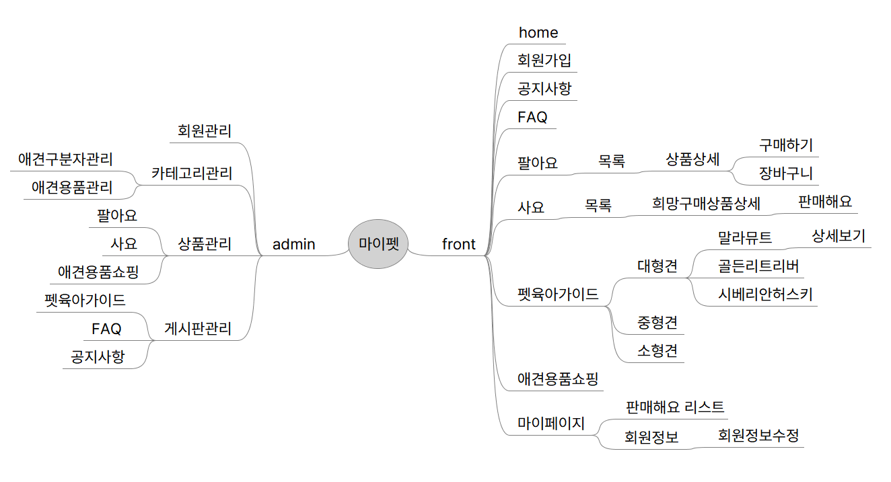

# 플랫폼 구축을 위한 사고와 습관

## 플랫폼(Platform)이란?

- 인간의 관계에서 생성되는 교류의 정류장 역할
- 교류 속에 이뤄지는 다양한 소통, 거래를 통해 발생하는 트래픽을 기준으로 기업과 개인이 공동의 이익을 형성하는 곳
    - 어떤 유저가 이용하고 어떤 이익을 낼 수 있는가 등

## 플랫폼의 진화

- 관계/수단(TV, 노트북 등) → 개인화(스마트폰, 패드 등) → 프로세스화(터치가 필요없는 데이터 기반의 프로세스화된 플랫폼, AI스피커, 스마트워츠 등) → 자동화(ChatGPT 등의 생성형 AI)
- 상대방, 또는 시간이 되면, 내가 보고 듣고 만든다 → 언제든지 내가 원하는 걸 **‘선택’**하면, 보여주고 들려준다 → AI가 나의 생활정보를 **‘이해’**하고 알아서 결정하고 제공해줌, 손의 자유/시각의 자유/결정의 자유 → AI가 창작의 영역으로 진입하면서 질문에 대한 결과의 **‘진위여부 판단’**만 인간의 영역으로 존재, 창작의 자유
- UI → UX → VUX | CX → BX —> TX
- 화면중심 → Big Data → 가치중심(IoT) —> 총체적 경험

### 플랫폼 서비스 제공 환경

- 찾아오는 서비스에서 찾아가는 서비스로 소비자는 점점  귀차니즘을 해결해주는 서비스로 이동하고 있음
- 소비자의 정보를 모르는 시대 → 소비자의 개인 정보만 아는 시대 → 소비자의 ‘행동’을 이해하는 시대 → 소비자의 ‘질문’을 이해하는 시대
- 고객이 서비스를 구매/이용할 확률을 높이기 위해 Data를 분석하는 영역이 추가되어, 기존 서비스를 고도화하고 있음
- 생성형 AI로 인하여 서비스 환경의 변화와 새로운 직업군 탄생

### Google & ChatGPT 혼자서 성장할 수 있을까?

- 사용자들이 플랫폼을 이용하고 만들어내는 정보가 귀한 매출 구조

### 고객의 ‘행동’으로 이뤄지는 플랫폼 생태계

- YouTube는 사용자가 생성하는 동영상을 기반으로 수익원을 창출하고 있고, 더욱 컨텐츠를 잘 올리고 서비스 퀄리티를 높일 수 있도록 편집/송출 기능을 제공

### 플랫폼의 핵심은 무엇인가?

- 플랫폼은 시장의 흐름을 보는 것부터 시작, 관계 중심

### 인간 세상에서 플랫폼이 나온다!

- 관계란 친구, 고객, 스승, 가족 등.. 타인으로부터 나오는 모든 행위가 플랫폼이 될 수 있음

### 플랫폼 서비스 설계를 위한 사고

- 새로움은 단지 오프라인 상에서 익숙했던 패턴을 온라인에 적용하는 것
- 서비스 패턴은 암묵적으로 습관화되어 있는 규칙과 같으며, 소비자는 새로운 패턴이 아닌 이미 익숙한 패턴에 쉽게 적응함

### 플랫폼 설계의 시작은 어떻게 하나요?

- 우리가 경험상 상상의 키워드를 그려보세요, 단어의 조합이 플랫폼이 됩니다
    - 프리마인드로 아키텍처 구축, 프론트/어드민
    - 가설을 키워드로 정의하고 기록하다 보면 플랫폼이 나올 수 있음 (Draw.io, Figma_FigJam)
    - Flow Chart가 있어야 하는 이유 → 추후 일정 관리 차원에서 모든 기능을 개발할 수 없을 경우 **선개발할 코어 기능과** 추후 개발할 부분을 분류하고 일정에 맞게 개발 진행
    

### 성공한 플랫폼 서비스의 공통적 특징

- 문화를 리드하고 사용자의 생활/이용 환경에 변화를 준 플랫폼

### 앞서가던 플랫폼 서비스 성장이 멈춰진 이유

- Device의 변화, 기술의 발달로 인한 신규 서비스 트렌드, 독단적 서비스 컨셉 변화
    - ex) 싸이월드의 블로그 서비스, 클래스101의 구독모델로의 변경
- 플랫폼은 자전거와 같음, 지속적으로 자전거 페달(변화)을 밟지 않으면 넘어지고 만다

### 플랫폼이 성공할 수 있는 방법은?

- 브랜드 가치가 없으면 매우 힘든 플랫폼 사업
- **‘소비자에게는 신뢰성이 매우 중요한 요건’**으로 초기 플랫폼 사업자가 활용할 3가지 핵심 Point
    1. 기업의 신뢰가 없다면 사람과 사람의 신뢰를 공략하자
        - 연락처의 모든 친구를 카카오 친구로 자동 추가하는 서비스를 통해 최단기 빠른 성장
    2. 이용을 하지 않으면 손실을 보는 듯한 기대 가치를 부여하자
        - 휴대폰 문자 메시지 건당 30원 / 네이트온 100건 무료 문자 / **카카오톡 무료**
    3. 처음부터 비용을 선뜻 지불하는 고객은 없다! 무료와 병행하라
        - 카카오톡은 무료 서비스지만 그 안에는 무궁무진한 마케팅 수익이 존재하고, 애니팡 하트나 노션, 피그마 등 그 이상의 서비스를 원하는 프리미엄 서비스 유도
    

### 플랫폼 서비스 아이디어란?

- “아이디어라는 것은 원래 완성 상태로 떠오르지 않습니다. **오직 실행하는 과정에서만 명료**해질 뿐입니다. 그래서 지금 바로 시작하면 되는 겁니다. 가장 위대한 성공은 마음껏 실패할 수 있는 자유에서 나옵니다.”

### 시작하는 한국 IT 기획자에게…

- 결과물을 만들기 위해 다양한 사고와 의사결정의 중심에 있음
- 커뮤니케이션 스킬과 논리적 사고가 필요
- 관계자와 협업해야 하고 이해와 공감을 이끌어 내야 함
- 단, 경험과 노하우가 부족핟나 편견으로 회사(팀장)는 새로운 기회를 제공하지 않음 → **새로움을 탐구하고 문제 해결과 미래 예측의 통찰력을 통해 창조적 기획**을 해야 하는 직군 특성임에도 불구하고 **경험에 한정된 굳은 머리**가 되곤 함
- **문제 해결에 재미를 찾는 기획자**가 되자
- 문제 해결은 **지속적 직/간접 학습과 논리적 제안**으로 시작되며 그 방법을 꾸준히 찾아나가는 것이 나의 미래 가치를 만드는 것
- (+) 고인물이 될 것이 아니라 경험을 확장하고 새로운 부분에 대한 관심을 지속적으로 가질 것

### 미래 플랫폼과 트렌드는?

- 다중 경험(MX), 고객 경험(CX), 직원 경험(EX), 사용자 경험(UX)의 결합 = 전체적 경험(TX)
    - 가상현실 컨텐츠 서비스에 대응하는 XR Device 연구
    - 행동 인터넷에 주목 _ IoB(Internet of Behaviors)

# FreeMind 실습

### 단축키

| 키 | 기능 |
| --- | --- |
| Insert | 자식 노드 추가 |
| Enter | 형제 노드 추가 |
| F2 | 노드 이름 수정 |

### 마인드맵을 통한 키워드 나열

- 키워드로 나열되지 않으면 공통된 카테고리를 묶는 것이 까다로움
- 어드민은 프론트 설계에 맞춰서 따라오는 경우가 많기 때문에 프론트 키워드 나열 및 설계 후 어드민을 접근하는 것이 유용함
- 엑셀 같은 툴은 시각화하기 어렵기 때문에 시각화가 되는 마인드맵 툴이 좋음
- ex)
    
    
    
    [mypet.mm](../assets/mypet.mm)

본 후기는 유데미-스나이퍼팩토리 10주 완성 프로젝트캠프 학습 일지 후기로 작성 되었습니다.
#프로젝트캠프 #프로젝트캠프후기 #유데미 #스나이퍼팩토리 #웅진씽크빅 #인사이드아웃 #IT개발캠프 #개발자부트캠프 #리액트 #react #부트캠프 #리액트캠프