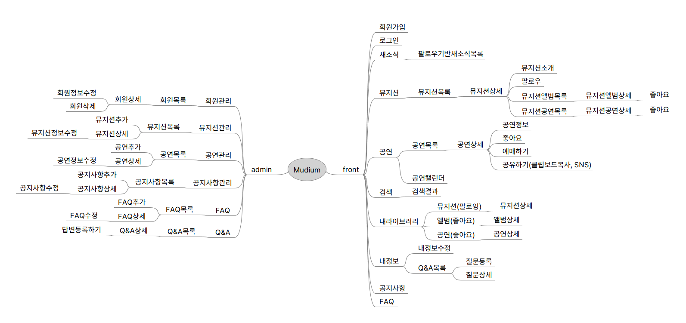

### 개요

- 뮤디엄(Mudium) → Music(음악)과 Medium(매개체)의 합성어로 음악을 매개체로 하는 커뮤니티

### 마인드맵

[mudium_v1.mm](../assets/mudium_v1.mm)

### 질문사항

- 마인드맵 설계 시 동일한 페이지로 떨어지는 경우(ex) 앨범상세, 뮤지션상세) 동일한 노드라도 하위에 생성을 하는 건지
- 기능들(ex) 목록에서의 검색, 필터, 탭)은 마인드맵에 따로 표기를 안하는지
- 클라이언트 혹은 회사에서 어디까지 어드민으로 관리할 것인가를 정하지 않을 때 기획적인 관점에서 어느 지점까지를 어드민으로 관리하려 하는지, 대략적인 기준이 있는지

### 레퍼런스

- 페스티벌 라이프 [https://festivallife.kr](https://festivallife.kr/fela_contents)
- 인디스트릿 [https://festivallife.kr](https://festivallife.kr/)
- AOTY https://www.albumoftheyear.org/
- Spotify

본 후기는 유데미-스나이퍼팩토리 10주 완성 프로젝트캠프 학습 일지 후기로 작성 되었습니다.
#프로젝트캠프 #프로젝트캠프후기 #유데미 #스나이퍼팩토리 #웅진씽크빅 #인사이드아웃 #IT개발캠프 #개발자부트캠프 #리액트 #react #부트캠프 #리액트캠프