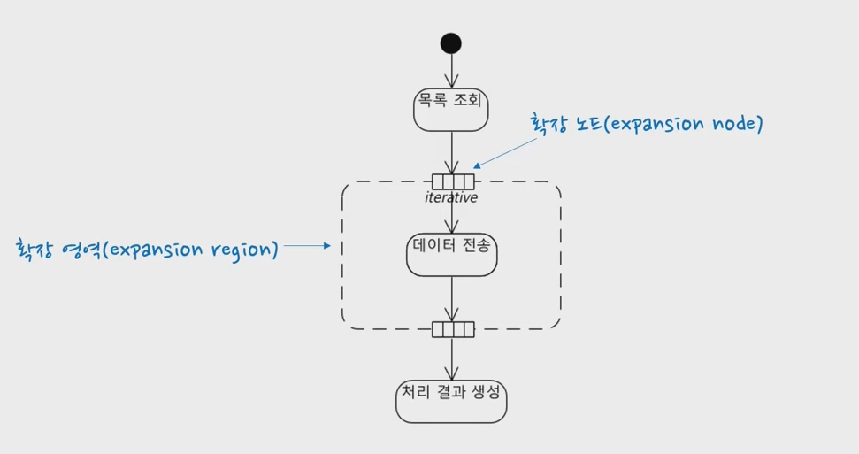
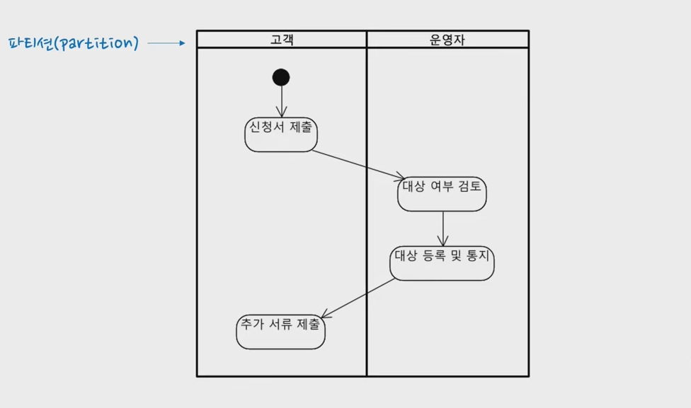

# UML을 통한 서비스 흐름 잡기

## UML이란?

- Unified Modeling Language로 복잡한 사람들의 사고와 생각을 표현하는 도구
- 구축에 대한 소프트웨어, 프로그래밍이 아닌 **시스템 자체의 산출물의 역할을 시각화하여 규정**하는데 목적을 두고 있음
- 이런 과정을 통해 꼭 필요한 행위를 기반으로 한 객체 지향 모델링이 가능해짐

## UML에서 정의하는 모델링이란?

- 어떠한 현상들을 단순화, 일반화, 추상화하는 과정으로 아래와 같은 장점을 가지고 있음
    - 내부 구조나 동작하는 행위에 대한 표현의 자유
    - 시스템의 구성 요소들이 서로 어떻게 연결되어 있는지 확인 가능
    - 설계와 구현 간의 일관성 유지
    - 레벨화 기능
    - 명확한 의사 소통의 도구
    

## 왜? UML을 배워야 하나요?

- 우리는 플랫폼을 만들 때 2가지 근본적인 어려움을 겪고 있음 → **복잡성 / 변경**

## UML은 이야기가 가능한 시각화 Tool이다

- 이런 문제점을 해결하기 위해서는 규격화된 규칙으로 손쉽게 이해할 수 있는 시각화가 필요
- 예컨대, 집의 옵션들을 나열하는 것보다 도면(시각화)으로 보는 것이 훨씬 직관적

## UML은 사람의 행위를 기반으로 한다

- UML은 사람의 행위를 기반으로 단계적 과정을 시점상으로 표현한 것으로 절차와 단계의 가설을 키워드로 표현하고 시나리오를 확장하는 순차적 단계를 지니고 있음

## UML은 사용자의 문제를 기반으로 모델링 한다

- 사람이 가장 이해하기 쉬운 이야기 전개 방식인 UML은 실제 사용자들이 플랫폼 관점으로 구축을 전개하는 것이 아닌 **사용자들의 문제를 기반으로 구축할 것을 모델링** 함으로서 좀 더 효율적이고 완성도 높은 플랫폼을 구축할 수 있음

## UML 모델링의 이점

- 시각화, 이해도, 정확성, 의사전달, 일관성 → 모두 성공적 플랫폼 구축을 위한 필수 요건

## UML은 모델 주도적 개발 방식이다

- UML을 통해 이해 당사자가 서로 커뮤니케이션할 수 있는 소프트웨어 시스템의 구조와 행위를 정의하고 기술 함으로서 보다 빠르고 정확한 플랫폼을 구현할 수 있다는 점에 주목해야 함
- 이런 방식을 MDD(Model-Driven Development), 즉 모델 주도적 개발이라고 함

## UML 다이어그램의 종류

- **Activity Diagram, Use Case Diagram**이 주요한 다이어그램

## 유스케이스 다이어그램 1

- 유스케이스 다이어그램(use case diagram)은 시스템의 행위를 모델링하여 시스템의 요구 사항을 표현하는 데 사용
- **시스템의 상위 레벨 기능과 범위**를 기술하며, 시스템이 기능을 어떻게(HOW) 구현할 것인지 기술하지 않음
- **시스템이 어떤 ‘WHAT’ 기능이 필요한지에 대해서만 표현** → ‘**무엇을**’

## 유스케이스 다이어그램 2

- 액터에게 가치 있는 결과를 제공
- 액터(소비자), 주문담당자, 배송서비스 → 연관관계, 포함관계(종속관계), 확장관계, 일반화관계

## 유스케이스 실습

[mudium.drawio](../assets/mudium.drawio)

## 유스케이스 보충내용 + 링크

- 전체적인 개요와 정의
    
    [[UML] 유스케이스 다이어그램(Usecase Diagram)](https://narup.tistory.com/70)
    

## 액티비티 다이어그램(활동 다이어그램)

- 활동 다이어그램은 시스템의 실행과 행위의 흐름을 표현
- 비즈니스 프로세스 또는 작업에서 이용하는 고객의 흐름을 표현하는데 적합

## 액티비티 다이어그램에 시간 이벤트가 있는 경우

- 이벤트 발생시간 / 특정시간 / 기간
- 분기말 부가세 납부 / 2017년 8월 13일 업데이트 시행 / 특정 기간에 문을 열고 문을 닫는다

## 액티비티 다이어그램의 구조

- 연관관계(액터들의 관계)
- 시작 → 행위 → Y/N → Activation → 종료

## 액티비티 다이어그램 보충내용 + 링크

- 전체적인 개요와 정의
    
    [Activity Diagram(행동 다이어그램)](https://blog.naver.com/bou_ti_que/223058370958)
    

- 영상 참고
    
    [UML 기초 05 - 액티비티 다이어그램](https://youtu.be/oLhlWX8Don4)
    
    - 로직, 절차, 흐름을 기술(플로우 차트와 유사) / 업무 프로세스, 코드 실행 로직을 표현할 때 주로 사용
    - 초기 노드(initial node), 액션(action - 뭘 하는 것), 제어 흐름(control flow), 끝 노드(final node)
        
        
        
    - 결정 노드(decision node), 조건(guard condition), 병합 노드(merge node) - 병합 노드는 생략할 때도 있음
        
        
        
    - 포크 노드(fork node - 동시에 처리되는 것, 병렬로 실행됐다가 다시 그것들이 모여서 다 끝날 때까지 기다렸다가 이어서 나갈 때), 조인 노드(join node)
        
        
        
    - 확장 영역(expansion region - 뭔가 목록을 조회하고 각 목록에 담겨 있는 어떤 항목을 loop를 돌면서 처리하는 걸 표현하고자 할 때 사용), 확장 노드(expansion node)
        
        
        
    - 파티션(partition - 각각의 액션이나 이런 것들이 어느 영역을 통해서 실행이 되는지 구분하고자 할 때, 조금 더 표현력이 올라감)
        
        
        
    - 액티비티 다이어그램은 흐름, 병렬 실행을 표현할 때 유용 → 업무 흐름 분석 및 실행 흐름을 파악할 때 사용

## 기획 관련 키워드

- User Persona
- 가치 제안 캔버스
- Killer Service

본 후기는 유데미-스나이퍼팩토리 10주 완성 프로젝트캠프 학습 일지 후기로 작성 되었습니다.
#프로젝트캠프 #프로젝트캠프후기 #유데미 #스나이퍼팩토리 #웅진씽크빅 #인사이드아웃 #IT개발캠프 #개발자부트캠프 #리액트 #react #부트캠프 #리액트캠프