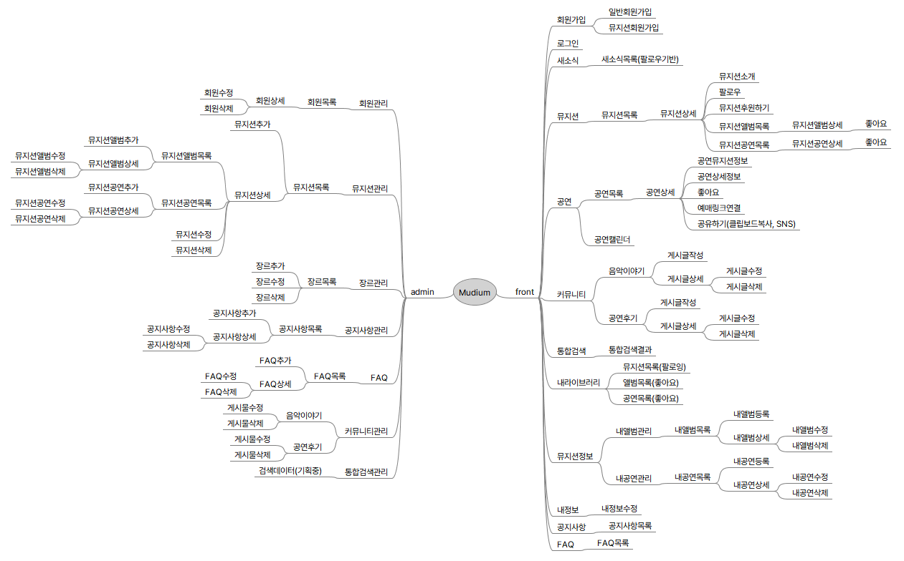
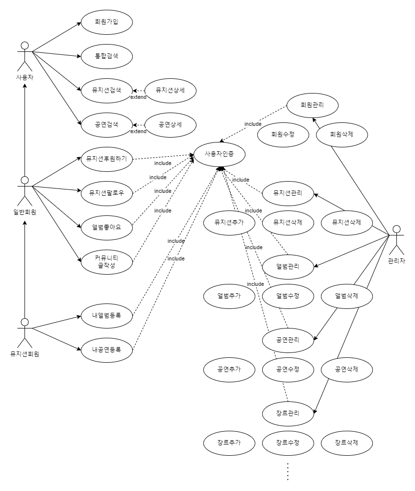
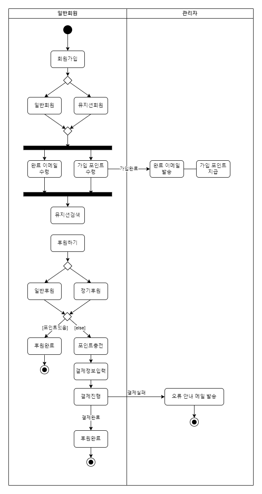

## 마인드맵 재설계

### 기존 마인드맵 문제점

- 유스케이스나 액티비티 다이어그램을 구상할 때 액터의 명확한 행동의 목적이나 목표가 있어야 하는데, 그 목표를 설정하기가 어려움 → 본질적으로 BM이 명확하지 않음을 깨달음
- BM을 명확하게 구상하지 않았기 때문에 다소 직선적인 회원 구조로만 설계되어 있음
- 그 구조에선 다채롭게 BM을 구상하기 어려움
- 추후 회원 구조를 확장하려 해도 유연함이 떨어짐

### 변경 포인트

- 유료 이용 가능한 BM을 구상하고 그걸 녹여낼 수 있는 회원 구조로 변경
- 일반회원/뮤지션회원으로 구조를 변경 → 뮤지션회원은 일반회원에게 홍보를, 일반회원은 특정 뮤지션회원에게 후원을 할 수 있게끔 서비스 내 화폐 단위를 충전해서 사용

### 변경 마인드맵

[mudium_v1.01.mm](../assets/mudium_v1.01.mm)

## 유스케이스 다이어그램 실습 수정

[mudium_usecase_v1.drawio](../assets/mudium_usecase_v1.drawio)

## 액티비티 다이어그램 실습 과제

[mudium_activity_v1.drawio](../assets/mudium_activity_v1.drawio)