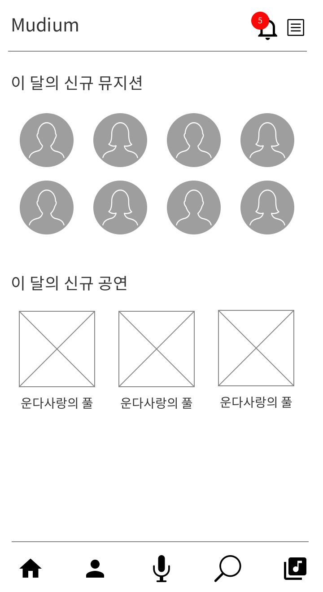
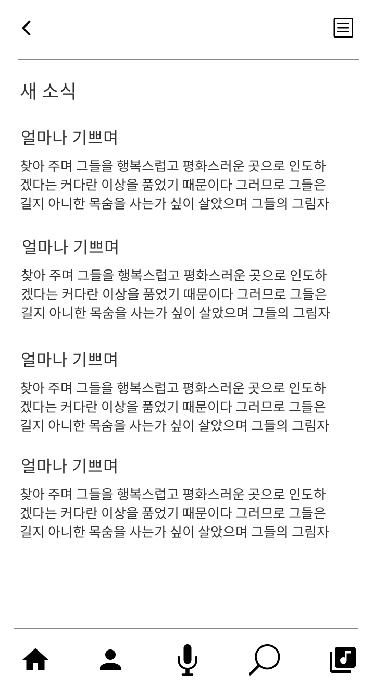

## 질문사항에 따른 메모

- 쇼핑몰의 경우 기획에 따라 처음부터 회원가입 시작하는 것이 아니라 상품을 먼저 둘러보고 가입을 할 수 있게끔 유도할 수 있음 → 상품 옵션을 통해 구매하기를 눌렀을 경우 회원가입 후 바로 결제하기 페이지로 이어질 수 있게끔 설계 및 마인드맵 구성

# 스케치란 무엇인가?

## 아이디어 스케치란?

- 공상 속에 있는 80%를 20%의 현실로 만든다
- “아이를 어떻게 한곳에 고정할 수 없을까?” → 고리, 고정, 밴드, 아기… (단위 개념화)
- 스케치의 최선은 모방과 결합이다

## 스케치의 효율성은?

- 시간절약: 공상을 현실적 밑그림으로 만든다 → 아이디어, 테이블 설계, 의사 전달
- 큰 구조파악: 전체 스토리를 알 수 있음 → 대 > 중 > 소 → 개념정립, 전략과 전술
- 스토리텔링: 진행과정의 스토리를 파악할 수 있음 → 시놉시스, 제안서, 스토리보드

## 아이디어 스케치 도구

- 노트
    - 1단계: 아무 노트나 닥치는 대로 그린다
    - 2단계: 나만의 스케치 노트를 만든다
- 그리고 도구
    - 1단계: 샤프
    - 2단계: 연필 볼펜
    - 3단계: 볼펜 & 마카
- 지우개
    - 톰보지우개(고무재질이 말랑말랑한 것)
    

## 효과적인 스케치

- 이미지가 그림이 되는 것이 아니라 그림이 이미지를 만들어준다
    - 1장에 1개의 주제만을 담아라
    - 그리는 데 3분 이상 소요하지 마라
    - 스토리를 그려라(다음은?)
    - 치환, 생략(알고 있는 개념은 생략하라 - 나는 이미 알고 있고 설명이 가능하니까)
- 그림을 다 그렸을 때 완성한 것은 종이 위에 그림이 아니라 머리 속의 이미지다!
    - 너무 정성 들여서 그리지는 말 것 → 어차피 수정되어야 할 것이기 때문에 일단 그리고 보는 것
    

## 눈으로 보는 한계를 넘어서는 스케치

- 아이디어 스케치는 가장 큰 사이트를 설계하기 위한 가장 작은 그림이다.

## 아이디어 스케치 어디에 쓰일까?

- 스토리보드, 제안서, 시놉시스, 회의, 다이어리
- 아이디어 스케치는 변수와 구조 파악의 최상의 단계 → 아이디어 스케치를 그리는 과정에서 누락된 내용을 확인하거나 유저플로우상 잘못된 부분을 발견할 수 있음

## 아이디어 스케치 스토리 1

- 중요 포인트: 메인 페이지의 페르소나가 무엇을 가장 중요하게 생각하는가
- UX/UI에서 가장 가치 있는 것, 가장 많이 팔리는 것, 가장 트래픽이 높은 것들이 레벨화가 되어 있어야 함
- 단순히 개발적인 관점에서만 구조를 생각하면 되게 흥미가 떨어지는 서비스가 될 수 있음 → 최소한 이건 왜, 저건 왜 그래야 하는가, 왜 고객이 이걸 선택해야 하는가, 그리고 고객이 어떤 프로세스로 goal까지 갈 수 있는가, 이런 것들을 짚고 나아가야 수정을 줄일 수 있음

## 아이디어 스케치 스토리 2

- 개념 프레임 구조 잡기 → GNB, SNB 등을 프레임을 기준으로 나눈다
- 프레임 구체화 설계 → 나눠진 프레임을 기준으로 디테일하게 쪼갠다
- 프레임 확정 → 구체적인 배너의 갯수 등 기획 구체화 및 확정

## 아이디어 스케치 과정

- 컨셉 도출 → 컨셉 고정콘 & 레벨화(데이터 정리) → 아이디어 스케치 + 단위 디테일

## 실무 아이디어 스케치 흐름 전개

- 상품에 들어갈 요소 정의 → 카피 확장 → 상품의 스토리 구성 스케치 → 구성 레벨화(위~아래)

## 아이디어 스케치 실습

[Mudium_idea_sketch.pdf](../assets/Mudium_idea_sketch.pdf)

- 메인
    
    
    

- 전체메뉴
    
    
    

- 새 소식
    
    
    
- 뮤지션
    
    
    
- 공연
    
    
    
- 검색
    
    
    
- 라이브러리
    
    
    
- 공지사항
    
    
    
- FAQ
    
    

    
본 후기는 유데미-스나이퍼팩토리 10주 완성 프로젝트캠프 학습 일지 후기로 작성 되었습니다.
#프로젝트캠프 #프로젝트캠프후기 #유데미 #스나이퍼팩토리 #웅진씽크빅 #인사이드아웃 #IT개발캠프 #개발자부트캠프 #리액트 #react #부트캠프 #리액트캠프