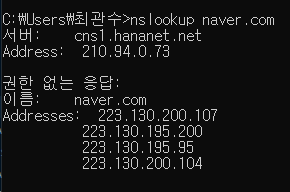

## 수업 메모

### 인터넷 vs 웹

- 인터넷: 인터넷은 전 세계를 연결하는 국제 정보 통신망으로, 컴퓨터나 스마트폰 같은 디지털 기기로 연결되어 사람들이 정보를 공유할 수 있는 공간
- 웹은 인터넷 공간에서 제공하는 서비스

### 팀 버너스 리

- 최초 웹 개발자, W3C 창설
- HTML 표준을 비롯한 웹 표준을 제작, 제안하는 일을 하는 국제적인 웹 표준화 단체

| 버전 | 발표 연도 |
| --- | --- |
| HTML1 | 1991.10 |
| HTML2 | 1995.11 |
| HTML3 | 1997.01 |
| HTML4 | 1997.12 |
| HTML5 | 2014.10 |

### HTTP

- HTTP(Hyper Text Transfer Protocol)는 HTML문서와 같은 리소스들을 가져올 수 있도록 해주는 프로토콜

### IP주소

- 인터넷에 연결되어 있는 모든 장치들(컴퓨터, 서버 장비, 스마트폰 등)을 식별할 수 있도록 각각의 장비에 부여되는 고유 주소

### DNS(Domain Name System)

- 숫자로 구성된 복잡한 IP를 사용자가 쉽게 기억하고 입력할 수 있는 도메인 네임으로 변환하는 시스템
- (+) 참고자료
    
    [nslookup 기본 사용법](https://velog.io/@bonjugi/nslookup)
    
    
    

## 팀 실습

- HTML - 실습 2 (팀 단위)
    
    [타이틀](https://udemy-team13.github.io/training/team/pages/230612/practice02.html)
    

## 개인 실습

- HTML - 실습 1 (팀 단위)
    
    [Document](https://udemy-team13.github.io/training/gonasooc/pages/practice/230612/practice01.html)
    

- HTML - 실습 3-1 (팀 단위)
    
    [로그인폼](https://udemy-team13.github.io/training/gonasooc/pages/practice/230612/practice03-01.html)
    

- HTML - 실습 3-2 (팀 단위)
    
    [Document](https://udemy-team13.github.io/training/gonasooc/pages/practice/230612/practice03-02.html)
    
- HTML - 실습 4 (팀 단위)
    
    [실습 4](https://udemy-team13.github.io/training/gonasooc/pages/practice/230612/practice04.html)
    
- HTML - 실습 5 (팀 단위)
    
    [iframe](https://udemy-team13.github.io/training/gonasooc/pages/practice/230612/practice05.html)

본 후기는 유데미-스나이퍼팩토리 10주 완성 프로젝트캠프 학습 일지 후기로 작성 되었습니다.
#프로젝트캠프 #프로젝트캠프후기 #유데미 #스나이퍼팩토리 #웅진씽크빅 #인사이드아웃 #IT개발캠프 #개발자부트캠프 #리액트 #react #부트캠프 #리액트캠프