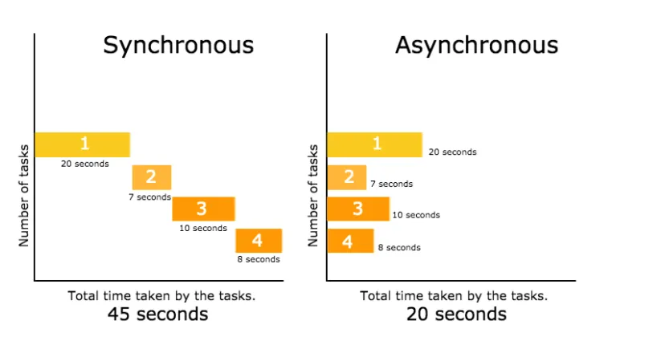

## 개요

- Synchronous/Asynchronous, Callback, Promise, async/await
- 비동기 처리와 관련된 키워드를 이해하기 위해선 이것들이 **왜 등장하게 되었는지 이해하는 것이 필요**합니다.
- 웹 생태계가 거대해지면서 타이머를 사용한 이벤트, 서버와의 네트워크 통신, 특정 간격이 필요한 애니메이션 등 여러 가지 사용자와의 인터렉션이 생겨나면서 자연스럽게 대기 시간이 발생, 그 대기 시간 안에 처리할 적절한 비동기 작업이 필요해졌습니다.

## Synchronous/Asynchronous



## 비동기적 사고 방식

### Callback function

- 자바스크립트는 **1급 함수**의 특징을 가졌기 때문에 함수의 인자로 콜백 함수를 호출이 가능합니다.
- 콜백 함수는 쉽게 말해서 다른 코드의 인자로 넘겨주는 함수라고 볼 수 있습니다. 콜백 함수를 넘겨 받은 코드는 이 콜백 함수를 필요에 따라 적절한 시점에 실행합니다. 말 그대로 콜백 함수는 다른 함수에게 인자로 넘겨줌으로써 그 제어권도 함께 위임한 함수입니다. 다만 비동기 작업을 수행하기 위해 함수를 전달하는 과정이 반복되면서 코드의 들여쓰기 수준이 감당하기 힘들 정도로 깊어지는 콜백 지옥(Callback Hell) 현상이 생길 수 있는데, 가독성이 떨어질 뿐더러 코드를 수정하기도 어렵습니다.
- 그런 일련의 과정 속에서 자바스크립트 진영은 비동기적인 작업을 동기적으로, 혹은 동기적인 것처럼 보이게끔 처리해주는 장치를 마련하게 되는데, 그게 **ES6에서는 `Promise`**, **ES2017에서는 `async`/`await`**라고 볼 수 있습니다.

### Promise

- ES6부터 등장한 문법, 미래에 값을 반환할 수도 있는 함수를 캡슐화한 객체입니다.
- 비동기 요청에 대한 세 가지(성공, 실패, 대기)의 상태를 가지고 있습니다. **`pending`(대기) / `fulfilled`(성공) / `rejected`(실패)**, 성공/실패 여부에 따라 `Promise` 객체가 `fulfilled`나 `rejected` 각각의 정보를 갖게 됩니다.
- 내부에서 비동기 요청이 끝나고 나면 결과값을 연결된 callback으로 보내줍니다. 좀 더 구조화된 callback이라고도 볼 수 있습니다.
- new 연산자와 함께 호출한 `Promise`의 인자로 넘겨주는 콜백 함수는 호출할 때 바로 실행되지만 그 내부에 `resolve`나 `reject` 함수를 호출하는 구문이 있을 경우 둘 중 하나가 실행되기 전까지는 다음(`then`) 또는 오류 구문(`catch`)으로 넘어가지 않습니다. (`pending` 상태)
- `Promise` 객체는 콜백 함수의 인자로 `resolve`와 `reject`를 가질 수 있는데, 콜백 함수의 인자로 `resolve`가 실행되면 `fullfilled` 상태가 되어 `then` 구문 안쪽의 프로세스로 넘어 가는 반면, `reject`가 실행되면 `rejected` 상태가 되어 `catch` 안쪽의 프로세스를 실행합니다.

### Problem Solving

- 비동기 처리의 등장은 일종의 **‘Problem Solving’**이라고도 볼 수 있습니다.
- 인간의 사고방식은 순차적인 흐름에 익숙해져 있고, 우리의 디버깅은 그런 인과관계의 흐름이 끊긴 부분을 찾아서 이어 나가는 방식의 연속이라고 할 수 있습니다.
- 초기 비동기 작업(Callback)의 특성상 순차적인 흐름보다는 여러 가지 맥락을 고려하고 코드의 흐름을 파악해야 하는 문제가 있었습니다.
  ```jsx
  function A(callback) {
    console.log("A");
    setTimeout(() => callback(), 0);
  }

  function B() {
    console.log("B");
  }

  function C() {
    console.log("C");
  }

  A(B);

  C();
  ```
- 결국 비동기 코드의 가독성 문제는 단순히 코드가 길이 뿐만 아니라 **인간의 사고 방식과 동떨어진 맥락**이라는 점에서 생깁니다.

## 동기적 사고 방식

### Generator

- Async function의 출현 전 `generator`를 이용해 비동기 처리 방식으로 접근할 수 있었습니다.
- 온전히 비동기 처리를 위해 나온 함수는 아니었지만 비동기를 동기적인 것처럼 보이게 하는 데에 유용했습니다.
- 특징
  - ES6
  - \*: `generator` 함수를 작성하기 위한 규칙, function 키워드 뒤나 식별자 앞에 선언
  - `Iterator`: `generator` 호출로 반환된 객체, `next()`를 가지고 있음
  - `next()`: `generator` 함수 안에 `yield` 문으로 넘어가기 위한 메소드
  - `yield`: `next()` 가 호출되었을 때 1) 중간에 멈추고 2) 데이터를 받는 지점
- 예시
  ```jsx
  fuction *asyncTask() {
  	const data = yield request();
  	// 받아온 data를 이용한 일련의 작업 수행 영역
  }

  function request() {
  	ajax('url', function (data) {
  		it.next(data);
  	});
  }

  const it = asyncTask();

  it.next();
  ```
  - asynctask라는 `generator` 함수를 호출해 `iterator` 객체를 반환 → 이 객체에 `next()` 메소드를 호출
  - 해당 `generator` 함수를 수행하다가 첫 번째 `yield` 문 뒤에 함수를 호출하고 함수를 중단 → 비동기 요청을 통해 값을 받아오면 받아온 값을 중단된 지점으로 보내서 다시 함수 진행
- 말 그대로 함수를 중단할 수 있다는 특징, 함수의 중간 지점에 값을 보낼 수 있다는 점을 조합하여 비동기 처리를 동기식 사고 방식으로 읽을 수 있게 됩니다.

### Async Function

- ES2017
- Syntatic Sugar - 사람이 직관적으로 코드를 쉽게 읽을 수 있게 만드는 문법적 설탕
- 함수 내에서 `await` 문을 만나면 함수의 실행을 일시 중지
- `await` 뒤에 있는 `Promise()`의 수행한 값을 받아서 함수를 재진행
- 예시
  ```jsx
  async function asyncTask() {
    const data = await request();

    // 받아온 data를 이용한 일련의 작업 수행 영역
  }

  function request() {
    return new Promise((resolve) => {
      ajax("url", function (data) {
        resolve(data);
      });
    });
  }
  ```
- `Promise`에 대한 Syntactic Sugar이기 때문에 **`Promise`에 대한 선행적 이해가 필요**합니다.
- 비동기 작업을 수행하고자 하는 함수 앞에 async를 표기하고, 함수 내부에서 실질적인 비동기 작업이 필요한 위치마다 await를 표기하는 것만으로 뒤의 내용을 `Promise`로 자동 전환하고, 해당 내용이 resolve된 이후에야 다음으로 진행합니다. `Promise` 문법을 사용하면서도 단순 `Promise` chaining보다 가독성이 뛰어나고 작성법도 간단하다고 볼 수 있습니다.

## 참고자료

- https://youtu.be/fsmekO1fQcw?si=3KJuAWc2U64S8Uba
- https://www.youtube.com/watch?v=Sn0ublt7CWM
- https://developer.mozilla.org/ko/docs/Glossary/First-class_Function
- https://medium.com/@vivianyim/synchronous-vs-asynchronous-javascript-de4918e8ad62
