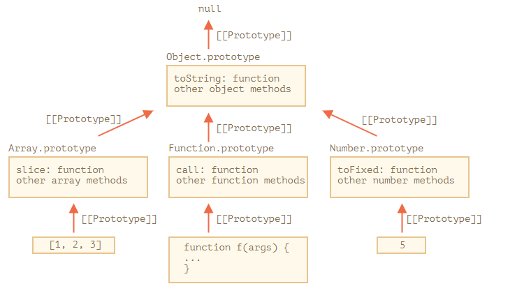

## 개요

- 자바스크립트는 프로토타입 기반 언어
- 클래스 기반 언어에서는 ‘**상속**’을 사용하지만 프로토타입 기반 언어에서는 **어떤 객체를 원형(prototype)으로 삼고 이를 복제(참조)**함으로써 상속과 비슷한 효과를 얻습니다.
- 맥락
  - 어떤 생성자 함수(`Constructor`)를 new 연산자와 함께 호출하면,
  - `Constuctor`에서 정의된 내용을 바탕으로 새로운 `instance`가 생성
  - 이때 `instance`에는 `__proto__` 라는 프로퍼티가 자동으로 부여되는데,
  - 이 프로퍼티는 `Constructor`의 `prototype`이라는 프로퍼티를 참조(복제)
- 생성자 함수의 예시
  ```jsx
  var Person = function (name) {
    this._name = name;
  };

  Person.prototype.getName = function () {
    return this._name;
  };
  ```
  - 여기서 `Person`의 인스턴스는 `__proto__` 프로퍼티를 통해 `getName`을 호출 가능
- 일반적인 객체 생성의 예시
  ```jsx
  const user = {
    name: "gonasooc",
    job: "progammer",
  };
  ```
  - 해당 객체를 생성하게 되면 내부적으로는 Object 생성자 함수에 의해 생성
  - 이때 `user`는 `user.__proto__` 라는 내부 프로퍼티를 통해 Object 생성자 함수가 미리 가지고 있던 `Object.prototype`과 연결
  - 이때의 `Object.prototype`이 프로토타입 객체
  - 객체 생성이 아니라 배열 생성이라도 같은 방식으로 `Array.prototype`이 프로토타입 객체

## 프로토타입 체인(Prototype Chain)



### 정의와 역할

- 이와 같이 어떤 객체에 특정 프로퍼티나 메서드에 접근할 때 특정 프로퍼티나 메서드가 없다면 내부 링크를 통해 상위 프로토타입으로 접근하는 행위를 프로토타입 체인이라고 하는데, 이런 과정에서 볼 수 있듯이 자바스크립트는 프로토타입 객체지향을 사용하고 있습니다.
- 자바스크립트의 모든 객체는 자신의 부모 역할을 담당하는 객체와 연결되어 있습니다. 이건 마치 객체 지향의 상속 개념과 같이 부모 객체의 프로퍼티나 메소드를 상속 받아서 사용할 수 있게 됩니다. 이러한 부모 객체를 프로토타입(Prototype) 객체 또는 줄여서 프로토타입이라고 합니다.
- 예컨대 하나의 배열을 만들면 `new Array()` 의 디폴트 생성자가 내부에서 동작해서 해당 `Array.prototype`이 해당 배열의 프로토타입이 되고, 우리는 그걸 통해 `Array.prototype.map()`과 같은 배열과 관련된 내장함수를 사용할 수 있게 됩니다. 이런 내부 동작은 메모리 효율을 높여주는 장점으로 작용합니다.
- Object.prototype은 프로토타입 체인의 종점이라고 볼 수 있습니다.

### **Array 객체 vs 객체 리티럴**

- `new Array()` 생성자를 통해 배열을 선언하는 방식과 객체 리터럴을 이용해 선언하는 방식이 속도적으로 큰 차이는 없으나, `new Array()` 등을 통한 생성은 직관적이지 않다는 게 가장 큰 차이라고 볼 수 있습니다. 결국은 사람이 하는 일이기에 휴먼 에러를 줄이는 것도 중요한 일이라서 객체 리터럴을 통한 방식을 주로 사용하게 되었다고도 볼 수 있습니다.

## 참고자료

- 코어 자바스크립트(정재남, 2019)
- https://youtu.be/TqFwNFTa3c4?si=2vJvutc7xOQCwrfv
- https://withhsunny.tistory.com/71
- https://stackoverflow.com/questions/1800594/in-javascript-why-is-preferred-over-new-array
- https://stackoverflow.com/questions/7375120/why-is-arr-faster-than-arr-new-array
- https://stackoverflow.com/questions/58464218/javascript-inheritance-how-prototype-chain-works-between-native-prototypes
- https://ko.javascript.info/native-prototypes
- https://poiemaweb.com/js-prototype
- https://2ality.com/2012/10/dunder.html
