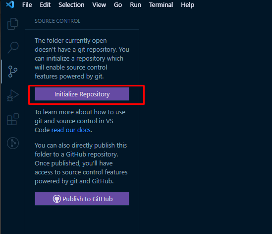
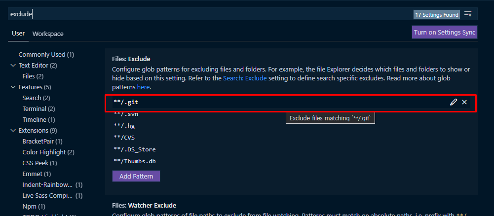
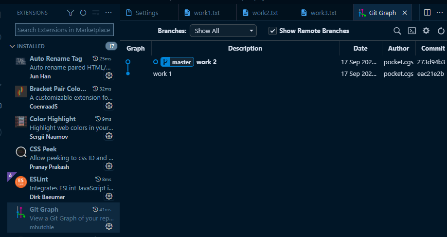

- Source Control 탭에서 Initialize Repository(저장소 초기화)를 통해서 git 버전 관리를 시작할 수 있음
    
    
    

- VSC 내에서 숨겨진 파일들(git 등등)을 보고 싶으면 preference로 들어가서 exclude로 검색하면 제외된 목록이 나옴
    
    
    

- git log로 현 상태 확인 가능
- git log 대신 vsc extension 중 하나인 git graph를 통해서 좀 더 편하게 볼 수 있음
    
    
    

- git checkout [commit id] → 해당 commit 시점으로 시간여행 가능
- **git checkout master** or git checkout [가장 최근의 commit id] → 다시 현 상태로 돌아옴
- git graph GUI에서 우클릭으로 checkout 가능