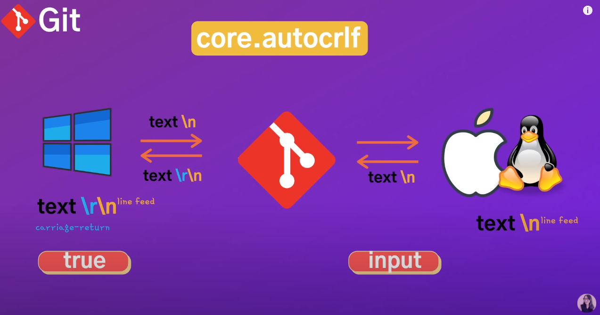
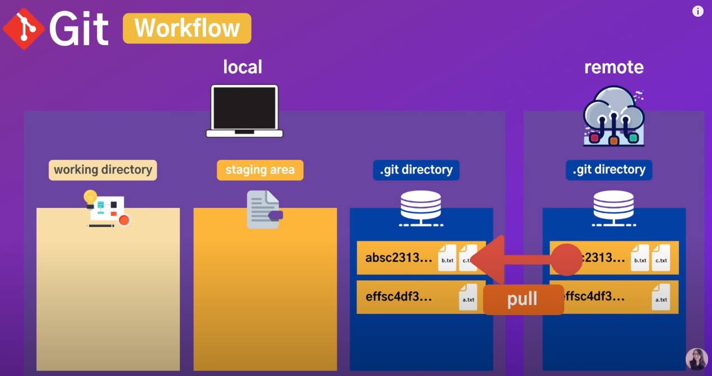
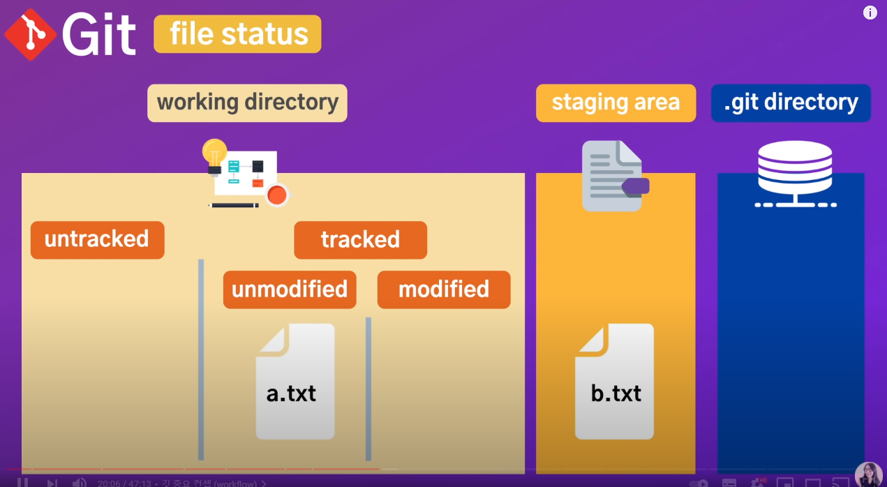

[깃, 깃허브 제대로 배우기 (기본 마스터편, 실무에서 꿀리지 말자)](https://youtu.be/Z9dvM7qgN9s)

[깃, 깃허브 제대로 배우기 (기본 마스터편, 실무에서 꿀리지 말자)](https://youtu.be/Z9dvM7qgN9s)

### git 기본

- git은 버전 관리, 형상 관리 tool
- git은 기본적으로 cli로 배우는 게 좋고 gui 클라이언트로 나온 프로그램을 사용할 수도 있음 ex) Sourcetree
- gui를 사용해서 배울 수도 있으나 git은 명령어 단위로 이뤄진 프로그램이기 때문에 명확히 이해하기 위해서는 cli로 배워두는 게 좋음
- git은 [git 명령어] 형식으로 구성되어 있음 ex) git 명령어 -옵션

### git 명령어 실습 1

git —version → git 버전 확인

git config —list → 모든 git config 설정 확인

code . → 현재 폴더가 vsc로 열림

git config —global core.editor "code —wait" → vsc상에서 config editor로 들어감

git config —global [user.name](http://user.name) "gonasooc" → 이름 설정

git config —global user.email "doupler@gmail.com" → 이메일 설정

git config [user.name](http://user.name)(key) → 설정값 확인 가능

git config —global core.autocrlf true (Windows) / git config —global core.autocrlf input (MAC)

<aside>
💡 Windows 에서는 line ending 을 CR(Carriage-Return, \r)과 LF(Line Feed, \n)을 사용하고 Unix와 Mac 은 LF 만 사용한다 소스 변경 없는데 CR/LF 때문에 변경으로 착각하여 commit 을 하게 된다 OS 가 달라도 문제가 없도록 crlf 를 처리하는 방법을 결정해야 한다 [출처] Git Line ending 의 CR LF 문제해결|작성자 김병철

</aside>

[eCommerce IT : 네이버 블로그](https://blog.naver.com/skykbc/222015824608)

### git 명령어 확인 가능한 documentation

[Reference](https://git-scm.com/docs)

### git 명령어 실습 2

git init → git setting

rm -rf .git → git 삭제

- git은 생성하면 master branch가 만들어짐

git config —global [alias.st](http://alias.st) status → git 명령어를 설정된 단축키로 축약할 수 있음

git status → 현재 git 상태를 확인할 수 있음 (tracked, untracked, staging 등)

### GIT Workflow

- git은 총 3가지의 작업 영역 → 크기 working directory, staging area, .git directory

- working directory 안에서는 untracked와 tracked로 나눌 수 있고, tracked 안에서는 unmodified와 modified로 나눌 수 있음
- untracked: 새로 생성된 파일 등 지금까지 tracking 되지 않았던 파일 / tracked: 기존 파일에 대한 tracking
- unmodified: 말 그대로 수정되지 않은 파일 / modified 수정된 파일로 modified 영역에 있는 애들만 staging 할 수 있음

- 최종적으로 commit 하게 되면 각각의 commit들은 해시코드가 부가됨

### git 명령어 실습 3

git add 파일명 → 해당파일을 staging area로 옮김

git rm —cached <file> → staging area에 있는 <file>을 working directory로 옮길 수 있음 ex) git rm —cached * (전체 파일을 working directory로 옮김)

- git을 통해 관리하고 싶지 않은 파일을 gitignore를 통해 관리 가능 (ex) 서버 정보가 담겨 있는 env)

echo *.log > gitignore → 생성된 전체 log files를 gitignore를 통해 git 관리를 안하겠다

git status -h → 명령어 뒤에 -help 입력하면 명령어와 관련된 모든 옵션 확인 가능

git status -s → 좀 더 간단하게 정리된 정보로 확인 가능

git commit → commit 명령어 → 이것만 입력하면 기존에 설정된 edit로 연결돼서 title이나 description을 기입하고 해당 창을 닫으면 commit 됨

git diff → 이전 버전과 비교해서 변경된 내용 확인 가능

git commit -m "second commit" → 해당 m(message)와 함께 바로 commit하겠다는 축약 명령

git commit -am "third commit" → working directory에 있는 a(all) 파일을 m(message)와 함께 commit하겠다는 명령어

### 언제, 어떤 규모로 commit을 해나가면 좋을까

유의미한 분기점을 잡아서 가급적 조각조각 나눠서 commit하는 게 좋음

ex) lnitiallise project / Add LoginService module / Add UserRepository module / Add Welcome page / Add About page / Add light theme

- commit message는 현재형, 동사형으로 주로 작성함
- 주의: commit message를 작성할 때 본인이 작업한 범주를 명시해주는 게 좋음. 예컨대, A를 수정하고 A에 대한 commit message를 작성하면서 B나 C도 조금만 수정할까? (X)
- 이전의 버전관리 툴에도 branch 기능이 있었으나 무겁고, 위험하고, 번거롭고, 거의 사용할 필요가 없을 정도로 무의미했음 → git이 이전의 버전관리 툴과 확연하게 다른 점은 branch 기능을 쓸만한 수준으로 끌어 올렸기 때문
- 주의: 하지만 branch에 익숙하지 않거나 온전히 이해하지 못했으면 사용하지 않는 게 좋음 → 나중에 merge할 때 충돌 잡기가 까다로움

### 210526 스터디 추가 내용

- vsc extension 중에 GIT Graphy를 사용하면 git repository를 visualize해서 확인할 수 있음
- 자사 내에서 퍼블리셔가 주로 사용하게 될 커맨드
    
    git diff → repository의 내용과 변경된 local의 변경사항 비교
    
    cd → cd 같은 폴더 이동하는 커맨드
    
    ls → 해당 폴더 내에 파일 리스트업하는 등의 커맨드
    
- working directory → working tree, staging area → index라고 칭하기도 함